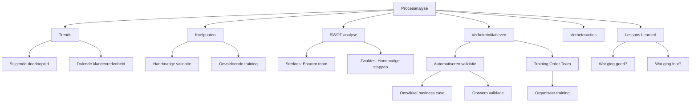

Dit Procesverbetering-template biedt een gestructureerde aanpak voor het analyseren, verbeteren, en optimaliseren van het Orderverwerkingsproces (PR-001) bij TelecomPro B.V.. Het doel is om:  
- Knelpunten en inefficiënties in het proces te identificeren en op te lossen.  
- Datagestuurde verbeterinitiatieven te ontwikkelen op basis van trends, analyses, en root causes.  
- Concrete verbeteracties te definieren met duidelijke verantwoordelijkheden en deadlines.  
- Lessons learned vast te leggen voor toekomstige verbeteringen.  
- Continue verbetering te waarborgen door feedback en evaluatie.

#### Eigenschappen

| Veld          | Waarde                                                                                        | Toelichting                                   |
| ----------------- | ------------------------------------------------------------------------------------------------- | ------------------------------------------------- |
| PMD-nummer    | 03.09.00                                                                                          | Uniek identificatienummer voor procesverbetering. |
| Versie        | 1.0                                                                                               | Huidige versie.                                   |
| Status        | Gepubliceerd                                                                                      | Status van het document.                          |
| Auteur        | Martin van Pelt                                                                                   | Procesanalist.                                    |
| Eigenaar      | Jan de Vries                                                                                      | Proceseigenaar Operaties.                         |
| Datum         | 19/04/2026                                                                                        | Datum van laatste update.                         |
| Gekoppeld aan | Root Cause Analyse (PMD-03.09.01), Procesverbeterplan (PMD-03.09.02), Procesreview (PMD-03.08.03) | Gerelateerde documenten.                          |

#### Algemeen Overzicht

| Veld                    | Waarde                                                                                                                   | Toelichting                                     |
| --------------------------- | ---------------------------------------------------------------------------------------------------------------------------- | --------------------------------------------------- |
| Procesnaam              | Orderverwerking                                                                                                              | Naam van het proces.                                |
| Proces-ID               | PR-001                                                                                                                       | Unieke identifier.                                  |
| Doel van de verbetering | Verminderen van doorlooptijd en fouten in de orderverwerking door automatisering, training, en procesoptimalisatie.          | Wat de verbetering moet bereiken.                   |
| Scope                   | Hele proces van ontvangst tot bevestiging van orders.                                                                        | Wat valt binnen de scope.                           |
| Betrokken partijen      | Proceseigenaar, Procesanalist, IT-afdeling, Kwaliteitsmanager, Order Team, Sales Manager, Financiële Afdeling                | Wie is betrokken bij de verbetering.                |
| Koppeling met strategie | Ondersteunt organisatiedoelen "Klanttevredenheid verhogen tot 90% in 2026" en "Kosten per order verlagen naar <€10". | Hoe de verbetering bijdraagt aan organisatiedoelen. |

#### Procesanalyse

##### Trends

Analyseer hier langetermijntrends in de procesprestaties op basis van KPI-data uit de Processturing (PMD-03.08.00) en Procesdashboard (PMD-03.08.02).

| Trend                  | KPI                      | Periode | Waarde begin | Waarde einde | Verandering | Oorzaak                                   | Impact                                       |
| -------------------------- | ---------------------------- | ----------- | ---------------- | ---------------- | --------------- | --------------------------------------------- | ------------------------------------------------ |
| Stijgende doorlooptijd     | Doorlooptijd orderverwerking | Q1 2026     | 22 uur           | 28 uur           | +6 uur (+27%)   | Handmatige validatiestap, systeemvertragingen | Vertraging in levering, lagere klanttevredenheid |
| Dalende klanttevredenheid  | Klanttevredenheid (NPS)      | Q1 2026     | 8,5              | 8,2              | -0,3 (-3,5%)    | Vertraagde levering, onjuiste orders          | Lagere klantretentie                             |
| Stijgend foutpercentage    | Aantal fouten per order      | Q1 2026     | 1,0%             | 1,5%             | +0,5% (+50%)    | Onvoldoende training, gebrek aan validatie    | Herwerk nodig, hogere kosten                     |
| Stijgende kosten per order | Kosten per order             | Q1 2026     | €10              | €12              | +€2 (+20%)      | Onbekende kostenposten, inefficiënties        | Lagere winstmarges                               |
| Dalende first-time-right   | First-time-right             | Q1 2026     | 98%              | 95%              | -3%             | Onjuiste klantgegevens, handmatige fouten     | Extra werk voor correctie                        |

##### Knelpunten

Identificeer hier de belangrijkste knelpunten in het proces. Gebruik de 5 Why's-methode om root causes te achterhalen.\

| Knelpunt                    | Beschrijving                                                  | Oorzaak (5 Why's)                                                                                                                                       | Impact                                     | Prioriteit | Gerelateerde KPI         |
| ------------------------------- | ----------------------------------------------------------------- | ----------------------------------------------------------------------------------------------------------------------------------------------------------- | ---------------------------------------------- | -------------- | ---------------------------- |
| Handmatige validatiestap        | Validatie van klantgegevens duurt gemiddeld 30 minuten per order. | 1. Handmatige stappen in validatie. 2. Geen automatisering. 3. Beperkte IT-capaciteit. 4. Geen budget voor automatisering. 5. Geen business case opgesteld. | Vertraging in orderverwerking, hogere kosten   | Hoog           | Doorlooptijd orderverwerking |
| Onvoldoende training            | Nieuwe medewerkers zijn niet voldoende getraind in CRM en ERP.    | 1. Gebrek aan training. 2. Hoge werkdruk. 3. Geen gestandaardiseerde werkwijze. 4. Geen checklists. 5. Geen kwaliteitscontroles.                            | Onjuiste orderverwerking, hoger foutpercentage | Hoog           | Aantal fouten per order      |
| Gebrek aan real-time monitoring | Geen real-time inzicht in procesprestaties.                       | 1. Geen dashboard ingericht. 2. Geen automatische rapportage. 3. Beperkte IT-resources. 4. Geen prioriteit voor monitoring.                                 | Gebrek aan inzicht, vertraagde acties          | Middel         | Alle KPI's                   |
| Onjuiste klantgegevens          | Klantgegevens zijn vaak onjuist of onvolledig.                    | 1. Geen automatische validatie. 2. Handmatige invoer. 3. Gebrek aan controles. 4. Geen feedbackloop.                                                        | Herwerk nodig, vertraging                      | Hoog           | First-time-right             |
| Systeemvertragingen             | SAP ERP en CRM-systeem vertragen het proces.                      | 1. Verouderde systemen. 2. Gebrek aan onderhoud. 3. Geen updates. 4. Beperkte IT-budget.                                                                    | Vertraging in orderverwerking                  | Hoog           | Doorlooptijd orderverwerking |

##### SWOT-analyse

Voer hier een SWOT-analyse uit om sterktes, zwaktes, kansen, en bedreigingen in kaart te brengen.

| Categorie    | Beschrijving                                     | Impact | Actie                                      |
| ---------------- | ---------------------------------------------------- | ---------- | ---------------------------------------------- |
| Sterktes     | Ervaren Order Team met kennis van CRM en ERP.        | Hoog       | Behoud en train nieuwe medewerkers.            |
| Sterktes     | Automatische orderbevestiging in Salesforce CRM.     | Hoog       | Behoud en breid uit naar andere stappen.       |
| Sterktes     | Goede samenwerking tussen Order Team en IT-afdeling. | Hoog       | Behoud goede communicatie.                     |
| Zwaktes      | Handmatige validatiestap in orderverwerking.         | Hoog       | Automatiseren validatie.                       |
| Zwaktes      | Onvoldoende training voor nieuwe medewerkers.        | Hoog       | Organiseer training.                           |
| Zwaktes      | Gebrek aan real-time monitoring van KPI’s.           | Middel     | Implementeer Procesdashboard.                  |
| Kansen       | Nieuwe functionaliteiten in Salesforce CRM.          | Hoog       | Benutten voor automatisering.                  |
| Kansen       | Groeiende vraag naar telecomdiensten.                | Hoog       | Schaal proces op.                              |
| Kansen       | Automatisering van repetitieve taken.                | Hoog       | Implementeer RPA (Robotic Process Automation). |
| Bedreigingen | Hoge concurrentie in de telecommarkt.                | Hoog       | Differentiëren op kwaliteit en service.        |
| Bedreigingen | Verouderde systemen (SAP ERP, CRM).                  | Hoog       | Upgrade systemen.                              |
| Bedreigingen | Strengere regulering (GDPR, telecomwet).             | Middel     | Zorg voor compliance.                          |

#### Verbeterinitiatieven

Definieer hier initiatieven om de geïdentificeerde knelpunten en trends aan te pakken. 
Gebruik de DMAIC-methode (Define, Measure, Analyze, Improve, Control) uit Lean Six Sigma.

| Initiatief                      | Doel                                   | Knelpunt/Trend              | Methode                                                            | Verantwoordelijke | Budget | Tijdsduur | Verwachte impact                           | Prioriteit | Koppeling met strategie                   |
| ----------------------------------- | ------------------------------------------ | ------------------------------- | ---------------------------------------------------------------------- | --------------------- | ---------- | ------------- | ---------------------------------------------- | -------------- | --------------------------------------------- |
| Automatiseren validatiestap         | Verminderen doorlooptijd met 50%           | Handmatige validatiestap        | Implementeer automatische validatie in CRM met koppeling naar SAP ERP. | IT-afdeling           | €5.000     | 2 maanden     | ⬇️ Doorlooptijd van 28u naar 14u               | Hoog           | Ondersteunt doel "Klanttevredenheid verhogen" |
| Training Order Team                 | Verminderen fouten met 30%                 | Onvoldoende training            | Organiseer training voor nieuwe medewerkers in CRM en ERP.             | Kwaliteitsmanager     | €2.000     | 1 maand       | ⬇️ Foutpercentage van 1,5% naar 1,0%           | Hoog           | Ondersteunt doel "Kwaliteit verbeteren"       |
| Implementeer Procesdashboard        | Real-time monitoring van KPI’s             | Gebrek aan real-time monitoring | Ontwikkel dashboard in Power BI met koppeling naar SAP en CRM.         | IT-afdeling           | €3.000     | 1 maand       | ⬆️ Inzicht in procesprestaties                 | Hoog           | Ondersteunt doel "Datagestuurd werken"        |
| Automatische klantgegevensvalidatie | Verhogen first-time-right naar 99%         | Onjuiste klantgegevens          | Implementeer automatische validatie van klantgegevens in CRM.          | IT-afdeling           | €2.500     | 1 maand       | ⬆️ First-time-right van 95% naar 99%           | Hoog           | Ondersteunt doel "Efficiëntie verhogen"       |
| Upgrade SAP ERP                     | Verhogen systeembeschikbaarheid naar 99,9% | Systeemvertragingen             | Upgrade naar nieuwste versie van SAP ERP.                              | IT-afdeling           | €10.000    | 3 maanden     | ⬆️ Systeembeschikbaarheid van 99,2% naar 99,9% | Middel         | Ondersteunt doel "Betrouwbaarheid verhogen"   |
| Kostenanalyse                       | Verlagen kosten per order naar €10         | Hoge kosten per order           | Analyseer kostenposten en optimaliseer proces.                         | Financiële Afdeling   | €1.500     | 1 maand       | ⬇️ Kosten per order van €12 naar €10           | Hoog           | Ondersteunt doel "Kosten verlagen"            |

#### Verbeteracties

Stel hier concrete verbeteracties op op basis van de verbeterinitiatieven. 
Gebruik de PDCA-cyclus (Plan-Do-Check-Act) voor structuur.

| Actie                           | Initiatief                      | Beschrijving                                                      | Verantwoordelijke | Startdatum | Deadline | Status | Benodigde middelen            | Kosten | Succescriteria                                 | Risico's                | Mitigerende maatregelen            |
| ----------------------------------- | ----------------------------------- | --------------------------------------------------------------------- | --------------------- | -------------- | ------------ | ---------- | --------------------------------- | ---------- | -------------------------------------------------- | --------------------------- | -------------------------------------- |
| Ontwikkel business case             | Automatiseren validatiestap         | Ontwikkel een business case voor automatisering van de validatiestap. | Proceseigenaar        | 20/04/2026     | 30/04/2026   | Gepland    | Tijd, expertise                   | €500       | Business case goedgekeurd door Directie            | Geen budget                 | Zoek alternatieve financieringsbronnen |
| Ontwerp automatische validatie      | Automatiseren validatiestap         | Ontwikkel automatische validatieregels in CRM.                        | IT-afdeling           | 01/05/2026     | 15/05/2026   | Gepland    | Ontwikkeltijd, testomgeving       | €2.000     | Validatieregels werken foutloos in testomgeving    | Technische issues           | Test in sandbox-omgeving               |
| Implementeer automatische validatie | Automatiseren validatiestap         | Implementeer validatieregels in productie.                            | IT-afdeling           | 16/05/2026     | 30/06/2026   | Gepland    | Productieomgeving                 | €2.500     | Validatie werkt foutloos in productie              | Weerstand tegen verandering | Betrek Order Team bij implementatie    |
| Organiseer training                 | Training Order Team                 | Plan en voer training uit voor nieuwe medewerkers.                    | Kwaliteitsmanager     | 01/05/2026     | 15/05/2026   | Gepland    | Trainingsmateriaal, trainer       | €2.000     | Alle medewerkers getraind en gecertificeerd        | Lage opkomst                | Maak training verplicht                |
| Ontwikkel dashboard                 | Implementeer Procesdashboard        | Ontwikkel dashboard in Power BI.                                      | IT-afdeling           | 01/05/2026     | 30/05/2026   | Gepland    | Power BI-licenties, ontwikkeltijd | €3.000     | Dashboard is operationeel en gekoppeld aan SAP/CRM | Technische beperkingen      | Gebruik standaard templates            |
| Implementeer klantgegevensvalidatie | Automatische klantgegevensvalidatie | Ontwikkel en implementeer automatische validatie in CRM.              | IT-afdeling           | 01/06/2026     | 30/06/2026   | Gepland    | Ontwikkeltijd, testomgeving       | €2.500     | Validatie werkt foutloos                           | Data-kwaliteitsissues       | Voer datakwaliteitscontroles uit       |
| Upgrade SAP ERP                     | Upgrade SAP ERP                     | Upgrade SAP ERP naar nieuwste versie.                                 | IT-afdeling           | 01/06/2026     | 30/08/2026   | Gepland    | SAP-licenties, migratietools      | €10.000    | SAP ERP is up-to-date en stabiel                   | Vertraging door migratie    | Gebruik gefaseerde migratie            |
| Onderzoek kostenposten              | Kostenanalyse                       | Analyseer kostenposten en optimaliseer proces.                        | Financiële Afdeling   | 01/05/2026     | 15/06/2026   | Gepland    | Toegang tot financiële data       | €1.500     | Kosten per order verlaagd naar €10                 | Onvolledige data            | Gebruik SAP ERP voor data-extractie    |

#### Lessons Learned

##### Wat ging goed?

| Succesfactor              | Beschrijving                                                               | Oorzaak                                                 | Actie voor toekomst                                |
| ----------------------------- | ------------------------------------------------------------------------------ | ----------------------------------------------------------- | ------------------------------------------------------ |
| Automatische orderbevestiging | Orderbevestigingen worden automatisch verstuurd via Salesforce CRM.            | Geïmplementeerd in 2023 als onderdeel van CRM-upgrade.      | Behoud en breid uit naar andere stappen in het proces. |
| Goede samenwerking IT         | IT-afdeling was proactief betrokken bij het oplossen van technische problemen. | Duidelijke communicatie en prioriteit voor orderverwerking. | Behoud goede samenwerking en plan regelmatig overleg.  |
| KPI-monitoring                | KPI's werden dagelijks gemonitord via SAP ERP.                                 | Procesdashboard was ingericht in Q4 2025.                   | Behoud monitoring en breid uit met real-time alerts.   |

##### Wat ging fout?

| Probleem                | Beschrijving                                                    | Oorzaak                                              | Impact                                  | Actie voor toekomst                                |
| --------------------------- | ------------------------------------------------------------------- | -------------------------------------------------------- | ------------------------------------------- | ------------------------------------------------------ |
| Vertraagde implementatie    | Automatisering van de validatiestap duurde langer dan gepland.      | Onvoorziene technische issues en prioriteitswijzigingen. | Vertraging in verbetering van doorlooptijd. | Voeg buffer toe in planning voor technische issues.    |
| Lage opkomst training       | Niet alle medewerkers volgden de training voor CRM en ERP.          | Gebrek aan verplichting en tijdsdruk.                    | Onvoldoende kennis bij Order Team.          | Maak training verplicht en plan in werktijd.           |
| Gebrek aan data             | Sommige KPI's konden niet worden gemeten door ontbrekende brondata. | Onvolledige integratie tussen SAP ERP en CRM.            | Onnauwige analyse van procesprestaties.     | Zorg voor complete brondata voordat verbetering start. |
| Weerstand tegen verandering | Medewerkers waren terughoudend om nieuwe werkwijzen te omarmen.     | Gebrek aan communicatie en betrokkenheid.                | Vertraagde adoptie van verbeteringen.       | Betrek medewerkers bij ontwerp en implementatie.       |

##### Acties voor Toekomst

| Actie                     | Beschrijving                                                        | Verantwoordelijke | Deadline |
| ----------------------------- | ----------------------------------------------------------------------- | --------------------- | ------------ |
| Voeg buffer toe in planning   | Voeg 20% buffer toe voor technische issues in projectplanning.          | Proceseigenaar        | 30/04/2026   |
| Maak training verplicht       | Maak training voor CRM en ERP verplicht voor alle nieuwe medewerkers.   | Kwaliteitsmanager     | 15/05/2026   |
| Zorg voor complete brondata   | Controleer en vul ontbrekende brondata aan in SAP ERP en CRM.           | IT-afdeling           | 30/04/2026   |
| Betrek medewerkers            | Betrek Order Team bij ontwerp en implementatie van verbeteringen.       | Proceseigenaar        | Continu      |
| Implementeer real-time alerts | Voeg real-time alerts toe aan het Procesdashboard voor kritische KPI's. | IT-afdeling           | 30/05/2026   |

#### Visuele Weergave (Mermaid)

#### Stakeholders en Verantwoordelijkheden

| Rol               | Verantwoordelijkheid                                                       | Betrokkenheid |
| --------------------- | ------------------------------------------------------------------------------ | ----------------- |
| Proceseigenaar    | Verantwoordelijk voor de uitvoering en follow-up van de procesverbetering. | Continu           |
| Procesanalist     | Voert de procesanalyse uit en stelt verbeterinitiatieven voor.             | Ad hoc            |
| Kwaliteitsmanager | Evalueert de impact van verbeteringen op kwaliteit.                        | Periodiek         |
| IT-afdeling       | Ondersteunt bij technische verbeteringen.                                  | Ad hoc            |
| Management        | Valideert verbeterinitiatieven op strategische alignement.                 | Periodiek         |
| Order Team        | Voert verbeteracties uit en levert input.                                  | Ad hoc            |

#### Gerelateerde Documenten

- [Root Cause Analyse](#) (PMD-03.09.01)
- [Procesverbeterplan](#) (PMD-03.09.02)
- [Procesreview](#) (PMD-03.08.03)
- [KPI's](#) (PMD-03.08.01)

#### Versiehistorie

| Versie | Datum  | Wijziging   | Auteur      | Goedgekeurd door |
| ---------- | ---------- | --------------- | --------------- | -------------------- |
| 1.0        | 19/04/2026 | Initiële versie | Martin van Pelt | Jan de Vries         |