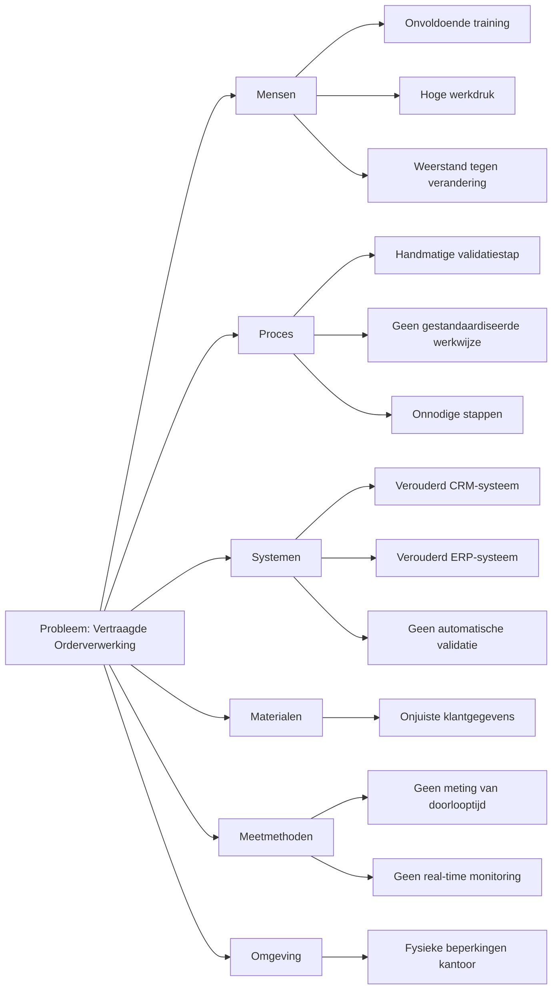
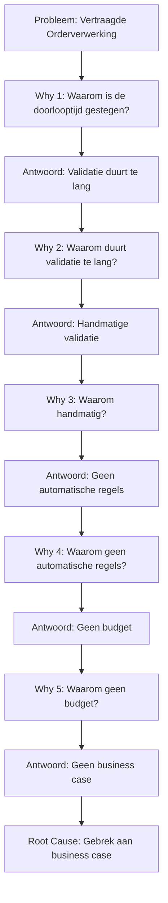

Dit Root Cause Analyse (RCA)-template helpt je om de onderliggende oorzaken van de vertraagde orderverwerking bij TelecomPro B.V. systematisch te identificeren. Het doel is om:  
- Symptomen en oorzaken van het probleem duidelijk te scheiden.  
- Root causes te achterhalen met behulp van gestructureerde analysemethoden (5 Why's, Fishbone, Pareto).  
- Permanente oplossingen te ontwikkelen in plaats van tijdelijke fixes.  
- Data en feiten te gebruiken voor objectieve analyse.  
- Lessons learned vast te leggen voor toekomstige preventie.

#### Eigenschappen

| Veld          | Waarde                                                    | Toelichting                     |
| ----------------- | ------------------------------------------------------------- | ----------------------------------- |
| PMD-nummer    | 03.09.01                                                      | Uniek identificatienummer voor RCA. |
| Versie        | 1.0                                                           | Huidige versie.                     |
| Status        | Gepubliceerd                                                  | Status van het document.            |
| Auteur        | Martin van Pelt                                               | Procesanalist.                      |
| Eigenaar      | Jan de Vries                                                  | Proceseigenaar Operaties.           |
| Datum         | 19/04/2026                                                    | Datum van laatste update.           |
| Gekoppeld aan | Procesverbetering (PMD-03.09.00), Procesreview (PMD-03.08.03) | Gerelateerde documenten.            |

#### Algemeen Overzicht

| Veld             | Waarde      | Toelichting                       |
| -------------------- | --------------- | ------------------------------------- |
| Procesnaam       | Orderverwerking | Naam van het proces.                  |
| Proces-ID        | PR-001          | Unieke identifier.                    |
| Probleem-ID      | PROB-001        | Unieke identifier voor het probleem.  |
| Datum ontdekking | 01/03/2026      | Datum waarop het probleem is ontdekt. |
| Datum analyse    | 19/04/2026      | Datum waarop de RCA is uitgevoerd.    |

#### Probleemomschrijving

Beschrijf hier het probleem op een duidelijke, objectieve manier met behulp van de 5W2H-methode (What, When, Where, Who, Why, How, How much).

| Veld    | Waarde                                                     |
| ----------- | -------------------------------------------------------------- |
| Wat     | Vertraagde orderverwerking                                     |
| Wanneer | Sinds begin Q1 2026                                            |
| Waar    | In het Order Team, tijdens de validatiestap                    |
| Wie     | Order Medewerkers, Klanten                                     |
| Waarom  | Onbekend, onderzocht via RCA                                   |
| Hoe     | Handmatige validatie van klantgegevens in CRM en SAP ERP       |
| Hoeveel | Gemiddelde doorlooptijd gestegen van 22 uur naar 28 uur (+27%) |

Beschrijving:

> *"Sinds begin Q1 2026 ervaart het Order Team vertragingen in de orderverwerking. De gemiddelde doorlooptijd is gestegen van 22 uur naar 28 uur (+27%), wat leidt tot klachten van klanten en een daling in klanttevredenheid (NPS van 8,5 naar 8,2). Het probleem doet zich voor tijdens de validatiestap van klantgegevens, waar Order Medewerkers handmatig gegevens controleren in het CRM-systeem (Salesforce) en ERP-systeem (SAP)."*

#### Impactanalyse

Beschrijf hier de impact van het probleem op verschillende gebieden.

| Impactcategorie | Beschrijving                                              | Kwantificeerbaar? | Waarde             | Severiteit |
| ------------------- | ------------------------------------------------------------- | --------------------- | ---------------------- | -------------- |
| Financieel      | Extra kosten door handmatig werk en klantcompensaties.        | Ja                    | €10.000/maand          | Hoog           |
| Operationeel    | Vertraging in levering en productie.                          | Ja                    | +6u doorlooptijd       | Hoog           |
| Klant           | Lagere klanttevredenheid en verlies van klanten.              | Ja                    | NPS -0,3               | Hoog           |
| Medewerker      | Frustratie en werkdruk bij Order Team.                        | Nee                   | -                      | Middel         |
| Compliance      | Risico op niet-naleving van SLA's (Service Level Agreements). | Ja                    | 2 SLA-overschrijdingen | Hoog           |
| Reputatie       | Negatieve impact op de reputatie van TelecomPro.              | Nee                   | -                      | Hoog           |

Severiteit:

- Hoog: Kritische impact op bedrijfsprestaties.
- Middel: Belangrijke impact, maar niet kritiek.
- Laag: Beperkte impact.

#### 5 Why's Analyse

Gebruik de 5 Why's-methode om de root cause van het probleem te achterhalen.

| Why   | Antwoord                                      | Onderbouwing                                                                               | Categorie |
| --------- | ------------------------------------------------- | ---------------------------------------------------------------------------------------------- | ------------- |
| Why 1 | Waarom is de doorlooptijd gestegen?               | Omdat de validatie van klantgegevens te lang duurt.                                        | Proces        |
| Why 2 | Waarom duurt de validatie te lang?                | Omdat de validatie handmatig wordt uitgevoerd.                                             | Proces        |
| Why 3 | Waarom wordt de validatie handmatig uitgevoerd?   | Omdat er geen automatische validatieregels zijn geïmplementeerd.                           | Technisch     |
| Why 4 | Waarom zijn er geen automatische validatieregels? | Omdat er geen budget was voor automatisering.                                              | Financieel    |
| Why 5 | Waarom was er geen budget voor automatisering?    | Omdat er geen business case was opgesteld die de ROI (Return on Investment) aantoonde. | Strategisch   |

Root Cause:  
*"Gebrek aan een business case voor automatisering van de validatiestap, wat heeft geleid tot handmatige validatie en vertraging in de orderverwerking."*

#### Fishbone-diagram (Ishikawa)

Gebruik een Fishbone-diagram om alle mogelijke oorzaken van het probleem in kaart te brengen.

Toelichting:

- Mensen: Onvoldoende training, hoge werkdruk, weerstand tegen verandering.
- Proces: Handmatige validatiestap, geen gestandaardiseerde werkwijze, onnodige stappen.
- Systemen: Verouderd CRM- en ERP-systeem, geen automatische validatie.
- Materialen: Onjuiste klantgegevens.
- Meetmethoden: Geen meting van doorlooptijd, geen real-time monitoring.
- Omgeving: Fysieke beperkingen op kantoor.

#### Pareto-analyse (80/20-regel)

Gebruik een Pareto-analyse om te bepalen welke oorzaken de grootste impact hebben.

| Oorzaak                     | Frequentie | Impact (1-10) | Totaal (Frequentie × Impact) | Cumulatief % | Prioriteit |
| ------------------------------- | -------------- | ----------------- | -------------------------------- | ---------------- | -------------- |
| Handmatige validatiestap        | 10             | 9                 | 90                               | 45%              | Hoog           |
| Onvoldoende training            | 8              | 7                 | 56                               | 75%              | Hoog           |
| Geen automatische validatie     | 7              | 8                 | 56                               | 75%              | Hoog           |
| Verouderd CRM-systeem           | 6              | 6                 | 36                               | 87%              | Middel         |
| Onjuiste klantgegevens          | 5              | 5                 | 25                               | 95%              | Middel         |
| Gebrek aan real-time monitoring | 4              | 4                 | 16                               | 100%             | Laag           |

Conclusie:  
*"De handmatige validatiestap en onvoldoende training zijn de twee belangrijkste oorzaken (75% van de impact) en moeten als eerste worden aangepakt."*

#### Oplossingen en Actieplan

Stel hier oplossingen voor om de root cause(s) aan te pakken.

| Oplossing                       | Root Cause                  | Actie                                                                                           | Verantwoordelijke | Deadline | Status | Verwachte impact           | Kosten | Prioriteit |
| ----------------------------------- | ------------------------------- | --------------------------------------------------------------------------------------------------- | --------------------- | ------------ | ---------- | ------------------------------ | ---------- | -------------- |
| Ontwikkel business case             | Gebrek aan business case        | Ontwikkel een business case voor automatisering van de validatiestap, inclusief ROI-berekening. | Proceseigenaar        | 30/04/2026   | Gepland    | Budget voor automatisering     | €1.000     | Hoog           |
| Implementeer automatische validatie | Handmatige validatiestap        | Implementeer automatische validatieregels in CRM en SAP ERP.                                    | IT-afdeling           | 30/06/2026   | Gepland    | ⬇️ Doorlooptijd met 50%        | €5.000     | Hoog           |
| Organiseer training                 | Onvoldoende training            | Organiseer training voor Order Team in CRM en SAP ERP.                                          | Kwaliteitsmanager     | 15/05/2026   | Gepland    | ⬇️ Foutpercentage met 30%      | €2.000     | Hoog           |
| Upgrade CRM-systeem                 | Verouderd CRM-systeem           | Upgrade naar nieuwe versie van Salesforce CRM.                                                  | IT-afdeling           | 30/09/2026   | Gepland    | ⬆️ Systeemprestaties           | €8.000     | Middel         |
| Implementeer real-time monitoring   | Gebrek aan real-time monitoring | Implementeer Procesdashboard in Power BI voor real-time monitoring.                             | IT-afdeling           | 30/05/2026   | Gepland    | ⬆️ Inzicht in procesprestaties | €3.000     | Hoog           |

#### Validatie van Oplossingen

Beschrijf hier hoe de oplossingen worden gevalideerd om ervoor te zorgen dat ze de root cause aanpakken.

| Oplossing          | Validatiemethode                                  | Verantwoordelijke | Frequentie | Succescriteria                  |
| ---------------------- | ----------------------------------------------------- | --------------------- | -------------- | ----------------------------------- |
| Automatische validatie | Meting doorlooptijd voor/na implementatie.        | Proceseigenaar        | Maandelijks    | Doorlooptijd < 24 uur.              |
| Training Order Team    | Meting foutpercentage voor/na training.           | Kwaliteitsmanager     | Maandelijks    | Foutpercentage < 1%.                |
| Upgrade CRM-systeem    | Meting systeemprestaties voor/na upgrade.         | IT-afdeling           | Kwartaallijks  | Systeembeschikbaarheid > 99,5%.     |
| Procesdashboard        | Meting gebruik en tevredenheid van het dashboard. | Proceseigenaar        | Maandelijks    | Dashboard wordt dagelijks gebruikt. |

#### Lessons Learned

Documenteer hier wat er is geleerd tijdens de RCA, zodat toekomstige problemen kunnen worden voorkomen.

| Categorie      | Beschrijving                                                     | Actie voor toekomst                                          |
| ------------------ | -------------------------------------------------------------------- | ---------------------------------------------------------------- |
| Succesfactoren | Gebruik van 5 Why's en Fishbone-diagram voor diepgaande analyse. | Behoud deze methoden voor toekomstige RCA's.                     |
| Succesfactoren | Betrokkenheid van IT-afdeling en Order Team bij de analyse.      | Behoud goede samenwerking tussen afdelingen.                     |
| Valkuilen      | Onvoldoende data beschikbaar voor analyse.                       | Zorg voor complete brondata voordat RCA start.               |
| Valkuilen      | Te late ontdekking van het probleem.                             | Implementeer real-time monitoring van KPI's.                 |
| Verbeterpunten | Geen business case voor automatisering.                          | Ontwikkel altijd een business case voor grote investeringen. |

#### Visuele Weergave (Mermaid)

#### Stakeholders en Verantwoordelijkheden

| Rol               | Verantwoordelijkheid                                         | Betrokkenheid |
| --------------------- | ---------------------------------------------------------------- | ----------------- |
| Proceseigenaar    | Verantwoordelijk voor de uitvoering en follow-up van de RCA. | Continu           |
| Procesanalist     | Voert de RCA uit en documenteert bevindingen.                | Ad hoc            |
| Kwaliteitsmanager | Valideert de RCA en zorgt voor datakwaliteit.                | Periodiek         |
| IT-afdeling       | Levert technische data en ondersteunt bij oplossingen.       | Ad hoc            |
| Management        | Valideert de RCA op strategische alignement.                 | Periodiek         |
| Order Team        | Levert input voor de RCA.                                    | Ad hoc            |

#### Gerelateerde Documenten

- [Procesverbetering](#) (PMD-03.09.00)
- [Procesreview](#) (PMD-03.08.03)
- [Procesverbeterplan](#) (PMD-03.09.02)

#### Versiehistorie
| Versie | Datum  | Wijziging   | Auteur      | Goedgekeurd door |
| ---------- | ---------- | --------------- | --------------- | -------------------- |
| 1.0        | 19/04/2026 | Initiële versie | Martin van Pelt | Jan de Vries         |