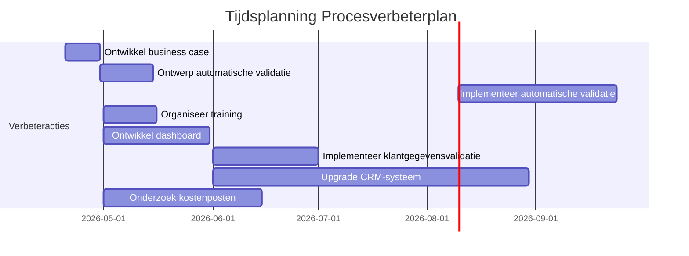
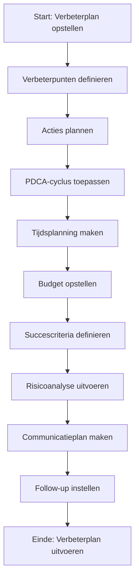

Dit Procesverbeterplan biedt een gestructureerde aanpak voor het plannen, uitvoeren, en monitoren van verbeteringen in het Orderverwerkingsproces (PR-001) bij TelecomPro B.V.. Het doel is om:  
- Duidelijke verbeterpunten te definieren op basis van analyses (RCA, Procesreview).  
- Concrete acties te plannen met verantwoordelijkheden, deadlines, en succescriteria.  
- Voortgang te monitoren en resultaten te evalueren.  
- Continue verbetering te waarborgen door feedback en lessen geleerd.  
- Transparantie te creëren voor stakeholders (management, teams, klanten).

#### Eigenschappen

| Veld          | Waarde                                                          | Toelichting                                    |
| ----------------- | ------------------------------------------------------------------- | -------------------------------------------------- |
| PMD-nummer    | 03.09.02                                                            | Uniek identificatienummer voor procesverbeterplan. |
| Versie        | 1.0                                                                 | Huidige versie.                                    |
| Status        | Gepubliceerd                                                        | Status van het document.                           |
| Auteur        | Martin van Pelt                                                     | Procesanalist.                                     |
| Eigenaar      | Jan de Vries                                                        | Proceseigenaar Operaties.                          |
| Datum         | 19/04/2026                                                          | Datum van laatste update.                          |
| Gekoppeld aan | Procesverbetering (PMD-03.09.00), Root Cause Analyse (PMD-03.09.01) | Gerelateerde documenten.                           |

#### Algemeen Overzicht

| Veld                      | Waarde                                                                                                                   | Toelichting                                       |
| ----------------------------- | ---------------------------------------------------------------------------------------------------------------------------- | ----------------------------------------------------- |
| Procesnaam                | Orderverwerking                                                                                                              | Naam van het proces.                                  |
| Proces-ID                 | PR-001                                                                                                                       | Unieke identifier.                                    |
| Doel van het verbeterplan | Verminderen van doorlooptijd en fouten in de orderverwerking door automatisering, training, en procesoptimalisatie.          | Wat het verbeterplan moet bereiken.                   |
| Scope                     | Hele proces van ontvangst tot bevestiging van orders.                                                                        | Wat valt binnen de scope.                             |
| Betrokken partijen        | Proceseigenaar, Procesanalist, IT-afdeling, Kwaliteitsmanager, Order Team, Sales Manager, Financiële Afdeling                | Wie is betrokken bij het verbeterplan.                |
| Koppeling met strategie   | Ondersteunt organisatiedoelen "Klanttevredenheid verhogen tot 90% in 2026" en "Kosten per order verlagen naar <€10". | Hoe het verbeterplan bijdraagt aan organisatiedoelen. |

#### Inleiding en Context

| Veld                 | Waarde                                                                                                                          |
| ------------------------ | ----------------------------------------------------------------------------------------------------------------------------------- |
| Aanleiding           | Stijgende doorlooptijd (28 uur) en dalende klanttevredenheid (NPS 8,2) in Q1 2026.                                                  |
| Probleemomschrijving | Gemiddelde doorlooptijd gestegen van 22u naar 28u (+27%), NPS gedaald van 8,5 naar 8,2, foutpercentage gestegen van 1,0% naar 1,5%. |
| Root Causes          | Gebrek aan business case voor automatisering, handmatige validatiestap, onvoldoende training, verouderde systemen.                  |
| Impact               | Vertraging in levering, hogere kosten, lagere klanttevredenheid, risico op SLA-overschrijdingen.                                    |

#### Verbeterpunten

Lijst hier de belangrijkste verbeterpunten op, gebaseerd op de Root Cause Analyse (PMD-03.09.01) en Procesreview (PMD-03.08.03).

| Verbeterpunt                    | Beschrijving                                                         | Root Cause                  | Gerelateerde KPI         | Prioriteit | Categorie |
| ----------------------------------- | ------------------------------------------------------------------------ | ------------------------------- | ---------------------------- | -------------- | ------------- |
| Automatiseren validatiestap         | Implementeer automatische validatie van klantgegevens in CRM en SAP ERP. | Handmatige validatiestap        | Doorlooptijd orderverwerking | Hoog           | Proces        |
| Extra training Order Team           | Organiseer training voor nieuwe medewerkers in CRM en SAP ERP.           | Onvoldoende training            | Aantal fouten per order      | Hoog           | Mensen        |
| Implementeer Procesdashboard        | Ontwikkel een dashboard in Power BI voor real-time monitoring van KPI’s. | Gebrek aan real-time monitoring | Alle KPI’s                   | Hoog           | Systemen      |
| Automatische klantgegevensvalidatie | Implementeer automatische validatie van klantgegevens in CRM.            | Onjuiste klantgegevens          | First-time-right             | Hoog           | Proces        |
| Upgrade CRM-systeem                 | Upgrade naar nieuwste versie van Salesforce CRM.                         | Verouderd CRM-systeem           | Systeembeschikbaarheid       | Middel         | Systemen      |
| Kostenanalyse                       | Analyseer kostenposten en optimaliseer proces.                           | Onbekende kostenposten          | Kosten per order             | Hoog           | Kosten        |

Prioriteit:

- Hoog: Kritisch voor procesprestaties, directe actie vereist.
- Middel: Belangrijk, maar niet kritiek.
- Laag: Wenselijk, maar niet urgent.

Categorie:

- Proces: Verbeteringen in de processtappen.
- Mensen: Verbeteringen in kennis, vaardigheden, of cultuur.
- Systemen: Verbeteringen in tools, software, of infrastructuur.
- Kosten: Verbeteringen in financieel beheer.

#### Verbeteracties

Definieer hier concrete acties om de verbeterpunten te realiseren. Gebruik de PDCA-cyclus (Plan-Do-Check-Act) voor structuur.

Actie                           | Verbeterpunt                    | Beschrijving                                                                                | Verantwoordelijke | Startdatum | Deadline | Status | Benodigde middelen            | Kosten | Succescriteria                                 | Risico's                | Mitigerende maatregelen            |
| ----------------------------------- | ----------------------------------- | ----------------------------------------------------------------------------------------------- | --------------------- | -------------- | ------------ | ---------- | --------------------------------- | ---------- | -------------------------------------------------- | --------------------------- | -------------------------------------- |
| Ontwikkel business case             | Automatiseren validatiestap         | Ontwikkel een business case voor automatisering van de validatiestap, inclusief ROI-berekening. | Proceseigenaar        | 20/04/2026     | 30/04/2026   | Gepland    | Tijd, expertise                   | €1.000     | Business case goedgekeurd door Directie            | Geen budget                 | Zoek alternatieve financieringsbronnen |
| Ontwerp automatische validatie      | Automatiseren validatiestap         | Ontwikkel automatische validatieregels in CRM en SAP ERP.                                       | IT-afdeling           | 01/05/2026     | 15/05/2026   | Gepland    | Ontwikkeltijd, testomgeving       | €2.000     | Validatieregels werken foutloos in testomgeving    | Technische issues           | Test in sandbox-omgeving               |
| Implementeer automatische validatie | Automatiseren validatiestap         | Implementeer validatieregels in productie.                                                      | IT-afdeling           | 16/05/2026     | 30/06/2026   | Gepland    | Productieomgeving                 | €2.500     | Validatie werkt foutloos in productie              | Weerstand tegen verandering | Betrek Order Team bij implementatie    |
| Organiseer training                 | Extra training Order Team           | Plan en voer training uit voor nieuwe medewerkers in CRM en SAP ERP.                            | Kwaliteitsmanager     | 01/05/2026     | 15/05/2026   | Gepland    | Trainingsmateriaal, trainer       | €2.000     | Alle medewerkers getraind en gecertificeerd        | Lage opkomst                | Maak training verplicht                |
| Ontwikkel dashboard                 | Implementeer Procesdashboard        | Ontwikkel dashboard in Power BI met koppeling naar SAP en CRM.                                  | IT-afdeling           | 01/05/2026     | 30/05/2026   | Gepland    | Power BI-licenties, ontwikkeltijd | €3.000     | Dashboard is operationeel en gekoppeld aan SAP/CRM | Technische beperkingen      | Gebruik standaard templates            |
| Implementeer klantgegevensvalidatie | Automatische klantgegevensvalidatie | Ontwikkel en implementeer automatische validatie van klantgegevens in CRM.                      | IT-afdeling           | 01/06/2026     | 30/06/2026   | Gepland    | Ontwikkeltijd, testomgeving       | €2.500     | Validatie werkt foutloos                           | Data-kwaliteitsissues       | Voer datakwaliteitscontroles uit       |
| Upgrade CRM-systeem                 | Upgrade CRM-systeem                 | Upgrade Salesforce CRM naar nieuwste versie.                                                    | IT-afdeling           | 01/06/2026     | 30/08/2026   | Gepland    | CRM-licenties, migratietools      | €8.000     | CRM-systeem is up-to-date en stabiel               | Vertraging door migratie    | Gebruik gefaseerde migratie            |
| Onderzoek kostenposten              | Kostenanalyse                       | Analyseer kostenposten en optimaliseer proces.                                                  | Financiële Afdeling   | 01/05/2026     | 15/06/2026   | Gepland    | Toegang tot financiële data       | €1.500     | Kosten per order verlaagd naar €10                 | Onvolledige data            | Gebruik SAP ERP voor data-extractie    |

Status:

- Gepland: Actie is gepland maar nog niet gestart.
- In uitvoering: Actie is gestart maar nog niet afgerond.
- Afgerond: Actie is afgerond en succescriteria zijn behaald.
- Gepauzeerd: Actie is tijdelijk gestopt.
- Geannuleerd: Actie is geannuleerd.

#### Tijdsplanning (Gantt Chart)

#### Budgetoverzicht

| Categorie | Post                            | Bedrag  | Verantwoordelijke | Status    |
| ------------- | ----------------------------------- | ----------- | --------------------- | ------------- |
| Ontwikkeling  | Business case                       | €1.000      | Proceseigenaar        | Goedgekeurd   |
| Ontwikkeling  | Ontwerp automatische validatie      | €2.000      | IT-afdeling           | In afwachting |
| Ontwikkeling  | Implementeer automatische validatie | €2.500      | IT-afdeling           | In afwachting |
| Training      | Order Team                          | €2.000      | Kwaliteitsmanager     | Goedgekeurd   |
| Ontwikkeling  | Procesdashboard                     | €3.000      | IT-afdeling           | In afwachting |
| Ontwikkeling  | Klantgegevensvalidatie              | €2.500      | IT-afdeling           | In afwachting |
| Ontwikkeling  | Upgrade CRM-systeem                 | €8.000      | IT-afdeling           | In afwachting |
| Analyse       | Kostenanalyse                       | €1.500      | Financiële Afdeling   | Goedgekeurd   |
| Totaal    | &nbsp;                              | €22.500 | &nbsp;                | &nbsp;        |

#### Succescriteria en KPI's

| Succescriterium          | Gerelateerde KPI         | Huidige waarde | Doelwaarde | Meetfrequentie | Verantwoordelijke | Bron     |
| ---------------------------- | ---------------------------- | ------------------ | -------------- | ------------------ | --------------------- | ------------ |
| Doorlooptijd orderverwerking | Doorlooptijd orderverwerking | 28 uur             | < 24 uur       | Dagelijks          | Proceseigenaar        | SAP ERP      |
| Aantal fouten per order      | Aantal fouten per order      | 1,5%               | < 1%           | Wekelijks          | Kwaliteitsmanager     | SAP ERP      |
| First-time-right             | First-time-right             | 95%                | > 98%          | Wekelijks          | Proceseigenaar        | SAP ERP      |
| Klanttevredenheid (NPS)      | Klanttevredenheid (NPS)      | 8,2                | > 8,5          | Maandelijks        | Sales Manager         | Klantenquête |
| Kosten per order             | Kosten per order             | €12                | < €10          | Maandelijks        | Financiële Afdeling   | SAP ERP      |
| Systeembeschikbaarheid       | Systeembeschikbaarheid       | 99,2%              | > 99,5%        | Continu            | IT-afdeling           | Nagios       |

#### Risicoanalyse

| Risico                  | Oorzaak                  | Impact             | Kans | Mitigerende maatregel        | Verantwoordelijke | Status    |
| --------------------------- | ---------------------------- | ---------------------- | -------- | -------------------------------- | --------------------- | ------------- |
| Vertraging in implementatie | Technische issues            | Vertraagde verbetering | Middel   | Test in sandbox-omgeving         | IT-afdeling           | In uitvoering |
| Budgetoverschrijding        | Onvoorziene kosten           | Financiële impact      | Laag     | Maandelijkse budgetreview        | Proceseigenaar        | Gepland       |
| Lage opkomst training       | Gebrek aan motivatie         | Onvoldoende kennis     | Middel   | Maak training verplicht          | Kwaliteitsmanager     | Gepland       |
| Weerstand tegen verandering | Angst voor nieuwe werkwijze  | Vertraagde adoptie     | Hoog     | Betrek medewerkers bij ontwerp   | Proceseigenaar        | Gepland       |
| Data-kwaliteitsissues       | Onvolledige of onjuiste data | Onnauwkeurige analyses | Laag     | Voer datakwaliteitscontroles uit | IT-afdeling           | Gepland       |

Kans:
- Hoog: Risico is zeer waarschijnlijk.
- Middel: Risico is mogelijk.
- Laag: Risico is onwaarschijnlijk.

#### Communicatieplan

| Doelgroep       | Bericht                       | Kanaal          | Frequentie | Verantwoordelijke | Status |
| ------------------- | --------------------------------- | ------------------- | -------------- | --------------------- | ---------- |
| Management          | Voortgangsrapportage verbeterplan | E-mail, Presentatie | Maandelijks    | Proceseigenaar        | Gepland    |
| Order Team          | Training en updates               | Teammeeting, E-mail | Wekelijks      | Kwaliteitsmanager     | Gepland    |
| IT-afdeling         | Technische vereisten              | E-mail, Overleg     | Ad hoc         | Proceseigenaar        | Gepland    |
| Financiële Afdeling | Budgetoverzicht                   | E-mail              | Ad hoc         | Proceseigenaar        | Gepland    |
| Klanten             | Verbeterde klantcommunicatie      | Nieuwsbrief, E-mail | Ad hoc         | Sales Manager         | Gepland    |

#### Follow-up en Evaluatie

| Veld                        | Waarde                                                  |
| ------------------------------- | ----------------------------------------------------------- |
| Follow-up frequentie        | Wekelijks                                                   |
| Verantwoordelijke follow-up | Proceseigenaar                                              |
| Evaluatiemomenten           | Maandelijkse review, Afronding verbeterplan                 |
| Rapportage                  | Wekelijkse statusupdate via e-mail, Maandelijkse rapportage |
| Escalatiepad                | Proceseigenaar → Teamleider → Directie                      |

#### Visuele Weergave (Mermaid)

#### Stakeholders en Verantwoordelijkheden

| Rol               | Verantwoordelijkheid                                                   | Betrokkenheid |
| --------------------- | -------------------------------------------------------------------------- | ----------------- |
| Proceseigenaar    | Verantwoordelijk voor de uitvoering en follow-up van het verbeterplan. | Continu           |
| Procesanalist     | Stelt het verbeterplan op en monitort voortgang.                       | Ad hoc            |
| IT-afdeling       | Ondersteunt bij technische verbeteringen.                              | Ad hoc            |
| Kwaliteitsmanager | Evalueert de impact op kwaliteit.                                      | Periodiek         |
| Management        | Valideert het verbeterplan op strategische alignement.                 | Periodiek         |
| Order Team        | Voert verbeteracties uit.                                              | Ad hoc            |

#### Gerelateerde Documenten

- [Procesverbetering](#) (PMD-03.09.00)
- [Root Cause Analyse](#) (PMD-03.09.01)
- [Processturing](#) (PMD-03.08.00)
- [KPI's](#) (PMD-03.08.01)

#### Versiehistorie

| Versie | Datum  | Wijziging   | Auteur      | Goedgekeurd door |
| ---------- | ---------- | --------------- | --------------- | -------------------- |
| 1.0        | 19/04/2026 | Initiële versie | Martin van Pelt | Jan de Vries         |