# 1 Procesdocumentatiebeheer

## 1.1 Procesdocumentatiebeheer Master
---
title: Procesdocumentatiebeheer 
weight: 1 
description: Beheer van alle procesdocumentatie binnen TelecomPro B.V., inclusief versiebeheer, toegang, en onderhoud. 
type: template 
tags:
- procesdocumentatiebeheer
- PDM
- versiebeheer
- TelecomPro
---

### 1.1.1 Inleiding

Dit document beschrijft hoe procesdocumentatie binnen TelecomPro B.V. wordt beheerd. Het doel is om: 
- Consistentie in procesdocumentatie te waarborgen. 
- Toegang en onderhoud van documentatie te regelen. 
- Versiebeheer te standaardiseren. 
- Compliance met organisatie- en wettelijke eisen te borgen.

### 1.1.2 Eigenschappen

|Veld|Waarde|Toelichting|
|---|---|---|
|PMD-nummer|01.00.00|Uniek identificatienummer voor procesdocumentatiebeheer.|
|Versie|1.0|Huidige versie.|
|Status|Gepubliceerd|Status van het document.|
|Auteur|Martin van Pelt|Procesanalist.|
|Eigenaar|Jan de Vries|Proceseigenaar Operaties.|
|Datum|19/04/2026|Datum van laatste update.|

### 1.1.3 Beheerstructuur

#### 1.1.3.1 Verantwoordelijkheden

|Rol|Verantwoordelijkheid|Betrokkenheid|
|---|---|---|
|Proceseigenaar|Verantwoordelijk voor de inhoud en actualiteit van procesdocumentatie binnen hun domein.|Continu|
|Procesanalist|Ontwikkelt en onderhoudt procesdocumentatie.|Ad hoc|
|Documentbeheerder|Beheert toegang, versiebeheer, en publicatie van documentatie.|Continu|
|IT-afdeling|Ondersteunt bij digitale opslag en toegang.|Ad hoc|
|Kwaliteitsmanager|Zorgt voor compliance met kwaliteitsnormen (ISO 9001).|Periodiek|

#### 1.1.3.2 Documentatiestructuur

```tree
TelecomPro PDM/  
├── 01. Procesdocumentatiebeheer/  
│   ├── Procesdocumentatiebeheer.md  
│   ├── Wijzigingslog.md  
│   └── Wijzigingsverzoek/  
│       ├── Template_Wijzigingsverzoek.md  
│       └── WR-2026-001_Orderverwerking.md  
├── 02. Procesarchitectuur/  
│   ├── Procesarchitectuur.md  
│   ├── Proceslandkaart.md  
│   ├── Proceshiërarchie.md  
│   ├── Procesinventarisatie.md  
│   └── Procesinteractie.md  
├── 03. Procesdoel/  
│   └── Procesdoel_Orderverwerking.md  
├── 04. Procescontext/  
│   ├── Procescontext_Orderverwerking.md  
│   └── Procesinput-output_Orderverwerking.md  
├── 05. Proceseigenschappen/  
│   ├── Proceseigenschappen_Orderverwerking.md  
│   └── Procesbegrippen.md  
├── 06. Procesmodellering/  
│   ├── Procesmodellering_Orderverwerking.md  
│   ├── BPMN_Orderverwerking.md  
│   ├── Flowchart_Orderverwerking.md  
│   └── Swimlane_Orderverwerking.md  
├── 07. Procesuitwerking/  
│   ├── Procesuitwerking_Orderverwerking.md  
│   ├── Procesbeschrijving_Orderverwerking.md  
│   ├── Werkinstructie_Orderverwerking.md  
│   ├── RACI_Orderverwerking.md  
│   └── Procesrollen_Orderverwerking.md  
├── 08. Processturing/  
│   ├── Processturing_Orderverwerking.md  
│   ├── KPIs_Orderverwerking.md  
│   ├── Procesdashboard_Orderverwerking.md  
│   ├── Procesreview_Orderverwerking.md  
│   └── KPI_Definitie_Doorlooptijd.md  
└── 09. Procesverbetering/  
    ├── Procesverbetering_Orderverwerking.md  
    ├── Root_Cause_Analysis_Vertraagde_Orderverwerking.md  
    └── Procesverbeterplan_Orderverwerking.md
```

#### 1.1.3.3 Opslaglocatie

|Locatie|Doel|Toegang|
|---|---|---|
|SharePoint (PDM)|Centrale opslag van alle procesdocumentatie.|Alle medewerkers (lezen), Proceseigenaar/Procesanalist (bewerken).|
|Confluence|Samenwerking en versiebeheer.|Proceseigenaar, Procesanalist, Documentbeheerder.|
|Git (voor technische documentatie)|Versiebeheer voor BPMN-diagrammen en scripts.|IT-afdeling, Procesanalist.|

### 1.1.4 Versiebeheer

#### 1.1.4.1 Versienummering

|Versie|Beschrijving|Voorbeeld|
|---|---|---|
|v0.x|Conceptversie (in opstelling).|v0.1, v0.2|
|v1.0|Eerste goedgekeurde versie.|v1.0|
|v1.x|Kleine wijzigingen (tekstuele correcties, verduidelijkingen).|v1.1, v1.2|
|v2.0|Structurele herziening (grote wijzigingen).|v2.0|

#### 1.1.4.2 Versiehistorie

Elk document bevat een versiehistorie in de volgende opmaak:

|Versie|Datum|Wijziging|Auteur|Goedgekeurd door|
|---|---|---|---|---|
|1.0|19/04/2026|Initiële versie|Martin van Pelt|Jan de Vries|
|1.1|20/04/2026|Toegevoegde Proceslandkaart|Martin van Pelt|Jan de Vries|

### 1.1.5 Toegang en Rechten

|Rol|Toegangsniveau|Rechten|
|---|---|---|
|Alle medewerkers|Lezen|Alle documenten in het PDM.|
|Proceseigenaar|Lezen/Bewerken|Documenten binnen eigen domein.|
|Procesanalist|Lezen/Bewerken|Alle documenten.|
|Documentbeheerder|Lezen/Bewerken/Beheren|Alle documenten + publicatierechten.|
|IT-afdeling|Lezen/Bewerken|Technische documentatie (BPMN, systemen).|
|Kwaliteitsmanager|Lezen|Alle documenten (voor audits).|

### 1.1.6 Onderhoud en Updates

#### 1.1.6.1 Periodieke Reviews

|Documenttype|Reviewfrequentie|Verantwoordelijke|
|---|---|---|
|Proceslandkaart|Jaarlijks|Proceseigenaar|
|Procesbeschrijving|Halfjaarlijks|Proceseigenaar|
|BPMN-diagrammen|Kwartaallijks|Procesanalist|
|Werkinstructies|Kwartaallijks|Teamleider|
|KPI’s|Maandelijks|Proceseigenaar|

#### 1.1.6.2 Wijzigingsproces

Zie [Wijzigingsbeheer](#) (PMD-03.10.00) voor het stapsgewijze wijzigingsproces.

### 1.1.7 Kwaliteitsborging

#### 1.1.7.1 Compliance-eisen

|Eis|Beschrijving|Verantwoordelijke|
|---|---|---|
|ISO 9001|Naleving van kwaliteitsnormen voor procesdocumentatie.|Kwaliteitsmanager|
|GDPR|Bescherming van persoonsgegevens in documentatie.|Compliance Officer|
|Interne audits|Jaarlijkse audits van procesdocumentatie.|Kwaliteitsmanager|

### 1.1.8 Tools en Systemen

|Tool|Doel|Gebruikers|
|---|---|---|
|SharePoint|Centrale opslag en versiebeheer.|Alle medewerkers|
|Confluence|Samenwerking en documentatie.|Proceseigenaar, Procesanalist|
|Camunda|BPMN-modellering.|Procesanalist, IT-afdeling|
|Git|Versiebeheer voor technische documentatie.|IT-afdeling, Procesanalist|
|Power BI|Rapportage en dashboards.|Proceseigenaar, Management|

### 1.1.9 Contactgegevens

|Rol|Naam|E-mail|Telefoon|
|---|---|---|---|
|Documentbeheerder|Sarah Koning|[sarah.koning@telecompro.nl](mailto:sarah.koning@telecompro.nl)|+31 (0)10 123 4567|
|Procesanalist|Martin van Pelt|[martin.vanpelt@telecompro.nl](mailto:martin.vanpelt@telecompro.nl)|+31 (0)10 123 4568|
|Kwaliteitsmanager|Sarah Koning|[sarah.koning@telecompro.nl](mailto:sarah.koning@telecompro.nl)|+31 (0)10 123 4567|

## 1.2 Wijzigingslog
---
title: Wijzigingslog weight: 2 
description: Logboek van alle wijzigingen in de procesdocumentatie van TelecomPro B.V. 
type: template 
tags:
- procesdocumentatiebeheer 
- wijzigingslog
- PDM
- TelecomPro
---
### 1.2.1 Inleiding

Dit Wijzigingslog documenteert alle wijzigingen in de procesdocumentatie van TelecomPro B.V.. Het doel is om: 
- Traceerbaarheid van wijzigingen te waarborgen. 
- Transparantie te creëren over wat, wanneer, en door wie wijzigingen zijn doorgevoerd. 
- Historische referentie mogelijk te maken.

### 1.2.2 Eigenschappen

|Veld|Waarde|Toelichting|
|---|---|---|
|PMD-nummer|01.00.01|Uniek identificatienummer voor het wijzigingslog.|
|Versie|1.0|Huidige versie.|
|Status|Gepubliceerd|Status van het document.|
|Auteur|Martin van Pelt|Procesanalist.|
|Eigenaar|Jan de Vries|Proceseigenaar Operaties.|
|Datum|19/04/2026|Datum van laatste update.|

### 1.2.3 Wijzigingslog

|Wijzigings-ID|Datum|Proces|Document|Type Wijziging|Beschrijving|Auteur|Goedgekeurd door|Status|
|---|---|---|---|---|---|---|---|---|
|WR-2026-001|19/04/2026|Orderverwerking|Procesbeschrijving_Orderverwerking.md|Middelgroot|Toegevoegde automatische validatiestap in CRM.|Martin van Pelt|Jan de Vries|Voltooid|
|WR-2026-002|20/04/2026|Orderverwerking|BPMN_Orderverwerking.md|Middelgroot|Bijgewerkt BPMN-diagram met nieuwe validatiestap.|Martin van Pelt|Jan de Vries|Voltooid|
|WR-2026-003|20/04/2026|Orderverwerking|Werkinstructie_Orderverwerking.md|Middelgroot|Toegevoegde stappen voor automatische validatie.|Martin van Pelt|Jan de Vries|Voltooid|
|WR-2026-004|21/04/2026|Orderverwerking|KPI_Definitie_Doorlooptijd.md|Klein|Gecorrigeerde definitie van doorlooptijd.|Martin van Pelt|Jan de Vries|Voltooid|
|WR-2026-005|22/04/2026|SIM-activatie|Procesbeschrijving_SIM-activatie.md|Groot|Toegevoegde koppeling tussen Provisioning- en CRM-systeem.|Martin van Pelt|Mark van den Berg|In uitvoering|

### 1.2.4 Legenda: Type Wijziging

|Type|Beschrijving|Voorbeelden|
|---|---|---|
|Klein|Tekstuele correcties of verduidelijkingen zonder procesimpact.|Spelfouten, grammaticafouten.|
|Middelgroot|Aanpassingen in werkinstructies, verantwoordelijkheden, of kleine processtappen.|Wijziging in werkinstructie, aanpassing RACI-matrix.|
|Groot|Wijzigingen in procesflow, systemen, KPI’s, of herontwerp van processtappen.|Nieuwe processtap, wijziging in BPMN-diagram.|

### 1.2.5 Legenda: Status

|Status|Beschrijving|
|---|---|
|Ingediend|Wijzigingsverzoek is ingediend en wacht op analyse.|
|In beoordeling|Wijzigingsverzoek wordt beoordeeld door Proceseigenaar/Beheer Board.|
|Goedgekeurd|Wijzigingsverzoek is goedgekeurd en wacht op uitvoering.|
|In uitvoering|Wijziging wordt uitgevoerd.|
|Voltooid|Wijziging is voltooid en gepubliceerd.|
|Afgewezen|Wijzigingsverzoek is afgewezen.|

### 1.2.6 Gerelateerde Documenten

- [Wijzigingsbeheer](#) (PMD-03.10.00)
- [Wijzigingsverzoek](#) (PMD-03.10.01)

## 1.3 Wijzigingsverzoek

_(Zie eerdere uitwerking in de chat voor het Wijzigingsverzoek-template voor TelecomPro, inclusief voorbeeld WR-2026-001 voor Orderverwerking.)_

# 2 Procesarchitectuur

## 2.1 Procesarchitectuur Master
---
title: Procesarchitectuur 
weight: 1 
description: Architectuur van alle processen binnen TelecomPro B.V., inclusief categorisatie, relaties, en governance. 
type: template 
tags:
- procesarchitectuur 
- PDM
- TelecomPro
---

### 2.1.1 Inleiding

De Procesarchitectuur van TelecomPro B.V. beschrijft de structuur, categorisatie, en relaties tussen alle processen binnen de organisatie. Het doel is om: 
- Overzicht te bieden van alle processen. 
- Categorisatie van processen op basis van domein en type. 
- Relaties tussen processen in kaart te brengen. 
- Governance te waarborgen voor procesbeheer.

### 2.1.2 Eigenschappen

|Veld|Waarde|Toelichting|
|---|---|---|
|PMD-nummer|02.00.00|Uniek identificatienummer voor procesarchitectuur.|
|Versie|1.0|Huidige versie.|
|Status|Gepubliceurd|Status van het document.|
|Auteur|Martin van Pelt|Procesanalist.|
|Eigenaar|Jan de Vries|Proceseigenaar Operaties.|
|Datum|19/04/2026|Datum van laatste update.|

### 2.1.3 Procescategorisatie

Processen binnen TelecomPro zijn grocategoriseerd op basis van domein en type:

#### 2.1.3.1 Domeinen

|Domein|Beschrijving|Voorbeelden|
|---|---|---|
|Sales|Processen gerelateerd aan verkoop en klantacquisitie.|Orderverwerking, Offerteproces, Klantcontact.|
|Operaties|Processen gerelateerd aan uitvoering en levering.|Provisioning, Netwerkbeheer, Storingafhandeling.|
|Klantenservice|Processen gerelateerd aan klantondersteuning.|Klachtbehandeling, Supportverlening.|
|Financiën|Processen gerelateerd aan financieel beheer.|Facturatie, Inkoop, Budgetbeheer.|
|IT|Processen gerelateerd aan systeembeheer.|Systeemonderhoud, IT-support.|
|HR|Processen gerelateerd aan personeelsbeheer.|Werving, Training, Prestatiebeoordeling.|
|Kwaliteit|Processen gerelateerd aan kwaliteitsborging.|Audits, Compliance, Verbeterprojecten.|

#### 2.1.3.2 Procesniveaus

|Niveau|Beschrijving|Voorbeeld|
|---|---|---|
|Level 0|Hoofdprocessen (strategisch).|Order-to-Cash, Klantenservice.|
|Level 1|Subprocessen (tactisch).|Orderverwerking, Facturatie.|
|Level 2|Processtappen (operationeel).|Ontvangst order, Validatie klantgegevens.|
|Level 3|Substappen (gedetailleerd).|Handmatige validatie, Automatische validatie.|
|Level 4|Taken (uitvoerend).|Invoeren klantgegevens in CRM.|

### 2.1.4 Proceslandkaart

Zie [Proceslandkaart](#) (PMD-02.01.00) voor een visuele weergave van alle processen.

### 2.1.5 Proceshiërarchie

Zie [Proceshiërarchie](#) (PMD-02.02.00) voor een hiërarchische weergave van de processen.

### 2.1.6 Procesinventarisatie

|Proces-ID|Procesnaam|Domein|Niveau|Eigenaar|Status|Koppeling|
|---|---|---|---|---|---|---|
|PR-001|Orderverwerking|Operaties|Level 1|Jan de Vries|Actief|[Procesbeschrijving](#)|
|PR-002|SIM-activatie|Operaties|Level 1|Mark van den Berg|Actief|[Procesbeschrijving](#)|
|PR-003|Provisioning|Operaties|Level 1|Peter de Jong|Actief|[Procesbeschrijving](#)|
|PR-004|Storingafhandeling|Operaties|Level 1|David van Leeuwen|Actief|[Procesbeschrijving](#)|
|PR-005|Facturatie|Financiën|Level 1|Lisa van der Meer|Actief|[Procesbeschrijving](#)|
|PR-006|Klachtbehandeling|Klantenservice|Level 1|Emma van Dijk|Actief|[Procesbeschrijving](#)|
|PR-007|Offerteproces|Sales|Level 1|Lisa van der Meer|Actief|[Procesbeschrijving](#)|

### 2.1.7 Procesinteractie

```mermaid
graph TD  
    subgraph Sales["Sales"]  
        A[Offerteproces] --> B[Orderverwerking]  
    end  
    subgraph Operaties["Operaties"]  
        B --> C[Provisioning]  
        B --> D[SIM-activatie]  
        C --> E[Netwerkbeheer]  
        D --> E  
    end  
    subgraph Klantenservice["Klantenservice"]  
        F[Klachtbehandeling] --> B  
        F --> E[Storingafhandeling]  
    end  
    subgraph Financiën["Financiën"]  
        B --> G[Facturatie]  
    end  
    subgraph IT["IT"]  
        H[IT-support] --> C  
        H --> E  
    end
```
Toelichting:
- Orderverwerking (PR-001) ontvangt input van Offerteproces (PR-007) en levert output aan Provisioning (PR-003) en Facturatie (PR-005).  
- Provisioning (PR-003) werkt samen met Netwerkbeheer (PR-004) en SIM-activatie (PR-002).
- Klachtbehandeling (PR-006) kan leiden tot Orderverwerking (PR-001) (bijv. herhaling order) of Storingafhandeling (PR-004).

### 2.1.8 Governance en Verantwoordelijkheden

|Rol|Verantwoordelijkheid|Betrokkenheid|
|---|---|---|
|Directie|Verantwoordelijk voor strategische alignement van processen.|Periodiek|
|Proceseigenaar|Verantwoordelijk voor inhoud en actualiteit van processen binnen hun domein.|Continu|
|Procesanalist|Ontwikkelt en onderhoudt procesdocumentatie.|Ad hoc|
|Kwaliteitsmanager|Zorgt voor compliance met kwaliteitsnormen.|Periodiek|
|IT-afdeling|Ondersteunt systeemintegraties.|Ad hoc|

### 2.1.9 Gerelateerde Documenten

- [Proceslandkaart](#) (PMD-02.01.00)
- [Proceshiërarchie](#) (PMD-02.02.00)
- [Procesinventarisatie](#) (PMD-02.03.00)

## 2.2 Proceslandkaart
---
title: Proceslandkaart 
weight: 2 
description: Visuele weergave van alle processen binnen TelecomPro B.V., inclusief relaties en domeinen. type: 
template tags:
- procesarchitectuur  
- proceslandkaart
- PDM
- TelecomPro
---
### 2.2.1 Inleiding

De Proceslandkaart van TelecomPro B.V. biedt een visueel overzicht van alle processen binnen de organisatie. Het doel is om: 
- Inzicht te geven in de structuur en relaties tussen processen. 
- Navigatie door het Procesdocumentatiemodel (PDM) te vergemakkelijken. 
- Alignement te waarborgen tussen processen en organisatiedoelen.

### 2.2.2 Eigenschappen

|Veld|Waarde|Toelichting|
|---|---|---|
|PMD-nummer|02.01.00|Uniek identificatienummer voor de proceslandkaart.|
|Versie|1.0|Huidige versie.|
|Status|Gepubliceerd|Status van het document.|
|Auteur|Martin van Pelt|Procesanalist.|
|Eigenaar|Jan de Vries|Proceseigenaar Operaties.|
|Datum|19/04/2026|Datum van laatste update.|

### 2.2.3 Proceslandkaart (Mermaid)

```mermaid
graph TD  
    subgraph Strategisch["Strategisch (Level 0)"]  
        A[Order-to-Cash] --> B[Klantenservice]  
        A --> C[Productontwikkeling]  
        B --> D[Incidentbeheer]  
    end  
​  
    subgraph Tactisch["Tactisch (Level 1)"]  
        A --> A1[Orderverwerking]  
        A --> A2[Facturatie]  
        A --> A3[Offerteproces]  
        B --> B1[Klachtbehandeling]  
        B --> B2[Supportverlening]  
        C --> C1[Productlancering]  
        D --> D1[Storingafhandeling]  
    end  
​  
    subgraph Operationeel["Operationeel (Level 2)"]  
        A1 --> A1a[Ontvangst order]  
        A1 --> A1b[Validatie klantgegevens]  
        A1 --> A1c[Genereren productieopdracht]  
        A1 --> A1d[Versturen orderbevestiging]  
​  
        B1 --> B1a[Registratie klacht]  
        B1 --> B1b[Onderzoek klacht]  
        B1 --> B1c[Oplossing bieden]  
​  
        D1 --> D1a[Ontvangst storingmelding]  
        D1 --> D1b[Analyse storing]  
        D1 --> D1c[Oplossing implementeren]  
    end  
​  
    style Strategisch fill:#f9f,stroke:#333  
    style Tactisch fill:#bbf,stroke:#333  
    style Operationeel fill:#9f9,stroke:#333
```

### 2.2.4 Toelichting Proceslandkaart

#### 2.2.4.1 Strategisch Niveau (Level 0)

|Proces|Beschrijving|Domein|Eigenaar|
|---|---|---|---|
|Order-to-Cash|End-to-end proces van orderontvangst tot betaling.|Operaties/Sales|Jan de Vries|
|Klantenservice|Alle processen gerelateerd aan klantondersteuning.|Klantenservice|Emma van Dijk|
|Productontwikkeling|Ontwikkeling van nieuwe producten en diensten.|R&D|David van Leeuwen|
|Incidentbeheer|Beheer van incidenten en storingen.|Operaties|David van Leeuwen|

#### 2.2.4.2 Tactisch Niveau (Level 1)

|Proces|Beschrijving|Domein|Eigenaar|Gekoppeld aan|
|---|---|---|---|---|
|Orderverwerking|Verwerking van klantorders.|Operaties|Jan de Vries|Order-to-Cash|
|Facturatie|Genereren en versturen van facturen.|Financiën|Lisa van der Meer|Order-to-Cash|
|Offerteproces|Opstellen en versturen van offertes.|Sales|Lisa van der Meer|Order-to-Cash|
|Klachtbehandeling|Afhandeling van klantklachten.|Klantenservice|Emma van Dijk|Klantenservice|
|Supportverlening|Ondersteuning van klanten bij vragen.|Klantenservice|Emma van Dijk|Klantenservice|
|Productlancering|Lancering van nieuwe producten.|R&D|David van Leeuwen|Productontwikkeling|
|Storingafhandeling|Afhandeling van netwerkstoringen.|Operaties|David van Leeuwen|Incidentbeheer|

#### 2.2.4.3 Operationeel Niveau (Level 2)

|Proces|Beschrijving|Domein|Eigenaar|Gekoppeld aan|
|---|---|---|---|---|
|Ontvangst order|Ontvangst en registratie van klantorders.|Operaties|Jan de Vries|Orderverwerking|
|Validatie klantgegevens|Controle of klantgegevens compleet en correct zijn.|Operaties|Jan de Vries|Orderverwerking|
|Genereren productieopdracht|Omzetten van klantorder naar productieopdracht.|Operaties|Jan de Vries|Orderverwerking|
|Versturen orderbevestiging|Bevestiging van de order naar de klant.|Operaties|Jan de Vries|Orderverwerking|
|Registratie klacht|Registratie van klantklachten in het ticketingsysteem.|Klantenservice|Emma van Dijk|Klachtbehandeling|
|Onderzoek klacht|Onderzoek naar de oorzaak van de klacht.|Klantenservice|Emma van Dijk|Klachtbehandeling|
|Oplossing bieden|Bieden van een oplossing aan de klant.|Klantenservice|Emma van Dijk|Klachtbehandeling|
|Ontvangst storingmelding|Ontvangst en registratie van storingmeldingen.|Operaties|David van Leeuwen|Storingafhandeling|
|Analyse storing|Analyse van de oorzaak van de storing.|Operaties|David van Leeuwen|Storingafhandeling|
|Oplossing implementeren|Implementeren van een oplossing voor de storing.|Operaties|David van Leeuwen|Storingafhandeling|

### 2.2.5 Gerelateerde Documenten

- [Procesarchitectuur](#) (PMD-02.00.00)
- [Proceshiërarchie](#) (PMD-02.02.00)
    
## 2.3 Proceshiërarchie
---
title: Proceshiërarchie 
weight: 3 
description: Hiërarchische structuur van processen binnen TelecomPro B.V., inclusief niveaus en relaties. 
type: template 
tags:
- procesarchitectuur  
- proceshiërarchie
- PDM
- TelecomPro  
---

### 2.3.1 Inleiding

De Proceshiërarchie van TelecomPro B.V. beschrijft de hiërarchische structuur van processen, van strategisch niveau (Level 0) tot operationeel niveau (Level 4). Het doel is om: -  Duidelijkheid te scheppen over de structuur van processen. -  Relaties tussen processen op verschillende niveaus te laten zien. -  Navigatie door het Procesdocumentatiemodel (PDM) te vergemakkelijken.

### 2.3.2 Eigenschappen

|Veld|Waarde|Toelichting|
|---|---|---|
|PMD-nummer|02.02.00|Uniek identificatienummer voor de proceshiërarchie.|
|Versie|1.0|Huidige versie.|
|Status|Gepubliceerd|Status van het document.|
|Auteur|Martin van Pelt|Procesanalist.|
|Eigenaar|Jan de Vries|Proceseigenaar Operaties.|
|Datum|19/04/2026|Datum van laatste update.|

### 2.3.3 Proceshiërarchie (Mermaid)

```mermaid
graph TD  
    A[Order-to-Cash (Level 0)] --> B[Orderverwerking (Level 1)]  
    A --> C[Facturatie (Level 1)]  
    A --> D[Offerteproces (Level 1)]  
​  
    B --> B1[Ontvangst order (Level 2)]  
    B --> B2[Validatie klantgegevens (Level 2)]  
    B --> B3[Genereren productieopdracht (Level 2)]  
    B --> B4[Versturen orderbevestiging (Level 2)]  
​  
    B1 --> B1a[Registratie order in CRM (Level 3)]  
    B1 --> B1b[Selectie product/dienst (Level 3)]  
​  
    B2 --> B2a[Controle klant-ID (Level 3)]  
    B2 --> B2b[Controle adresgegevens (Level 3)]  
    B2 --> B2c[Controle kredietstatus (Level 3)]  
​  
    B3 --> B3a[Koppeling met ERP (Level 3)]  
    B3 --> B3b[Controle voorraad (Level 3)]  
​  
    B4 --> B4a[Genereren orderbevestiging (Level 3)]  
    B4 --> B4b[Versturen per e-mail (Level 3)]  
​  
    B1a --> B1a1[Invoeren klantgegevens (Level 4)]  
    B1a --> B1a2[Selecteren ordertype (Level 4)]  
​  
    B2a --> B2a1[Opzoeken klant in CRM (Level 4)]  
    B2a --> B2a2[Valideren klant-ID (Level 4)]
```
### 2.3.4 Toelichting Proceshiërarchie

#### 2.3.4.1 Level 0: Strategisch

|Proces|Beschrijving|Eigenaar|
|---|---|---|
|Order-to-Cash|End-to-end proces van orderontvangst tot betaling.|Jan de Vries|

#### 2.3.4.2 Level 1: Tactisch

|Proces|Beschrijving|Eigenaar|Gekoppeld aan|
|---|---|---|---|
|Orderverwerking|Verwerking van klantorders.|Jan de Vries|Order-to-Cash|
|Facturatie|Genereren en versturen van facturen.|Lisa van der Meer|Order-to-Cash|
|Offerteproces|Opstellen en versturen van offertes.|Lisa van der Meer|Order-to-Cash|

#### 2.3.4.3 Level 2: Operationeel

|Proces|Beschrijving|Eigenaar|Gekoppeld aan|
|---|---|---|---|
|Ontvangst order|Ontvangst en registratie van klantorders.|Jan de Vries|Orderverwerking|
|Validatie klantgegevens|Controle of klantgegevens compleet en correct zijn.|Jan de Vries|Orderverwerking|
|Genereren productieopdracht|Omzetten van klantorder naar productieopdracht.|Jan de Vries|Orderverwerking|
|Versturen orderbevestiging|Bevestiging van de order naar de klant.|Jan de Vries|Orderverwerking|

#### 2.3.4.4 Level 3: Gedetailleerd

|Proces|Beschrijving|Eigenaar|Gekoppeld aan|
|---|---|---|---|
|Registratie order in CRM|Invoeren van ordergegevens in het CRM-systeem.|Jan de Vries|Ontvangst order|
|Selectie product/dienst|Selecteren van het gewenste product of dienst.|Jan de Vries|Ontvangst order|
|Controle klant-ID|Controle of de klant-ID geldig is.|Jan de Vries|Validatie klantgegevens|
|Controle adresgegevens|Controle of de adresgegevens correct zijn.|Jan de Vries|Validatie klantgegevens|
|Controle kredietstatus|Controle of de klant kredietwaardig is.|Lisa van der Meer|Validatie klantgegevens|
|Koppeling met ERP|Koppeling van ordergegevens met het ERP-systeem.|Jan de Vries|Genereren productieopdracht|
|Controle voorraad|Controle of de gevraagde producten/diensten op voorraad zijn.|Jan de Vries|Genereren productieopdracht|
|Genereren orderbevestiging|Opstellen van de orderbevestiging.|Jan de Vries|Versturen orderbevestiging|
|Versturen per e-mail|Versturen van de orderbevestiging naar de klant.|Jan de Vries|Versturen orderbevestiging|

#### 2.3.4.5 Level 4: Uitvoerend

|Proces|Beschrijving|Eigenaar|Gekoppeld aan|
|---|---|---|---|
|Invoeren klantgegevens|Handmatig invoeren van klantgegevens in CRM.|Emma van Dijk|Registratie order in CRM|
|Selecteren ordertype|Selecteren of het een standaard- of spoedorder is.|Emma van Dijk|Registratie order in CRM|
|Opzoeken klant in CRM|Opzoeken van de klant in het CRM-systeem.|Emma van Dijk|Controle klant-ID|
|Valideren klant-ID|Valideren of de klant-ID geldig is.|Emma van Dijk|Controle klant-ID|

### 2.3.5 Gerelateerde Documenten

- [Procesarchitectuur](#) (PMD-02.00.00)
- [Proceslandkaart](#) (PMD-02.01.00)

## 2.4 Procesinventarisatie
---
title: Procesinventarisatie 
weight: 4 
description: Inventarisatie van alle processen binnen TelecomPro B.V., inclusief metadata en status. 
type: template 
tags:
- procesarchitectuur
- procesinventarisatie
- PDM
- TelecomPro
---

### 2.4.1 Inleiding

De Procesinventarisatie van TelecomPro B.V. biedt een compleet overzicht van alle processen binnen de organisatie, inclusief metadata, status, en koppeling met documentatie. Het doel is om: -  Transparantie te creëren over alle processen. -  Navigatie door het Procesdocumentatiemodel (PDM) te vergemakkelijken. -  Onderhoud van procesdocumentatie te ondersteunen.

### 2.4.2 Eigenschappen

|Veld|Waarde|Toelichting|
|---|---|---|
|PMD-nummer|02.03.00|Uniek identificatienummer voor de procesinventarisatie.|
|Versie|1.0|Huidige versie.|
|Status|Gepubliceerd|Status van het document.|
|Auteur|Martin van Pelt|Procesanalist.|
|Eigenaar|Jan de Vries|Proceseigenaar Operaties.|
|Datum|19/04/2026|Datum van laatste update.|

### 2.4.3 Procesinventarisatie

|Proces-ID|Procesnaam|Domein|Niveau|Eigenaar|Status|PMD-nummer|Laatste Update|Volgende Review|
|---|---|---|---|---|---|---|---|---|
|PR-001|Orderverwerking|Operaties|Level 1|Jan de Vries|Actief|PMD-03.07.01|19/04/2026|19/10/2026|
|PR-002|SIM-activatie|Operaties|Level 1|Mark van den Berg|Actief|PMD-03.07.01|19/04/2026|19/10/2026|
|PR-003|Provisioning|Operaties|Level 1|Peter de Jong|Actief|PMD-03.07.01|19/04/2026|19/10/2026|
|PR-004|Storingafhandeling|Operaties|Level 1|David van Leeuwen|Actief|PMD-03.07.01|19/04/2026|19/10/2026|
|PR-005|Facturatie|Financiën|Level 1|Lisa van der Meer|Actief|PMD-03.07.01|19/04/2026|19/10/2026|
|PR-006|Klachtbehandeling|Klantenservice|Level 1|Emma van Dijk|Actief|PMD-03.07.01|19/04/2026|19/10/2026|
|PR-007|Offerteproces|Sales|Level 1|Lisa van der Meer|Actief|PMD-03.07.01|19/04/2026|19/10/2026|
|PR-008|Inkoop|Financiën|Level 1|Lisa van der Meer|Actief|PMD-03.07.01|19/04/2026|19/10/2026|
|PR-009|Netwerkbeheer|Operaties|Level 1|David van Leeuwen|Actief|PMD-03.07.01|19/04/2026|19/10/2026|
|PR-010|IT-support|IT|Level 1|David van Leeuwen|Actief|PMD-03.07.01|19/04/2026|19/10/2026|

### 2.4.4 Status Legenda

|Status|Beschrijving|
|---|---|
|Actief|Proces is actief en wordt uitgevoerd.|
|In Ontwikkeling|Proces is in ontwikkeling.|
|Verouderd|Proces is verouderd en wordt niet meer uitgevoerd.|
|Gearchiveerd|Proces is gearchiveerd.|

### 2.4.5 Gerelateerde Documenten

- [Procesarchitectuur](#) (PMD-02.00.00)
- [Proceslandkaart](#) (PMD-02.01.00)
- [Proceshiërarchie](#) (PMD-02.02.00)

## 2.5 Procesinteractie
---
title: Procesinteractie 
weight: 5 
description: Interacties en afhankelijkheden tussen processen binnen TelecomPro B.V. 
type: template 
tags:
- procesarchitectuur  
- procesinteractie
- PDM
- TelecomPro
---

### 2.5.1 Inleiding

De Procesinteractie van TelecomPro B.V. beschrijft hoe processen met elkaar samenhangen en welke afhankelijkheden er bestaan. Het doel is om: 
- Inzicht te geven in de samenhang tussen processen. 
- Afhankelijkheden en interfaces tussen processen te identificeren. 
- Bottlenecks en knelpunten in processtromen te herkennen.

### 2.5.2 Eigenschappen

|Veld|Waarde|Toelichting|
|---|---|---|
|PMD-nummer|02.04.00|Uniek identificatienummer voor procesinteractie.|
|Versie|1.0|Huidige versie.|
|Status|Gepubliceerd|Status van het document.|
|Auteur|Martin van Pelt|Procesanalist.|
|Eigenaar|Jan de Vries|Proceseigenaar Operaties.|
|Datum|19/04/2026|Datum van laatste update.|

### 2.5.3 Procesinteractie (Mermaid)

```mermaid
graph LR  
    subgraph Sales["Sales"]  
        A[Offerteproces] -->|Output: Offerte| B[Orderverwerking]  
        A -->|Input: Klantvraag| C[Klantcontact]  
    end  
​  
    subgraph Operaties["Operaties"]  
        B -->|Output: Order| D[Provisioning]  
        B -->|Output: Order| E[SIM-activatie]  
        D -->|Output: Geactiveerde dienst| F[Netwerkbeheer]  
        E -->|Output: Geactiveerde SIM| F  
        B -->|Output: Ordergegevens| G[Facturatie]  
        H[Storingafhandeling] -->|Output: Oplossing| F  
    end  
​  
    subgraph Klantenservice["Klantenservice"]  
        C -->|Output: Klantvraag| B  
        I[Klachtbehandeling] -->|Output: Klacht| B  
        I -->|Output: Storingmelding| H  
    end  
​  
    subgraph Financiën["Financiën"]  
        G -->|Output: Factuur| J[Inkoop]  
    end  
​  
    subgraph IT["IT"]  
        K[IT-support] -->|Output: Systeemondersteuning| D  
        K -->|Output: Systeemondersteuning| E  
        K -->|Output: Systeemondersteuning| F  
    end  
​  
    style Sales fill:#f96,stroke:#333  
    style Operaties fill:#9f9,stroke:#333  
    style Klantenservice fill:#69f,stroke:#333  
    style Financiën fill:#ff9,stroke:#333  
    style IT fill:#99f,stroke:#333
```

### 2.5.4 Toelichting Procesinteractie

#### 2.5.4.1 Input/Output Relaties

|Proces|Input|Output|Volgende Proces|
|---|---|---|---|
|Offerteproces|Klantvraag|Offerte|Orderverwerking|
|Orderverwerking|Offerte, Klantvraag|Order|Provisioning, SIM-activatie, Facturatie|
|Provisioning|Order|Geactiveerde dienst|Netwerkbeheer|
|SIM-activatie|Order|Geactiveerde SIM|Netwerkbeheer|
|Netwerkbeheer|Geactiveerde dienst/SIM|Werkend netwerk|-|
|Facturatie|Ordergegevens|Factuur|Inkoop|
|Klachtbehandeling|Klacht|Storingmelding/Order|Storingafhandeling/Orderverwerking|
|Storingafhandeling|Storingmelding|Oplossing|Netwerkbeheer|
|IT-support|Systeemverzoek|Systeemondersteuning|Provisioning, SIM-activatie, Netwerkbeheer|

### 2.5.5 Afhankelijkheden en Interfaces

|Proces 1|Proces 2|Afhankelijkheid|Interface|Risico|Mitigatie|
|---|---|---|---|---|---|
|Orderverwerking|Provisioning|Order moet worden doorgegeven aan Provisioning.|SAP ERP → Provisioning-systeem|Vertraging in doorgave|Automatische koppeling tussen systemen.|
|Orderverwerking|Facturatie|Ordergegevens moeten worden doorgegeven aan Facturatie.|SAP ERP|Fouten in ordergegevens|Automatische validatie van ordergegevens.|
|Provisioning|Netwerkbeheer|Geactiveerde dienst moet worden doorgegeven aan Netwerkbeheer.|Provisioning-systeem → Netwerkbeheersysteem|Fouten in activatie|Automatische test na activatie.|
|Klachtbehandeling|Storingafhandeling|Storingmeldingen moeten worden doorgegeven aan Storingafhandeling.|ServiceNow|Vertraagde afhandeling|Prioritering van storingmeldingen.|
|IT-support|Provisioning|Systeemondersteuning is nodig voor Provisioning.|ServiceNow → Provisioning-systeem|Systeemstoring|24/7 IT-support beschikbaar.|

### 2.5.6 Gerelateerde Documenten

- [Procesarchitectuur](#) (PMD-02.00.00)
- [Proceslandkaart](#) (PMD-02.01.00)
- [Proceshiërarchie](#) (PMD-02.02.00)

# 3 Procesdoel

## 3.1 Procesdoel Master
---
title: Procesdoel - Orderverwerking 
weight: 2 
description: Doel, scope, succescriteria en strategische koppeling van het Orderverwerkingsproces bij TelecomPro B.V. 
type: template tags:
- procesdoel    
- PDM
- TelecomPro
- Orderverwerking
---

### 3.1.1 Inleiding

Dit document beschrijft het doel, scope, succescriteria, en strategische koppeling van het Orderverwerkingsproces (PR-001) bij TelecomPro B.V.. Het doel is om: -  Duidelijkheid te scheppen over wat het proces moet bereiken. -  Alignement te waarborgen met organisatiedoelen. -  Meetbare succescriteria te definieren voor prestatiemeting.

### 3.1.2 Eigenschappen

|Veld|Waarde|Toelichting|
|---|---|---|
|PMD-nummer|03.03.00|Uniek identificatienummer voor procesdoel.|
|Versie|1.0|Huidige versie.|
|Status|Gepubliceerd|Status van het document.|
|Auteur|Martin van Pelt|Procesanalist.|
|Eigenaar|Jan de Vries|Proceseigenaar Operaties.|
|Datum|19/04/2026|Datum van laatste update.|

### 3.1.3 Procesidentificatie

|Veld|Waarde|
|---|---|
|Procesnaam|Orderverwerking|
|Proces-ID|PR-001|
|Procescategorie|Primair|
|Domein|Operaties|
|Subdomein|Orderbeheer|

### 3.1.4 Procesdoel

|Aspect|Beschrijving|
|---|---|
|Hoofddoel|Zorgen voor tijdige, accurate, en efficiënte verwerking van klantorders, van ontvangst tot activatie van diensten.|
|Waarde voor de organisatie|Verhogen van klanttevredenheid en efficiëntie in de orderafhandeling, wat leidt tot lagere kosten en hogere omzet.|
|Waarde voor de klant|Snelle en betrouwbare orderbevestiging en activatie van diensten, met minimale vertraging.|
|Waarde voor medewerkers|Duidelijke werkinstructies en verantwoordelijkheden, wat leidt tot minder fouten en hogere productiviteit.|

### 3.1.5 Scope

#### 3.1.5.1 Wat valt binnen het proces?

|Onderdeel|Beschrijving|Verantwoordelijke|
|---|---|---|
|Ontvangst klantorder|Registratie van klantorders via webshop, telefoon, of sales.|Order Team|
|Validatie klantgegevens|Controle of klantgegevens (naam, adres, kredietstatus) compleet en correct zijn.|Order Team|
|Genereren productieopdracht|Omzetten van klantorder naar productieopdracht in ERP-systeem.|Order Team|
|Controle voorraad|Controle of de gevraagde producten/diensten op voorraad zijn.|Order Team|
|Versturen orderbevestiging|Bevestiging van de order naar de klant via e-mail.|Order Team|
|Koppeling met Provisioning|Doorgeven van ordergegevens aan Provisioning voor activatie.|Order Team|

#### 3.1.5.2 Wat valt buiten het proces?

|Uitsluiting|Toelichting|Verantwoordelijk Proces|
|---|---|---|
|Inkoop van materialen|Inkoop van SIM-kaarten, routers, etc.|Inkoop (PR-008)|
|Facturatie|Genereren en versturen van facturen.|Facturatie (PR-005)|
|Technische ondersteuning|Ondersteuning bij technische problemen na activatie.|IT-support (PR-010)|
|Klachtbehandeling|Afhandeling van klachten na levering.|Klachtbehandeling (PR-006)|

### 3.1.6 Strategische Koppeling

|Organisatiedoel|Koppeling met Proces|Bijdrage|
|---|---|---|
|Verhogen klanttevredenheid (NPS > 8,5)|Snelle en accurate orderverwerking leidt tot tevreden klanten.|Direct|
|Verminderen orderverwerkingtijd (< 24 uur)|Efficiënte orderverwerking vermindert doorlooptijd.|Direct|
|Verhogen first-time-right (> 98%)|Accurate validatie en controle verminderen fouten.|Direct|
|Verlagen kosten per order (< €10)|Automatisering en efficiëntie verminderen kosten.|Direct|
|Verhogen systeembeschikbaarheid (> 99,5%)|Betrouwbare systemen ondersteunen orderverwerking.|Indirect|

### 3.1.7 Succescriteria

|Succescriterium|Definitie|Doelwaarde|Meetmethode|Verantwoordelijke|
|---|---|---|---|---|
|Doorlooptijd orderverwerking|Gemiddelde tijd tussen ontvangst en bevestiging van een order.|< 24 uur|Automatische meting via SAP ERP|Proceseigenaar|
|Aantal fouten per order|Percentage orders met fouten (bijv. onjuiste klantgegevens, verkeerde productselectie).|< 1%|Handmatige controle + systeemlogs|Kwaliteitsmanager|
|Klanttevredenheid (NPS)|Net Promoter Score voor orderafhandeling.|> 8,5|Klantenquête|Sales Manager|
|First-time-right|Percentage orders dat in één keer correct wordt verwerkt.|> 98%|Systeemmeting (SAP)|Proceseigenaar|
|Kosten per order|Gemiddelde kosten voor het verwerken van een order.|< €10|Financiële rapportage|Financiële Afdeling|

### 3.1.8 Visuele Weergave (Mermaid)

```mermaid
graph TD  
    A[Hoofddoel: Tijdige en accurate orderverwerking] --> B[Waarde voor organisatie]  
    A --> C[Waarde voor klant]  
    A --> D[Waarde voor medewerkers]  
​  
    B --> B1[Verhogen klanttevredenheid]  
    B --> B2[Verminderen kosten]  
    B --> B3[Verhogen efficiëntie]  
​  
    C --> C1[Snelle orderbevestiging]  
    C --> C2[Betrouwbare activatie]  
​  
    D --> D1[Duidelijke werkinstructies]  
    D --> D2[Minder fouten]  
​  
    A --> E[Succescriteria]  
    E --> E1[Doorlooptijd < 24 uur]  
    E --> E2[Aantal fouten < 1%]  
    E --> E3[NPS > 8,5]  
    E --> E4[First-time-right > 98%]  
    E --> E5[Kosten per order < €10]
```

### 3.1.9 Gerelateerde Documenten

- [Procescontext](#) (PMD-03.04.00)
- [Procesinput-output](#) (PMD-03.02.01)
- [Procesbeschrijving](#) (PMD-03.07.01)

# 4 Procescontext

## 4.1 Procescontext Master
---
title: Procescontext - Orderverwerking 
weight: 1 
description: Contextuele informatie over het Orderverwerkingsproces bij TelecomPro B.V., inclusief interne en externe factoren. 
type: template 
tags:
- procescontext   
- PDM
- TelecomPro
- Orderverwerking
---

### 4.1.1 Inleiding

De Procescontext van het Orderverwerkingsproces (PR-001) bij TelecomPro B.V. beschrijft de interne en externe factoren die van invloed zijn op het proces. Het doel is om: -  Inzicht te geven in de omgeving waarin het proces functioneert. -  Afhankelijkheden en beïnvloedende factoren te identificeren. -  Risico’s en kansen voor het proces in kaart te brengen.

### 4.1.2 Eigenschappen

|Veld|Waarde|Toelichting|
|---|---|---|
|PMD-nummer|03.04.00|Uniek identificatienummer voor procescontext.|
|Versie|1.0|Huidige versie.|
|Status|Gepubliceerd|Status van het document.|
|Auteur|Martin van Pelt|Procesanalist.|
|Eigenaar|Jan de Vries|Proceseigenaar Operaties.|
|Datum|19/04/2026|Datum van laatste update.|

### 4.1.3 Interne Context

#### 4.1.3.1 Organisatiestructuur

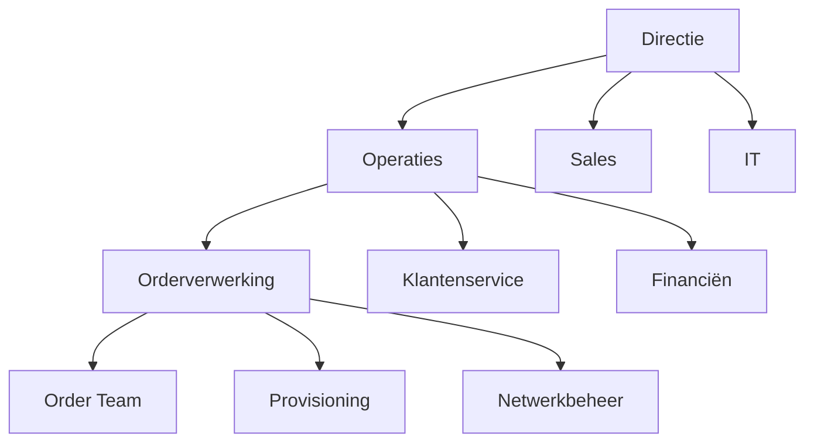
Toelichting:

- Orderverwerking valt onder Operaties, geleid door Jan de Vries (Proceseigenaar).
- Samenwerking met Sales (orderontvangst), Financiën (facturatie), IT (systeemondersteuning), en Klantenservice (klantcontact).

#### 4.1.3.2 Betrokken Afdelingen

|Afdeling|Rol in Proces|Verantwoordelijkheid|Contactpersoon|
|---|---|---|---|
|Order Team|Uitvoerend|Verwerking van orders.|Emma van Dijk|
|Sales|Input|Ontvangst van orders.|Lisa van der Meer|
|Provisioning|Output|Activatie van diensten.|Peter de Jong|
|Financiën|Output|Facturatie.|Lisa van der Meer|
|IT|Ondersteunend|Systeemondersteuning.|David van Leeuwen|
|Klantenservice|Input/Output|Klantcontact en klachtbehandeling.|Emma van Dijk|

#### 4.1.3.3 Gebruikte Systemen

|Systeem|Doel|Gebruikers|Kritikaliteit|
|---|---|---|---|
|SAP ERP|Orderverwerking, financiële administratie.|Order Team, Financiële Afdeling|Hoog|
|Salesforce CRM|Klantbeheer, orderontvangst.|Sales, Order Team|Hoog|
|Provisioning-systeem|Activatie van diensten (SIM, VoIP).|Provisioning, Technisch Team|Hoog|
|ServiceNow|Ticketingsysteem voor klantverzoeken.|Klantenservice, IT|Middel|
|Microsoft Teams|Interne communicatie.|Alle medewerkers|Laag|

#### 4.1.3.4 Afhankelijkheden

|Afhankelijkheid|Type|Beschrijving|Impact bij uitval|Mitigatie|
|---|---|---|---|---|
|SAP ERP|Systeem|Orderverwerking is afhankelijk van SAP.|Proces stopt|Back-up procedure in Excel.|
|Salesforce CRM|Systeem|Orderontvangst is afhankelijk van CRM.|Orders kunnen niet worden geregistreerd.|Handmatige registratie in SAP.|
|Provisioning-systeem|Systeem|Activatie van diensten is afhankelijk van Provisioning.|Diensten kunnen niet worden geactiveerd.|Handmatige activatie (tijdrovend).|
|Sales Team|Afdeling|Orderontvangst is afhankelijk van Sales.|Orders komen niet binnen.|Directe klantcontact via Klantenservice.|

### 4.1.4 Externe Context

#### 4.1.4.1 Markt en Concurrentie

|Factor|Beschrijving|Impact op Proces|Kans/Bedreiging|
|---|---|---|---|
|Concurrentie|Hoge concurrentie in de B2B telecommarkt.|Druk om snellere orderverwerking en betere service.|Bedreiging|
|Klantverwachtingen|Klanten verwachten snelle levering en 24/7 service.|Behoefte aan automatisering en efficiëntie.|Kans|
|Technologische ontwikkelingen|Opkomst van 5G, SD-WAN, en cloudtelefonie.|Behoefte aan nieuwe producten en aanpassingen in orderverwerking.|Kans|
|Regulering|Strengere GDPR- en telecomwetgeving.|Behoefte aan compliance in orderverwerking.|Bedreiging|

#### 4.1.4.2 Leveranciers en Partners

|Partner|Rol|Afhankelijkheid|Impact bij uitval|Mitigatie|
|---|---|---|---|---|
|SAP|ERP-leverancier|Levering en ondersteuning van SAP ERP.|Proces stopt|Overstap naar alternatief ERP-systeem.|
|Salesforce|CRM-leverancier|Levering en ondersteuning van Salesforce CRM.|Orderontvangst stopt|Overstap naar alternatief CRM-systeem.|
|Ericsson|Netwerkleverancier|Levering van netwerkapparatuur.|Vertraging in levering|Alternatieve leveranciers.|
|Samsung|Toestelleverancier|Levering van mobiele toestellen.|Vertraging in levering|Alternatieve leveranciers.|

#### 4.1.4.3 Klantsegmenten

|Segment|Beschrijving|Aandeel|Specifieke Behoeften|
|---|---|---|---|
|MKB|Bedrijven met 50-500 medewerkers.|60%|Flexibele bundels, schaalbaarheid.|
|Grote Ondernemingen|Bedrijven met >500 medewerkers.|30%|Maatwerkoplossingen, SLA’s.|
|Overheid|Overheidsinstanties.|10%|Veiligheid, compliance.|

### 4.1.5 SWOT-analyse

|Categorie|Beschrijving|Impact|Actie|
|---|---|---|---|
|Sterktes|Ervaren Order Team met kennis van telecomprocessen.|Hoog|Behoud en train nieuwe medewerkers.|
|Sterktes|Geavanceerde systemen (SAP, Salesforce).|Hoog|Optimaliseer gebruik van systemen.|
|Sterktes|Sterke samenwerking tussen afdelingen.|Hoog|Behoud goede communicatie.|
|Zwaktes|Handmatige validatiestap in orderverwerking.|Hoog|Automatiseren validatie.|
|Zwaktes|Gebrek aan real-time monitoring van KPI’s.|Middel|Implementeer Procesdashboard.|
|Kansen|Groeiende vraag naar 5G en cloudtelefonie.|Hoog|Ontwikkel nieuwe producten.|
|Kansen|Automatisering van processtappen.|Hoog|Implementeer RPA voor repetitieve taken.|
|Bedreigingen|Hoge concurrentie in de telecommarkt.|Hoog|Differentiëren op service en kwaliteit.|
|Bedreigingen|Strengere regulering (GDPR, telecomwet).|Middel|Zorg voor compliance.|

### 4.1.6 Visuele Weergave (Mermaid)

```mermaid
graph TD  
    A[Interne Context] --> B[Organisatiestructuur]  
    A --> C[Betrokken Afdelingen]  
    A --> D[Gebruikte Systemen]  
    A --> E[Afhankelijkheden]  
​  
    F[Externe Context] --> G[Markt en Concurrentie]  
    F --> H[Leveranciers en Partners]  
    F --> I[Klantsegmenten]  
​  
    J[SWOT-analyse] --> K[Sterktes]  
    J --> L[Zwaktes]  
    J --> M[Kansen]  
    J --> N[Bedreigingen]
```

### 4.1.7 Gerelateerde Documenten

- [Procesdoel](#) (PMD-03.03.00)
- [Procesinput-output](#) (PMD-03.02.01)
- [Procesbeschrijving](#) (PMD-03.07.01)

## 4.2 Procesinput-output
---
title: 
Procesinput-output - Orderverwerking 
weight: 2 
description: Input, output, en transformatie van het Orderverwerkingsproces bij TelecomPro B.V. 
type: template tags:
- procescontext
- PDM
- TelecomPro
- Orderverwerking
---

### 4.2.1 Inleiding

Dit document beschrijft de input, output, en transformatie van het Orderverwerkingsproces (PR-001) bij TelecomPro B.V.. Het doel is om: -  Duidelijkheid te scheppen over wat het proces ontvangt en oplevert. -  Transformatiestappen in kaart te brengen. -  Kwaliteitsvoorwaarden voor input en output te definieren.

### 4.2.2 Eigenschappen

|Veld|Waarde|Toelichting|
|---|---|---|
|PMD-nummer|03.02.01|Uniek identificatienummer voor procesinput-output.|
|Versie|1.0|Huidige versie.|
|Status|Gepubliceerd|Status van het document.|
|Auteur|Martin van Pelt|Procesanalist.|
|Eigenaar|Jan de Vries|Proceseigenaar Operaties.|
|Datum|19/04/2026|Datum van laatste update.|

### 4.2.3 Input

|Input|Type|Beschrijving|Bron|Kwaliteitsvoorwaarden|Verantwoordelijke|
|---|---|---|---|---|---|
|Klantorder|Data|Digitaal orderformulier met klant- en productgegevens.|Webshop, Telefoon, Sales|Compleet, geverifieerd, tijdig|Sales Team|
|Klantgegevens|Data|Naam, adres, contactgegevens, klant-ID.|CRM-systeem|Accuraat, actueel, GDPR-compliant|Sales Team|
|Productgegevens|Data|Specificaties van geselecteerde producten/diensten.|Productcatalogus (SAP)|Accuraat, actueel|Product Management|
|Offerte|Document|Goedgekeurde offerte voor de klant.|Sales Team|Ondertekend, actueel|Sales Team|
|Kredietstatus|Data|Kredietwaardigheid van de klant.|Financiële Afdeling|Actueel, geverifieerd|Financiële Afdeling|

### 4.2.4 Transformatie

|Stap|Activiteit|Input|Output|Systeem/Tool|Verantwoordelijke|
|---|---|---|---|---|---|
|1|Ontvangst order|Klantorder|Geregistreerde order|Salesforce CRM|Order Team|
|2|Validatie klantgegevens|Klantgegevens|Gevalideerde klantgegevens|Salesforce CRM|Order Team|
|3|Controle kredietstatus|Kredietstatus|Goedgekeurde/afgewezen order|SAP ERP|Order Team|
|4|Controle voorraad|Productgegevens|Bevestigde voorraad|SAP ERP|Order Team|
|5|Genereren productieopdracht|Gevalideerde order|Productieopdracht|SAP ERP|Order Team|
|6|Koppeling met Provisioning|Productieopdracht|Activatieopdracht|SAP ERP → Provisioning-systeem|Order Team|
|7|Versturen orderbevestiging|Gevalideerde order|Orderbevestiging|Salesforce CRM|Order Team|

### 4.2.5 Output

|Output|Type|Beschrijving|Bestemming|Kwaliteitsvoorwaarden|Verantwoordelijke|
|---|---|---|---|---|---|
|Geregistreerde order|Data|Ordergegevens in CRM-systeem.|CRM-systeem|Volledig, consistent|Order Team|
|Gevalideerde klantgegevens|Data|Geverifieerde klantgegevens.|CRM-systeem|Accuraat, actueel|Order Team|
|Productieopdracht|Data|Digitaal opdrachtformulier voor Provisioning.|Provisioning-systeem|Compleet, foutloos|Order Team|
|Activatieopdracht|Data|Opdracht voor activatie van diensten.|Provisioning-systeem|Compleet, tijdig|Provisioning|
|Orderbevestiging|Document|Bevestiging van de order aan de klant.|Klant (e-mail)|Accuraat, tijdig, professioneel|Order Team|
|Geactiveerde dienst|Dienst|Werkende telecomdienst (SIM, VoIP, internet).|Klant|Functioneel, tijdig|Provisioning|

### 4.2.6 Visuele Weergave (Mermaid)

```mermaid
graph LR  
    subgraph Input["Input"]  
        A[Klantorder] --> B[Ontvangst order]  
        C[Klantgegevens] --> B  
        D[Productgegevens] --> E[Validatie klantgegevens]  
        F[Offerte] --> B  
        G[Kredietstatus] --> H[Controle kredietstatus]  
    end  
​  
    subgraph Transformatie["Transformatie"]  
        B --> E  
        E --> H  
        H --> I[Controle voorraad]  
        I --> J[Genereren productieopdracht]  
        J --> K[Koppeling met Provisioning]  
        K --> L[Versturen orderbevestiging]  
    end  
​  
    subgraph Output["Output"]  
        J --> M[Productieopdracht]  
        K --> N[Activatieopdracht]  
        L --> O[Orderbevestiging]  
        N --> P[Geactiveerde dienst]  
    end  
​  
    style Input fill:#f96,stroke:#333  
    style Transformatie fill:#9f9,stroke:#333  
    style Output fill:#69f,stroke:#333
``` 
### 4.2.7 Kwaliteitsvoorwaarden

|Categorie|Voorwaarde|Beschrijving|Meetmethode|
|---|---|---|---|
|Input|Volledigheid|Alle benodigde gegevens zijn aanwezig.|Visuele controle|
|Input|Accuraatheid|Gegevens zijn correct en up-to-date.|Systeemvalidatie|
|Transformatie|Tijdigheid|Stappen worden binnen de gestelde tijd uitgevoerd.|Tijdsregistratie|
|Transformatie|Consistentie|Stappen worden op dezelfde manier uitgevoerd.|Audit|
|Output|Kwaliteit|Output voldoet aan de gestelde normen.|Klantfeedback, systeemcontrole|

### 4.2.8 Gerelateerde Documenten

- [Procesdoel](#) (PMD-03.03.00)
- [Procescontext](#) (PMD-03.04.00)
- [Procesbeschrijving](#) (PMD-03.07.01)

# 5 Proceseigenschappen

## 5.1 Proceseigenschappen Master
---
title: Proceseigenschappen Master  
weight: 1  
description: Master template voor het documenteren van algemene eigenschappen van processen binnen TelecomPro B.V.  
type: template  
tags:
- proceseigenschappen
- master template
- PDM
- TelecomPro
- metadata
---

### 5.1.1 Inleiding

Dit Proceseigenschappen Master-template biedt een gestandaardiseerde structuur voor het documenteren van eigenschappen van alle processen binnen TelecomPro B.V.. Het doel is om:  
✅ Consistentie in procesdocumentatie te waarborgen.  
✅ Metadata te standaardiseren voor beheer en traceerbaarheid.  
✅ Koppeling tussen processen en andere documentatie te vergemakkelijken.

---

---

### 5.1.2 Eigenschappen


| Veld       | Waarde      | Toelichting                                            |
| -------------- | --------------- | ---------------------------------------------------------- |
| PMD-nummer | 03.05.00        | Uniek identificatienummer voor Proceseigenschappen Master. |
| Versie     | 1.0             | Huidige versie.                                            |
| Status     | Gepubliceerd    | Status van het document.                                   |
| Auteur     | Martin van Pelt | Procesanalist.                                             |
| Eigenaar   | Jan de Vries    | Proceseigenaar Operaties.                                  |
| Datum      | 19/04/2026      | Datum van laatste update.                                  |


---

---

### 5.1.3 Structuur van Proceseigenschappen

Elk proces binnen TelecomPro heeft de volgende standaard eigenschappen:


| Categorie     | Veld                    | Beschrijving                                            | Voorbeeld                            |
| ----------------- | --------------------------- | ----------------------------------------------------------- | ---------------------------------------- |
| Basisgegevens | Procesnaam                  | Naam van het proces.                                        | Orderverwerking                          |
| Basisgegevens | Proces-ID                   | Unieke identifier.                                          | PR-001                                   |
| Basisgegevens | Procescategorie             | Categorisatie (Primair, Ondersteunend, Sturend).            | Primair                                  |
| Basisgegevens | Domein                      | Functioneel domein.                                         | Operaties                                |
| Basisgegevens | Subdomein                   | Subdomein binnen het domein.                                | Orderbeheer                              |
| Basisgegevens | Koppeling met               | Gerelateerde processen.                                     | Order-to-Cash (PR-000)                   |
| Metadata      | PMD-nummer                  | Uniek identificatienummer in PDM.                           | 03.07.01                                 |
| Metadata      | Versie                      | Versienummer van het procesdocument.                        | 1.0                                      |
| Metadata      | Status                      | Status van het document (Concept, In Review, Gepubliceerd). | Gepubliceerd                             |
| Metadata      | Auteur                      | Auteur van het document.                                    | Martin van Pelt                          |
| Metadata      | Eigenaar                    | Verantwoordelijke voor het proces.                          | Jan de Vries                             |
| Metadata      | Datum                       | Datum van laatste update.                                   | 19/04/2026                               |
| Metadata      | Gekoppeld aan               | Gerelateerde documenten.                                    | Procesbeschrijving, BPMN, Werkinstructie |
| Kenmerken     | Type proces                 | Type (Operationeel, Tactisch, Strategisch).                 | Operationeel                             |
| Kenmerken     | Frequentie                  | Hoe vaak het proces wordt uitgevoerd.                       | Dagelijks                                |
| Kenmerken     | Doorlooptijd (doel)         | Streeftijd voor het proces.                                 | < 24 uur                                 |
| Kenmerken     | Doorlooptijd (huiding)      | Huidige gemiddelde doorlooptijd.                            | 28 uur                                   |
| Kenmerken     | Aantal betrokken afdelingen | Aantal afdelingen betrokken bij het proces.                 | 5                                        |
| Kenmerken     | Aantal processtappen        | Aantal stappen in het proces.                               | 7                                        |
| Kenmerken     | Automatiseringsgraad        | Percentage geautomatiseerde stappen.                        | 60%                                      |
| Kenmerken     | Kritikaliteit               | Kritikaliteit voor de organisatie (Hoog, Middel, Laag).     | Hoog                                     |
| Kenmerken     | Complexiteit                | Complexiteit van het proces (Hoog, Middel, Laag).           | Middel                                   |
| Compliance    | Gerelateerde normen         | Normen en wetten waaraan het proces moet voldoen.           | ISO 9001, GDPR, Telecomwet               |
| Compliance    | Interne audits              | Frequentie van interne audits.                              | Halfjaarlijks                            |
| Compliance    | Externe audits              | Frequentie van externe audits.                              | Jaarlijks                                |


---

---

### 5.1.4 Voorbeeld: Proceseigenschappen voor Orderverwerking


| Categorie     | Veld                    | Waarde                                                                            |
| ----------------- | --------------------------- | ------------------------------------------------------------------------------------- |
| Basisgegevens | Procesnaam                  | Orderverwerking                                                                       |
| Basisgegevens | Proces-ID                   | PR-001                                                                                |
| Basisgegevens | Procescategorie             | Primair                                                                               |
| Basisgegevens | Domein                      | Operaties                                                                             |
| Basisgegevens | Subdomein                   | Orderbeheer                                                                           |
| Basisgegevens | Koppeling met               | Order-to-Cash (PR-000), Provisioning (PR-003), Facturatie (PR-005)                    |
| Metadata      | PMD-nummer                  | 03.07.01                                                                              |
| Metadata      | Versie                      | 1.0                                                                                   |
| Metadata      | Status                      | Gepubliceerd                                                                          |
| Metadata      | Auteur                      | Martin van Pelt                                                                       |
| Metadata      | Eigenaar                    | Jan de Vries                                                                          |
| Metadata      | Datum                       | 19/04/2026                                                                            |
| Metadata      | Gekoppeld aan               | Procesbeschrijving (PMD-03.07.01), BPMN (PMD-03.06.01), Werkinstructie (PMD-03.07.02) |
| Kenmerken     | Type proces                 | Operationeel                                                                          |
| Kenmerken     | Frequentie                  | Dagelijks                                                                             |
| Kenmerken     | Doorlooptijd (doel)         | < 24 uur                                                                              |
| Kenmerken     | Doorlooptijd (huiding)      | 28 uur                                                                                |
| Kenmerken     | Aantal betrokken afdelingen | 5 (Order Team, Sales, Provisioning, Financiën, IT)                                    |
| Kenmerken     | Aantal processtappen        | 7                                                                                     |
| Kenmerken     | Automatiseringsgraad        | 60%                                                                                   |
| Kenmerken     | Kritikaliteit               | Hoog                                                                                  |
| Kenmerken     | Complexiteit                | Middel                                                                                |
| Compliance    | Gerelateerde normen         | ISO 9001, GDPR, Telecomwet                                                            |
| Compliance    | Interne audits              | Halfjaarlijks                                                                         |
| Compliance    | Externe audits              | Jaarlijks                                                                             |

### 5.1.5 Gerelateerde Documenten

- [Procesbeschrijving](#) (PMD-03.07.01)
- [BPMN](#) (PMD-03.06.01)
- [Werkinstructie](#) (PMD-03.07.02)

## 5.2 Procesbegrippen
---
title: Procesbegrippen  
weight: 2  
description: Glossarium van procesgerelateerde begrippen bij TelecomPro B.V.  
type: template  
tags:
- proceseigenschappen
- glossarium
- PDM
- TelecomPro
---

### 5.2.1 Inleiding

Dit glossarium bevat organisatiespecifieke begrippen die worden gebruikt in de procesdocumentatie van TelecomPro B.V.. Het doel is om:  
-  Eenduidigheid in terminologie te waarborgen.  
-  Misverstanden tussen afdelingen te voorkomen.  
-  Nieuwe medewerkers te helpen bij het begrijpen van procesdocumentatie.

### 5.2.2 Eigenschappen

| Veld           | Waarde          | Toelichting                                     |
| -------------- | --------------- | ----------------------------------------------- |
| PMD-nummer | 03.05.01        | Uniek identificatienummer voor procesbegrippen. |
| Versie     | 1.0             | Huidige versie.                                 |
| Status     | Gepubliceerd    | Status van het document.                        |
| Auteur     | Martin van Pelt | Procesanalist.                                  |
| Eigenaar   | Jan de Vries    | Proceseigenaar Operaties.                       |
| Datum      | 19/04/2026      | Datum van laatste update.                       |

### 5.2.3 Glossarium

| Term              | Definitie                                                                         | Categorie | Gebruik in           | Synoniemen        |
| --------------------- | ------------------------------------------------------------------------------------- | ------------- | ------------------------ | --------------------- |
| Orderverwerking   | Het proces van ontvangst tot bevestiging van een klantorder.                          | Proces        | Orderverwerking (PR-001) | Orderafhandeling      |
| Order             | Een verzoek van een klant voor een product of dienst.                                 | Proces        | Orderverwerking          | Bestelling            |
| Klantorder        | Een order die door een klant is geplaatst.                                            | Proces        | Orderverwerking          | -                     |
| Productieopdracht | Een opdracht voor Provisioning om een dienst te activeren.                            | Proces        | Orderverwerking          | Activatieopdracht     |
| Orderbevestiging  | Een bevestiging die naar de klant wordt gestuurd na ontvangst van de order.           | Document      | Orderverwerking          | Bevestigingsmail      |
| Validatie         | Controle of gegevens (bijv. klantgegevens) compleet en correct zijn.                  | Activiteit    | Orderverwerking          | Controle, Verificatie |
| Provisioning      | Het proces van het inrichten en activeren van telecomdiensten.                        | Proces        | Provisioning (PR-003)    | Activatie             |
| SIM-activatie     | Het proces van het activeren van een SIM-kaart.                                       | Proces        | SIM-activatie (PR-002)   | -                     |
| VoIP              | Voice over IP; telefonie via internet.                                                | Product       | Orderverwerking          | IP-telefonie          |
| SIP-Trunking      | Een dienst die bedrijven in staat stelt om telefoongesprekken via internet te voeren. | Product       | Orderverwerking          | -                     |
| CRM-systeem       | Customer Relationship Management-systeem voor klantbeheer.                            | Systeem       | Orderverwerking          | Salesforce            |
| ERP-systeem       | Enterprise Resource Planning-systeem voor bedrijfsprocessen.                          | Systeem       | Orderverwerking          | SAP                   |
| First-time-right  | Percentage orders dat in één keer correct wordt verwerkt.                             | KPI           | Orderverwerking          | FTR                   |
| Doorlooptijd      | Tijd tussen ontvangst en bevestiging van een order.                                   | KPI           | Orderverwerking          | Lead time             |
| Kredietstatus     | De kredietwaardigheid van een klant.                                                  | Data          | Orderverwerking          | Kredietcheck          |
| Voorraad          | Beschikbare hoeveelheid van een product of dienst.                                    | Data          | Orderverwerking          | Stock                 |
| SLA               | Service Level Agreement; afspraken over prestatieniveaus.                             | Contract      | Alle processen           | Service Level         |
| GDPR              | General Data Protection Regulation; Europese privacywetgeving.                        | Wettelijk     | Alle processen           | AVG                   |
| ISO 9001          | Internationale norm voor kwaliteitsmanagement.                                        | Norm          | Alle processen           | -                     |
| BPMN              | Business Process Model and Notation; standaard voor procesmodellering.                | Methode       | Procesmodellering        | -                     |
| RACI              | Responsible, Accountable, Consulted, Informed; methode voor rolverdeling.             | Methode       | Procesrollen             | -                     |

### 5.2.4 Visuele Weergave (Mermaid)

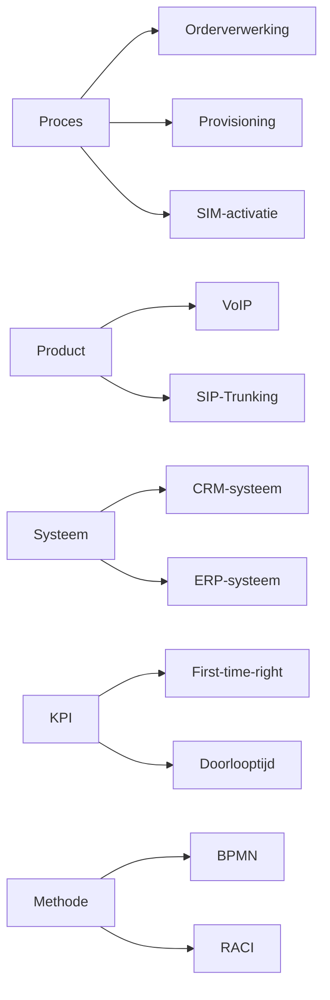

### 5.2.5 Gerelateerde Documenten

- [Proceseigenschappen](#) (PMD-03.05.00)
- [Procesbeschrijving](#) (PMD-03.07.01)

# 6 Procesmodellering

## 6.1 Procesmodellering Master
---
title: Procesmodellering - Orderverwerking  
weight: 1  
description: Algemeen template voor de modellering van het Orderverwerkingsproces bij TelecomPro B.V., inclusief richtlijnen en standaarden.  
type: template  
tags:
- procesmodellering
- PDM
- TelecomPro
- BPMN
- Orderverwerking
---

### 6.1.1 Inleiding

Dit document beschrijft de richtlijnen en standaarden voor het modelleren van het Orderverwerkingsproces (PR-001) bij TelecomPro B.V.. Het doel is om:  
-  Consistentie in procesmodellering te waarborgen.  
-  Duidelijke richtlijnen te bieden voor het gebruik van BPMN, Flowchart, en Swimlane-diagrammen.  
-  Best practices toe te passen voor leesbaarheid en bruikbaarheid.

### 6.1.2 Eigenschappen

| Veld           | Waarde          | Toelichting                                       |
| -------------- | --------------- | ------------------------------------------------- |
| PMD-nummer | 03.06.00        | Uniek identificatienummer voor procesmodellering. |
| Versie     | 1.0             | Huidige versie.                                   |
| Status     | Gepubliceerd    | Status van het document.                          |
| Auteur     | Martin van Pelt | Procesanalist.                                    |
| Eigenaar   | Jan de Vries    | Proceseigenaar Operaties.                         |
| Datum      | 19/04/2026      | Datum van laatste update.                         |

### 6.1.3 Modelleringsrichtlijnen

#### 6.1.3.1 Algemene Principes

- Gebruik BPMN 2.0 als standaard voor procesmodellering.
- Houd diagrammen eenvoudig en overzichtelijk.
- Gebruik kleuren en iconen voor betere leesbaarheid.
- Voeg een legende toe voor symbolen en kleuren.
- Documenteer altijd de scope en doel van het diagram.

#### 6.1.3.2 BPMN Richtlijnen

| Element             | Gebruik                     | Voorbeeld | Opmerkingen                     |
| ----------------------- | ------------------------------- | ------------- | ----------------------------------- |
| Start Event         | Begin van het proces.           | ⭕             | Gebruik voor het startpunt.         |
| End Event           | Einde van het proces.           | ⊙             | Gebruik voor het eindpunt.          |
| Task                | Een activiteit of stap.         | 🟦            | Gebruik voor handmatige taken.      |
| Service Task        | Een geautomatiseerde taak.      | 🟩            | Gebruik voor systeemtaken.          |
| Gateway (Exclusive) | Keuzepunt (XOR).                | ✕             | Gebruik voor "of/of"-beslissingen.  |
| Gateway (Inclusive) | Parallelle paden (OR).          | ⊕             | Gebruik voor "en/en"-beslissingen.  |
| Gateway (Parallel)  | Synchrone paden (AND).          | +             | Gebruik voor gelijktijdige stappen. |
| Pool/Lane           | Verantwoordelijke afdeling/rol. | 🟨            | Gebruik in Swimlane-diagrammen.     |
| Message Flow        | Communicatie tussen processen.  | ➡️            | Gebruik voor externe communicatie.  |
| Data Object         | Gegevens die worden gebruikt.   | 📄            | Gebruik voor input/output.          |

#### 6.1.3.3 Flowchart Richtlijnen

| Element   | Gebruik     | Voorbeeld           |
| ------------- | --------------- | ----------------------- |
| Ovaal     | Start/Einde.    | Start / Einde           |
| Rechthoek | Activiteit.     | Validatie klantgegevens |
| Ruit      | Beslissing.     | Is de order compleet?   |
| Pijl      | Stroomrichting. | →                       |
| Cilinder  | Database.       | CRM-systeem             |

#### 6.1.3.4 Swimlane Richtlijnen

| Element                | Gebruik               | Voorbeeld                     |
| -------------------------- | ------------------------- | --------------------------------- |
| Swimlane (Horizontaal) | Afdeling of rol.          | Order Team, Sales, Provisioning   |
| Swimlane (Verticaal)   | Procesfase.               | Ontvangst, Validatie, Activatie   |
| Kleuren                | Verschillende afdelingen. | Order Team (blauw), Sales (groen) |

### 6.1.4 Tools en Software

| Tool            | Doel                            | Gebruikers             | Link                                 |
| ------------------- | ----------------------------------- | -------------------------- | ---------------------------------------- |
| Camunda         | BPMN-modellering en automatisering. | Procesanalist, IT-afdeling | [Camunda](https://camunda.com)           |
| Lucidchart      | BPMN, Flowchart, Swimlane.          | Procesanalist, Order Team  | [Lucidchart](https://www.lucidchart.com) |
| Microsoft Visio | Flowchart, Swimlane.                | Procesanalist              | [Visio](https://www.microsoft.com/visio) |
| Draw.io         | Gratis BPMN en Flowchart.           | Alle medewerkers           | [Draw.io](https://draw.io)               |
| Signavio        | Geavanceerde BPMN-modellering.      | Procesanalist              | [Signavio](https://www.signavio.com)     |

### 6.1.5 Kwaliteitsvoorwaarden

| Voorwaarde      | Beschrijving                                              | Meetmethode             |
| ------------------- | ------------------------------------------------------------- | --------------------------- |
| Leesbaarheid    | Diagrammen moeten eenvoudig te begrijpen zijn.            | Review door stakeholders.   |
| Consistentie    | Gebruik eenduidige symbolen en kleuren.                   | Visuele inspectie.          |
| Volledigheid    | Alle processtappen en beslissingen moeten zijn opgenomen. | Validatie met stakeholders. |
| Actualiteit     | Diagrammen moeten up-to-date zijn.                        | Periodieke reviews.         |
| Traceerbaarheid | Diagrammen moeten gekoppeld zijn aan andere documentatie. | Cross-referentie check.     |

### 6.1.6 Gerelateerde Documenten

- [BPMN](#) (PMD-03.06.01)
- [Flowchart](#) (PMD-03.06.02)
- [Swimlane Diagram](#) (PMD-03.06.03)

## 6.2 BPM Diagram
---
title: BPMN - Orderverwerking  
weight: 1  
description: Compleet BPMN-diagram van het Orderverwerkingsproces bij TelecomPro B.V., inclusief hoofdstroom, uitzonderingen, beslissingen en verantwoordelijkheden.  
type: template  
tags:
- BPMN
- procesmodellering
- PDM
- TelecomPro
- Orderverwerking
- 7x Framework
---

### 6.2.1 Inleiding

Dit BPMN-diagram visualiseert het Orderverwerkingsproces (PR-001) bij TelecomPro B.V. op een gedetailleerde en gestandaardiseerde manier. Het diagram toont:  
- Hoofdstroom van het proces (90% van de orders).  
- Uitzonderingen (bijv. onvolledige orders, kredietproblemen, onvoldoende voorraad).  
- Beslissingen (bijv. validatie, voorraadcontrole, kredietcheck).  
- Verantwoordelijkheden per stap (via Pools/Lanes).  
- Systemen die worden gebruikt (SAP ERP, Salesforce CRM, Provisioning-systeem).

### 6.2.2 Eigenschappen

| Veld          | Waarde                                                          | Toelichting                              |
| ----------------- | ------------------------------------------------------------------- | -------------------------------------------- |
| PMD-nummer    | 03.06.01                                                            | Uniek identificatienummer voor BPMN-diagram. |
| Versie        | 1.0                                                                 | Huidige versie.                              |
| Status        | Gepubliceerd                                                        | Status van het document.                     |
| Auteur        | Martin van Pelt                                                     | Procesanalist.                               |
| Eigenaar      | Jan de Vries                                                        | Proceseigenaar Operaties.                    |
| Datum         | 19/04/2026                                                          | Datum van laatste update.                    |
| Gekoppeld aan | Procesmodellering (PMD-03.06.00), Procesbeschrijving (PMD-03.07.01) | Gerelateerde documenten.                     |

### 6.2.3 BPMN-diagram (Mermaid)

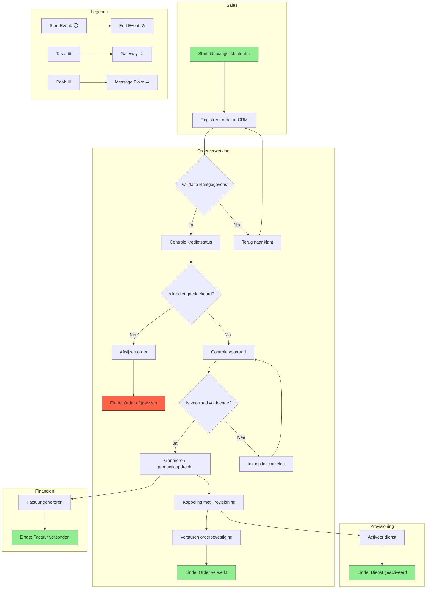

### 6.2.4 Toelichting BPMN-diagram

#### 6.2.4.1 Hoofdstroom (90% van de orders)

1. Start: Ontvangst klantorder
  - Trigger: Klant plaatst een order via webshop, telefoon, of sales.
  - Systeem: Salesforce CRM.
  - Verantwoordelijke: Sales Team.
1. Registreer order in CRM
  - Activiteit: Order Medewerker registreert de order in Salesforce CRM.
  - Input: Klantorder (digitaal formulier of telefoongesprek).
  - Output: Geregistreerde order in CRM.
  - Systeem: Salesforce CRM.
  - Verantwoordelijke: Order Team.
1. Validatie klantgegevens
  - Beslissing (Exclusive Gateway): Zijn de klantgegevens (naam, adres, contactgegevens) compleet en correct?
    - Ja: Doorgaan naar Controle kredietstatus.
    - Nee: Terug naar klant voor aanvulling gegevens.
1. Controle kredietstatus
  - Activiteit: Order Medewerker controleert of de klant kredietwaardig is.
  - Systeem: SAP ERP (koppeling met CRM).
  - Verantwoordelijke: Order Team.
1. Is krediet goedgekeurd? (Exclusive Gateway)
  - Beslissing: Is de kredietstatus van de klant goedgekeurd?
    - Ja: Doorgaan naar Controle voorraad.
    - Nee: Order wordt afgewezen.
1. Controle voorraad
  - Activiteit: Order Medewerker controleert of de gevraagde producten/diensten op voorraad zijn.
  - Systeem: SAP ERP.
  - Verantwoordelijke: Order Team.
1. Is voorraad voldoende? (Exclusive Gateway)
  - Beslissing: Is de voorraad voldoende voor de order?
    - Ja: Doorgaan naar Genereren productieopdracht.
    - Nee: Inkoop inschakelen om voorraad aan te vullen.
1. Genereren productieopdracht
  - Activiteit: Order Medewerker zet de klantorder om in een productieopdracht in SAP ERP.
  - Output: Productieopdracht (digitaal).
  - Systeem: SAP ERP.
  - Verantwoordelijke: Order Team.
1. Koppeling met Provisioning
  - Activiteit: Productieopdracht wordt automatisch doorgegeven aan het Provisioning-systeem.
  - Systeem: SAP ERP → Provisioning-systeem.
  - Verantwoordelijke: Order Team.
1. Versturen orderbevestiging
  - Activiteit: Order Medewerker verstuurt een orderbevestiging naar de klant.
    - Output: Orderbevestiging (e-mail).
    - Systeem: Salesforce CRM.
    - Verantwoordelijke: Order Team.
1. Einde: Order verwerkt
  - Resultaat: Order is succesvol verwerkt en de klant heeft een bevestiging ontvangen.

#### 6.2.4.2 Uitzonderingen

1. Terug naar klant (Validatie klantgegevens)
  - Oorzaak: Klantgegevens zijn onvolledig of onjuist.
  - Actie: Order Medewerker neemt contact op met de klant voor aanvulling.
  - Verantwoordelijke: Order Team.
1. Afwijzen order (Kredietcontrole)
  - Oorzaak: Klant is niet kredietwaardig.
  - Actie: Order wordt afgewezen en de klant wordt geïnformeerd via e-mail.
  - Verantwoordelijke: Order Team.
1. Inkoop inschakelen (Voorraadcontrole)
  - Oorzaak: Voorraad is onvoldoende voor de order.
  - Actie: Inkoop wordt ingeschakeld om voorraad aan te vullen.
  - Verantwoordelijke: Inkoop.

#### 6.2.4.3 Beslissingen

| Beslissing          | Type Gateway | Criteria                               | Opties | Verantwoordelijke |
| ----------------------- | ---------------- | ------------------------------------------ | ---------- | --------------------- |
| Is de order compleet?   | Exclusive (XOR)  | Alle verplichte velden zijn ingevuld.      | Ja / Nee   | Order Medewerker      |
| Is krediet goedgekeurd? | Exclusive (XOR)  | Klant heeft een goede kredietstatus.   | Ja / Nee   | Order Medewerker      |
| Is voorraad voldoende?  | Exclusive (XOR)  | Voorraad is beschikbaar voor de order. | Ja / Nee   | Order Medewerker      |

### 6.2.5 Symbolen en Legenda

| Symbool | Naam          | Beschrijving               | Voorbeeld                 |
| ----------- | ----------------- | ------------------------------ | ----------------------------- |
| ⭕           | Start Event       | Begin van het proces.          | Ontvangst klantorder          |
| ⊙           | End Event         | Einde van het proces.          | Order verwerkt                |
| 🟦          | Task              | Een activiteit of stap.        | Registreer order in CRM       |
| ✕           | Exclusive Gateway | Keuzepunt (XOR).               | Is de order compleet?         |
| ⊕           | Inclusive Gateway | Parallelle paden (OR).         | -                             |
| +           | Parallel Gateway  | Synchrone paden (AND).         | -                             |
| 🟨          | Pool              | Een afdeling of rol.           | Sales, Orderverwerking        |
| ➡️          | Sequence Flow     | Volgorde van activiteiten.     | Pijlen tussen stappen         |
| 📄          | Data Object       | Gegevens die worden gebruikt.  | Klantorder, Productieopdracht |
| 🟪          | Message Flow      | Communicatie tussen processen. | Koppeling met Provisioning    |

### 6.2.6 Verantwoordelijkheden per Pool/Lane

| Pool/Lane       | Beschrijving                                       | Verantwoordelijke | Betrokken Activiteiten                                                                                                                              |
| ------------------- | ------------------------------------------------------ | --------------------- | ------------------------------------------------------------------------------------------------------------------------------------------------------- |
| Sales           | Afdeling verantwoordelijk voor orderontvangst.         | Sales Team            | Ontvangst klantorder, Registreer order in CRM                                                                                                           |
| Orderverwerking | Afdeling verantwoordelijk voor orderverwerking.        | Order Team            | Validatie klantgegevens, Controle kredietstatus, Controle voorraad, Genereren productieopdracht, Koppeling met Provisioning, Versturen orderbevestiging |
| Provisioning    | Afdeling verantwoordelijk voor activatie van diensten. | Provisioning          | Activeer dienst                                                                                                                                         |
| Financiën       | Afdeling verantwoordelijk voor facturatie.             | Financiële Afdeling   | Factuur genereren                                                                                                                                       |

### 6.2.7 Systemen en Tools


| Systeem/Tool         | Doel                                                   | Gebruik in Proces                                                        | Verantwoordelijke           |
| ------------------------ | ---------------------------------------------------------- | ---------------------------------------------------------------------------- | ------------------------------- |
| Salesforce CRM       | Klantbeheer en orderontvangst.                             | Registreer order in CRM, Validatie klantgegevens, Versturen orderbevestiging | Order Team, Sales Team          |
| SAP ERP              | Orderverwerking, voorraadbeheer, financiële administratie. | Controle kredietstatus, Controle voorraad, Genereren productieopdracht       | Order Team, Financiële Afdeling |
| Provisioning-systeem | Activatie van telecomdiensten.                             | Koppeling met Provisioning, Activeer dienst                                  | Provisioning                    |
| E-mail (Outlook)     | Communicatie met klanten.                                  | Versturen orderbevestiging                                                   | Order Team                      |
### 6.2.8 Gerelateerde Documenten

- [Procesmodellering](#) (PMD-03.06.00)
- [Procesbeschrijving](#) (PMD-03.07.01)
- [Swimlane Diagram](#) (PMD-03.06.03)
- [Flowchart](#) (PMD-03.06.02)

### 6.2.9 Versiehistorie

| Versie | Datum  | Wijziging   | Auteur      | Goedgekeurd door |
| ---------- | ---------- | --------------- | --------------- | -------------------- |
| 1.0        | 19/04/2026 | Initiële versie | Martin van Pelt | Jan de Vries         |

## 6.3 Swimlane Diagram
---
title: Swimlane Diagram
weight: 3  
description: Swimlane-diagram van het Orderverwerkingsproces bij TelecomPro B.V., inclusief verantwoordelijkheden per afdeling.  
type: template  
tags:
- Swimlane
- procesmodellering
- PDM
- TelecomPro
- Orderverwerking
- 7x Framework
---

### 6.3.1 Inleiding

Dit Swimlane-diagram visualiseert het Orderverwerkingsproces (PR-001) bij TelecomPro B.V. met een duidelijke verdeling van verantwoordelijkheden per afdeling. Het doel is om:  
- Verantwoordelijkheden per afdeling visueel in kaart te brengen.  
- Samenwerking tussen afdelingen te verduidelijken.  
- Bottlenecks en knelpunten in de processtroom te identificeren.

### 6.3.2 Eigenschappen

| Veld          | Waarde                                                                               | Toelichting                                  |
| ----------------- | ---------------------------------------------------------------------------------------- | ------------------------------------------------ |
| PMD-nummer    | 03.06.03                                                                                 | Uniek identificatienummer voor Swimlane-diagram. |
| Versie        | 1.0                                                                                      | Huidige versie.                                  |
| Status        | Gepubliceerd                                                                             | Status van het document.                         |
| Auteur        | Martin van Pelt                                                                          | Procesanalist.                                   |
| Eigenaar      | Jan de Vries                                                                             | Proceseigenaar Operaties.                        |
| Datum         | 19/04/2026                                                                               | Datum van laatste update.                        |
| Gekoppeld aan | Procesmodellering (PMD-03.06.00), BPMN (PMD-03.06.01), Procesbeschrijving (PMD-03.07.01) | Gerelateerde documenten.                         |

### 6.3.3 Swimlane-diagram (Mermaid)

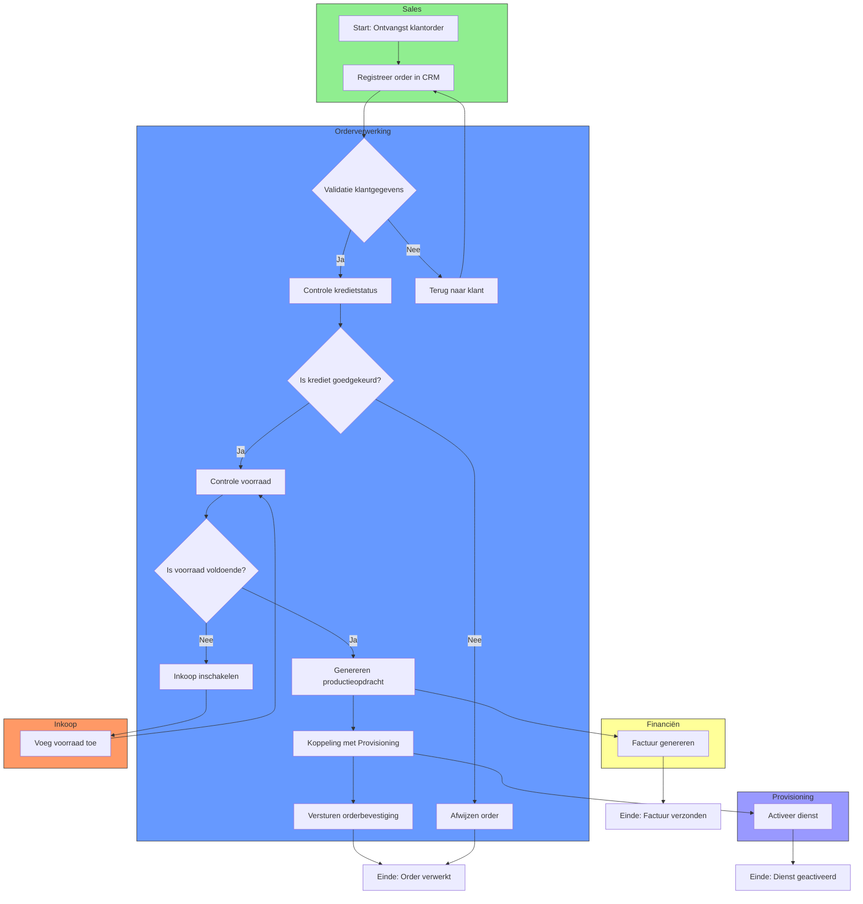

### 6.3.4 Toelichting Swimlane-diagram

#### 6.3.4.1 Swimlanes (Afdelingen)

| Swimlane        | Beschrijving                                           | Verantwoordelijke | Betrokken Activiteiten                                                                                                                              |
| ------------------- | ---------------------------------------------------------- | --------------------- | ------------------------------------------------------------------------------------------------------------------------------------------------------- |
| Sales           | Afdeling verantwoordelijk voor orderontvangst.         | Sales Team            | Ontvangst klantorder, Registreer order in CRM                                                                                                           |
| Orderverwerking | Afdeling verantwoordelijk voor orderverwerking.        | Order Team            | Validatie klantgegevens, Controle kredietstatus, Controle voorraad, Genereren productieopdracht, Koppeling met Provisioning, Versturen orderbevestiging |
| Provisioning    | Afdeling verantwoordelijk voor activatie van diensten. | Provisioning          | Activeer dienst                                                                                                                                         |
| Financiën       | Afdeling verantwoordelijk voor facturatie.             | Financiële Afdeling   | Factuur genereren                                                                                                                                       |
| Inkoop          | Afdeling verantwoordelijk voor voorraadbeheer.         | Inkoop                | Voeg voorraad toe                                                                                                                                       |

#### 6.3.4.2 Processtroom per Swimlane

##### 6.3.4.2.1 Sales

1. Start: Ontvangst klantorder
  - Klant plaatst een order via webshop, telefoon, of sales.
1. Registreer order in CRM
  - Sales Medewerker registreert de order in Salesforce CRM.

##### 6.3.4.2.2 Orderverwerking

1. Validatie klantgegevens
  - Order Medewerker controleert of klantgegevens compleet en correct zijn.
  - Beslissing: Is de order compleet?
    - Ja: Doorgaan naar Controle kredietstatus.
    - Nee: Terug naar klant voor aanvulling gegevens.
1. Controle kredietstatus
  - Order Medewerker controleert of de klant kredietwaardig is.
  - Beslissing: Is krediet goedgekeurd?
    - Ja: Doorgaan naar Controle voorraad.
    - Nee: Order wordt afgewezen.
1. Controle voorraad
  - Order Medewerker controleert of de voorraad voldoende is.
  - Beslissing: Is voorraad voldoende?
    - Ja: Doorgaan naar Genereren productieopdracht.
    - Nee: Inkoop inschakelen.
1. Genereren productieopdracht
  - Order Medewerker zet de klantorder om in een productieopdracht in SAP ERP.
1. Koppeling met Provisioning
  - Productieopdracht wordt automatisch doorgegeven aan Provisioning.
1. Versturen orderbevestiging
  - Order Medewerker verstuurt een orderbevestiging naar de klant.

##### 6.3.4.2.3 Provisioning

1. Activeer dienst
  - Provisioning Medewerker activeert de telecomdienst (SIM, VoIP, internet).

##### 6.3.4.2.4 Financiën

1. Factuur genereren
  - Financieel Medewerker genereert een factuur voor de klant.

##### 6.3.4.2.5 Inkoop

1. Voeg voorraad toe
  - Inkoop Medewerker schakelt leveranciers in om voorraad aan te vullen.

### 6.3.5 Gerelateerde Documenten

- [Procesmodellering](#) (PMD-03.06.00)
- [BPMN](#) (PMD-03.06.01)
- [Procesbeschrijving](#) (PMD-03.07.01)
- [RACI Matrix](#) (PMD-03.07.03)

### 6.3.6 Versiehistorie

| Versie | Datum  | Wijziging   | Auteur      | Goedgekeurd door |
| ---------- | ---------- | --------------- | --------------- | -------------------- |
| 1.0        | 19/04/2026 | Initiële versie | Martin van Pelt | Jan de Vries         |

## 6.4 Flowchart Diagram
---
title: Flowchart - Orderverwerking  
weight: 2  
description: Flowchart van het Orderverwerkingsproces bij TelecomPro B.V., inclusief processtappen, beslissingen en uitzonderingen.  
type: template  
tags:
- Flowchart
- procesmodellering
- PDM
- TelecomPro
- Orderverwerking
- 7x Framework
---

### 6.4.1 Inleiding

Dit Flowchart biedt een eenvoudige, visuele weergave van het Orderverwerkingsproces (PR-001) bij TelecomPro B.V.. Het doel is om:  
- Processtappen op een begrijpelijke manier weer te geven.  
- Beslissingen en uitzonderingen in kaart te brengen.  
- Training en communicatie te ondersteunen met een duidelijke visuele weergave.

### 6.4.2 Eigenschappen

| Veld          | Waarde                                                                               | Toelichting                           |
| ----------------- | ---------------------------------------------------------------------------------------- | ----------------------------------------- |
| PMD-nummer    | 03.06.02                                                                                 | Uniek identificatienummer voor Flowchart. |
| Versie        | 1.0                                                                                      | Huidige versie.                           |
| Status        | Gepubliceerd                                                                             | Status van het document.                  |
| Auteur        | Martin van Pelt                                                                          | Procesanalist.                            |
| Eigenaar      | Jan de Vries                                                                             | Proceseigenaar Operaties.                 |
| Datum         | 19/04/2026                                                                               | Datum van laatste update.                 |
| Gekoppeld aan | Procesmodellering (PMD-03.06.00), BPMN (PMD-03.06.01), Procesbeschrijving (PMD-03.07.01) | Gerelateerde documenten.                  |

### 6.4.3 Flowchart (Mermaid)

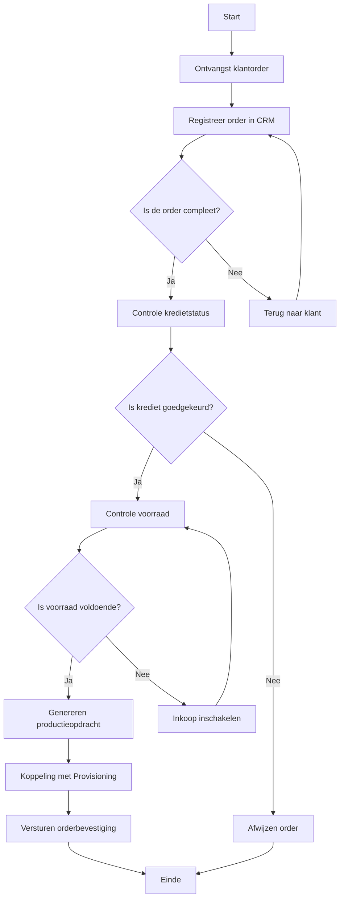

### 6.4.4 Toelichting Flowchart

#### 6.4.4.1 Symbolen en Legenda

| Symbool   | Naam   | Beschrijving               | Voorbeeld                                 |
| ------------- | ---------- | ------------------------------ | --------------------------------------------- |
| Ovaal     | Start/End  | Begin of einde van het proces. | Start, Einde                                  |
| Rechthoek | Activiteit | Een stap in het proces.        | Ontvangst klantorder, Registreer order in CRM |
| Ruit      | Beslissing | Een keuzepunt in het proces.   | Is de order compleet?                         |
| Pijl      | Stroom     | Richting van de processtroom.  | →                                             |
| Lijn      | Verbinding | Verbinding tussen symbolen.    | -                                             |

#### 6.4.4.2 Processtappen

| Stap                    | Symbool | Beschrijving                                                | Verantwoordelijke | Systeem/Tool               |
| --------------------------- | ----------- | --------------------------------------------------------------- | --------------------- | ------------------------------ |
| Start                       | Ovaal       | Begin van het proces.                                           | -                     | -                              |
| Ontvangst klantorder        | Rechthoek   | Klant plaatst een order via webshop, telefoon, of sales.        | Sales Team            | Webshop, Salesforce CRM        |
| Registreer order in CRM     | Rechthoek   | Order Medewerker registreert de order in Salesforce CRM.        | Order Team            | Salesforce CRM                 |
| Is de order compleet?       | Ruit        | Beslissing: Zijn alle verplichte velden ingevuld?               | Order Team            | Salesforce CRM                 |
| Controle kredietstatus      | Rechthoek   | Order Medewerker controleert of de klant kredietwaardig is.     | Order Team            | SAP ERP                        |
| Is krediet goedgekeurd?     | Ruit        | Beslissing: Is de kredietstatus goedgekeurd?                    | Order Team            | SAP ERP                        |
| Controle voorraad           | Rechthoek   | Order Medewerker controleert of de voorraad voldoende is.       | Order Team            | SAP ERP                        |
| Is voorraad voldoende?      | Ruit        | Beslissing: Is de voorraad voldoende voor de order?             | Order Team            | SAP ERP                        |
| Genereren productieopdracht | Rechthoek   | Order Medewerker zet de klantorder om in een productieopdracht. | Order Team            | SAP ERP                        |
| Koppeling met Provisioning  | Rechthoek   | Productieopdracht wordt doorgegeven aan Provisioning.           | Order Team            | SAP ERP → Provisioning-systeem |
| Versturen orderbevestiging  | Rechthoek   | Order Medewerker verstuurt een orderbevestiging naar de klant.  | Order Team            | Salesforce CRM                 |
| Einde                       | Ovaal       | Einde van het proces.                                           | -                     | -                              |

#### 6.4.4.3 Beslissingen

| Beslissing          | Opties | Actie bij "Ja"                        | Actie bij "Nee" |
| ----------------------- | ---------- | ----------------------------------------- | ------------------- |
| Is de order compleet?   | Ja / Nee   | Doorgaan naar Controle kredietstatus      | Terug naar klant    |
| Is krediet goedgekeurd? | Ja / Nee   | Doorgaan naar Controle voorraad           | Afwijzen order      |
| Is voorraad voldoende?  | Ja / Nee   | Doorgaan naar Genereren productieopdracht | Inkoop inschakelen  |

### 6.4.5 Gerelateerde Documenten

- [Procesmodellering](#) (PMD-03.06.00)
- [BPMN](#) (PMD-03.06.01)
- [Swimlane Diagram](#) (PMD-03.06.03)
- [Procesbeschrijving](#) (PMD-03.07.01)

### 6.4.6 Versiehistorie

| Versie | Datum  | Wijziging   | Auteur      | Goedgekeurd door |
| ---------- | ---------- | --------------- | --------------- | -------------------- |
| 1.0        | 19/04/2026 | Initiële versie | Martin van Pelt | Jan de Vries         |

# 7 Procesuitwerking
## 7.1 Procesuitwerking Master
---
title: Procesuitwerking Master  
weight: 1  
description: Master template voor de uitwerking van processen binnen TelecomPro B.V., inclusief structuur en richtlijnen.  
type: template  
tags:
- procesuitwerking
- master template
- PDM
- TelecomPro
- 7x Framework
---

### 7.1.1 Inleiding

Dit Procesuitwerking Master-template biedt een gestandaardiseerde structuur voor het uitwerken van processen binnen TelecomPro B.V.. Het doel is om:  
- Consistentie in procesdocumentatie te waarborgen.  
- Duidelijkheid te scheppen over processtappen, verantwoordelijkheden, en systemen.  
- Koppeling tussen processen en andere documentatie te vergemakkelijken.

### 7.1.2 Eigenschappen


| Veld       | Waarde      | Toelichting                                         |
| -------------- | --------------- | ------------------------------------------------------- |
| PMD-nummer | 03.07.00        | Uniek identificatienummer voor Procesuitwerking Master. |
| Versie     | 1.0             | Huidige versie.                                         |
| Status     | Gepubliceerd    | Status van het document.                                |
| Auteur     | Martin van Pelt | Procesanalist.                                          |
| Eigenaar   | Jan de Vries    | Proceseigenaar Operaties.                               |
| Datum      | 19/04/2026      | Datum van laatste update.                               |

### 7.1.3 Structuur van Procesuitwerking

Elke procesuitwerking binnen TelecomPro bevat de volgende standaard onderdelen:

| Onderdeel                     | Beschrijving                                                                  | Doel                                 |
| --------------------------------- | --------------------------------------------------------------------------------- | ---------------------------------------- |
| Basisgegevens                 | Algemene informatie over het proces (naam, ID, doel, scope).                      | Duidelijkheid over het proces.           |
| Procesdoel                    | Doel, waarde, en succescriteria van het proces.                                   | Alignement met organisatiedoelen.        |
| Processtappen                 | Gedetailleerde beschrijving van activiteiten, verantwoordelijkheden, en systemen. | Inzicht in de uitvoering van het proces. |
| Uitzonderingen en varianten   | Afwijkingen van de standaardstroom.                                               | Compleet beeld van het proces.           |
| Betrokken systemen            | Systemen en tools die worden gebruikt in het proces.                              | Inzicht in technische afhankelijkheden.  |
| KPI’s                         | Key Performance Indicators voor het proces.                                       | Meten van procesprestaties.              |
| Risico’s                      | Potentiële risico’s en mitigerende maatregelen.                                   | Proactief risicobeheer.                  |
| Relaties met andere processen | Koppeling met upstream/downstream processen.                                      | Inzicht in procesinteracties.            |
| Visuele weergave              | Diagrammen (BPMN, Swimlane, Flowchart).                                           | Visueel inzicht in het proces.           |

### 7.1.4 Voorbeeld: Structuur voor Orderverwerking

| Onderdeel                     | Inhoud                                 | Gerelateerd Document                                                              |
| --------------------------------- | ------------------------------------------ | ------------------------------------------------------------------------------------- |
| Basisgegevens                 | Procesnaam, Proces-ID, Doel, Scope         | [Procesdoel](#) (PMD-03.03.00)                                                        |
| Procesdoel                    | Doel, waarde, succescriteria               | [Procesdoel](#) (PMD-03.03.00)                                                        |
| Processtappen                 | Stapsgewijze beschrijving van activiteiten | [Procesbeschrijving](#) (PMD-03.07.01)                                                |
| Uitzonderingen en varianten   | Afwijkingen van de standaardstroom         | [Procesbeschrijving](#) (PMD-03.07.01)                                                |
| Betrokken systemen            | Systemen en tools                          | [Procescontext](#) (PMD-03.04.00)                                                     |
| KPI’s                         | Key Performance Indicators                 | [KPI's](#) (PMD-03.08.01)                                                             |
| Risico’s                      | Risicoanalyse                              | [Procesbeschrijving](#) (PMD-03.07.01)                                                |
| Relaties met andere processen | Upstream/downstream processen              | [Procesinteractie](#) (PMD-02.04.00)                                                  |
| Visuele weergave              | BPMN, Swimlane, Flowchart                  | [BPMN](#) (PMD-03.06.01), [Swimlane](#) (PMD-03.06.03), [Flowchart](#) (PMD-03.06.02) |

### 7.1.5 Gerelateerde Documenten

- [Procesbeschrijving](#) (PMD-03.07.01)
- [Werkinstructie](#) (PMD-03.07.02)
- [RACI Matrix](#) (PMD-03.07.03)
- [Procesrollen](#) (PMD-03.07.04)

## 7.2 Procesuitwerking Master
---
title: Procesuitwerking - Orderverwerking  
weight: 1  
description: Uitgebreide uitwerking van het Orderverwerkingsproces bij TelecomPro B.V., inclusief processtappen, verantwoordelijkheden en systemen.  
type: template  
tags:
- procesuitwerking
- PDM
- TelecomPro
- Orderverwerking
---

### 7.2.1 Inleiding

Dit document biedt een uitgebreide uitwerking van het Orderverwerkingsproces (PR-001) bij TelecomPro B.V., inclusief:  
-  Gedetailleerde processtappen met verantwoordelijkheden en systemen.  
-  Uitzonderingen en varianten van het proces.  
-  Koppeling met andere processen en documentatie.

### 7.2.2 Eigenschappen

| Veld           | Waarde          | Toelichting                                      |
| -------------- | --------------- | ------------------------------------------------ |
| PMD-nummer | 03.07.00        | Uniek identificatienummer voor procesuitwerking. |
| Versie     | 1.0             | Huidige versie.                                  |
| Status     | Gepubliceerd    | Status van het document.                         |
| Auteur     | Martin van Pelt | Procesanalist.                                   |
| Eigenaar   | Jan de Vries    | Proceseigenaar Operaties.                        |
| Datum      | 19/04/2026      | Datum van laatste update.                        |

### 7.2.3 Procesoverzicht

| Veld                 | Waarde                                           |
| ------------------------ | ---------------------------------------------------- |
| Procesnaam           | Orderverwerking                                      |
| Proces-ID            | PR-001                                               |
| Doel                 | Tijdige en accurate verwerking van klantorders.      |
| Scope                | Van ontvangst klantorder tot activatie van diensten. |
| Betrokken afdelingen | Sales, Order Team, Provisioning, Financiën, IT       |

### 7.2.4 Processtappen

| Stap | Activiteit              | Beschrijving                                                                   | Verantwoordelijke | Systeem/Tool               | Duur | Input                  | Output                   | Beslissing          | Uitzonderingen                     |
| -------- | --------------------------- | ---------------------------------------------------------------------------------- | --------------------- | ------------------------------ | -------- | -------------------------- | ---------------------------- | ----------------------- | -------------------------------------- |
| 1        | Ontvangst klantorder        | Klant plaatst een order via webshop, telefoon, of sales.                           | Sales Team            | Webshop, Salesforce CRM        | 5 min    | Klantorder                 | Geregistreerde order         | -                       | Spoedorders, grote orders (>100 stuks) |
| 2        | Registratie in CRM          | Order Medewerker registreert de order in Salesforce CRM.                           | Order Team            | Salesforce CRM                 | 10 min   | Klantorder                 | Geregistreerde order in CRM  | -                       | Onvolledige orders                     |
| 3        | Validatie klantgegevens     | Controle of klantgegevens (naam, adres, contactgegevens) compleet en correct zijn. | Order Team            | Salesforce CRM                 | 15 min   | Geregistreerde order       | Gevalideerde klantgegevens   | Is de order compleet?   | Onjuiste klantgegevens                 |
| 4        | Controle kredietstatus      | Controle of de klant kredietwaardig is.                                            | Order Team            | SAP ERP                        | 10 min   | Gevalideerde klantgegevens | Goedgekeurde/afgewezen order | Is krediet goedgekeurd? | Klant niet kredietwaardig              |
| 5        | Controle voorraad           | Controle of de gevraagde producten/diensten op voorraad zijn.                      | Order Team            | SAP ERP                        | 10 min   | Goedgekeurde order         | Bevestigde voorraad          | Is voorraad voldoende?  | Onvoldoende voorraad                   |
| 6        | Genereren productieopdracht | Order Medewerker zet de klantorder om in een productieopdracht.                    | Order Team            | SAP ERP                        | 15 min   | Bevestigde voorraad        | Productieopdracht            | -                       | -                                      |
| 7        | Koppeling met Provisioning  | Productieopdracht wordt automatisch doorgegeven aan Provisioning.                  | Order Team            | SAP ERP → Provisioning-systeem | 5 min    | Productieopdracht          | Activatieopdracht            | -                       | Systeemstoring                         |
| 8        | Versturen orderbevestiging  | Order Medewerker verstuurt een orderbevestiging naar de klant.                     | Order Team            | Salesforce CRM                 | 5 min    | Activatieopdracht          | Orderbevestiging             | -                       | -                                      |

### 7.2.5 Uitzonderingen en Varianten

| Uitzondering          | Oorzaak                                          | Actie                                      | Verantwoordelijke | Impact                     |
| ------------------------- | ---------------------------------------------------- | ---------------------------------------------- | --------------------- | ------------------------------ |
| Onvolledige klantgegevens | Klantgegevens zijn niet compleet.                    | Terug naar klant voor aanvulling.              | Order Team            | Vertraging in orderverwerking. |
| Klant niet kredietwaardig | Klant heeft een slechte kredietstatus.               | Order afwijzen en klant informeren.            | Order Team            | Verloren order.                |
| Onvoldoende voorraad      | Voorraad is niet voldoende voor de order.            | Inkoop inschakelen om voorraad aan te vullen.  | Order Team            | Vertraging in orderverwerking. |
| Systeemstoring            | SAP ERP of Provisioning-systeem is niet beschikbaar. | Handmatige verwerking en later synchroniseren. | IT-afdeling           | Vertraging in orderverwerking. |
| Spoedorder                | Klant heeft een spoedorder geplaatst.                | Prioriteit geven aan de order.                 | Order Team            | Snellere verwerking.           |
| Grote order (>100 stuks)  | Order omvat meer dan 100 stuks.                      | Extra goedkeuring vereist van Sales Manager.   | Sales Manager         | Vertraging in orderverwerking. |

### 7.2.6 Beslissingsbomen (Mermaid)

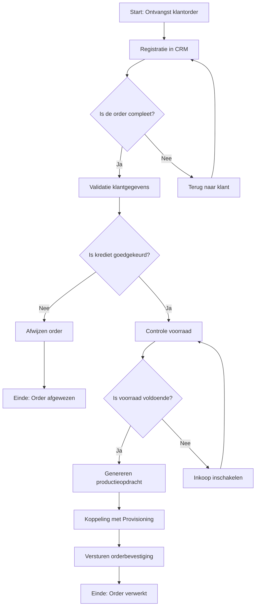

### 7.2.7 Koppeling met Andere Processen

| Proces                     | Relatie   | Input/Output                                          | Verantwoordelijke |
| ------------------------------ | ------------- | --------------------------------------------------------- | --------------------- |
| Offerteproces (PR-007)     | Upstream      | Output: Offerte → Input: Klantorder                       | Sales Team            |
| Provisioning (PR-003)      | Downstream    | Input: Productieopdracht → Output: Geactiveerde dienst    | Provisioning          |
| Facturatie (PR-005)        | Downstream    | Input: Ordergegevens → Output: Factuur                    | Financiële Afdeling   |
| Inkoop (PR-008)            | Ondersteunend | Input: Onvoldoende voorraad → Output: Aangevulde voorraad | Inkoop                |
| Klachtbehandeling (PR-006) | Gerelateerd   | Input: Klacht → Output: Herhaling orderverwerking         | Klantenservice        |

### 7.2.8 Visuele Weergave (Mermaid - Processtroom)

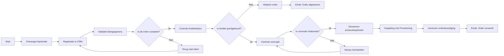

### 7.2.9 Gerelateerde Documenten

- [Procesbeschrijving](#) (PMD-03.07.01)
- [Werkinstructie](#) (PMD-03.07.02)
- [RACI Matrix](#) (PMD-03.07.03)
- [Procesrollen](#) (PMD-03.07.04)

## 7.3 Procesbeschrijving
---
title: Procesbeschrijving - Orderverwerking  
weight: 1  
description: Compleet overzicht van het Orderverwerkingsproces bij TelecomPro B.V., inclusief stappen, verantwoordelijkheden, systemen, KPI's en risico's.  
type: template  
tags:

- procesbeschrijving
- procesuitwerking
- PDM
- TelecomPro
- Orderverwerking
- 7x Framework
---

### 7.3.1 Inleiding

Dit document biedt een gedetailleerde beschrijving van het Orderverwerkingsproces (PR-001) bij TelecomPro B.V.. Het doel is om:  
- Duidelijkheid te scheppen over hoe het proces werkt.  
- Verantwoordelijkheden, systemen, en KPI’s in kaart te brengen.  
- Basis te leggen voor procesmodellering, werkinstructies, en verbeterinitiatieven.  
- Consistentie te waarborgen in de uitvoering van het proces.

### 7.3.2 Eigenschappen

| Veld          | Waarde                                                                                                                                         | Toelichting                                    |
| ----------------- | -------------------------------------------------------------------------------------------------------------------------------------------------- | -------------------------------------------------- |
| PMD-nummer    | 03.07.01                                                                                                                                           | Uniek identificatienummer voor procesbeschrijving. |
| Versie        | 1.0                                                                                                                                                | Huidige versie.                                    |
| Status        | Gepubliceerd                                                                                                                                       | Status van het document.                           |
| Auteur        | Martin van Pelt                                                                                                                                    | Procesanalist.                                     |
| Eigenaar      | Jan de Vries                                                                                                                                       | Proceseigenaar Operaties.                          |
| Datum         | 19/04/2026                                                                                                                                         | Datum van laatste update.                          |
| Gekoppeld aan | Procesdoel (PMD-03.03.00), Procesuitwerking (PMD-03.07.00), Werkinstructie (PMD-03.07.02), RACI Matrix (PMD-03.07.03), Procesrollen (PMD-03.07.04) | Gerelateerde documenten.                           |

### 7.3.3 Basisgegevens

| Veld            | Waarde                                                                                                          | Toelichting               |
| ------------------- | ------------------------------------------------------------------------------------------------------------------- | ----------------------------- |
| Procesnaam      | Orderverwerking                                                                                                     | Naam van het proces.          |
| Proces-ID       | PR-001                                                                                                              | Unieke identifier.            |
| Procescategorie | Primair                                                                                                             | Kernproces voor TelecomPro.   |
| Domein          | Operaties                                                                                                           | Functioneel domein.           |
| Subdomein       | Orderbeheer                                                                                                         | Subdomein binnen Operaties.   |
| Doel            | Tijdige en accurate verwerking van klantorders, van ontvangst tot activatie van diensten.                           | Wat het proces moet bereiken. |
| Scope           | Van ontvangst klantorder (via webshop, telefoon, of sales) tot activatie van de dienst (SIM-kaart, VoIP, internet). | Wat valt binnen de scope.     |
| Koppeling met   | Order-to-Cash (PR-000), Provisioning (PR-003), Facturatie (PR-005), Klachtbehandeling (PR-006)                      | Gerelateerde processen.       |

### 7.3.4 2. Procesdoel

*(Zie [Procesdoel](#) (PMD-03.03.00) voor een gedetailleerde beschrijving.)*

Samenvatting:

- Hoofddoel: Zorgen voor tijdige, accurate, en efficiënte verwerking van klantorders.
- Waarde voor organisatie: Verhogen van klanttevredenheid en efficiëntie, verlagen van kosten.
- Waarde voor klant: Snelle en betrouwbare orderbevestiging en activatie van diensten.
- Waarde voor medewerkers: Duidelijke werkinstructies en verantwoordelijkheden.

### 7.3.5 Processtappen

#### 7.3.5.1 Overzichtstabel Processtappen

| Stap | Activiteit              | Beschrijving                                                                   | Verantwoordelijke | Systeem/Tool               | Duur | Input                                          | Output                   | Kwaliteitsvoorwaarden                               | Beslissing          | Uitzonderingen                     |
| -------- | --------------------------- | ---------------------------------------------------------------------------------- | --------------------- | ------------------------------ | -------- | -------------------------------------------------- | ---------------------------- | ------------------------------------------------------- | ----------------------- | -------------------------------------- |
| 1        | Ontvangst klantorder        | Klant plaatst een order via webshop, telefoon, of sales.                           | Sales Team            | Webshop, Salesforce CRM        | 5 min    | Klantorder (digitaal formulier of telefoongesprek) | Geregistreerde order in CRM  | Alle verplichte velden zijn ingevuld.                   | -                       | Spoedorders, grote orders (>100 stuks) |
| 2        | Registratie in CRM          | Order Medewerker registreert de order in Salesforce CRM.                           | Order Team            | Salesforce CRM                 | 10 min   | Klantorder                                         | Geregistreerde order in CRM  | Order is compleet en correct geregistreerd.             | -                       | Onvolledige orders                     |
| 3        | Validatie klantgegevens     | Controle of klantgegevens (naam, adres, contactgegevens) compleet en correct zijn. | Order Team            | Salesforce CRM                 | 15 min   | Geregistreerde order                               | Gevalideerde klantgegevens   | Klant-ID is geldig, adresgegevens zijn correct.         | Is de order compleet?   | Onjuiste klantgegevens                 |
| 4        | Controle kredietstatus      | Controle of de klant kredietwaardig is.                                            | Order Team            | SAP ERP                        | 10 min   | Gevalideerde klantgegevens                         | Goedgekeurde/afgewezen order | Kredietstatus is actueel en geverifieerd.               | Is krediet goedgekeurd? | Klant niet kredietwaardig              |
| 5        | Controle voorraad           | Controle of de gevraagde producten/diensten op voorraad zijn.                      | Order Team            | SAP ERP                        | 10 min   | Goedgekeurde order                                 | Bevestigde voorraad          | Voorraadniveaus zijn actueel.                           | Is voorraad voldoende?  | Onvoldoende voorraad                   |
| 6        | Genereren productieopdracht | Order Medewerker zet de klantorder om in een productieopdracht.                    | Order Team            | SAP ERP                        | 15 min   | Bevestigde voorraad                                | Productieopdracht            | Productieopdracht is compleet en foutloos.              | -                       | -                                      |
| 7        | Koppeling met Provisioning  | Productieopdracht wordt automatisch doorgegeven aan Provisioning.                  | Order Team            | SAP ERP → Provisioning-systeem | 5 min    | Productieopdracht                                  | Activatieopdracht            | Koppeling is succesvol.                                 | -                       | Systeemstoring                         |
| 8        | Versturen orderbevestiging  | Order Medewerker verstuurt een orderbevestiging naar de klant.                     | Order Team            | Salesforce CRM                 | 5 min    | Activatieopdracht                                  | Orderbevestiging (e-mail)    | Orderbevestiging is accuraat, tijdig, en professioneel. | -                       | -                                      |

#### 7.3.5.2 Gedetailleerde Beschrijving per Stap

##### 7.3.5.2.1 Stap 1: Ontvangst klantorder

- Activiteit:
  - Klant plaatst een order via webshop, telefoon, of sales.
  - Sales Medewerker registreert de basisgegevens van de klant en de order.
- Verantwoordelijke: Sales Team.
- Systeem/Tool: Webshop, Salesforce CRM.
- Input:
  - Klantorder (digitaal formulier via webshop of telefoongesprek).
  - Klantgegevens (naam, adres, contactgegevens, klant-ID).
- Output:
  - Geregistreerde order in Salesforce CRM.
- Kwaliteitsvoorwaarden:
  - Alle verplichte velden zijn ingevuld.
  - Klant-ID is geldig en uniek.
- Uitzonderingen:
  - Spoedorders: Orders met hoge prioriteit (bijv. klanten met SLA).
  - Grote orders (>100 stuks): Orders die extra goedkeuring vereisen.
- Tips/Waarschuwingen:
  - Controleer of de klant-ID al bestaat in het systeem. Zo niet, maak een nieuwe klant aan.
  - Bij onbekende klanten: vraag om bedrijfsgegevens (KvK-nummer, BTW-nummer).
- Voorbeeld:
  > *"Order #2026-0045 van Klant X (Klant-ID: KL-1001) wordt geregistreerd met product VoIP Business (Product-ID: PB-001) via de webshop."*

##### 7.3.5.2.2 Stap 2: Registratie in CRM

- Activiteit:
  - Order Medewerker controleert en voltooit de registratie van de order in Salesforce CRM.
  - Eventueel ontbrekende gegevens worden aanvullend ingevuld.
- Verantwoordelijke: Order Team.
- Systeem/Tool: Salesforce CRM.
- Input:
  - Geregistreerde order (uit Stap 1).
- Output:
  - Volledige order in Salesforce CRM, inclusief alle klant- en productgegevens.
- Kwaliteitsvoorwaarden:
  - Order is compleet (alle verplichte velden zijn ingevuld).
  - Order is correct (geen fouten in klant- of productgegevens).
- Uitzonderingen:
  - Onvolledige orders: Orders waar gegevens ontbreken.
- Tips/Waarschuwingen:
  - Gebruik de "Valideer"-knop in Salesforce CRM voor automatische controle.
  - Controleer of de productcodes correct zijn.
- Voorbeeld:
  > *"Order #2026-0045 is volledig geregistreerd in Salesforce CRM met klantgegevens (KL-1001) en productgegevens (PB-001)."*

##### 7.3.5.2.3 Stap 3: Validatie klantgegevens

- Activiteit:
  - Order Medewerker controleert of de klantgegevens (naam, adres, contactgegevens) compleet en correct zijn.
  - Gebruik de "Valideer"-functie in Salesforce CRM voor automatische controle.
- Verantwoordelijke: Order Team.
- Systeem/Tool: Salesforce CRM.
- Input:
  - Geregistreerde order (uit Stap 2).
- Output:
  - Gevalideerde klantgegevens.
- Kwaliteitsvoorwaarden:
  - Klant-ID is geldig en uniek.
  - Adresgegevens zijn correct en compleet.
- Beslissing:
  - Is de order compleet?
    - Ja: Doorgaan naar Stap 4 (Controle kredietstatus).
    - Nee: Terug naar klant voor aanvulling gegevens (via e-mail of telefoon).
- Uitzonderingen:
  - Onjuiste klantgegevens: Klantgegevens zijn onvolledig of onjuist.
- Tips/Waarschuwingen:
  - Bij onjuiste gegevens: neem direct contact op met de klant.
  - Gebruik de "Klantzoeken"-functie om dubbele klant-ID’s te voorkomen.
- Voorbeeld:
  > *"Klantgegevens van Klant X (Klant-ID: KL-1001) zijn gevalideerd: naam (TelecomPro B.V.), adres (Dam 1, Rotterdam), en contactgegevens (010-1234567) zijn correct."*

##### 7.3.5.2.4 Stap 4: Controle kredietstatus

- Activiteit:
  - Order Medewerker controleert of de klant kredietwaardig is in SAP ERP.
  - Gebruik de "Kredietcheck"-functie in SAP ERP.
- Verantwoordelijke: Order Team.
- Systeem/Tool: SAP ERP.
- Input:
  - Gevalideerde klantgegevens (uit Stap 3).
- Output:
  - Goedgekeurde of afgewezen order.
- Kwaliteitsvoorwaarden:
  - Kredietstatus is actueel (max. 30 dagen oud).
  - Kredietlimiet is niet overschreden.
- Beslissing:
  - Is krediet goedgekeurd?
    - Ja: Doorgaan naar Stap 5 (Controle voorraad).
    - Nee: Order wordt afgewezen en de klant wordt geïnformeerd via e-mail (gebruik template "Order Afgewezen").
- Uitzonderingen:
  - Klant niet kredietwaardig: Klant heeft een slechte kredietstatus.
- Tips/Waarschuwingen:
  - Bij afgewezen krediet: informeer de klant met een duidelijke uitleg en bied alternatieven (bijv. voorschotbetaling).
  - Raadpleeg de Financiële Afdeling bij twijfel.
- Voorbeeld:
  > *"Kredietstatus van Klant X (Klant-ID: KL-1001) is goedgekeurd (limiet: €10.000, gebruikt: €5.000)."*

##### 7.3.5.2.5 Stap 5: Controle voorraad

- Activiteit:
  - Order Medewerker controleert of de gevraagde producten/diensten op voorraad zijn in SAP ERP.
  - Gebruik de "Voorraadcheck"-functie in SAP ERP.
- Verantwoordelijke: Order Team.
- Systeem/Tool: SAP ERP.
- Input:
  - Goedgekeurde order (uit Stap 4).
- Output:
  - Bevestigde voorraad.
- Kwaliteitsvoorwaarden:
  - Voorraadniveaus zijn actueel (real-time).
  - Voorraad is voldoende voor de order.
- Beslissing:
  - Is voorraad voldoende?
    - Ja: Doorgaan naar Stap 6 (Genereren productieopdracht).
    - Nee: Inkoop inschakelen om voorraad aan te vullen (automatische notificatie naar Inkoop).
- Uitzonderingen:
  - Onvoldoende voorraad: Voorraad is niet voldoende voor de order.
- Tips/Waarschuwingen:
  - Bij onvoldoende voorraad: neem contact op met Inkoop voor spoedlevering.
  - Controleer of de leverdatum realistisch is.
- Voorbeeld:
  > *"Voorraad van VoIP Business (Product-ID: PB-001) is voldoende (100 stuks beschikbaar, order: 50 stuks)."*

##### 7.3.5.2.6 Stap 6: Genereren productieopdracht

- Activiteit:
  - Order Medewerker zet de klantorder om in een productieopdracht in SAP ERP.
  - Vul de productgegevens (aantal, type, leverdatum) in.
- Verantwoordelijke: Order Team.
- Systeem/Tool: SAP ERP.
- Input:
  - Bevestigde voorraad (uit Stap 5).
- Output:
  - Productieopdracht (digitaal).
- Kwaliteitsvoorwaarden:
  - Productieopdracht is compleet (alle velden ingevuld).
  - Productgegevens zijn correct (geen fouten in aantallen of types).
- Tips/Waarschuwingen:
  - Controleer of de leverdatum realistisch is (rekening houdend met voorraad en productietijd).
  - Gebruik de "Genereren Opdracht"-knop in SAP ERP.
- Voorbeeld:
  > *"Productieopdracht #PO-2026-0045 is gegenereerd voor 50 stuks VoIP Business (Product-ID: PB-001), leverdatum: 25/04/2026."*

##### 7.3.5.2.7 Stap 7: Koppeling met Provisioning

- Activiteit:
  - De productieopdracht wordt automatisch doorgegeven aan het Provisioning-systeem.
  - Order Medewerker controleert of de koppeling succesvol is verlopen.
- Verantwoordelijke: Order Team.
- Systeem/Tool: SAP ERP → Provisioning-systeem.
- Input:
  - Productieopdracht (uit Stap 6).
- Output:
  - Activatieopdracht (in Provisioning-systeem).
- Kwaliteitsvoorwaarden:
  - Koppeling is succesvol (geen foutmeldingen).
  - Activatieopdracht bevat alle benodigde gegevens.
- Uitzonderingen:
  - Systeemstoring: SAP ERP of Provisioning-systeem is niet beschikbaar.
- Tips/Waarschuwingen:
  - Bij systeemstoring: neem contact op met IT-afdeling en gebruik de back-up procedure (handmatige registratie in Excel).
  - Controleer of de Activatie-ID correct is doorgegeven.
- Voorbeeld:
  > *"Productieopdracht #PO-2026-0045 is gekoppeld aan Provisioning-systeem (Activatie-ID: ACT-2026-045)."*

##### 7.3.5.2.8 Stap 8: Versturen orderbevestiging

- Activiteit:
  - Order Medewerker verstuurt een orderbevestiging naar de klant via e-mail.
  - Gebruik de standaard template voor orderbevestigingen.
- Verantwoordelijke: Order Team.
- Systeem/Tool: Salesforce CRM.
- Input:
  - Activatieopdracht (uit Stap 7).
- Output:
  - Orderbevestiging (e-mail).
- Kwaliteitsvoorwaarden:
  - Orderbevestiging is accuraat (geen fouten in klantgegevens of producten).
  - Orderbevestiging is tijdig verzonden (binnen 1 uur na registratie).
- Tips/Waarschuwingen:
  - Controleer of de klantgegevens in de bevestiging correct zijn.
  - Voeg extra informatie toe (bijv. leverdatum, contactgegevens).
- Voorbeeld:
  > *"Orderbevestiging voor Order #2026-0045 is verstuurd naar Klant X (e-mail: [klant@bedrijf.nl](mailto:klant@bedrijf.nl))."*

### 7.3.6 Betrokken Systemen

| Systeem              | Doel                                                   | Gebruikers                  | Toegang  | Verantwoordelijke | Kritikaliteit | Handleiding                                                              |
| ------------------------ | ---------------------------------------------------------- | ------------------------------- | ------------ | --------------------- | ----------------- | ---------------------------------------------------------------------------- |
| Salesforce CRM       | Beheer van klantgegevens en orders.                        | Sales Team, Order Team          | Webinterface | IT-afdeling           | Hoog              | [Handleiding CRM](https://telecompro.nl/handleidingen/crm)                   |
| SAP ERP              | Orderverwerking, voorraadbeheer, financiële administratie. | Order Team, Financiële Afdeling | Webinterface | IT-afdeling           | Hoog              | [Handleiding ERP](https://telecompro.nl/handleidingen/erp)                   |
| Provisioning-systeem | Activatie van telecomdiensten (SIM, VoIP, internet).       | Provisioning, Order Team        | Webinterface | IT-afdeling           | Hoog              | [Handleiding Provisioning](https://telecompro.nl/handleidingen/provisioning) |
| Webshop              | Ontvangst van online orders.                               | Klanten, Sales Team             | Webinterface | IT-afdeling           | Middel            | -                                                                            |
| E-mail (Outlook)     | Communicatie met klanten.                                  | Order Team, Sales Team          | Outlook      | IT-afdeling           | Middel            | [IT-beleid](https://telecompro.nl/beleid/it)                                 |

### 7.3.7 KPI’s

*(Zie [KPI’s](#) (PMD-03.08.01) voor een gedetailleerd overzicht.)*

| KPI                      | Definitie                                                  | Doelwaarde | Huidige waarde | Meetfrequentie | Verantwoordelijke | Bron     | Impact |
| ---------------------------- | -------------------------------------------------------------- | -------------- | ------------------ | ------------------ | --------------------- | ------------ | ---------- |
| Doorlooptijd orderverwerking | Gemiddelde tijd tussen ontvangst en bevestiging van een order. | < 24 uur       | 28 uur             | Dagelijks          | Proceseigenaar        | SAP ERP      | Hoog       |
| Aantal fouten per order      | Percentage orders met fouten.                                  | < 1%           | 1,5%               | Wekelijks          | Kwaliteitsmanager     | SAP ERP      | Hoog       |
| First-time-right             | Percentage orders dat in één keer correct wordt verwerkt.      | > 98%          | 95%                | Wekelijks          | Proceseigenaar        | SAP ERP      | Hoog       |
| Klanttevredenheid (NPS)      | Net Promoter Score voor orderafhandeling.                      | > 8,5          | 8,2                | Maandelijks        | Sales Manager         | Klantenquête | Hoog       |
| Kosten per order             | Gemiddelde kosten voor het verwerken van een order.            | < €10          | €12                | Maandelijks        | Financiële Afdeling   | SAP ERP      | Hoog       |
| Systeembeschikbaarheid       | Percentage tijd dat SAP ERP en CRM-systeem beschikbaar zijn.   | > 99,5%        | 99,2%              | Continu            | IT-afdeling           | Nagios       | Hoog       |

### 7.3.8 Risico’s

| Risico                  | Oorzaak                                                    | Impact                                       | Kans | Mitigerende maatregel                        | Verantwoordelijke | Status    |
| --------------------------- | -------------------------------------------------------------- | ------------------------------------------------ | -------- | ------------------------------------------------ | --------------------- | ------------- |
| Vertraagde orderverwerking  | Handmatige validatiestap duurt te lang.                        | Vertraging in levering, lagere klanttevredenheid | Hoog     | Automatiseren validatiestap.                     | IT-afdeling           | In uitvoering |
| Fouten in klantgegevens     | Onjuiste invoer door medewerker.                               | Onjuiste orderverwerking, herwerk nodig          | Middel   | Dubbelcheck door tweede medewerker.              | Order Team            | Gepland       |
| Systeemstoring              | SAP ERP of Provisioning-systeem is niet beschikbaar.           | Proces stopt, vertraging in orderverwerking      | Laag     | Back-up procedure in Excel.                      | IT-afdeling           | Gepland       |
| Onvoldoende voorraad        | Voorraad is niet voldoende voor de order.                      | Vertraging in orderverwerking                    | Middel   | Inkoop inschakelen.                              | Inkoop                | Gepland       |
| Weerstand tegen verandering | Medewerkers zijn terughoudend om nieuwe werkwijzen te omarmen. | Vertraagde adoptie van verbeteringen             | Hoog     | Betrek medewerkers bij ontwerp en implementatie. | Proceseigenaar        | Gepland       |

Kans:
- Hoog: Risico is zeer waarschijnlijk.
- Middel: Risico is mogelijk.
- Laag: Risico is onwaarschijnlijk.

### 7.3.9 7. Relaties met Andere Processen


| Proces                     | Relatie   | Input/Output                                          | Verantwoordelijke | PMD-nummer |
| ------------------------------ | ------------- | --------------------------------------------------------- | --------------------- | -------------- |
| Offerteproces (PR-007)     | Upstream      | Output: Offerte → Input: Klantorder                       | Sales Team            | PMD-03.07.01   |
| Provisioning (PR-003)      | Downstream    | Input: Productieopdracht → Output: Geactiveerde dienst    | Provisioning          | PMD-03.07.01   |
| Facturatie (PR-005)        | Downstream    | Input: Ordergegevens → Output: Factuur                    | Financiële Afdeling   | PMD-03.07.01   |
| Inkoop (PR-008)            | Ondersteunend | Input: Onvoldoende voorraad → Output: Aangevulde voorraad | Inkoop                | PMD-03.07.01   |
| Klachtbehandeling (PR-006) | Gerelateerd   | Input: Klacht → Output: Herhaling orderverwerking         | Klantenservice        | PMD-03.07.01   |

### 7.3.10 8. Visuele Weergave (Mermaid)

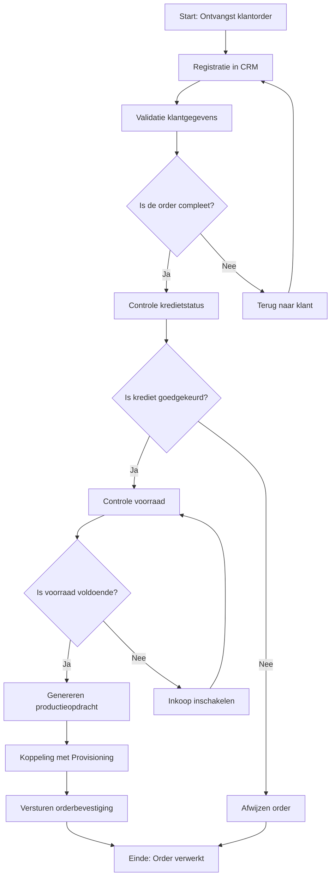

### 7.3.11 📎11. Gerelateerde Documenten

- [Procesdoel](#) (PMD-03.03.00)
- [Procesuitwerking](#) (PMD-03.07.00)
- [Werkinstructie](#) (PMD-03.07.02)
- [RACI Matrix](#) (PMD-03.07.03)
- [Procesrollen](#) (PMD-03.07.04)
- [KPI’s](#) (PMD-03.08.01)

### 7.3.12 12. Versiehistorie

| Versie | Datum  | Wijziging   | Auteur      | Goedgekeurd door |
| ---------- | ---------- | --------------- | --------------- | -------------------- |
| 1.0        | 19/04/2026 | Initiële versie | Martin van Pelt | Jan de Vries         |

## 7.4 Werkinstructie
---
title: Werkinstructie - Orderverwerking  
weight: 2  
description: Stapsgewijze handleiding voor het uitvoeren van het Orderverwerkingsproces bij TelecomPro B.V., inclusief tips, schermvoorbeelden en controlepunten.  
type: template  
tags:
- procesuitwerking
- werkinstructie
- PDM
- TelecomPro
- Orderverwerking
---

### 7.4.1 Inleiding

Deze Werkinstructie biedt een praktische, stapsgewijze handleiding voor het uitvoeren van het Orderverwerkingsproces (PR-001) bij TelecomPro B.V.. Het document is bedoeld voor Order Medewerkers en bevat:  
-  Duidelijke stappen met verantwoordelijkheden en systemen.  
-  Schermvoorbeelden en tips voor efficiënte uitvoering.  
-  Controlepunten en veelgemaakte fouten met oplossingen.

### 7.4.2 Eigenschappen

| Veld              | Waarde                                                         | Toelichting                                    |
| ----------------- | -------------------------------------------------------------- | ---------------------------------------------- |
| PMD-nummer    | 03.07.02                                                       | Uniek identificatienummer voor werkinstructie. |
| Versie        | 1.0                                                            | Huidige versie.                                |
| Status        | Gepubliceerd                                                   | Status van het document.                       |
| Auteur        | Martin van Pelt                                                | Procesanalist.                                 |
| Eigenaar      | Jan de Vries                                                   | Proceseigenaar Operaties.                      |
| Datum         | 19/04/2026                                                     | Datum van laatste update.                      |
| Gekoppeld aan | Procesbeschrijving (PMD-03.07.01), Procesrollen (PMD-03.07.04) | Gerelateerde documenten.                       |

### 7.4.3 Basisgegevens

| Veld              | Waarde                                                    |
| --------------------- | ------------------------------------------------------------- |
| Werkinstructie-ID | WI-001                                                        |
| Procesnaam        | Orderverwerking                                               |
| Proces-ID         | PR-001                                                        |
| Doelgroep         | Order Team                                                    |
| Toepassingsmoment | Bij het verwerken van klantorders (webshop, telefoon, sales). |

### 7.4.4 Doel en Toepassingsgebied

| Aspect                     | Beschrijving                                                                                                                    |
| ------------------------------ | ----------------------------------------------------------------------------------------------------------------------------------- |
| Doel                       | Zorgen voor een gestandaardiseerde, foutloze, en efficiënte verwerking van klantorders.                                         |
| Waarde voor de organisatie | Verminderen van fouten en vertragingen in de orderafhandeling, wat leidt tot hogere klanttevredenheid en lagere kosten. |
| Waarde voor de medewerker  | Duidelijke handleiding voor nieuwe en ervaren medewerkers, wat leidt tot minder stress en hogere productiviteit.        |
| Koppeling met procesdoel   | Ondersteunt het procesdoel "Tijdige en accurate verwerking van klantorders".                                                    |

### 7.4.5 Voorbereiding

| Veld                   | Waarde                                                                                                                                           |
| -------------------------- | ---------------------------------------------------------------------------------------------------------------------------------------------------- |
| Benodigde kennis       | Kennis van Salesforce CRM, SAP ERP, basis kennis van telecomproducten (VoIP, SIM, internet).                                                         |
| Benodigde toegang      | Toegang tot Salesforce CRM, SAP ERP, e-mail (Outlook).                                                                                               |
| Benodigde materialen   | Laptop, telefoon, headset, orderformulieren (digitaal).                                                                                              |
| Voorbereidende stappen | 1. Inloggen in Salesforce CRM en SAP ERP. 2. Openen van het orderdashboard. 3. Controleren of alle systeemnotificaties zijn gelezen. |

### 7.4.6 Stappen

#### 7.4.6.1 Stap 1: Ontvangst klantorder

- Actie:
  - Open Salesforce CRM en selecteer "Nieuwe Order" in het dashboard.
  - Vul de basisgegevens van de klant in (naam, klant-ID, contactgegevens).
- Verantwoordelijke: Order Medewerker.
- Systeem/Tool: Salesforce CRM.
- Input: Klantorder (digitaal formulier via webshop, telefoongesprek, of sales).
- Output: Geregistreerde order in CRM.
- Tijdsduur: 5 minuten.
- Kwaliteitsvoorwaarden:
  - Alle verplichte velden zijn ingevuld.
  - Klant-ID is geldig en uniek.
- Schermvoorbeeld:
  ```mermaid
  graph TD
      A[Salesforce Dashboard] --> B[Klik op 'Nieuwe Order']
      B --> C[Vul klantgegevens in]
  ```
- Tips/Waarschuwingen:
  - Controleer of de klant-ID al bestaat in het systeem. Zo niet, maak een nieuwe klant aan.
  - Bij onbekende klanten: vraag om bedrijfsgegevens (KvK-nummer, BTW-nummer).
- Voorbeeld:
  > *"Order #2026-0045 van Klant X (Klant-ID: KL-1001) wordt geregistreerd met product VoIP Business (Product-ID: PB-001)."*

#### 7.4.6.2 Stap 2: Validatie klantgegevens

- Actie:
  - Controleer of de klantgegevens (naam, adres, contactgegevens) compleet en correct zijn.
  - Gebruik de "Valideer"-knop in Salesforce CRM voor automatische controle.
- Verantwoordelijke: Order Medewerker.
- Systeem/Tool: Salesforce CRM.
- Input: Geregistreerde order.
- Output: Gevalideerde klantgegevens.
- Tijdsduur: 15 minuten.
- Kwaliteitsvoorwaarden:
  - Klant-ID is geldig.
  - Adresgegevens zijn correct en compleet.
- Beslissing:
  - Is de order compleet?
    - Ja: Doorgaan naar Stap 3.
    - Nee: Terug naar klant voor aanvulling gegevens (via e-mail of telefoon).
- Tips/Waarschuwingen:
  - Bij onjuiste gegevens: neem direct contact op met de klant.
  - Gebruik de "Klantzoeken"-functie om dubbele klant-ID’s te voorkomen.
- Voorbeeld:
  > *"Klantgegevens van Klant X (Klant-ID: KL-1001) zijn gevalideerd: naam, adres (Dam 1, Rotterdam), en contactgegevens (010-1234567) zijn correct."*

#### 7.4.6.3 Stap 3: Controle kredietstatus

- Actie:
  - Open SAP ERP en zoek de klant op via Klant-ID.
  - Controleer de kredietstatus in het klantendossier.
- Verantwoordelijke: Order Medewerker.
- Systeem/Tool: SAP ERP.
- Input: Gevalideerde klantgegevens.
- Output: Goedgekeurde of afgewezen order.
- Tijdsduur: 10 minuten.
- Kwaliteitsvoorwaarden:
  - Kredietstatus is actueel (max. 30 dagen oud).
  - Kredietlimiet is niet overschreden.
- Beslissing:
  - Is krediet goedgekeurd?
    - Ja: Doorgaan naar Stap 4.
    - Nee: Order afwijzen en klant informeren via e-mail (gebruik template "Order Afgewezen").
- Tips/Waarschuwingen:
  - Bij afgewezen krediet: informeer de klant met een duidelijke uitleg en bied alternatieven (bijv. voorschotbetaling).
  - Gebruik de "Kredietcheck"-functie in SAP ERP.
- Voorbeeld:
  > *"Kredietstatus van Klant X (Klant-ID: KL-1001) is goedgekeurd (limiet: €10.000, gebruikt: €5.000)."*

#### 7.4.6.4 Stap 4: Controle voorraad

- Actie:
  - Open SAP ERP en zoek de producten/diensten uit de order op.
  - Controleer of de voorraad voldoende is.
- Verantwoordelijke: Order Medewerker.
- Systeem/Tool: SAP ERP.
- Input: Goedgekeurde order.
- Output: Bevestigde voorraad.
- Tijdsduur: 10 minuten.
- Kwaliteitsvoorwaarden:
  - Voorraadniveaus zijn actueel (real-time).
  - Voorraad is voldoende voor de order.
- Beslissing:
  - Is voorraad voldoende?
    - Ja: Doorgaan naar Stap 5.
    - Nee: Inkoop inschakelen (stuur een automatische notificatie naar Inkoop via SAP).
- Tips/Waarschuwingen:
  - Bij onvoldoende voorraad: neem contact op met Inkoop voor spoedlevering.
  - Gebruik de "Voorraadcheck"-functie in SAP ERP.
- Voorbeeld:
  > *"Voorraad van VoIP Business (Product-ID: PB-001) is voldoende (100 stuks beschikbaar, order: 50 stuks)."*

#### 7.4.6.5 Stap 5: Genereren productieopdracht

- Actie:
  - Zet de klantorder om in een productieopdracht in SAP ERP.
  - Vul de productgegevens (aantal, type, leverdatum) in.
- Verantwoordelijke: Order Medewerker.
- Systeem/Tool: SAP ERP.
- Input: Bevestigde voorraad.
- Output: Productieopdracht (digitaal).
- Tijdsduur: 15 minuten.
- Kwaliteitsvoorwaarden:
  - Productieopdracht is compleet (alle velden ingevuld).
  - Productgegevens zijn correct (geen fouten in aantallen of types).
- Tips/Waarschuwingen:
  - Controleer of de leverdatum realistisch is (rekening houdend met voorraad en productietijd).
  - Gebruik de "Genereren Opdracht"-knop in SAP ERP.
- Voorbeeld:
  > *"Productieopdracht #PO-2026-0045 is gegenereerd voor 50 stuks VoIP Business (Product-ID: PB-001), leverdatum: 25/04/2026."*

#### 7.4.6.6 Stap 6: Koppeling met Provisioning

- Actie:
  - De productieopdracht wordt automatisch doorgegeven aan het Provisioning-systeem.
  - Controleer of de koppeling succesvol is verlopen.
- Verantwoordelijke: Order Medewerker.
- Systeem/Tool: SAP ERP → Provisioning-systeem.
- Input: Productieopdracht.
- Output: Activatieopdracht (in Provisioning-systeem).
- Tijdsduur: 5 minuten.
- Kwaliteitsvoorwaarden:
  - Koppeling is succesvol (geen foutmeldingen).
  - Activatieopdracht bevat alle benodigde gegevens.
- Tips/Waarschuwingen:
  - Bij systeemstoring: neem contact op met IT-afdeling en gebruik de back-up procedure (handmatige registratie in Excel).
  - Controleer of de Activatie-ID correct is doorgegeven.
- Voorbeeld:
  > *"Productieopdracht #PO-2026-0045 is gekoppeld aan Provisioning-systeem (Activatie-ID: ACT-2026-045)."*

#### 7.4.6.7 Stap 7: Versturen orderbevestiging

- Actie:
  - Open Salesforce CRM en selecteer de order.
  - Klik op "Verstuur Orderbevestiging" om een automatische e-mail naar de klant te versturen.
  - Controleer of de e-mail correct is verzonden.
- Verantwoordelijke: Order Medewerker.
- Systeem/Tool: Salesforce CRM.
- Input: Activatieopdracht.
- Output: Orderbevestiging (e-mail).
- Tijdsduur: 5 minuten.
- Kwaliteitsvoorwaarden:
  - Orderbevestiging is accuraat (geen fouten in klantgegevens of producten).
  - Orderbevestiging is tijdig verzonden (binnen 1 uur na registratie).
- Tips/Waarschuwingen:
  - Gebruik de standaard template voor orderbevestigingen.
  - Controleer of de klantgegevens in de bevestiging correct zijn.
- Voorbeeld:
  > *"Orderbevestiging voor Order #2026-0045 is verstuurd naar Klant X (e-mail: [klant@bedrijf.nl](mailto:klant@bedrijf.nl))."*

### 7.4.7 Benodigde Systemen

| Systeem              | Doel                                                   | Toegang  | Verantwoordelijke | Handleiding                                                              | Link                                 |
| ------------------------ | ---------------------------------------------------------- | ------------ | --------------------- | ---------------------------------------------------------------------------- | ---------------------------------------- |
| Salesforce CRM       | Beheer van klantgegevens en orders.                        | Webinterface | IT-afdeling           | [Handleiding CRM](https://telecompro.nl/handleidingen/crm)                   | [Salesforce](https://www.salesforce.com) |
| SAP ERP              | Orderverwerking, voorraadbeheer, financiële administratie. | Webinterface | IT-afdeling           | [Handleiding ERP](https://telecompro.nl/handleidingen/erp)                   | [SAP](https://www.sap.com)               |
| Provisioning-systeem | Activatie van telecomdiensten.                             | Webinterface | IT-afdeling           | [Handleiding Provisioning](https://telecompro.nl/handleidingen/provisioning) | Intern                                   |
| E-mail (Outlook)     | Communicatie met klanten.                                  | Outlook      | IT-afdeling           | [IT-beleid](https://telecompro.nl/beleid/it)                                 | [Outlook](https://outlook.office.com)    |

### 7.4.8 Controlepunten

| Controlepunt           | Stap | Type Controle | Frequentie | Verantwoordelijke  | Controlemethode | Acceptatiecriteria                     |
| -------------------------- | -------- | ----------------- | -------------- | ---------------------- | ------------------- | ------------------------------------------ |
| Volledigheid klantgegevens | Stap 2   | Handmatig         | Per order      | Order Medewerker       | Visuele controle    | Alle verplichte velden zijn ingevuld.      |
| Juistheid klantgegevens    | Stap 2   | Automatisch       | Per order      | Salesforce CRM         | Systeemvalidatie    | Geen foutmeldingen in het systeem.         |
| Kredietstatus              | Stap 3   | Automatisch       | Per order      | SAP ERP                | Systeemvalidatie    | Kredietstatus is goedgekeurd.              |
| Voorraadniveaus            | Stap 4   | Automatisch       | Per order      | SAP ERP                | Systeemvalidatie    | Voorraad is voldoende.                     |
| Productieopdracht          | Stap 5   | Handmatig         | Per order      | Order Medewerker       | Visuele controle    | Productieopdracht is compleet en foutloos. |
| Koppeling met Provisioning | Stap 6   | Automatisch       | Per order      | SAP ERP → Provisioning | Systeemvalidatie    | Koppeling is succesvol.                    |

### 7.4.9 Veelgemaakte Fouten en Oplossingen

| Fout                    | Oorzaak                                          | Impact                                 | Oplossing                    | Preventieve maatregel                        |
| --------------------------- | ---------------------------------------------------- | ------------------------------------------ | -------------------------------- | ------------------------------------------------ |
| Onvolledige klantgegevens   | Medewerker vergeet velden in te vullen.              | Vertraging in orderverwerking.             | Handmatig aanvullen.             | Gebruik verplichte velden in Salesforce CRM. |
| Foutieve productcodes       | Onjuiste selectie uit dropdown-menu.                 | Onjuiste orderverwerking.                  | Handmatig corrigeren.            | Voeg validatie toe in SAP ERP.               |
| Vertraging door systeemfout | SAP ERP of Provisioning-systeem is niet beschikbaar. | Proces stopt.                              | Handmatige registratie in Excel. | Zorg voor back-up procedures.                |
| Onvoldoende voorraad        | Voorraad is niet voldoende voor de order.            | Vertraging in orderverwerking.             | Inkoop inschakelen.              | Automatische waarschuwing bij lage voorraad. |
| Verkeerde klant-ID          | Medewerker selecteert verkeerde klant-ID.            | Order wordt aan verkeerde klant gekoppeld. | Handmatig corrigeren.            | Gebruik barcode-scanner voor klant-ID.       |

### 7.4.10 Escalatieprocedure

| Probleem        | Escalatieniveau | Actie                          | Verantwoordelijke | Contactgegevens                                           | Tijdslimiet |
| ------------------- | ------------------- | ---------------------------------- | --------------------- | ------------------------------------------------------------- | --------------- |
| Onbekende klant     | Niveau 1            | Neem contact op met Sales Manager. | Order Medewerker      | [sales@telecompro.nl](mailto:sales@telecompro.nl)             | 1 uur           |
| Systeemstoring      | Niveau 2            | Meld storing bij IT-afdeling.      | Order Medewerker      | [it-support@telecompro.nl](mailto:it-support@telecompro.nl)   | 30 minuten      |
| Complexe klantvraag | Niveau 3            | Escaleren naar Proceseigenaar.     | Teamleider            | [jan.devries@telecompro.nl](mailto:jan.devries@telecompro.nl) | 2 uur           |
| Kredietprobleem     | Niveau 2            | Raadpleeg Financiële Afdeling.     | Order Medewerker      | [finance@telecompro.nl](mailto:finance@telecompro.nl)         | 1 uur           |

### 7.4.11 Bijlagen

| Bijlage               | Type   | Beschrijving                                              | Locatie                                                                   |
| ------------------------- | ---------- | ------------------------------------------------------------- | ----------------------------------------------------------------------------- |
| Salesforce Orderformulier | Afbeelding | Schermvoorbeeld van het orderformulier in Salesforce.         | Bijlage 1                                                                     |
| SAP ERP Orderopdracht     | Afbeelding | Schermvoorbeeld van de orderopdracht in SAP.                  | Bijlage 2                                                                     |
| Orderbevestiging Template | Document   | Standaard template voor orderbevestiging.                     | [Template Orderbevestiging](https://telecompro.nl/templates/orderbevestiging) |
| Back-up Procedure         | Document   | Procedure voor handmatige orderverwerking bij systeemstoring. | [Back-up Procedure](https://telecompro.nl/procedures/backup)                  |

### 7.4.12 Visuele Weergave (Mermaid)

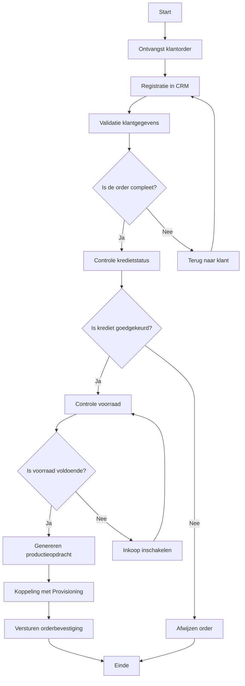

### 7.4.13 Gerelateerde Documenten

- [Procesbeschrijving](#) (PMD-03.07.01)
- [Procesrollen](#) (PMD-03.07.04)
- [RACI Matrix](#) (PMD-03.07.03)

## 7.5 RACI-Matrix
---
title: RACI Matrix - Orderverwerking  
weight: 3  
description: Gedetailleerde RACI-matrix voor het Orderverwerkingsproces bij TelecomPro B.V., inclusief verantwoordelijkheden per activiteit en rol.  
type: template  
tags:
- procesuitwerking
- RACI
- PDM
- TelecomPro
- Orderverwerking
---

### 7.5.1 Inleiding

Deze RACI-matrix definieert de rollen en verantwoordelijkheden voor het Orderverwerkingsproces (PR-001) bij TelecomPro B.V.. Het doel is om:  
-  Duidelijkheid te scheppen over wie wat doet in het proces.  
-  Verantwoordelijkheden eenduidig toe te wijzen en overlappingen te voorkomen.  
-  Communicatie en samenwerking tussen afdelingen te verbeteren.

### 7.5.2 Eigenschappen

| Veld          | Waarde                                                                                    | Toelichting                             |
| ----------------- | --------------------------------------------------------------------------------------------- | ------------------------------------------- |
| PMD-nummer    | 03.07.03                                                                                      | Uniek identificatienummer voor RACI-matrix. |
| Versie        | 1.0                                                                                           | Huidige versie.                             |
| Status        | Gepubliceerd                                                                                  | Status van het document.                    |
| Auteur        | Martin van Pelt                                                                               | Procesanalist.                              |
| Eigenaar      | Jan de Vries                                                                                  | Proceseigenaar Operaties.                   |
| Datum         | 19/04/2026                                                                                    | Datum van laatste update.                   |
| Gekoppeld aan | Procesbeschrijving (PMD-03.07.01), Procesrollen (PMD-03.07.04), Werkinstructie (PMD-03.07.02) | Gerelateerde documenten.                    |

### 7.5.3 Legenda

| Code | Rol     | Beschrijving                         | Voorbeeld                    |
| -------- | ----------- | ---------------------------------------- | -------------------------------- |
| R    | Responsible | Voert de taak uit.                       | Order Medewerker                 |
| A    | Accountable | Eindverantwoordelijk voor het resultaat. | Proceseigenaar                   |
| C    | Consulted   | Wordt geraadpleegd voor input.           | Sales Manager, Kwaliteitsmanager |
| I    | Informed    | Wordt geïnformeerd over de uitvoering.   | Management, IT-afdeling          |

3.2.4 RACI Matrix

#### 7.5.3.1 Overzichtstabel

| Activiteit                                | Proceseigenaar | Order Medewerker | Sales Manager | IT-afdeling | Kwaliteitsmanager | Financiële Afdeling | Inkoop | Provisioning | Teamleider Orderverwerking |
| --------------------------------------------- | ------------------ | -------------------- | ----------------- | --------------- | --------------------- | ----------------------- | ---------- | ---------------- | ------------------------------ |
| Ontvangst klantorder                      | A                  | R                    | I                 | I               | I                     | I                       | I          | I                | C                              |
| Registratie in CRM                        | A                  | R                    | I                 | C               | I                     | I                       | I          | I                | C                              |
| Validatie klantgegevens                   | A                  | R                    | C                 | I               | C                     | I                       | I          | I                | C                              |
| Controle kredietstatus                    | C                  | R                    | A                 | I               | I                     | C                       | I          | I                | C                              |
| Controle voorraad                         | C                  | R                    | I                 | A               | I                     | I                       | C          | I                | C                              |
| Genereren productieopdracht               | A                  | R                    | I                 | C               | I                     | I                       | I          | I                | C                              |
| Koppeling met Provisioning                | C                  | R                    | I                 | A               | I                     | I                       | I          | C                | C                              |
| Versturen orderbevestiging                | A                  | R                    | I                 | I               | I                     | I                       | I          | I                | C                              |
| Afwijzen order                            | C                  | R                    | A                 | I               | I                     | C                       | I          | I                | C                              |
| Inkoop inschakelen                        | I                  | C                    | I                 | I               | I                     | I                       | R          | I                | C                              |
| Handmatige validatie (bij systeemstoring) | I                  | R                    | I                 | C               | I                     | I                       | I          | I                | A                              |
| Pilot testen (nieuwe functionaliteit)     | C                  | R                    | I                 | A               | I                     | I                       | I          | I                | C                              |

### 7.5.4 Toelichting per Activiteit

| Activiteit                                | Beschrijving                                                | R (Responsible) | A (Accountable) | C (Consulted)                   | I (Informed)                                          |
| --------------------------------------------- | --------------------------------------------------------------- | ------------------- | ------------------- | ----------------------------------- | --------------------------------------------------------- |
| Ontvangst klantorder                      | Klant plaatst een order via webshop, telefoon, of sales.        | Order Medewerker    | Proceseigenaar      | -                                   | Sales Manager, IT-afdeling, Kwaliteitsmanager, Teamleider |
| Registratie in CRM                        | Order Medewerker registreert de order in Salesforce CRM.        | Order Medewerker    | Proceseigenaar      | IT-afdeling                         | Teamleider                                                |
| Validatie klantgegevens                   | Controle of klantgegevens compleet en correct zijn.             | Order Medewerker    | Proceseigenaar      | Sales Manager, Kwaliteitsmanager    | Teamleider                                                |
| Controle kredietstatus                    | Controle of de klant kredietwaardig is.                         | Order Medewerker    | Sales Manager       | Proceseigenaar, Financiële Afdeling | Teamleider                                                |
| Controle voorraad                         | Controle of de gevraagde producten/diensten op voorraad zijn.   | Order Medewerker    | IT-afdeling         | Proceseigenaar, Inkoop              | Teamleider                                                |
| Genereren productieopdracht               | Order Medewerker zet de klantorder om in een productieopdracht. | Order Medewerker    | Proceseigenaar      | IT-afdeling                         | Teamleider                                                |
| Koppeling met Provisioning                | Productieopdracht wordt doorgegeven aan Provisioning.           | Order Medewerker    | IT-afdeling         | Proceseigenaar, Provisioning        | Teamleider                                                |
| Versturen orderbevestiging                | Order Medewerker verstuurt een orderbevestiging naar de klant.  | Order Medewerker    | Proceseigenaar      | -                                   | Sales Manager, IT-afdeling, Teamleider                    |
| Afwijzen order                            | Order wordt afgewezen bij onvoldoende krediet.                  | Order Medewerker    | Sales Manager       | Proceseigenaar, Financiële Afdeling | Teamleider                                                |
| Inkoop inschakelen                        | Inkoop wordt ingeschakeld bij onvoldoende voorraad.             | Inkoop              | -                   | Order Medewerker                    | Proceseigenaar, Teamleider                                |
| Handmatige validatie (bij systeemstoring) | Handmatige validatie van orders bij systeemstoring.             | Order Medewerker    | Teamleider          | IT-afdeling                         | Proceseigenaar                                            |
| Pilot testen (nieuwe functionaliteit)     | Testen van nieuwe functionaliteit in het orderproces.           | Order Medewerker    | IT-afdeling         | Proceseigenaar                      | Teamleider                                                |

### 7.5.5 Rollen en Verantwoordelijkheden

| Rol                        | Beschrijving                                                     | Verantwoordelijkheden in Orderverwerking                                 | Betrokkenheid |
| ------------------------------ | -------------------------------------------------------------------- | ---------------------------------------------------------------------------- | ----------------- |
| Proceseigenaar             | Verantwoordelijk voor het beheer van het Orderverwerkingsproces. | Eigenaar van procesdocumentatie, optimalisatie, training, en verslaglegging. | Continu           |
| Order Medewerker           | Voert de dagelijkse orderverwerking uit.                         | Registratie, validatie, en bevestiging van orders.                           | Dagelijks         |
| Sales Manager              | Verantwoordelijk voor sales en klantacquisitie.                  | Goedkeuring van orders, beheer van klantrelaties.                            | Ad hoc            |
| IT-afdeling                | Verantwoordelijk voor technische ondersteuning.                  | Onderhoud en ondersteuning van systemen (SAP, CRM, Provisioning).            | Ad hoc            |
| Kwaliteitsmanager          | Verantwoordelijk voor kwaliteitsborging.                         | Monitoring, audits, en verbetervoorstellen.                                  | Periodiek         |
| Financiële Afdeling        | Verantwoordelijk voor financiële afhandeling.                    | Controle kredietstatus, facturatie.                                          | Ad hoc            |
| Inkoop                     | Verantwoordelijk voor inkoop van producten.                      | Aankopen van producten/diensten bij onvoldoende voorraad.                    | Ad hoc            |
| Provisioning               | Verantwoordelijk voor activatie van diensten.                    | Activatie van SIM-kaarten, VoIP, internet.                                   | Ad hoc            |
| Teamleider Orderverwerking | Verantwoordelijk voor coördinatie van het Order Team.            | Planning, training, en kwaliteitscontrole.                                   | Continu           |

### 7.5.6 Visuele Weergave (Mermaid)

```mermaid
graph TD
    subgraph R["Responsible (R)"]
        A[Order Medewerker]
        B[Inkoop]
    end
    subgraph A["Accountable (A)"]
        C[Proceseigenaar]
        D[Sales Manager]
        E[IT-afdeling]
        F[Teamleider Orderverwerking]
    end
    subgraph C["Consulted (C)"]
        G[Sales Manager]
        H[IT-afdeling]
        I[Kwaliteitsmanager]
        J[Financiële Afdeling]
        K[Provisioning]
        L[Teamleider Orderverwerking]
    end
    subgraph I["Informed (I)"]
        M[Management]
        N[Sales Manager]
        O[IT-afdeling]
        P[Kwaliteitsmanager]
        Q[Teamleider Orderverwerking]
    end

    A -->|Ontvangst klantorder| C
    A -->|Registratie in CRM| C
    A -->|Validatie klantgegevens| C
    A -->|Controle kredietstatus| D
    A -->|Controle voorraad| E
    A -->|Genereren productieopdracht| C
    A -->|Koppeling met Provisioning| E
    A -->|Versturen orderbevestiging| C
    A -->|Afwijzen order| D
    B -->|Inkoop inschakelen| A
    A -->|Handmatige validatie| F
    A -->|Pilot testen| E
```

### 7.5.7 Gerelateerde Documenten

- [Procesbeschrijving](#) (PMD-03.07.01)
- [Procesrollen](#) (PMD-03.07.04)
- [Werkinstructie](#) (PMD-03.07.02)

## 7.6 Procesrollen
---
title: Procesrollen - Orderverwerking  
weight: 4  
description: Compleet overzicht van rollen, verantwoordelijkheden, competenties, systemen en KPI's voor het Orderverwerkingsproces bij TelecomPro B.V.  
type: template  
tags:
- procesuitwerking
- procesrollen
- PDM
- TelecomPro
- Orderverwerking
- 7x Framework
---

### 7.6.1 Inleiding

Dit document biedt een compleet overzicht van alle rollen binnen het Orderverwerkingsproces (PR-001) bij TelecomPro B.V.. Het doel is om:  
-  Duidelijkheid te scheppen over wie wat doet in het proces.  
-  Verantwoordelijkheden, competenties, systemen, en KPI’s per rol te definieren.  
-  Samenwerking tussen afdelingen te verbeteren door transparante rolomschrijvingen.  
-  Basis te leggen voor training, werving, en prestatiebeoordeling.

### 7.6.2 Overzichtstabel Procesrollen

| Rol                            | Rol-ID | Afdeling | Type      | Aantal FTE | Rapporteert aan        | Samenvatting                                                               |
| ---------------------------------- | ---------- | ------------ | ------------- | -------------- | -------------------------- | ------------------------------------------------------------------------------ |
| Proceseigenaar Orderverwerking | ROL-001    | Operaties    | Sturend       | 1              | Directie (Mark de Jong)    | Verantwoordelijk voor beheer, optimalisatie en training van het orderproces.   |
| Teamleider Orderverwerking     | ROL-002    | Operaties    | Sturend       | 1              | Proceseigenaar             | Coördineert het Order Team en zorgt voor planning en kwaliteitscontrole.       |
| Order Medewerker               | ROL-003    | Operaties    | Uitvoerend    | 5              | Teamleider Orderverwerking | Voert dagelijkse orderverwerking uit: registratie, validatie, en bevestiging.  |
| Senior Order Medewerker        | ROL-004    | Operaties    | Uitvoerend    | 2              | Teamleider Orderverwerking | Verwerkt complexe orders en ondersteunt nieuwe medewerkers.                    |
| Sales Manager                  | ROL-005    | Sales        | Sturend       | 1              | Directie (Mark de Jong)    | Goedkeurt orders, beheert klantrelaties en onderhandelt contracten.            |
| IT Medewerker                  | ROL-006    | IT           | Ondersteunend | 2              | CTO (David van Leeuwen)    | Ondersteunt systemen (SAP, CRM, Provisioning) en lost technische problemen op. |
| Kwaliteitsmanager              | ROL-007    | Kwaliteit    | Sturend       | 1              | Directie (Mark de Jong)    | Monitort proceskwaliteit, voert audits uit en stelt verbeterpunten voor.       |
| Financieel Medewerker          | ROL-008    | Financiën    | Ondersteunend | 1              | CFO (Lisa van der Meer)    | Controleert kredietstatus en beheert facturatie.                               |
| Inkoop Medewerker              | ROL-009    | Financiën    | Ondersteunend | 1              | CFO (Lisa van der Meer)    | Schakelt inkoop in bij onvoldoende voorraad.                                   |
| Provisioning Medewerker        | ROL-010    | Operaties    | Uitvoerend    | 3              | Teamleider Provisioning    | Activeert telecomdiensten (SIM, VoIP, internet).                               |

### 7.6.3 Gedetailleerde Rolomschrijvingen

#### 7.6.3.1 Proceseigenaar Orderverwerking (ROL-001)

##### 7.6.3.1.1 Algemeen
| Veld            | Waarde                   |
| ------------------- | ---------------------------- |
| Rol-ID          | ROL-001                      |
| Afdeling        | Operaties                    |
| Type rol        | Sturend                      |
| Aantal FTE      | 1,0                          |
| Rapporteert aan | Directie (Mark de Jong)      |
| Salarisniveau   | Niveau 5 (Senior Management) |
| Locatie         | Rotterdam (Hoofdkantoor)     |

##### 7.6.3.1.2 Verantwoordelijkheden

| Categorie             | Verantwoordelijkheid    | Beschrijving                                                                                                           | Frequentie | Gerelateerde Activiteiten     |
| ------------------------- | --------------------------- | -------------------------------------------------------------------------------------------------------------------------- | -------------- | --------------------------------- |
| Procesbeheer          | Eigenaar procesdocumentatie | Verantwoordelijk voor het opstellen, bijwerken en valideren van alle procesdocumentatie (BPMN, Werkinstructies, RACI). | Continu        | Alle documentatie in PDM.         |
| Procesoptimalisatie   | Continue verbetering        | Analyseren van KPI’s en implementeren van verbeteracties.                                                          | Maandelijks    | Procesreview, Root Cause Analyse. |
| Training & Coaching   | Training medewerkers        | Trainen van Order Medewerkers in het proces en systemen.                                                               | Ad hoc         | Werkinstructies, workshops.       |
| Stakeholdermanagement | Afstemming met afdelingen   | Coördineren met Sales, IT, Financiën en Provisioning.                                                                  | Continu        | Overleggen, meetings.             |
| Rapportage            | Prestatierapportage         | Rapportage van procesprestaties aan directie.                                                                          | Maandelijks    | Procesdashboard, KPI-rapportage.  |
| Compliance            | Naleving normen             | Zorgen voor naleving van ISO 9001 en interne richtlijnen.                                                              | Continu        | Audits, compliance-checks.        |

##### 7.6.3.1.3 Betrokken Processen

| Procesnaam    | PMD-nummer | Rol in proces | Betrokkenheid | Tijdsbesteding |
| ----------------- | -------------- | ----------------- | ----------------- | ------------------ |
| Orderverwerking   | PMD-03.07.01   | Sturend           | Continu           | 60%                |
| Procesverbetering | PMD-03.09.00   | Uitvoerend        | Ad hoc            | 20%                |
| Procesreview      | PMD-03.08.03   | Uitvoerend        | Maandelijks       | 10%                |
| Wijzigingsbeheer  | PMD-03.10.00   | Uitvoerend        | Ad hoc            | 10%                |

##### 7.6.3.1.4 Competenties

| Competentie       | Niveau | Beschrijving                                                        | Training        | Certificering         | Meetbaar?                            |
| --------------------- | ---------- | ----------------------------------------------------------------------- | ------------------- | ------------------------- | ---------------------------------------- |
| Procesmanagement      | Expert     | Ervaring met het beheren en optimaliseren van processen.            | Interne training    | PRINCE2 Foundation        | Ja (KPI: Aantal verbeteringen)           |
| BPMN-modellering      | Gevorderd  | Kennis van BPMN 2.0 en procesmodellering.                           | Camunda training    | -                         | Ja (KPI: Aantal gemodelleerde processen) |
| Lean Six Sigma        | Gevorderd  | Toepassen van DMAIC-methode voor procesverbetering.                 | Green Belt training | Lean Six Sigma Green Belt | Ja (KPI: Aantal verbeterprojecten)       |
| Kwaliteitsmanagement  | Gevorderd  | Kennis van ISO 9001 en kwaliteitsnormen.                            | Interne training    | -                         | Ja (KPI: Aantal audits)                  |
| Stakeholdermanagement | Gevorderd  | Vermogen om effectief te communiceren met verschillende afdelingen. | Interne training    | -                         | Nee                                      |
| Projectmanagement     | Gevorderd  | Beheer van procesverbeterprojecten.                                 | Interne training    | PRINCE2 Practitioner      | Ja (KPI: Projectsucces)                  |

##### 7.6.3.1.5 Tools en Systemen

| Tool/Systeem                     | Doel                            | Toegang     | Handleiding                                 | Frequentie | Kritikaliteit |
| ------------------------------------ | ----------------------------------- | --------------- | ----------------------------------------------- | -------------- | ----------------- |
| PMD (Proces Management Document) | Beheer van procesdocumentatie.      | Webinterface    | [Link](https://telecompro.nl/pdm)               | Dagelijks      | Hoog              |
| Camunda                          | BPMN-modellering en automatisering. | Webinterface    | [Link](https://camunda.com)                     | Wekelijks      | Hoog              |
| Power BI                         | Rapportage en dashboards.           | Webinterface    | [Link](https://powerbi.microsoft.com)           | Maandelijks    | Hoog              |
| Salesforce CRM                   | Beheer van klantgegevens.           | Webinterface    | [Link](https://telecompro.nl/handleidingen/crm) | Ad hoc         | Middel            |
| SAP ERP                          | Orderverwerking en voorraadbeheer.  | Webinterface    | [Link](https://telecompro.nl/handleidingen/erp) | Ad hoc         | Middel            |
| Microsoft Teams                  | Interne communicatie.               | Desktop/ Mobile | [Link](https://teams.microsoft.com)             | Dagelijks      | Laag              |

##### 7.6.3.1.6 KPI’s

| KPI                      | Definitie                                                  | Doelwaarde | Huidige waarde | Meetfrequentie | Bron          | Impact |
| ---------------------------- | -------------------------------------------------------------- | -------------- | ------------------ | ------------------ | ----------------- | ---------- |
| Doorlooptijd orderverwerking | Gemiddelde tijd tussen ontvangst en bevestiging van een order. | < 24 uur       | 28 uur             | Dagelijks          | SAP ERP           | Hoog       |
| First-time-right             | Percentage orders dat in één keer correct wordt verwerkt.      | > 98%          | 95%                | Wekelijks          | SAP ERP           | Hoog       |
| Aantal procesverbeteringen   | Aantal geïmplementeerde verbeteringen per kwartaal.            | > 4            | 3                  | Kwartaallijks      | PMD               | Hoog       |
| Klanttevredenheid (NPS)      | Net Promoter Score voor orderafhandeling.                      | > 8,5          | 8,2                | Maandelijks        | Klantenquête      | Hoog       |
| Aantal audits                | Aantal uitgevoerde interne audits per jaar.                    | > 4            | 4                  | Jaarlijks          | Kwaliteitssysteem | Middel     |

##### 7.6.3.1.7 Carrièrepad

| Niveau | Rol                        | Ervaring | Vereiste Competenties         | Training         |
| ---------- | ------------------------------ | ------------ | --------------------------------- | -------------------- |
| Junior | Order Medewerker               | 0-2 jaar     | Basis kennis CRM/ERP              | Interne training     |
| Medior | Senior Order Medewerker        | 2-5 jaar     | Gevorderd CRM/ERP, klantenservice | On-the-job training  |
| Senior | Teamleider Orderverwerking     | 5-10 jaar    | Leiderschap, proceskennis         | Leiderschapstraining |
| Expert | Proceseigenaar Orderverwerking | 10+ jaar     | Procesmanagement, Lean Six Sigma  | PRINCE2, Green Belt  |

#### 7.6.3.2 Teamleider Orderverwerking (ROL-002)

##### 7.6.3.2.1 Algemeen

| Veld            | Waarde                               |
| ------------------- | ---------------------------------------- |
| Rol-ID          | ROL-002                                  |
| Afdeling        | Operaties                                |
| Type rol        | Sturend                                  |
| Aantal FTE      | 1,0                                      |
| Rapporteert aan | Proceseigenaar Orderverwerking (ROL-001) |
| Salarisniveau   | Niveau 4 (Management)                    |
| Locatie         | Rotterdam (Hoofdkantoor)                 |

##### 7.6.3.2.2 Verantwoordelijkheden

| Categorie          | Verantwoordelijkheid | Beschrijving                                                                | Frequentie | Gerelateerde Activiteiten |
| ---------------------- | ------------------------ | ------------------------------------------------------------------------------- | -------------- | ----------------------------- |
| Teamcoördinatie    | Planning en inzet        | Plannen van werkzaamheden en toewijzen van taken aan Order Medewerkers. | Dagelijks      | Werkverdeling, roosterbeheer. |
| Kwaliteitscontrole | Controle werk            | Controleren van de kwaliteit van verwerkte orders.                          | Dagelijks      | Steekproefsgewijze controle.  |
| Training           | Begeleiding medewerkers  | Trainen en coachen van nieuwe en bestaande medewerkers.                     | Ad hoc         | Onboarding, bijscholing.      |
| Rapportage         | Teamprestaties           | Rapportage van teamprestaties aan Proceseigenaar.                           | Wekelijks      | Teammeetings, KPI-rapportage. |
| Probleemoplossing  | Escalatie                | Oplossen van complexe problemen of escaleren naar Proceseigenaar.       | Ad hoc         | Incidentafhandeling.          |

##### 7.6.3.2.3 Betrokken Processen

| Procesnaam    | PMD-nummer | Rol in proces | Betrokkenheid | Tijdsbesteding |
| ----------------- | -------------- | ----------------- | ----------------- | ------------------ |
| Orderverwerking   | PMD-03.07.01   | Sturend           | Continu           | 80%                |
| Procesverbetering | PMD-03.09.00   | Ondersteunend     | Ad hoc            | 10%                |
| Wijzigingsbeheer  | PMD-03.10.00   | Ondersteunend     | Ad hoc            | 10%                |

##### 7.6.3.2.4 Competenties

| Competentie            | Niveau | Beschrijving                                    | Training         | Certificering | Meetbaar?                         |
| -------------------------- | ---------- | --------------------------------------------------- | -------------------- | ----------------- | ------------------------------------- |
| Leiderschap                | Gevorderd  | Vermogen om een team te leiden en te motiveren. | Leiderschapstraining | -                 | Nee                                   |
| Planning                   | Gevorderd  | Vermogen om werkzaamheden efficiënt te plannen. | Interne training     | -                 | Ja (KPI: Teamproductiviteit)          |
| Coaching                   | Gevorderd  | Vermogen om medewerkers te begeleiden.          | Interne training     | -                 | Nee                                   |
| Kwaliteitscontrole         | Gevorderd  | Vermogen om kwaliteit te waarborgen.            | Interne training     | -                 | Ja (KPI: First-time-right)            |
| Probleemoplossend vermogen | Gevorderd  | Vermogen om complexe problemen op te lossen.    | Workshop             | -                 | Ja (KPI: Aantal opgeloste incidenten) |

##### 7.6.3.2.5 Tools en Systemen

|Tool/Systeem    | Doel                            | Toegang    | Handleiding                                 | Frequentie | Kritikaliteit |
| ------------------- | ----------------------------------- | -------------- | ----------------------------------------------- | -------------- | ----------------- |
| Salesforce CRM  | Beheer van klantgegevens en orders. | Webinterface   | [Link](https://telecompro.nl/handleidingen/crm) | Dagelijks      | Hoog              |
| SAP ERP         | Orderverwerking en voorraadbeheer.  | Webinterface   | [Link](https://telecompro.nl/handleidingen/erp) | Dagelijks      | Hoog              |
| Microsoft Teams | Interne communicatie.               | Desktop/Mobile | [Link](https://teams.microsoft.com)             | Dagelijks      | Middel            |
| Power BI        | Rapportage en dashboards.           | Webinterface   | [Link](https://powerbi.microsoft.com)           | Wekelijks      | Middel            |

##### 7.6.3.2.6 KPI’s

| KPI                     | Definitie                                             | Doelwaarde | Huidige waarde | Meetfrequentie | Bron                        | Impact |
| --------------------------- | --------------------------------------------------------- | -------------- | ------------------ | ------------------ | ------------------------------- | ---------- |
| Teamproductiviteit          | Aantal verwerkte orders per teamlid per dag.              | > 40           | 38                 | Dagelijks          | SAP ERP                         | Hoog       |
| First-time-right            | Percentage orders dat in één keer correct wordt verwerkt. | > 98%          | 95%                | Wekelijks          | SAP ERP                         | Hoog       |
| Aantal opgeloste incidenten | Aantal complexe problemen dat is opgelost.                | > 90%          | 85%                | Wekelijks          | ServiceNow                      | Hoog       |
| Medewerkerstevredenheid     | Tevredenheidsscore van het Order Team.                    | > 8            | 7,5                | Kwartaallijks      | Medewerkerstevredenheidsenquête | Middel     |

#### 7.6.3.3 Order Medewerker (ROL-003)

##### 7.6.3.3.1 Algemeen

| Veld            | Waarde                           |
| ------------------- | ------------------------------------ |
| Rol-ID          | ROL-003                              |
| Afdeling        | Operaties                            |
| Type rol        | Uitvoerend                           |
| Aantal FTE      | 5                                    |
| Rapporteert aan | Teamleider Orderverwerking (ROL-002) |
| Salarisniveau   | Niveau 2 (Uitvoerend)                |
| Locatie         | Rotterdam (Hoofdkantoor)             |

##### 7.6.3.3.2 Verantwoordelijkheden

| Categorie         | Verantwoordelijkheid    | Beschrijving                                                     | Frequentie | Gerelateerde Activiteiten |
| --------------------- | --------------------------- | -------------------------------------------------------------------- | -------------- | ----------------------------- |
| Orderontvangst    | Registratie orders          | Registreren van klantorders in Salesforce CRM.                   | Dagelijks      | Ontvangst klantorder          |
| Validatie         | Controle klantgegevens      | Valideren van klantgegevens (naam, adres, contactgegevens).      | Dagelijks      | Validatie klantgegevens       |
| Kredietcontrole   | Controle kredietstatus      | Controleren of de klant kredietwaardig is in SAP ERP.            | Dagelijks      | Controle kredietstatus        |
| Voorraadcontrole  | Controle voorraad           | Controleren of de gevraagde producten/diensten op voorraad zijn. | Dagelijks      | Controle voorraad             |
| Opdrachtgeneratie | Genereren productieopdracht | Omzetten van klantorder naar productieopdracht in SAP ERP.       | Dagelijks      | Genereren productieopdracht   |
| Systeemkoppeling  | Koppeling met Provisioning  | Doorgeven van productieopdracht aan Provisioning-systeem.        | Dagelijks      | Koppeling met Provisioning    |
| Communicatie      | Versturen orderbevestiging  | Versturen van orderbevestiging naar de klant.                    | Dagelijks      | Versturen orderbevestiging    |
| Afwijzing         | Afwijzen order              | Afwijzen van orders bij onvoldoende krediet of voorraad.         | Ad hoc         | Afwijzen order                |

##### 7.6.3.3.3 Betrokken Processen

| Procesnaam  | PMD-nummer | Rol in proces | Betrokkenheid | Tijdsbesteding |
| --------------- | -------------- | ----------------- | ----------------- | ------------------ |
| Orderverwerking | PMD-03.07.01   | Uitvoerend        | Dagelijks         | 100%               |

##### 7.6.3.3.4 Competenties

| Competentie            | Niveau | Beschrijving                                               | Training        | Certificering                  | Meetbaar?                     |
| -------------------------- | ---------- | -------------------------------------------------------------- | ------------------- | ---------------------------------- | --------------------------------- |
| Kennis Salesforce CRM      | Gevorderd  | Ervaring met Salesforce CRM voor orderbeheer.              | Interne training    | Salesforce Certified Administrator | Ja (KPI: Aantal verwerkte orders) |
| Kennis SAP ERP             | Gevorderd  | Ervaring met SAP ERP voor orderverwerking.                 | Interne training    | -                                  | Ja (KPI: Doorlooptijd per order)  |
| Klantenservice             | Gevorderd  | Vaardigheid in klantcontact (telefoon, e-mail).            | On-the-job training | -                                  | Ja (KPI: Klanttevredenheid)       |
| Accuraatheid               | Gevorderd  | Vermogen om foutloos te werken.                            | Interne training    | -                                  | Ja (KPI: Aantal fouten per order) |
| Probleemoplossend vermogen | Basis      | Vermogen om eenvoudige problemen zelfstandig op te lossen. | Workshop            | -                                  | Nee                               |

##### 7.6.3.3.5 Tools en Systemen

| Tool/Systeem     | Doel                            | Toegang    | Handleiding                                 | Frequentie | Kritikaliteit |
| -------------------- | ----------------------------------- | -------------- | ----------------------------------------------- | -------------- | ----------------- |
| Salesforce CRM   | Beheer van klantgegevens en orders. | Webinterface   | [Link](https://telecompro.nl/handleidingen/crm) | Dagelijks      | Hoog              |
| SAP ERP          | Orderverwerking en voorraadbeheer.  | Webinterface   | [Link](https://telecompro.nl/handleidingen/erp) | Dagelijks      | Hoog              |
| E-mail (Outlook) | Communicatie met klanten.           | Outlook        | [Link](https://telecompro.nl/beleid/it)         | Dagelijks      | Middel            |
| Microsoft Teams  | Interne communicatie.               | Desktop/Mobile | [Link](https://teams.microsoft.com)             | Dagelijks      | Laag              |

##### 7.6.3.3.6 KPI’s

| KPI                         | Definitie                                      | Doelwaarde | Huidige waarde | Meetfrequentie | Bron     | Impact |
| ------------------------------- | -------------------------------------------------- | -------------- | ------------------ | ------------------ | ------------ | ---------- |
| Aantal verwerkte orders per dag | Aantal orders dat dagelijks wordt verwerkt.        | 50             | 45                 | Dagelijks          | SAP ERP      | Hoog       |
| Doorlooptijd per order          | Gemiddelde tijd per order.                         | < 30 minuten   | 35 minuten         | Dagelijks          | SAP ERP      | Hoog       |
| Aantal fouten per order         | Percentage orders met fouten.                      | < 1%           | 1,5%               | Wekelijks          | SAP ERP      | Hoog       |
| Klanttevredenheid (CSAT)        | Customer Satisfaction Score voor orderafhandeling. | > 90%          | 88%                | Maandelijks        | Klantenquête | Hoog       |

#### 7.6.3.4 Senior Order Medewerker (ROL-004)

##### 7.6.3.4.1 Algemeen

| Veld            | Waarde                           |
| ------------------- | ------------------------------------ |
| Rol-ID          | ROL-004                              |
| Afdeling        | Operaties                            |
| Type rol        | Uitvoerend                           |
| Aantal FTE      | 2                                    |
| Rapporteert aan | Teamleider Orderverwerking (ROL-002) |
| Salarisniveau   | Niveau 3 (Senior Uitvoerend)         |
| Locatie         | Rotterdam (Hoofdkantoor)             |

##### 7.6.3.4.2 Verantwoordelijkheden

| Categorie          | Verantwoordelijkheid       | Beschrijving                                                               | Frequentie | Gerelateerde Activiteiten   |
| ---------------------- | ------------------------------ | ------------------------------------------------------------------------------ | -------------- | ------------------------------- |
| Complexe orders    | Verwerking complexe orders     | Verwerken van complexe orders (bijv. grote orders, maatwerk).              | Dagelijks      | Alle stappen in Orderverwerking |
| Ondersteuning      | Begeleiding nieuwe medewerkers | Begeleiden van nieuwe Order Medewerkers.                                   | Ad hoc         | Training, coaching              |
| Kwaliteitscontrole | Controle werk                  | Controleren van de kwaliteit van verwerkte orders door nieuwe medewerkers. | Dagelijks      | Steekproefsgewijze controle     |
| Probleemoplossing  | Oplossen complexe problemen    | Oplossen van complexe problemen in de orderverwerking.                     | Ad hoc         | Incidentafhandeling             |

##### 7.6.3.4.3 Betrokken Processen

| Procesnaam    | PMD-nummer | Rol in proces | Betrokkenheid | Tijdsbesteding |
| ----------------- | -------------- | ----------------- | ----------------- | ------------------ |
| Orderverwerking   | PMD-03.07.01   | Uitvoerend        | Dagelijks         | 90%                |
| Procesverbetering | PMD-03.09.00   | Ondersteunend     | Ad hoc            | 10%                |

##### 7.6.3.4.4 Competenties

| Competentie            | Niveau | Beschrijving                                       | Training        | Certificering                           | Meetbaar?                               |
| -------------------------- | ---------- | ------------------------------------------------------ | ------------------- | ------------------------------------------- | ------------------------------------------- |
| Kennis Salesforce CRM      | Expert     | Diepgaande kennis van Salesforce CRM.              | Interne training    | Salesforce Certified Advanced Administrator | Ja (KPI: Aantal complexe orders)            |
| Kennis SAP ERP             | Expert     | Diepgaande kennis van SAP ERP.                     | Interne training    | -                                           | Ja (KPI: Doorlooptijd complexe orders)      |
| Klantenservice             | Expert     | Vaardigheid in complex klantcontact.               | On-the-job training | -                                           | Ja (KPI: Klanttevredenheid complexe orders) |
| Accuraatheid               | Expert     | Vermogen om foutloos te werken bij complexe taken. | Interne training    | -                                           | Ja (KPI: Aantal fouten complexe orders)     |
| Probleemoplossend vermogen | Gevorderd  | Vermogen om complexe problemen op te lossen.       | Workshop            | -                                           | Ja (KPI: Aantal opgeloste incidenten)       |
| Mentorschap                | Gevorderd  | Vermogen om nieuwe medewerkers te begeleiden.      | Interne training    | -                                           | Nee                                         |

##### 7.6.3.4.5 Tools en Systemen

| Tool/Systeem     | Doel                            | Toegang    | Handleiding                                 | Frequentie | Kritikaliteit |
| -------------------- | ----------------------------------- | -------------- | ----------------------------------------------- | -------------- | ----------------- |
| Salesforce CRM   | Beheer van klantgegevens en orders. | Webinterface   | [Link](https://telecompro.nl/handleidingen/crm) | Dagelijks      | Hoog              |
| SAP ERP          | Orderverwerking en voorraadbeheer.  | Webinterface   | [Link](https://telecompro.nl/handleidingen/erp) | Dagelijks      | Hoog              |
| E-mail (Outlook) | Communicatie met klanten.           | Outlook        | [Link](https://telecompro.nl/beleid/it)         | Dagelijks      | Middel            |
| Microsoft Teams  | Interne communicatie.               | Desktop/Mobile | [Link](https://teams.microsoft.com)             | Dagelijks      | Laag              |

##### 7.6.3.4.6 KPI’s

| KPI                           | Definitie                              | Doelwaarde | Huidige waarde | Meetfrequentie | Bron     | Impact |
| --------------------------------- | ------------------------------------------ | -------------- | ------------------ | ------------------ | ------------ | ---------- |
| Aantal verwerkte complexe orders  | Aantal complexe orders dat wordt verwerkt. | > 10 per dag   | 8                  | Dagelijks          | SAP ERP      | Hoog       |
| Doorlooptijd complexe orders      | Gemiddelde tijd per complexe order.        | < 45 minuten   | 50 minuten         | Dagelijks          | SAP ERP      | Hoog       |
| Aantal fouten complexe orders     | Percentage complexe orders met fouten.     | < 0,5%         | 0,7%               | Wekelijks          | SAP ERP      | Hoog       |
| Klanttevredenheid complexe orders | CSAT voor complexe orders.                 | > 95%          | 92%                | Maandelijks        | Klantenquête | Hoog       |
| Aantal opgeloste incidenten       | Aantal complexe problemen dat is opgelost. | > 95%          | 90%                | Wekelijks          | ServiceNow   | Hoog       |

#### 7.6.3.5 Sales Manager (ROL-005)

##### 7.6.3.5.1 Algemeen

| Veld            | Waarde               |
| ------------------- | ------------------------ |
| Rol-ID          | ROL-005                  |
| Afdeling        | Sales                    |
| Type rol        | Sturend                  |
| Aantal FTE      | 1                        |
| Rapporteert aan | Directie (Mark de Jong)  |
| Salarisniveau   | Niveau 4 (Management)    |
| Locatie         | Rotterdam (Hoofdkantoor) |

##### 7.6.3.5.2 Verantwoordelijkheden

| Categorie        | Verantwoordelijkheid  | Beschrijving                                             | Frequentie | Gerelateerde Activiteiten |
| -------------------- | ------------------------- | ------------------------------------------------------------ | -------------- | ----------------------------- |
| Ordergoedkeuring | Goedkeuring orders        | Goedkeuren van orders met hoge waarde of complexe eisen. | Dagelijks      | Controle kredietstatus        |
| Klantrelaties    | Beheer klantrelaties      | Beheren van klantrelaties en contracten.                 | Continu        | Ontvangst klantorder          |
| Onderhandeling   | Onderhandelen contracten  | Onderhandelen met klanten over prijs en voorwaarden.     | Ad hoc         | Offerteproces                 |
| Rapportage       | Salesprestaties           | Rapportage van salesprestaties aan directie.             | Maandelijks    | KPI-rapportage                |
| Samenwerking     | Afstemming met Order Team | Afstemmen met Order Team over orderverwerking.           | Continu        | Overleggen, meetings          |

##### 7.6.3.5.3 Betrokken Processen

| Procesnaam  | PMD-nummer | Rol in proces | Betrokkenheid | Tijdsbesteding |
| --------------- | -------------- | ----------------- | ----------------- | ------------------ |
| Orderverwerking | PMD-03.07.01   | Ondersteunend     | Ad hoc            | 30%                |
| Offerteproces   | PMD-03.07.01   | Uitvoerend        | Dagelijks         | 70%                |

##### 7.6.3.5.4 Competenties

| Competentie     | Niveau | Beschrijving                                  | Training     | Certificering | Meetbaar?                    |
| ------------------- | ---------- | ------------------------------------------------- | ---------------- | ----------------- | -------------------------------- |
| Sales               | Expert     | Ervaring met verkoop en klantacquisitie.      | Interne training | -                 | Ja (KPI: Aantal geslaagde deals) |
| Klantbeheer         | Expert     | Vaardigheid in het beheren van klantrelaties. | Interne training | -                 | Ja (KPI: Klanttevredenheid)      |
| Onderhandelen       | Expert     | Vermogen om effectief te onderhandelen.       | Workshop         | -                 | Ja (KPI: Contractwaarde)         |
| Marktkennis         | Expert     | Kennis van de telecommarkt.                   | Interne training | -                 | Nee                              |
| Commercieel inzicht | Gevorderd  | Vermogen om commerciële kansen te herkennen.  | Interne training | -                 | Ja (KPI: Omzetgroei)             |

##### 7.6.3.5.5 Tools en Systemen

| Tool/Systeem     | Doel                           | Toegang    | Handleiding                                 | Frequentie | Kritikaliteit |
| -------------------- | ---------------------------------- | -------------- | ----------------------------------------------- | -------------- | ----------------- |
| Salesforce CRM   | Beheer van klantgegevens en sales. | Webinterface   | [Link](https://telecompro.nl/handleidingen/crm) | Dagelijks      | Hoog              |
| Power BI         | Rapportage en dashboards.          | Webinterface   | [Link](https://powerbi.microsoft.com)           | Maandelijks    | Hoog              |
| Microsoft Teams  | Interne communicatie.              | Desktop/Mobile | [Link](https://teams.microsoft.com)             | Dagelijks      | Middel            |
| E-mail (Outlook) | Communicatie met klanten.          | Outlook        | [Link](https://telecompro.nl/beleid/it)         | Dagelijks      | Middel            |

##### 7.6.3.5.6 KPI’s

| KPI                 | Definitie                             | Doelwaarde | Huidige waarde | Meetfrequentie | Bron       | Impact |
| ----------------------- | ----------------------------------------- | -------------- | ------------------ | ------------------ | -------------- | ---------- |
| Klanttevredenheid (NPS) | Net Promoter Score voor orderafhandeling. | > 8,5          | 8,2                | Maandelijks        | Klantenquête   | Hoog       |
| Aantal geslaagde deals  | Aantal deals dat succesvol is afgerond.   | > 20 per maand | 18                 | Maandelijks        | Salesforce CRM | Hoog       |
| Omzet per klant         | Gemiddelde omzet per klant.               | > €500         | €450               | Maandelijks        | Salesforce CRM | Hoog       |
| Contractwaarde          | Gemiddelde waarde van nieuwe contracten.  | > €1.000       | €900               | Maandelijks        | Salesforce CRM | Hoog       |
| Klantretentie           | Percentage klanten dat behouden blijft.   | > 90%          | 88%                | Kwartaallijks      | Salesforce CRM | Hoog       |

#### 7.6.3.6 IT Medewerker (ROL-006)

##### 7.6.3.6.1 Algemeen 

| Veld            | Waarde                   |
| ------------------- | ---------------------------- |
| Rol-ID          | ROL-006                      |
| Afdeling        | IT                           |
| Type rol        | Ondersteunend                |
| Aantal FTE      | 2                            |
| Rapporteert aan | CTO (David van Leeuwen)      |
| Salarisniveau   | Niveau 3 (Senior Uitvoerend) |
| Locatie         | Rotterdam (Hoofdkantoor)     |

##### 7.6.3.6.2 Verantwoordelijkheden

| Categorie            | Verantwoordelijkheid               | Beschrijving                                            | Frequentie | Gerelateerde Activiteiten |
| ------------------------ | -------------------------------------- | ----------------------------------------------------------- | -------------- | ----------------------------- |
| Systeemondersteuning | Ondersteuning systemen                 | Ondersteunen van systemen (SAP, CRM, Provisioning).     | Continu        | Alle activiteiten             |
| Systeemonderhoud     | Onderhoud systemen                     | Onderhouden van systemen en databases.                  | Wekelijks      | -                             |
| Probleemoplossing    | Oplossen technische problemen          | Oplossen van technische problemen in systemen.          | Ad hoc         | Koppeling met Provisioning    |
| Implementatie        | Implementeren nieuwe functionaliteiten | Implementeren van nieuwe functionaliteiten in systemen. | Ad hoc         | Pilot testen                  |
| Monitoring           | Monitoring systemen                    | Monitoren van systeembeschikbaarheid en prestaties.     | Continu        | Nagios                        |

##### 7.6.3.6.3 Betrokken Processen

| Procesnaam  | PMD-nummer | Rol in proces | Betrokkenheid | Tijdsbesteding |
| --------------- | -------------- | ----------------- | ----------------- | ------------------ |
| Orderverwerking | PMD-03.07.01   | Ondersteunend     | Ad hoc            | 40%                |
| Provisioning    | PMD-03.07.01   | Ondersteunend     | Ad hoc            | 40%                |
| Systeembeheer   | -              | Uitvoerend        | Continu           | 20%                |

##### 7.6.3.6.4 Competenties

| Competentie             | Niveau | Beschrijving                                   | Training     | Certificering | Meetbaar?                      |
| --------------------------- | ---------- | -------------------------------------------------- | ---------------- | ----------------- | ---------------------------------- |
| Technische kennis           | Expert     | Kennis van IT-systemen en netwerken.           | Interne training | -                 | Ja (KPI: Systeembeschikbaarheid)   |
| Systeembeheer               | Expert     | Ervaring met het beheren van systemen.         | Interne training | -                 | Ja (KPI: Aantal opgeloste tickets) |
| Probleemoplossend vermogen  | Expert     | Vermogen om technische problemen op te lossen. | Workshop         | -                 | Ja (KPI: Gemiddelde oplostijd)     |
| Kennis SAP ERP              | Gevorderd  | Ervaring met SAP ERP.                          | Interne training | -                 | Ja (KPI: Systeemprestaties)        |
| Kennis Salesforce CRM       | Gevorderd  | Ervaring met Salesforce CRM.                   | Interne training | -                 | Ja (KPI: Systeemprestaties)        |
| Kennis Provisioning-systeem | Gevorderd  | Ervaring met het Provisioning-systeem.         | Interne training | -                 | Ja (KPI: Activatietijd)            |

##### 7.6.3.6.5 Tools en Systemen

| Tool/Systeem         | Doel                           | Toegang  | Handleiding                                          | Frequentie | Kritikaliteit |
| ------------------------ | ---------------------------------- | ------------ | -------------------------------------------------------- | -------------- | ----------------- |
| SAP ERP              | Orderverwerking en voorraadbeheer. | Webinterface | [Link](https://telecompro.nl/handleidingen/erp)          | Dagelijks      | Hoog              |
| Salesforce CRM       | Beheer van klantgegevens.          | Webinterface | [Link](https://telecompro.nl/handleidingen/crm)          | Dagelijks      | Hoog              |
| Provisioning-systeem | Activatie van telecomdiensten.     | Webinterface | [Link](https://telecompro.nl/handleidingen/provisioning) | Dagelijks      | Hoog              |
| Nagios               | Monitoring van systemen.           | Webinterface | [Link](https://www.nagios.org)                           | Continu        | Hoog              |
| ServiceNow           | Beheer van tickets.                | Webinterface | [Link](https://www.servicenow.com)                       | Dagelijks      | Middel            |

##### 7.6.3.6.6 KPI’s

| KPI                  | Definitie                                                    | Doelwaarde | Huidige waarde | Meetfrequentie | Bron   | Impact |
| ------------------------ | ---------------------------------------------------------------- | -------------- | ------------------ | ------------------ | ---------- | ---------- |
| Systeembeschikbaarheid   | Percentage tijd dat systemen beschikbaar zijn.                   | > 99,5%        | 99,2%              | Continu            | Nagios     | Hoog       |
| Aantal opgeloste tickets | Aantal technische problemen dat is opgelost.                     | > 95%          | 90%                | Wekelijks          | ServiceNow | Hoog       |
| Gemiddelde oplostijd     | Gemiddelde tijd om een technisch probleem op te lossen.          | < 2 uur        | 2,5 uur            | Wekelijks          | ServiceNow | Hoog       |
| Systeemprestaties        | Prestaties van SAP ERP, Salesforce CRM, en Provisioning-systeem. | > 90%          | 88%                | Maandelijks        | Nagios     | Hoog       |

#### 7.6.3.7 Kwaliteitsmanager (ROL-007)

##### 7.6.3.7.1 Algemeen

| Veld            | Waarde               |
| ------------------- | ------------------------ |
| Rol-ID          | ROL-007                  |
| Afdeling        | Kwaliteit                |
| Type rol        | Sturend                  |
| Aantal FTE      | 1                        |
| Rapporteert aan | Directie (Mark de Jong)  |
| Salarisniveau   | Niveau 4 (Management)    |
| Locatie         | Rotterdam (Hoofdkantoor) |

##### 7.6.3.7.2 Verantwoordelijkheden

| Categorie         | Verantwoordelijkheid     | Beschrijving                                                            | Frequentie | Gerelateerde Activiteiten |
| --------------------- | ---------------------------- | --------------------------------------------------------------------------- | -------------- | ----------------------------- |
| Kwaliteitsborging | Monitoring proceskwaliteit   | Monitoren van de kwaliteit van het Orderverwerkingsproces.              | Continu        | Procesreview, audits          |
| Audits            | Uitvoeren audits             | Uitvoeren van interne audits.                                           | Kwartaallijks  | ISO 9001 audits               |
| Verbeterpunten    | Identificeren verbeterpunten | Identificeren van verbeterpunten en voorstellen voor optimalisatie. | Maandelijks    | Root Cause Analyse            |
| Training          | Kwaliteitstraining           | Trainen van medewerkers in kwaliteitsnormen.                            | Ad hoc         | Kwaliteitstraining            |
| Rapportage        | Kwaliteitsrapportage         | Rapportage van kwaliteitsprestaties aan directie.                       | Maandelijks    | KPI-rapportage                |

##### 7.6.3.7.3 Betrokken Processen

| Procesnaam    | PMD-nummer | Rol in proces | Betrokkenheid | Tijdsbesteding |
| ----------------- | -------------- | ----------------- | ----------------- | ------------------ |
| Orderverwerking   | PMD-03.07.01   | Sturend           | Continu           | 50%                |
| Procesverbetering | PMD-03.09.00   | Uitvoerend        | Ad hoc            | 30%                |
| Procesreview      | PMD-03.08.03   | Uitvoerend        | Maandelijks       | 20%                |

##### 7.6.3.7.4 Competenties

| Competentie        | Niveau | Beschrijving                                                            | Training     | Certificering         | Meetbaar?                       |
| ---------------------- | ---------- | --------------------------------------------------------------------------- | ---------------- | ------------------------- | ----------------------------------- |
| Kwaliteitsmanagement   | Expert     | Kennis van ISO 9001 en kwaliteitsnormen.                                | Interne training | ISO 9001 Lead Auditor     | Ja (KPI: Aantal audits)             |
| Procesanalyse          | Expert     | Vermogen om processen te analyseren en verbeterpunten te identificeren. | Interne training | Lean Six Sigma Green Belt | Ja (KPI: Aantal verbeterpunten)     |
| Auditvaardigheden      | Expert     | Vermogen om audits uit te voeren.                                       | Interne training | ISO 9001 Lead Auditor     | Ja (KPI: Aantal uitgevoerde audits) |
| Trainingsvaardigheden  | Gevorderd  | Vermogen om effectief te trainen.                                       | Interne training | -                         | Nee                                 |
| Rapportagevaardigheden | Gevorderd  | Vermogen om duidelijke rapportages te schrijven.                        | Interne training | -                         | Ja (KPI: Kwaliteit rapportages)     |

##### 7.6.3.7.5 Tools en Systemen

| Tool/Systeem      | Doel                           | Toegang    | Handleiding                         | Frequentie | Kritikaliteit |
| --------------------- | ---------------------------------- | -------------- | --------------------------------------- | -------------- | ----------------- |
| Kwaliteitssysteem | Beheer van kwaliteitsdocumentatie. | Webinterface   | [Link](https://telecompro.nl/kwaliteit) | Dagelijks      | Hoog              |
| Power BI          | Rapportage en dashboards.          | Webinterface   | [Link](https://powerbi.microsoft.com)   | Maandelijks    | Hoog              |
| Camunda           | BPMN-modellering.                  | Webinterface   | [Link](https://camunda.com)             | Ad hoc         | Middel            |
| Microsoft Teams   | Interne communicatie.              | Desktop/Mobile | [Link](https://teams.microsoft.com)     | Dagelijks      | Middel            |

##### 7.6.3.7.6 KPI’s

| KPI                 | Definitie                                             | Doelwaarde | Huidige waarde | Meetfrequentie | Bron          | Impact |
| ----------------------- | --------------------------------------------------------- | -------------- | ------------------ | ------------------ | ----------------- | ---------- |
| Aantal fouten per order | Percentage orders met fouten.                             | < 1%           | 1,5%               | Wekelijks          | SAP ERP           | Hoog       |
| First-time-right        | Percentage orders dat in één keer correct wordt verwerkt. | > 98%          | 95%                | Wekelijks          | SAP ERP           | Hoog       |
| Aantal audits           | Aantal uitgevoerde interne audits per jaar.               | > 4            | 4                  | Jaarlijks          | Kwaliteitssysteem | Hoog       |
| Klanttevredenheid (NPS) | Net Promoter Score voor orderafhandeling.                 | > 8,5          | 8,2                | Maandelijks        | Klantenquête      | Hoog       |
| Aantal verbeterpunten   | Aantal geïdentificeerde verbeterpunten per kwartaal.      | > 5            | 4                  | Kwartaallijks      | PMD               | Hoog       |

#### 7.6.3.8 Financieel Medewerker (ROL-008)

##### 7.6.3.8.1 Algemeen

| Veld            | Waarde                   |
| ------------------- | ---------------------------- |
| Rol-ID          | ROL-008                      |
| Afdeling        | Financiën                    |
| Type rol        | Ondersteunend                |
| Aantal FTE      | 1                            |
| Rapporteert aan | CFO (Lisa van der Meer)      |
| Salarisniveau   | Niveau 3 (Senior Uitvoerend) |
| Locatie         | Rotterdam (Hoofdkantoor)     |

##### 7.6.3.8.2 Verantwoordelijkheden

| Categorie       | Verantwoordelijkheid | Beschrijving                                | Frequentie | Gerelateerde Activiteiten |
| ------------------- | ------------------------ | ----------------------------------------------- | -------------- | ----------------------------- |
| Kredietcontrole | Controle kredietstatus   | Controleren of klanten kredietwaardig zijn. | Dagelijks      | Controle kredietstatus        |
| Facturatie      | Beheer facturatie        | Beheren van facturatieproces voor orders.   | Dagelijks      | Facturatie                    |
| Budgetbeheer    | Beheer budgetten         | Beheren van budgetten voor orderverwerking. | Maandelijks    | Budgetrapportage              |
| Rapportage      | Financiële rapportage    | Rapportage van financiële prestaties.       | Maandelijks    | Financiële rapportage         |

##### 7.6.3.8.3 Betrokken Processen

| Procesnaam  | PMD-nummer | Rol in proces | Betrokkenheid | Tijdsbesteding |
| --------------- | -------------- | ----------------- | ----------------- | ------------------ |
| Orderverwerking | PMD-03.07.01   | Ondersteunend     | Dagelijks         | 50%                |
| Facturatie      | PMD-03.07.01   | Uitvoerend        | Dagelijks         | 50%                |

##### 7.6.3.8.4 Competenties

| Competentie        | Niveau | Beschrijving                                     | Training     | Certificering | Meetbaar?                    |
| ---------------------- | ---------- | ---------------------------------------------------- | ---------------- | ----------------- | -------------------------------- |
| Financieel beheer      | Expert     | Kennis van financiële processen.                 | Interne training | -                 | Ja (KPI: Kosten per order)       |
| Kennis SAP ERP         | Gevorderd  | Ervaring met SAP ERP voor financiële processen.  | Interne training | -                 | Ja (KPI: Facturatieaccuraatheid) |
| Analysevaardigheden    | Gevorderd  | Vermogen om financiële data te analyseren.       | Interne training | -                 | Ja (KPI: Budgetnaleving)         |
| Rapportagevaardigheden | Gevorderd  | Vermogen om financiële rapportages te schrijven. | Interne training | -                 | Ja (KPI: Kwaliteit rapportages)  |

##### 7.6.3.8.5 Tools en Systemen

| Tool/Systeem | Doel                                     | Toegang  | Handleiding                                 | Frequentie | Kritikaliteit |
| ---------------- | -------------------------------------------- | ------------ | ----------------------------------------------- | -------------- | ----------------- |
| SAP ERP      | Financiële administratie en orderverwerking. | Webinterface | [Link](https://telecompro.nl/handleidingen/erp) | Dagelijks      | Hoog              |
| Power BI     | Financiële rapportage.                       | Webinterface | [Link](https://powerbi.microsoft.com)           | Maandelijks    | Hoog              |
| Excel        | Financiële analyse.                          | Desktop      | [Link](https://www.microsoft.com/excel)         | Dagelijks      | Middel            |

##### 7.6.3.8.6 KPI’s

| KPI                | Definitie                                       | Doelwaarde | Huidige waarde | Meetfrequentie | Bron | Impact |
| ---------------------- | --------------------------------------------------- | -------------- | ------------------ | ------------------ | -------- | ---------- |
| Kosten per order       | Gemiddelde kosten voor het verwerken van een order. | < €10          | €12                | Maandelijks        | SAP ERP  | Hoog       |
| Facturatieaccuraatheid | Percentage correcte facturen.                       | > 99%          | 98%                | Maandelijks        | SAP ERP  | Hoog       |
| Budgetnaleving         | Naleving van het budget voor orderverwerking.       | 100%           | 95%                | Maandelijks        | SAP ERP  | Hoog       |
| Betalingstermijn       | Gemiddelde betalingstermijn van klanten.            | < 30 dagen     | 35 dagen           | Maandelijks        | SAP ERP  | Middel     |

#### 7.6.3.9 Inkoop Medewerker (ROL-009)

##### 7.6.3.9.1 Algemeen

| Veld            | Waarde                   |
| ------------------- | ---------------------------- |
| Rol-ID          | ROL-009                      |
| Afdeling        | Financiën                    |
| Type rol        | Ondersteunend                |
| Aantal FTE      | 1                            |
| Rapporteert aan | CFO (Lisa van der Meer)      |
| Salarisniveau   | Niveau 3 (Senior Uitvoerend) |
| Locatie         | Rotterdam (Hoofdkantoor)     |

##### 7.6.3.9.2 Verantwoordelijkheden

| Categorie          | Verantwoordelijkheid | Beschrijving                                              | Frequentie | Gerelateerde Activiteiten |
| ---------------------- | ------------------------ | ------------------------------------------------------------- | -------------- | ----------------------------- |
| Inkoop             | Aankopen producten       | Aankopen van producten/diensten bij onvoldoende voorraad. | Ad hoc         | Controle voorraad             |
| Leveranciersbeheer | Beheer leveranciers      | Beheren van relaties met leveranciers.                    | Continu        | Leverancierscontact           |
| Onderhandeling     | Onderhandelen contracten | Onderhandelen met leveranciers over prijs en voorwaarden. | Ad hoc         | Inkoopcontracten              |
| Voorraadbeheer     | Beheer voorraad          | Beheren van voorraadniveaus.                              | Dagelijks      | Controle voorraad             |

##### 7.6.3.9.3 Betrokken Processen

| Procesnaam  | PMD-nummer | Rol in proces | Betrokkenheid | Tijdsbesteding |
| --------------- | -------------- | ----------------- | ----------------- | ------------------ |
| Orderverwerking | PMD-03.07.01   | Ondersteunend     | Ad hoc            | 30%                |
| Inkoop          | -              | Uitvoerend        | Dagelijks         | 70%                |

##### 7.6.3.9.4 Competenties

| Competentie    | Niveau | Beschrijving                                         | Training     | Certificering | Meetbaar?                      |
| ------------------ | ---------- | -------------------------------------------------------- | ---------------- | ----------------- | ---------------------------------- |
| Inkoop             | Expert     | Ervaring met inkoopprocessen.                        | Interne training | -                 | Ja (KPI: Leveringstijd)            |
| Leveranciersbeheer | Expert     | Vaardigheid in het beheren van leveranciersrelaties. | Interne training | -                 | Ja (KPI: Leverancierstevredenheid) |
| Onderhandelen      | Gevorderd  | Vermogen om effectief te onderhandelen.              | Workshop         | -                 | Ja (KPI: Inkoopkosten)             |
| Voorraadbeheer     | Gevorderd  | Vermogen om voorraadniveaus te beheren.              | Interne training | -                 | Ja (KPI: Voorraadnauwkeurigheid)   |

##### 7.6.3.9.5 Tools en Systemen

| Tool/Systeem     | Doel                       | Toegang  | Handleiding                                 | Frequentie | Kritikaliteit |
| -------------------- | ------------------------------ | ------------ | ----------------------------------------------- | -------------- | ----------------- |
| SAP ERP          | Inkoop en voorraadbeheer.      | Webinterface | [Link](https://telecompro.nl/handleidingen/erp) | Dagelijks      | Hoog              |
| Excel            | Inkoopanalyse.                 | Desktop      | [Link](https://www.microsoft.com/excel)         | Dagelijks      | Middel            |
| E-mail (Outlook) | Communicatie met leveranciers. | Outlook      | [Link](https://telecompro.nl/beleid/it)         | Dagelijks      | Middel            |

##### 7.6.3.9.6 KPI’s| KPI                  | Definitie                              | Doelwaarde | Huidige waarde | Meetfrequentie | Bron            | Impact |
| ------------------------ | ------------------------------------------ | -------------- | ------------------ | ------------------ | ------------------- | ---------- |
| Leveringstijd            | Gemiddelde tijd tussen inkoop en levering. | < 5 dagen      | 7 dagen            | Wekelijks          | SAP ERP             | Hoog       |
| Inkoopkosten             | Gemiddelde kosten per inkooporder.         | < €50          | €55                | Maandelijks        | SAP ERP             | Hoog       |
| Leverancierstevredenheid | Tevredenheidsscore van leveranciers.       | > 8            | 7,5                | Kwartaallijks      | Leveranciersenquête | Middel     |
| Voorraadnauwkeurigheid   | Nauwkeurigheid van voorraadgegevens.       | > 99%          | 98%                | Maandelijks        | SAP ERP             | Hoog       |

#### 7.6.3.10 Provisioning Medewerker (ROL-010)

##### 7.6.3.10.1 Algemeen

| Veld            | Waarde               |
| ------------------- | ------------------------ |
| Rol-ID          | ROL-010                  |
| Afdeling        | Operaties                |
| Type rol        | Uitvoerend               |
| Aantal FTE      | 3                        |
| Rapporteert aan | Teamleider Provisioning  |
| Salarisniveau   | Niveau 2 (Uitvoerend)    |
| Locatie         | Rotterdam (Hoofdkantoor) |

##### 7.6.3.10.2 Verantwoordelijkheden

| Categorie         | Verantwoordelijkheid    | Beschrijving                                                 | Frequentie | Gerelateerde Activiteiten |
| --------------------- | --------------------------- | ---------------------------------------------------------------- | -------------- | ----------------------------- |
| Activatie         | Activatie diensten          | Activeren van telecomdiensten (SIM-kaarten, VoIP, internet). | Dagelijks      | Koppeling met Provisioning    |
| Configuratie      | Configureren systemen       | Configureren van systemen voor nieuwe diensten.              | Dagelijks      | Provisioning                  |
| Testen            | Testen activaties           | Testen of diensten correct zijn geactiveerd.                 | Dagelijks      | Provisioning                  |
| Probleemoplossing | Oplossen activatieproblemen | Oplossen van problemen bij activatie.                        | Ad hoc         | Storingafhandeling            |

##### 7.6.3.10.3 Betrokken Processen

| Procesnaam  | PMD-nummer | Rol in proces | Betrokkenheid | Tijdsbesteding |
| --------------- | -------------- | ----------------- | ----------------- | ------------------ |
| Orderverwerking | PMD-03.07.01   | Ondersteunend     | Dagelijks         | 40%                |
| Provisioning    | PMD-03.07.01   | Uitvoerend        | Dagelijks         | 60%                |

##### 7.6.3.10.4 Competenties

| Competentie            | Niveau | Beschrijving                                   | Training     | Certificering | Meetbaar?                                 |
| -------------------------- | ---------- | -------------------------------------------------- | ---------------- | ----------------- | --------------------------------------------- |
| Technische kennis          | Gevorderd  | Kennis van telecomsystemen.                    | Interne training | -                 | Ja (KPI: Activatietijd)                       |
| Provisioning               | Gevorderd  | Ervaring met provisioning van telecomdiensten. | Interne training | -                 | Ja (KPI: Aantal succesvolle activaties)       |
| Probleemoplossend vermogen | Gevorderd  | Vermogen om technische problemen op te lossen. | Workshop         | -                 | Ja (KPI: Aantal opgeloste activatieproblemen) |
| Accuraatheid               | Gevorderd  | Vermogen om foutloos te werken.                | Interne training | -                 | Ja (KPI: Aantal activatiefouten)              |

##### 7.6.3.10.5 Tools en Systemen

| Tool/Systeem         | Doel                       | Toegang  | Handleiding                                          | Frequentie | Kritikaliteit |
| ------------------------ | ------------------------------ | ------------ | -------------------------------------------------------- | -------------- | ----------------- |
| Provisioning-systeem | Activatie van telecomdiensten. | Webinterface | [Link](https://telecompro.nl/handleidingen/provisioning) | Dagelijks      | Hoog              |
| SAP ERP              | Ordergegevens.                 | Webinterface | [Link](https://telecompro.nl/handleidingen/erp)          | Dagelijks      | Hoog              |
| Nagios               | Monitoring van systemen.       | Webinterface | [Link](https://www.nagios.org)                           | Continu        | Middel            |
| ServiceNow           | Beheer van tickets.            | Webinterface | [Link](https://www.servicenow.com)                       | Dagelijks      | Middel            |

##### 7.6.3.10.6 KPI’s

| KPI                             | Definitie                               | Doelwaarde | Huidige waarde | Meetfrequentie | Bron             | Impact |
| ----------------------------------- | ------------------------------------------- | -------------- | ------------------ | ------------------ | -------------------- | ---------- |
| Activatietijd                       | Gemiddelde tijd om een dienst te activeren. | < 1 uur        | 1,5 uur            | Dagelijks          | Provisioning-systeem | Hoog       |
| Aantal succesvolle activaties       | Percentage succesvolle activaties.          | > 99%          | 98%                | Dagelijks          | Provisioning-systeem | Hoog       |
| Aantal activatiefouten              | Percentage activaties met fouten.           | < 0,5%         | 0,7%               | Wekelijks          | Provisioning-systeem | Hoog       |
| Aantal opgeloste activatieproblemen | Aantal problemen dat is opgelost.           | > 95%          | 90%                | Wekelijks          | ServiceNow           | Hoog       |

### 7.6.4 Visuele Weergaven

#### 7.6.4.1 Organigram (Mermaid)

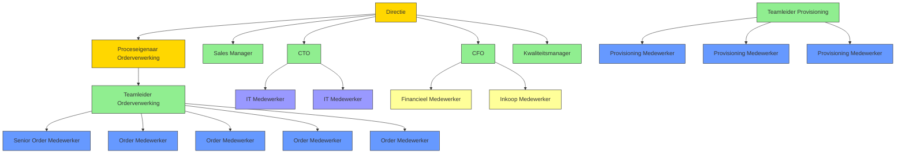

#### 7.6.4.2 Rolverdeling per Processtap (Mermaid)

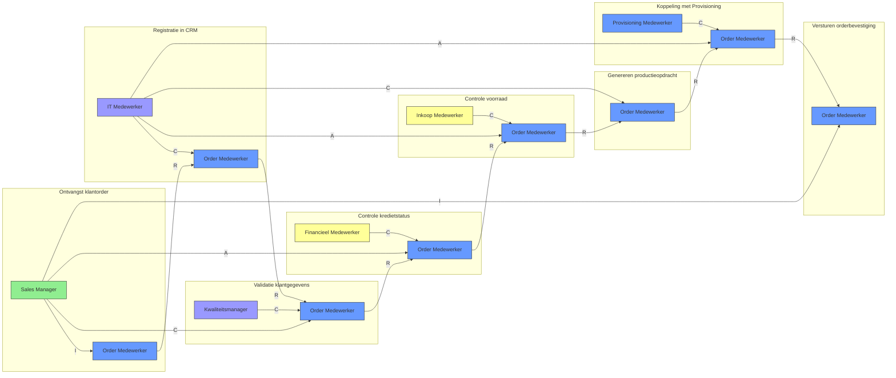

#### 7.6.4.3 Gerelateerde Documenten

- [RACI Matrix](#) (PMD-03.07.03)
- [Procesbeschrijving](#) (PMD-03.07.01)
- [Werkinstructie](#) (PMD-03.07.02)
- [Procesdoel](#) (PMD-03.03.00)
- [Processturing](#) (PMD-03.08.00)

# 8 Procesbesturing

## 8.1 Procesbesturing Master
---
title: Processturing
weight: 7  
description: Template voor het sturen van het Orderverwerkingsproces bij TelecomPro B.V., inclusief KPI's, monitoring, rapportage en kwaliteitsborging.  
type: template  
tags:
- processturing
- KPI
- monitoring
- PDM
- TelecomPro
- Orderverwerking
- 7x Framework
---

### 8.1.1 Inleiding

Dit Processturing-document beschrijft hoe het Orderverwerkingsproces (PR-001) bij TelecomPro B.V. wordt gestuurd, gemonitord en verbeterd. Het doel is om:  
- Prestaties van het proces meetbaar te maken met KPI’s.  
- Real-time inzicht te bieden via monitoring en dashboards.  
- Rapportage te standaardiseren voor transparantie naar stakeholders.  
- Kwaliteitsborging te waarborgen door controles en audits.  
- Continue verbetering te faciliteren met feedback en actieplannen.

### 8.1.2 Eigenschappen

| Veld          | Waarde                                                                        | Toelichting                               |
| ----------------- | --------------------------------------------------------------------------------- | --------------------------------------------- |
| PMD-nummer    | 03.08.00                                                                          | Uniek identificatienummer voor processturing. |
| Versie        | 1.0                                                                               | Huidige versie.                               |
| Status        | Gepubliceerd                                                                      | Status van het document.                      |
| Auteur        | Martin van Pelt                                                                   | Procesanalist.                                |
| Eigenaar      | Jan de Vries                                                                      | Proceseigenaar Operaties.                     |
| Datum         | 19/04/2026                                                                        | Datum van laatste update.                     |
| Gekoppeld aan | KPI's (PMD-03.08.01), Procesdashboard (PMD-03.08.02), Procesreview (PMD-03.08.03) | Gerelateerde documenten.                      |

### 8.1.3 Algemeen Overzicht

| Veld                | Waarde                                                                                                           | Toelichting                  |
| ----------------------- | -------------------------------------------------------------------------------------------------------------------- | -------------------------------- |
| Procesnaam          | Orderverwerking                                                                                                      | Naam van het proces.             |
| Proces-ID           | PR-001                                                                                                               | Unieke identifier.               |
| Doel van de sturing | Zorgen voor tijdige, accurate en efficiënte orderverwerking door monitoring, rapportage en verbeteracties.       | Wat de sturing moet bereiken.    |
| Scope               | Van ontvangst klantorder tot activatie van diensten.                                                                 | Wat valt binnen de scope.        |
| Stakeholders        | Proceseigenaar, Order Team, Sales Manager, IT-afdeling, Kwaliteitsmanager, Financiële Afdeling, Inkoop, Provisioning | Wie is betrokken bij de sturing. |

### 8.1.4 KPI Overzicht

*(Zie ook [KPI's](#) (PMD-03.08.01) voor een gedetailleerd overzicht.)*

| KPI                         | Huidige waarde | Norm (Doelwaarde) | Streefwaarde | Trend | Status | Verantwoordelijke | Bron     | Meetfrequentie |
| ------------------------------- | ------------------ | --------------------- | ---------------- | --------- | ---------- | --------------------- | ------------ | ------------------ |
| Doorlooptijd orderverwerking    | 28 uur             | < 24 uur              | < 12 uur         | ⬆️        | 🔴         | Proceseigenaar        | SAP ERP      | Dagelijks          |
| Aantal fouten per order         | 1,5%               | < 1%                  | < 0,5%           | ⬆️        | 🔴         | Kwaliteitsmanager     | SAP ERP      | Wekelijks          |
| First-time-right                | 95%                | > 98%                 | > 99%            | ⬇️        | 🟡         | Proceseigenaar        | SAP ERP      | Wekelijks          |
| Klanttevredenheid (NPS)         | 8,2                | > 8,5                 | > 9,0            | ⬇️        | 🔴         | Sales Manager         | Klantenquête | Maandelijks        |
| Kosten per order                | €12                | < €10                 | < €8             | ⬆️        | 🔴         | Financiële Afdeling   | SAP ERP      | Maandelijks        |
| Systeembeschikbaarheid          | 99,2%              | > 99,5%               | > 99,9%          | ⬇️        | 🟡         | IT-afdeling           | Nagios       | Continu            |
| Aantal verwerkte orders per dag | 45                 | > 50                  | > 60             | ⬇️        | 🟡         | Teamleider            | SAP ERP      | Dagelijks          |

Legenda Status:

- 🟢 Groen: Norm bereikt of overschreden.
- 🟡 Oranje: Waarschuwing (dicht bij norm, maar niet bereikt).
- 🔴 Rood: Afwijking (norm niet bereikt).

### 8.1.5 Monitoring

#### 8.1.5.1 Dashboards

*(Zie ook [Procesdashboard](#) (PMD-03.08.02) voor een gedetailleerd dashboard.)

| Dashboard             | Doel                                 | Gebruikers                         | Frequentie | Tools       | Verantwoordelijke |
| ------------------------- | ---------------------------------------- | -------------------------------------- | -------------- | --------------- | --------------------- |
| Orderverwerkingsdashboard | Overzicht van KPI’s en procesprestaties. | Proceseigenaar, Order Team, Management | Dagelijks      | Power BI        | Proceseigenaar        |
| Kwaliteitsdashboard       | Overzicht van fouten en verbeterpunten.  | Kwaliteitsmanager, Proceseigenaar      | Wekelijks      | Power BI        | Kwaliteitsmanager     |
| Systeemstatusdashboard    | Overzicht van systeembeschikbaarheid.    | IT-afdeling, Proceseigenaar            | Continu        | Nagios, Grafana | IT-afdeling           |

#### 8.1.5.2 Alerts

| Alert                   | KPI                      | Drempelwaarde | Trigger                      | Actie                 | Verantwoordelijke | Escalatie        | Kanaal        |
| --------------------------- | ---------------------------- | ----------------- | -------------------------------- | ------------------------- | --------------------- | -------------------- | ----------------- |
| Vertraagde orderverwerking  | Doorlooptijd orderverwerking | > 24 uur          | Doorlooptijd overschrijdt norm   | Onderzoek oorzaak         | Proceseigenaar        | Teamleider Operaties | E-mail, Teams     |
| Hoog foutpercentage         | Aantal fouten per order      | > 1%              | Foutpercentage overschrijdt norm | Extra training Order Team | Kwaliteitsmanager     | Proceseigenaar       | E-mail            |
| Lage klanttevredenheid      | Klanttevredenheid (NPS)      | < 8,5             | NPS daalt onder norm             | Klantfeedback analyseren  | Sales Manager         | Directie             | E-mail, Dashboard |
| Hoge kosten per order       | Kosten per order             | > €10             | Kosten overschrijden norm        | Onderzoek kostenposten    | Financiële Afdeling   | Proceseigenaar       | E-mail            |
| Lage systeembeschikbaarheid | Systeembeschikbaarheid       | < 99,5%           | Systeembeschikbaarheid daalt     | IT-onderhoud plannen      | IT-afdeling           | Extern supportteam   | SMS, E-mail       |

#### 8.1.5.3 Rapportage

| Rapportage                   | Frequentie | Inhoud                                         | Doelgroep                          | Verantwoordelijke | Format        | Distributie    |
| -------------------------------- | -------------- | -------------------------------------------------- | -------------------------------------- | --------------------- | ----------------- | ------------------ |
| Dagelijkse procesrapportage      | Dagelijks      | KPI’s, afwijkingen, actiepunten                    | Proceseigenaar, Order Team, Management | Proceseigenaar        | E-mail, Dashboard | E-mail, SharePoint |
| Wekelijkse kwaliteitsrapportage  | Wekelijks      | Foutenanalyse, verbeterpunten                      | Kwaliteitsmanager, Proceseigenaar      | Kwaliteitsmanager     | PDF               | E-mail, Confluence |
| Maandelijkse prestatierapportage | Maandelijks    | KPI-trends, verbeteracties, ROI                    | Management, Directie                   | Proceseigenaar        | Presentatie       | Managementmeeting  |
| Ad-hoc incidentrapportage        | Ad hoc         | Oorzaakanalyse, oplossing, preventieve maatregelen | Betrokken partijen                     | Proceseigenaar        | Word/PDF          | E-mail             |

### 8.1.6 Kwaliteitsborging

### 8.1.7 Controles

| Controle          | Type    | Frequentie | Verantwoordelijke | Methode      | Acceptatiecriteria                |
| --------------------- | ----------- | -------------- | --------------------- | ---------------- | ------------------------------------- |
| Volledigheidscontrole | Handmatig   | Per order      | Order Medewerker      | Visuele controle | Alle verplichte velden zijn ingevuld. |
| Juistheidscontrole    | Automatisch | Per order      | SAP ERP               | Systeemvalidatie | Geen foutmeldingen in het systeem.    |
| Tijdigheidscontrole   | Handmatig   | Dagelijks      | Teamleider            | Tijdsregistratie | Order verwerkt binnen 24 uur.         |
| Systeemcontrole       | Automatisch | Continu        | IT-afdeling           | Nagios           | Systeembeschikbaarheid > 99,5%.       |
| Kredietcontrole       | Automatisch | Per order      | Financiële Afdeling   | SAP ERP          | Kredietstatus is goedgekeurd.         |

#### 8.1.7.1 Audits

| Audit              | Type         | Frequentie | Verantwoordelijke | Scope                | Doel                             | Rapportage        |
| ---------------------- | ---------------- | -------------- | --------------------- | ------------------------ | ------------------------------------ | --------------------- |
| Interne procesaudit    | Interne audit    | Halfjaarlijks  | Kwaliteitsmanager     | Hele proces              | Naleving van processtappen en KPI’s  | Auditrapport          |
| Externe ISO 9001 audit | Externe audit    | Jaarlijks      | Kwaliteitsmanager     | Kwaliteitsmanagement     | Naleving van ISO 9001-normen         | Certificeringsrapport |
| Systeemaudit           | Technische audit | Kwartaallijks  | IT-afdeling           | ERP-systeem, CRM-systeem | Systeemveiligheid en beschikbaarheid | Technisch rapport     |

### 8.1.8 Continue Verbetering

#### 8.1.8.1 Feedback Mechanismen

Mechanisme     | Type                 | Frequentie | Verantwoordelijke | Doel                     | Actie               |
| ------------------ | ------------------------ | -------------- | --------------------- | ---------------------------- | ----------------------- |
| Medewerkerfeedback | Kwalitatief              | Maandelijks    | Teamleider            | Verbeterpunten identificeren | Werkoverleg             |
| Klantfeedback      | Kwalitatief/Kwantitatief | Continu        | Sales Manager         | Klanttevredenheid meten      | Klantenquête, follow-up |
| Systeemfeedback    | Kwantitatief             | Continu        | IT-afdeling           | Systeemprestaties meten      | Monitoring, onderhoud   |
| Procesaudit        | Kwalitatief              | Halfjaarlijks  | Kwaliteitsmanager     | Naleving en verbeterpunten   | Auditrapport, actieplan |

#### 8.1.8.2 Verbeteracties
|Verbeterpunt             | KPI                      | Oorzaak                        | Actie                                   | Verantwoordelijke | Deadline | Status    | Impact                    | Kosten | Prioriteit |
| ---------------------------- | ---------------------------- | ---------------------------------- | ------------------------------------------- | --------------------- | ------------ | ------------- | ----------------------------- | ---------- | -------------- |
| Automatiseren validatiestap  | Doorlooptijd orderverwerking | Handmatige validatie duurt te lang | Implementeer automatische validatie in CRM  | IT-afdeling           | 30/06/2026   | In uitvoering | ⬇️ Doorlooptijd met 50%       | €5.000     | Hoog           |
| Extra training Order Team    | Aantal fouten per order      | Onvoldoende training               | Organiseer training voor nieuwe medewerkers | Kwaliteitsmanager     | 15/05/2026   | Gepland       | ⬇️ Fouten met 30%             | €2.000     | Hoog           |
| Verbeter klantcommunicatie   | Klanttevredenheid (NPS)      | Onduidelijke communicatie          | Implementeer automatische statusupdates     | Sales Manager         | 30/05/2026   | Gepland       | ⬆️ NPS met 0,5 punt           | €1.000     | Hoog           |
| Optimaliseren systeemupdates | Systeembeschikbaarheid       | Planned downtime                   | Verplaats updates naar buiten kantooruren   | IT-afdeling           | 30/04/2026   | In uitvoering | ⬆️ Beschikbaarheid naar 99,5% | €0         | Middel         |
| Kostenanalyse                | Kosten per order             | Onbekende kostenposten             | Onderzoek kostenposten en optimaliseer      | Financiële Afdeling   | 15/06/2026   | Gepland       | ⬇️ Kosten met 10%             | €1.500     | Hoog           |

### 8.2 Visuele Weergave (Mermaid)

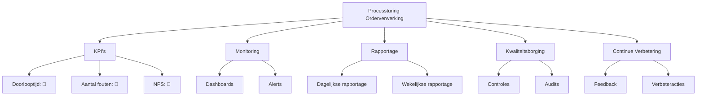

### 8.2.1 Stakeholders en Verantwoordelijkheden|

|Rol               | Verantwoordelijkheid                                                 | Betrokkenheid |
| --------------------- | ------------------------------------------------------------------------ | ----------------- |
| Proceseigenaar    | Verantwoordelijk voor de inhoud en actualiteit van de processturing. | Continu           |
| Procesanalist     | Stelt de processturing op en zorgt voor consistentie.                | Ad hoc            |
| Kwaliteitsmanager | Monitort de kwaliteit en voert audits uit.                           | Periodiek         |
| IT-afdeling       | Ondersteunt bij monitoring en systeembeschikbaarheid.                | Continu           |
| Management        | Valideert de processturing op strategische alignement.               | Periodiek         |
| Order Team        | Voert het proces uit volgens de gedefinieerde sturing.               | Dagelijks         |

### 8.2.2 Gerelateerde Documenten

- [KPI's](#) (PMD-03.08.01)
- [KPI Definitie](#) (PMD-03.08.04)
- [Procesdashboard](#) (PMD-03.08.02)
- [Procesreview](#) (PMD-03.08.03)
- [Procesbeschrijving](#) (PMD-03.07.01)

### 8.2.3 Versiehistorie

| Versie | Datum  | Wijziging   | Auteur      | Goedgekeurd door |
| ---------- | ---------- | --------------- | --------------- | -------------------- |
| 1.0        | 19/04/2026 | Initiële versie | Martin van Pelt | Jan de Vries         |

## 8.3 KPI's

---
title: KPI's - Orderverwerking  
weight: 1  
description: Overzicht van Key Performance Indicators (KPI's) voor het Orderverwerkingsproces bij TelecomPro B.V.  
type: template  
tags:
- KPI
- processturing
- PDM
- TelecomPro
- Orderverwerking
- 7x Framework
- 
### 8.3.1 Inleiding

Dit document biedt een overzicht van KPI’s voor het Orderverwerkingsproces (PR-001) bij TelecomPro B.V.. KPI’s helpen om:  
- Prestaties van het proces objectief meetbaar te maken.  
- Doelen te koppelen aan concrete, meetbare resultaten.  
- Transparantie te creëren voor stakeholders (management, teams, klanten).  
- Continue verbetering te faciliteren door afwijkingen te analyseren en acties te ondernemen.

### 8.3.2 Eigenschappen

| Veld          | Waarde                                                                                 | Toelichting                       |
| ----------------- | ------------------------------------------------------------------------------------------ | ------------------------------------- |
| PMD-nummer    | 03.08.01                                                                                   | Uniek identificatienummer voor KPI's. |
| Versie        | 1.0                                                                                        | Huidige versie.                       |
| Status        | Gepubliceerd                                                                               | Status van het document.              |
| Auteur        | Martin van Pelt                                                                            | Procesanalist.                        |
| Eigenaar      | Jan de Vries                                                                               | Proceseigenaar Operaties.             |
| Datum         | 19/04/2026                                                                                 | Datum van laatste update.             |
| Gekoppeld aan | KPI Definitie (PMD-03.08.04), Processturing (PMD-03.08.00), Procesdashboard (PMD-03.08.02) | Gerelateerde documenten.              |

### 8.3.3 Algemeen Overzicht

| Veld              | Waarde                                                                                    | Toelichting               |
| --------------------- | --------------------------------------------------------------------------------------------- | ----------------------------- |
| Procesnaam        | Orderverwerking                                                                               | Naam van het proces.          |
| Proces-ID         | PR-001                                                                                        | Unieke identifier.            |
| Doel van de KPI’s | Meten van de efficiëntie, kwaliteit, en klanttevredenheid van het Orderverwerkingsproces. | Wat de KPI’s moeten bereiken. |
| Scope             | Van ontvangst klantorder tot activatie van diensten.                                          | Wat valt binnen de scope.     |

### 8.3.4 KPI Overzichtstabel
| KPI                         | Definitie                                                                     | Doel                   | Meetmethode                   | Meetfrequentie | Norm (Doelwaarde) | Streefwaarde | Huidige waarde | Trend | Verantwoordelijke | Bron     | Actie bij afwijking          | Koppeling met strategie                   |
| ------------------------------- | --------------------------------------------------------------------------------- | -------------------------- | --------------------------------- | ------------------ | --------------------- | ---------------- | ------------------ | --------- | --------------------- | ------------ | -------------------------------- | --------------------------------------------- |
| Doorlooptijd orderverwerking    | Gemiddelde tijd tussen ontvangst en bevestiging van een order.                    | Snelle orderafhandeling    | Automatische meting via SAP ERP   | Dagelijks          | < 24 uur              | < 12 uur         | 28 uur             | ⬆️        | Proceseigenaar        | SAP ERP      | Onderzoek oorzaak vertraging     | Ondersteunt doel "Klanttevredenheid verhogen" |
| Aantal fouten per order         | Percentage orders met fouten (onjuiste klantgegevens, verkeerde productselectie). | Minimaliseren van fouten   | Handmatige controle + systeemlogs | Wekelijks          | < 1%                  | < 0,5%           | 1,5%               | ⬆️        | Kwaliteitsmanager     | SAP ERP      | Extra training voor Order Team   | Ondersteunt doel "Kwaliteit verbeteren"       |
| First-time-right                | Percentage orders dat in één keer correct wordt verwerkt.                         | Verhogen efficiëntie       | Systeemmeting (SAP)               | Wekelijks          | > 98%                 | > 99%            | 95%                | ⬇️        | Proceseigenaar        | SAP ERP      | Analyse van fouten               | Ondersteunt doel "Efficiëntie verhogen"       |
| Klanttevredenheid (NPS)         | Net Promoter Score voor orderafhandeling.                                         | Hoge klanttevredenheid     | Klantenquête                      | Maandelijks        | > 8,5                 | > 9,0            | 8,2                | ⬇️        | Sales Manager         | Klantenquête | Klantfeedback analyseren         | Ondersteunt doel "Klanttevredenheid verhogen" |
| Kosten per order                | Gemiddelde kosten voor het verwerken van een order.                               | Efficiënte orderverwerking | Financiële rapportage             | Maandelijks        | < €10                 | < €8             | €12                | ⬆️        | Financiële Afdeling   | SAP ERP      | Onderzoek kostenposten           | Ondersteunt doel "Kosten verlagen"            |
| Systeembeschikbaarheid          | Percentage tijd dat SAP ERP en CRM-systeem beschikbaar zijn.                      | Betrouwbare systeemtoegang | Automatische monitoring           | Continu            | > 99,5%               | > 99,9%          | 99,2%              | ⬇️        | IT-afdeling           | Nagios       | IT-onderhoud plannen             | Ondersteunt doel "Betrouwbaarheid verhogen"   |
| Aantal verwerkte orders per dag | Aantal orders dat dagelijks wordt verwerkt.                                       | Verhogen productiviteit    | Systeemmeting (SAP)               | Dagelijks          | > 50                  | > 60             | 45                 | ⬇️        | Teamleider            | SAP ERP      | Onderzoek capaciteitsbeperkingen | Ondersteunt doel "Productiviteit verhogen"    |

### 8.3.5 KPI Categorisatie

| Categorie   | KPI’s                                                     | Doel                                         |
| --------------- | ------------------------------------------------------------- | ------------------------------------------------ |
| Efficiëntie | Doorlooptijd orderverwerking, Aantal verwerkte orders per dag | Meten van snelheid en productiviteit.        |
| Kwaliteit   | Aantal fouten per order, First-time-right                     | Meten van nauwkeurigheid en betrouwbaarheid. |
| Klant       | Klanttevredenheid (NPS)                                       | Meten van klanttevredenheid.                 |
| Kosten      | Kosten per order                                              | Meten van kostenefficiëntie.                 |
| Systeem     | Systeembeschikbaarheid                                        | Meten van systeembetrouwbaarheid.            |

### 8.3.6 KPI Definities

*(Zie [KPI Definitie](#) (PMD-03.08.04) voor gedetailleerde definities van elke KPI.)*

### 8.3.7 Visuele Weergave (Mermaid)

```mermaid
%% KPI Overzicht - Orderverwerking
graph TD
    A[KPI's Orderverwerking] --> B[Efficiëntie]
    A --> C[Kwaliteit]
    A --> D[Klant]
    A --> E[Kosten]
    A --> F[Systeem]

    B --> B1[Doorlooptijd: 28u]
    B --> B2[Aantal orders/dag: 45]

    C --> C1[Aantal fouten: 1,5%]
    C --> C2[First-time-right: 95%]

    D --> D1[NPS: 8,2]

    E --> E1[Kosten per order: €12]

    F --> F1[Systeembeschikbaarheid: 99,2%]
```

### 8.3.8 Stakeholders en Verantwoordelijkheden

| Rol               | Verantwoordelijkheid                                         | Betrokkenheid |
| --------------------- | ---------------------------------------------------------------- | ----------------- |
| Proceseigenaar    | Verantwoordelijk voor de inhoud en actualiteit van de KPI’s. | Continu           |
| Procesanalist     | Definieert en documenteert de KPI’s.                         | Ad hoc            |
| IT-afdeling       | Levert technische data en ondersteunt bij automatisering.    | Ad hoc            |
| Kwaliteitsmanager | Valideert de KPI’s en zorgt voor datakwaliteit.              | Periodiek         |
| Management        | Valideert de KPI’s op strategische alignement.               | Periodiek         |

### 8.3.9 Gerelateerde Documenten

- [KPI Definitie](#) (PMD-03.08.04)
- [Processturing](#) (PMD-03.08.00)
- [Procesdashboard](#) (PMD-03.08.02)
- [Procesreview](#) (PMD-03.08.03)

### 8.3.10 Versiehistorie

| Versie | Datum  | Wijziging   | Auteur      | Goedgekeurd door |
| ---------- | ---------- | --------------- | --------------- | -------------------- |
| 1.0        | 19/04/2026 | Initiële versie | Martin van Pelt | Jan de Vries         |

## 8.4 KPI Definitie
---
title: KPI Definitie - Doorlooptijd Orderverwerking  
weight: 1  
description: Gedetailleerde definitie van de KPI 'Doorlooptijd Orderverwerking' voor TelecomPro B.V.  
type: template  
tags:
- KPI definitie
- processturing
- PDM
- TelecomPro
- Orderverwerking
- 7x Framework
---

### 8.4.1 Inleiding

Dit document biedt een gedetailleerde definitie van de KPI "Doorlooptijd Orderverwerking" voor het Orderverwerkingsproces (PR-001) bij TelecomPro B.V.. Het doel is om:  
- Duidelijkheid te scheppen over wat de KPI meet en hoe deze wordt berekend.  
- Consistentie te waarborgen in de meting en interpretatie van de KPI.  
- Basis te leggen voor processturing, monitoring, en continue verbetering.

### 8.4.2 Eigenschappen

| Veld          | Waarde                                                                         | Toelichting                               |
| ----------------- | ---------------------------------------------------------------------------------- | --------------------------------------------- |
| PMD-nummer    | 03.08.04                                                                           | Uniek identificatienummer voor KPI-definitie. |
| Versie        | 1.0                                                                                | Huidige versie.                               |
| Status        | Gepubliceerd                                                                       | Status van het document.                      |
| Auteur        | Martin van Pelt                                                                    | Procesanalist.                                |
| Eigenaar      | Jan de Vries                                                                       | Proceseigenaar Operaties.                     |
| Datum         | 19/04/2026                                                                         | Datum van laatste update.                     |
| Gekoppeld aan | KPI's (PMD-03.08.01), Processturing (PMD-03.08.00), Procesdashboard (PMD-03.08.02) | Gerelateerde documenten.                      |

### 8.4.3 Basisgegevens

| Veld       | Waarde                   | Toelichting                                            |
| -------------- | ---------------------------- | ---------------------------------------------------------- |
| KPI-ID     | KPI-001                      | Unieke identifier.                                         |
| KPI naam   | Doorlooptijd Orderverwerking | Naam van de KPI.                                           |
| Procesnaam | Orderverwerking              | Proces waar de KPI toe behoort.                            |
| Proces-ID  | PR-001                       | Referentie naar het proces.                                |
| Categorie  | Efficiëntie                  | Type KPI (Efficiëntie, Kwaliteit, Klant, Kosten, Systeem). |

### 8.4.4 KPI Naam

Doorlooptijd Orderverwerking

### 8.4.5 Definitie

| Veld              | Waarde                                                                                                                                                                                           |
| --------------------- | ---------------------------------------------------------------------------------------------------------------------------------------------------------------------------------------------------- |
| Exacte betekenis  | De gemiddelde tijd in uren tussen het moment waarop een klantorder wordt ontvangen (via webshop, telefoon, of sales) en het moment waarop de orderbevestiging naar de klant wordt verstuurd. |
| Scope             | Alle orders die via de webshop, telefoon, of sales worden ontvangen, exclusief bulkorders (>100 stuks).                                                                                      |
| Doel van de KPI   | Meten van de efficiëntie van het Orderverwerkingsproces.                                                                                                                                         |
| Toepassingsgebied | Order Team, Sales Team, Provisioning.                                                                                                                                                                |

### 8.4.6 Formule

| Veld                | Waarde                                                                                          |
| ----------------------- | --------------------------------------------------------------------------------------------------- |
| Formule             | `(Som van doorlooptijden alle orders) / (Aantal orders)`                                            |
| Eenheid             | uren                                                                                                |
| Berekeningsmethode  | Automatisch via SAP ERP (tijdstempel ontvangst order - tijdstempel versturen orderbevestiging). |
| Voorbeeldberekening | `(24u + 20u + 30u + 25u) / 4 = 24,75u`                                                              |

### 8.4.7 Brondata

| Veld             | Waarde                         |
| -------------------- | ---------------------------------- |
| Bronsysteem      | SAP ERP                            |
| Rapportage       | Dagelijkse KPI-rapportage          |
| Handmatige input | Geen (fully automated)             |
| Data-eigenaar    | IT-afdeling                        |
| Datakwaliteit    | Gevalideerd, real-time, consistent |

### 8.4.8 Norm / Target

| Veld                    | Waarde                                                                    | Toelichting                    |
| --------------------------- | ----------------------------------------------------------------------------- | ---------------------------------- |
| Minimum                 | Niet van toepassing                                                           | -                                  |
| Norm (Doelwaarde)       | < 24 uur                                                                      | Gemiddelde doorlooptijd.           |
| Streefwaarde            | < 12 uur                                                                      | Ambitieuze doelwaarde.             |
| Maximum                 | 48 uur                                                                        | Maximale acceptabele doorlooptijd. |
| Koppeling met strategie | Ondersteunt organisatiedoel "Klanttevredenheid verhogen tot 90% in 2026". | &nbsp;                             |

### 8.4.9 Meetfrequentie

| Veld              | Waarde                   | Toelichting |
| --------------------- | ---------------------------- | --------------- |
| Frequentie        | Dagelijks                    | -               |
| Meetmoment        | Einde van de dag (17:00 uur) | -               |
| Verantwoordelijke | Proceseigenaar               | -               |\

### 8.4.10 Eigenaar

| Veld                  | Waarde                                                    | Toelichting |
| ------------------------- | ------------------------------------------------------------- | --------------- |
| Eigenaar              | Proceseigenaar Orderverwerking (Jan de Vries)                 | -               |
| Verantwoordelijkheden | Meting, analyse, rapportage, verbeteracties                   | -               |
| Contactgegevens       | [jan.devries@telecompro.nl](mailto:jan.devries@telecompro.nl) | -               |

### 8.4.11 Kwaliteitsvoorwaarden

| Veld          | Waarde                                           |
| ----------------- | ---------------------------------------------------- |
| Datakwaliteit | Data moet compleet, accuraat, en real-time zijn. |
| Meetmethode   | Automatische meting via SAP ERP.                 |
| Validatie     | Maandelijkse controle door Kwaliteitsmanager.    |

### 8.4.12 Visuele Weergave (Mermaid)

```mermaid
%% KPI Formule - Doorlooptijd Orderverwerking
graph TD
    A[Starttijd Order] --> B[Eindtijd Orderbevestiging]
    B --> C[Doorlooptijd = Eindtijd - Starttijd]
    C --> D[Gemiddelde = Som doorlooptijden / Aantal orders]
```

### 8.4.13 Gerelateerde Documenten

- [KPI's](#) (PMD-03.08.01)
- [Processturing](#) (PMD-03.08.00)
- [Procesdashboard](#) (PMD-03.08.02)

### 8.4.14 Versiehistorie

| Versie | Datum  | Wijziging   | Auteur      | Goedgekeurd door |
| ---------- | ---------- | --------------- | --------------- | -------------------- |
| 1.0        | 19/04/2026 | Initiële versie | Martin van Pelt | Jan de Vries         |

## 8.5 Procesdashboard
---
title: Procesdashboard - Orderverwerking  
weight: 2  
description: Dashboard voor monitoring en sturing van het Orderverwerkingsproces bij TelecomPro B.V.  
type: template  
tags:

- procesdashboard
- monitoring
- KPI
- PDM
- TelecomPro
- Orderverwerking
- 7x Framework
---

### 8.5.1 Inleiding

Dit Procesdashboard biedt een centrale, visuele weergave van de prestaties, trends, en verbeterpunten van het Orderverwerkingsproces (PR-001) bij TelecomPro B.V.. Het doel is om:  
- Real-time inzicht te bieden in de prestaties van het proces.  
- Trends en patronen te identificeren voor proactieve sturing.  
- Afwijkingen snel te signaleren en acties te ondernemen.  
- Transparantie te creëren voor stakeholders (management, teams, klanten).  
- Basis te leggen voor continue verbetering en datagestuurde besluitvorming.

### 8.5.2 Eigenschappen

| Veld          | Waarde                                                                       | Toelichting                                 |
| ----------------- | -------------------------------------------------------------------------------- | ----------------------------------------------- |
| PMD-nummer    | 03.08.02                                                                         | Uniek identificatienummer voor procesdashboard. |
| Versie        | 1.0                                                                              | Huidige versie.                                 |
| Status        | Gepubliceerd                                                                     | Status van het document.                        |
| Auteur        | Martin van Pelt                                                                  | Procesanalist.                                  |
| Eigenaar      | Jan de Vries                                                                     | Proceseigenaar Operaties.                       |
| Datum         | 19/04/2026                                                                       | Datum van laatste update.                       |
| Gekoppeld aan | KPI's (PMD-03.08.01), Processturing (PMD-03.08.00), KPI Definitie (PMD-03.08.04) | Gerelateerde documenten.                        |

### 8.5.3 Algemeen Overzicht

| Veld                   | Waarde                                                                   | Toelichting                    |
| -------------------------- | ---------------------------------------------------------------------------- | ---------------------------------- |
| Procesnaam             | Orderverwerking                                                              | Naam van het proces.               |
| Proces-ID              | PR-001                                                                       | Unieke identifier.                 |
| Doel van het dashboard | Real-time monitoring van orderverwerkingsprestaties voor proactieve sturing. | Wat het dashboard moet bereiken.   |
| Doelgroep              | Proceseigenaar, Order Team, Management, IT-afdeling, Kwaliteitsmanager       | Voor wie het dashboard bedoeld is. |

### 8.5.4 Dashboard Structuur

Een effectief procesdashboard bevat de volgende onderdelen:

1. KPI-overzicht: Huidige waarden, normen, en trends van KPI's.
2. Visuele weergave: Grafieken, diagrammen, en meters voor snelle interpretatie.
3. Analyse: Diepgaande analyse van trends, afwijkingen, en oorzaken.
4. Verbeteracties: Actiepunten voor het verbeteren van procesprestaties.
5. Alerts: Waarschuwingen voor kritische afwijkingen.

### 8.5.5 KPI Overzicht

| KPI                         | Huidige waarde | Norm | Trend | Status | Verantwoordelijke | Bron     | Laatste meting |
| ------------------------------- | ------------------ | -------- | --------- | ---------- | --------------------- | ------------ | ------------------ |
| Doorlooptijd orderverwerking    | 28 uur             | < 24 uur | ⬆️        | 🔴         | Proceseigenaar        | SAP ERP      | 19/04/2026         |
| Aantal fouten per order         | 1,5%               | < 1%     | ⬆️        | 🔴         | Kwaliteitsmanager     | SAP ERP      | 18/04/2026         |
| First-time-right                | 95%                | > 98%    | ⬇️        | 🟡         | Proceseigenaar        | SAP ERP      | 18/04/2026         |
| Klanttevredenheid (NPS)         | 8,2                | > 8,5    | ⬇️        | 🔴         | Sales Manager         | Klantenquête | 15/04/2026         |
| Kosten per order                | €12                | < €10    | ⬆️        | 🔴         | Financiële Afdeling   | SAP ERP      | 19/04/2026         |
| Systeembeschikbaarheid          | 99,2%              | > 99,5%  | ⬇️        | 🟡         | IT-afdeling           | Nagios       | 19/04/2026         |
| Aantal verwerkte orders per dag | 45                 | > 50     | ⬇️        | 🟡         | Teamleider            | SAP ERP      | 19/04/2026         |

Legenda Status:

- 🟢 Groen: Norm bereikt of overschreden.
- 🟡 Oranje: Waarschuwing (dicht bij norm, maar niet bereikt).
- 🔴 Rood: Afwijking (norm niet bereikt).

### 8.5.6 Visuele Weergave

#### 8.5.6.1 KPI Meter (Mermaid)

```mermaid
%% KPI Meter - Orderverwerking
graph TD
    A[KPI Status Overzicht] --> B[Doorlooptijd: 🔴]
    A --> C[Aantal fouten: 🔴]
    A --> D[First-time-right: 🟡]
    A --> E[NPS: 🔴]
    A --> F[Kosten per order: 🔴]
    A --> G[Systeembeschikbaarheid: 🟡]
    A --> H[Aantal orders/dag: 🟡]

    B --> B1[28u / Norm: <24u]
    C --> C1[1,5% / Norm: <1%]
    D --> D1[95% / Norm: >98%]
    E --> E1[8,2 / Norm: >8,5]
    F --> F1[€12 / Norm: <€10]
    G --> G1[99,2% / Norm: >99,5%]
    H --> H1[45 / Norm: >50]
```

#### 8.5.6.2 Trendgrafiek (Mermaid)

```mermaid
%% Trendgrafiek - Doorlooptijd Orderverwerking
graph LR
    A[Jan] -->|22u| B[Feb]
    B -->|24u| C[Mrt]
    C -->|26u| D[Apr]
    D -->|28u| E[Mei]

    style A fill:#90EE90,stroke:#333
    style B fill:#90EE90,stroke:#333
    style C fill:#FFD700,stroke:#333
    style D fill:#FF6347,stroke:#333
    style E fill:#FF6347,stroke:#333
```

#### 8.5.6.3 Pareto-diagram (Mermaid)

```mermaid
%% Pareto-diagram - Knelpunten Orderverwerking
graph TD
    A[Knelpunten] --> B[Handmatige validatie: 40%]
    A --> C[Onvoldoende training: 30%]
    A --> D[Systeemstoringen: 20%]
    A --> E[Onjuiste klantgegevens: 10%]

    style B fill:#FF6347,stroke:#333
    style C fill:#FFD700,stroke:#333
    style D fill:#90EE90,stroke:#333
    style E fill:#90EE90,stroke:#333
```

### 8.5.7 Analyse

#### 8.5.7.1 Trendanalyse

| KPI                      | Trend | Oorzaak              | Impact               | Root Cause            | Onderbouwing                                 |
| ---------------------------- | --------- | ------------------------ | ------------------------ | ------------------------- | ------------------------------------------------ |
| Doorlooptijd orderverwerking | ⬆️        | Handmatige validatiestap | Vertraging in levering   | Gebrek aan automatisering | Handmatige validatie duurt gemiddeld 30 minuten. |
| Aantal fouten per order      | ⬆️        | Onvoldoende training     | Onjuiste orderverwerking | Gebrek aan kennis         | Nieuwe medewerkers zijn niet voldoende getraind. |
| First-time-right             | ⬇️        | Onjuiste klantgegevens   | Herwerk nodig            | Gebrek aan validatie      | Geen automatische controle op klantgegevens.     |
| Klanttevredenheid (NPS)      | ⬇️        | Vertraagde levering      | Lagere klanttevredenheid | Hoge doorlooptijd         | Klanten klagen over late leveringen.             |
| Kosten per order             | ⬆️        | Onbekende kostenposten   | Hogere kosten            | Gebrek aan inzicht        | Geen gedetailleerde kostenanalyse.               |

#### 8.5.7.2 Correlatieanalyse

| KPI 1                    | KPI 2                    | Correlatie | Uitleg                                                    |
| ---------------------------- | ---------------------------- | -------------- | ------------------------------------------------------------- |
| Doorlooptijd orderverwerking | Klanttevredenheid (NPS)      | Negatief       | Langere doorlooptijd leidt tot lagere klanttevredenheid.      |
| Aantal fouten per order      | First-time-right             | Negatief       | Meer fouten leiden tot lagere first-time-right.               |
| Systeembeschikbaarheid       | Doorlooptijd orderverwerking | Negatief       | Lagere systeembeschikbaarheid leidt tot langere doorlooptijd. |

### 8.5.8 Verbeteracties

| Verbeterpunt             | KPI                      | Oorzaak               | Actie                                   | Verantwoordelijke | Deadline | Status    | Impact                    | Kosten | Prioriteit |
| ---------------------------- | ---------------------------- | ------------------------- | ------------------------------------------- | --------------------- | ------------ | ------------- | ----------------------------- | ---------- | -------------- |
| Automatiseren validatiestap  | Doorlooptijd orderverwerking | Handmatige validatie      | Implementeer automatische validatie in CRM  | IT-afdeling           | 30/06/2026   | In uitvoering | ⬇️ Doorlooptijd met 50%       | €5.000     | Hoog           |
| Extra training Order Team    | Aantal fouten per order      | Onvoldoende training      | Organiseer training voor nieuwe medewerkers | Kwaliteitsmanager     | 15/05/2026   | Gepland       | ⬇️ Fouten met 30%             | €2.000     | Hoog           |
| Verbeter klantcommunicatie   | Klanttevredenheid (NPS)      | Onduidelijke communicatie | Implementeer automatische statusupdates     | Sales Manager         | 30/05/2026   | Gepland       | ⬆️ NPS met 0,5 punt           | €1.000     | Hoog           |
| Optimaliseren systeemupdates | Systeembeschikbaarheid       | Planned downtime          | Verplaats updates naar buiten kantooruren   | IT-afdeling           | 30/04/2026   | In uitvoering | ⬆️ Beschikbaarheid naar 99,5% | €0         | Middel         |
| Kostenanalyse                | Kosten per order             | Onbekende kostenposten    | Onderzoek kostenposten en optimaliseer      | Financiële Afdeling   | 15/06/2026   | Gepland       | ⬇️ Kosten met 10%             | €1.500     | Hoog           |

### 8.5.9 Alerts en Waarschuwingen

| Alert                   | KPI                      | Drempelwaarde | Trigger                      | Actie                | Verantwoordelijke | Escalatie        | Kanaal        |
| --------------------------- | ---------------------------- | ----------------- | -------------------------------- | ------------------------ | --------------------- | -------------------- | ----------------- |
| Vertraagde orderverwerking  | Doorlooptijd orderverwerking | > 24 uur          | Doorlooptijd overschrijdt norm   | Onderzoek oorzaak        | Proceseigenaar        | Teamleider Operaties | E-mail, Teams     |
| Hoog foutpercentage         | Aantal fouten per order      | > 1%              | Foutpercentage overschrijdt norm | Extra training           | Kwaliteitsmanager     | Proceseigenaar       | E-mail            |
| Lage klanttevredenheid      | Klanttevredenheid (NPS)      | < 8,5             | NPS daalt onder norm             | Klantfeedback analyseren | Sales Manager         | Directie             | E-mail, Dashboard |
| Hoge kosten per order       | Kosten per order             | > €10             | Kosten overschrijden norm        | Onderzoek kostenposten   | Financiële Afdeling   | Proceseigenaar       | E-mail            |
| Lage systeembeschikbaarheid | Systeembeschikbaarheid       | < 99,5%           | Systeembeschikbaarheid daalt     | IT-onderhoud plannen     | IT-afdeling           | Extern supportteam   | SMS, E-mail       |

### 8.5.10 Stakeholders en Verantwoordelijkheden

| Rol               | Verantwoordelijkheid                                              | Betrokkenheid |
| --------------------- | --------------------------------------------------------------------- | ----------------- |
| Proceseigenaar    | Verantwoordelijk voor de inhoud en actualiteit van het dashboard. | Continu           |
| Procesanalist     | Stelt het dashboard op en voert analyses uit.                     | Ad hoc            |
| Kwaliteitsmanager | Monitort KPI's en voert verbeteracties uit.                       | Periodiek         |
| IT-afdeling       | Ondersteunt bij automatisering en tooling.                        | Ad hoc            |
| Management        | Gebruikt het dashboard voor strategische besluitvorming.          | Periodiek         |
| Order Team        | Levert data voor het dashboard.                                   | Dagelijks         |

### 8.5.11 Gerelateerde Documenten

- [KPI's](#) (PMD-03.08.01)
- [KPI Definitie](#) (PMD-03.08.04)
- [Processturing](#) (PMD-03.08.00)

### 8.5.12 Versiehistorie

| Versie | Datum  | Wijziging   | Auteur      | Goedgekeurd door |
| ---------- | ---------- | --------------- | --------------- | -------------------- |
| 1.0        | 19/04/2026 | Initiële versie | Martin van Pelt | Jan de Vries         |

## 8.6 Procesreview
---
title: Procesreview - Orderverwerking  
weight: 3  
description: Template voor het uitvoeren van een procesreview voor het Orderverwerkingsproces bij TelecomPro B.V.  
type: template  
tags:
- procesreview
- processturing
- PDM
- TelecomPro
- Orderverwerking
- 7x Framework
---

### 8.6.1 Inleiding

Dit Procesreview-template biedt een gestructureerde aanpak voor het evalueren en verbeteren van het Orderverwerkingsproces (PR-001) bij TelecomPro B.V.. Het doel is om:  
- Prestaties van het proces objectief te beoordelen op basis van KPI's en bevindingen.  
- Knippunten en kansen voor verbetering te identificeren.  
- Actieplannen op te stellen voor continue verbetering.  
- Verantwoordelijkheid en follow-up te waarborgen voor het implementeren van verbeteringen.  
- Transparantie te creëren voor stakeholders (management, teams, klanten).

### 8.6.2 Eigenschappen

| Veld          | Waarde                                                                         | Toelichting                              |
| ----------------- | ---------------------------------------------------------------------------------- | -------------------------------------------- |
| PMD-nummer    | 03.08.03                                                                           | Uniek identificatienummer voor procesreview. |
| Versie        | 1.0                                                                                | Huidige versie.                              |
| Status        | Gepubliceerd                                                                       | Status van het document.                     |
| Auteur        | Martin van Pelt                                                                    | Procesanalist.                               |
| Eigenaar      | Jan de Vries                                                                       | Proceseigenaar Operaties.                    |
| Datum         | 19/04/2026                                                                         | Datum van laatste update.                    |
| Gekoppeld aan | KPI's (PMD-03.08.01), Processturing (PMD-03.08.00), Procesdashboard (PMD-03.08.02) | Gerelateerde documenten.                     |

### 8.6.3 Algemeen Overzicht

| Veld               | Waarde                                                          | Toelichting                       |
| ---------------------- | ------------------------------------------------------------------- | ------------------------------------- |
| Procesnaam         | Orderverwerking                                                     | Naam van het proces.                  |
| Proces-ID          | PR-001                                                              | Unieke identifier.                    |
| Datum review       | 19/04/2026                                                          | Datum waarop de review is uitgevoerd. |
| Type review        | Maandelijkse review                                                 | Type review.                          |
| Doel van de review | Evaluatie van procesprestaties en identificatie van verbeterpunten. | Wat de review moet bereiken.          |
| Scope              | Hele proces van ontvangst tot bevestiging van orders.               | Wat valt binnen de scope.             |

### 8.6.4 Voorbereiding

| Veld                 | Waarde                                                                                                                |
| ------------------------ | ------------------------------------------------------------------------------------------------------------------------- |
| Benodigde documenten | Procesbeschrijving (PMD-03.07.01), KPI-rapport (PMD-03.08.01), Procesdashboard (PMD-03.08.02), RACI Matrix (PMD-03.07.03) |
| Benodigde data       | KPI-waarden, proceslogs, klantfeedback, systeemdata                                                                       |
| Betrokken partijen   | Proceseigenaar, Procesanalist, Kwaliteitsmanager, IT-afdeling, Sales Manager, Teamleider Orderverwerking                  |
| Agenda               | KPI-prestaties, bevindingen, verbeteracties, actieplan                                                                    |

### 8.6.5 KPI Prestaties

| KPI                         | Huidige waarde | Norm | Trend | Status | Afwijking | Oorzaak              | Impact               |
| ------------------------------- | ------------------ | -------- | --------- | ---------- | ------------- | ------------------------ | ------------------------ |
| Doorlooptijd orderverwerking    | 28 uur             | < 24 uur | ⬆️        | 🔴         | +4 uur        | Handmatige validatiestap | Vertraging in levering   |
| Aantal fouten per order         | 1,5%               | < 1%     | ⬆️        | 🔴         | +0,5%         | Onvoldoende training     | Onjuiste orderverwerking |
| First-time-right                | 95%                | > 98%    | ⬇️        | 🟡         | -3%           | Onjuiste klantgegevens   | Herwerk nodig            |
| Klanttevredenheid (NPS)         | 8,2                | > 8,5    | ⬇️        | 🔴         | -0,3          | Vertraagde levering      | Lagere klanttevredenheid |
| Kosten per order                | €12                | < €10    | ⬆️        | 🔴         | +€2           | Onbekende kostenposten   | Hogere kosten            |
| Systeembeschikbaarheid          | 99,2%              | > 99,5%  | ⬇️        | 🟡         | -0,3%         | Planned downtime         | Onderbreking van proces  |
| Aantal verwerkte orders per dag | 45                 | > 50     | ⬇️        | 🟡         | -5            | Capaciteitsbeperkingen   | Lagere productiviteit    |

Legenda Status:

- 🟢 Groen: Norm bereikt of overschreden.
- 🟡 Oranje: Waarschuwing (dicht bij norm, maar niet bereikt).
- 🔴 Rood: Afwijking (norm niet bereikt).

### 8.6.6 Bevindingen

#### 8.6.6.1 Positieve Bevindingen

| Bevinding                 | Beschrijving                                          | Oorzaak                           | Impact                                 |
| ----------------------------- | --------------------------------------------------------- | ------------------------------------- | ------------------------------------------ |
| Automatische orderbevestiging | Orderbevestigingen worden automatisch verstuurd.          | Geïmplementeerd in Salesforce CRM     | Vermindering van handmatig werk.           |
| Hoog opgeleid Order Team      | Order Team heeft ervaring met CRM en ERP.                 | Interne training en werving           | Efficiënte orderverwerking.                |
| Goede samenwerking IT         | IT-afdeling is proactief betrokken bij procesverbetering. | Duidelijke communicatie en prioriteit | Snelle oplossing van technische problemen. |

#### 8.6.6.2 Negatieve Bevindingen (Verbeterpunten)

| Bevinding               | Beschrijving                               | Oorzaak (5 Why's)                                                                                                                                | Impact               | Prioriteit |
| --------------------------- | ---------------------------------------------- | ---------------------------------------------------------------------------------------------------------------------------------------------------- | ------------------------ | -------------- |
| Vertraagde orderverwerking  | Doorlooptijd is gestegen van 24u naar 28u.     | 1. Handmatige validatiestap. 2. Geen automatisering. 3. Beperkte IT-capaciteit. 4. Geen budget voor automatisering. 5. Geen business case opgesteld. | Vertraging in levering   | Hoog           |
| Hoog foutpercentage         | Aantal fouten per order is gestegen naar 1,5%. | 1. Onvoldoende training. 2. Nieuwe medewerkers. 3. Geen gestandaardiseerde werkwijze. 4. Geen checklists. 5. Geen kwaliteitscontroles.               | Onjuiste orderverwerking | Hoog           |
| Lage klanttevredenheid      | NPS is gedaald naar 8,2.                       | 1. Vertraagde levering. 2. Onjuiste orders. 3. Gebrek aan communicatie. 4. Geen proactieve updates. 5. Geen klantfeedbackmechanisme.                 | Lagere klanttevredenheid | Hoog           |
| Hoge kosten per order       | Kosten per order zijn gestegen naar €12.       | 1. Onbekende kostenposten. 2. Gebrek aan kostenanalyse. 3. Geen inzicht in proceskosten.                                                             | Hogere kosten            | Hoog           |
| Lage systeembeschikbaarheid | Systeembeschikbaarheid is gedaald naar 99,2%.  | 1. Planned downtime. 2. Systeemupdates. 3. Gebrek aan monitoring.                                                                                    | Onderbreking van proces  | Middel         |

### 8.6.7 SWOT-analyse
| Categorie    | Beschrijving                | Impact               | Actie                     |
| ---------------- | ------------------------------- | ------------------------ | ----------------------------- |
| Sterktes     | Automatische orderbevestiging   | Efficiëntie              | Behoud en optimaliseer.       |
| Sterktes     | Hoog opgeleid Order Team        | Kwaliteit                | Investeer in training.        |
| Sterktes     | Goede samenwerking IT           | Snelle probleemoplossing | Behoud goede samenwerking.    |
| Zwaktes      | Handmatige validatiestap        | Vertraging               | Automatiseren.                |
| Zwaktes      | Onvoldoende training            | Fouten                   | Organiseer training.          |
| Zwaktes      | Gebrek aan real-time monitoring | Gebrek aan inzicht       | Implementeer dashboard.       |
| Kansen       | Nieuwe CRM-functionaliteiten    | Efficiëntie              | Benutten voor automatisering. |
| Kansen       | Groeiende markt                 | Omzet                    | Schaal proces op.             |
| Bedreigingen | Concurrentie                    | Marktpositie             | Differentiëren op kwaliteit.  |
| Bedreigingen | Systeemveroudering              | Betrouwbaarheid          | Upgraden systeem.             |

### 8.6.8 Verbeterinitiatieven

| Initiatief               | Doel                        | Knelpunt/Trend      | Methode                                  | Verantwoordelijke | Budget | Tijdsduur | Verwachte impact          | Prioriteit |
| ---------------------------- | ------------------------------- | ----------------------- | -------------------------------------------- | --------------------- | ---------- | ------------- | ----------------------------- | -------------- |
| Automatiseren validatiestap  | Verminderen doorlooptijd        | Handmatige validatie    | Implementeer automatische validatie in CRM.  | IT-afdeling           | €5.000     | 2 maanden     | ⬇️ Doorlooptijd met 50%       | Hoog           |
| Training Order Team          | Verminderen fouten              | Onvoldoende training    | Organiseer training voor nieuwe medewerkers. | Kwaliteitsmanager     | €2.000     | 1 maand       | ⬇️ Fouten met 30%             | Hoog           |
| Verbeter klantcommunicatie   | Verhogen klanttevredenheid      | Gebrek aan communicatie | Implementeer automatische statusupdates.     | Sales Manager         | €1.000     | 1 maand       | ⬆️ NPS met 0,5 punt           | Hoog           |
| Kostenanalyse                | Verlagen kosten per order       | Onbekende kostenposten  | Onderzoek kostenposten en optimaliseer.      | Financiële Afdeling   | €1.500     | 1 maand       | ⬇️ Kosten met 10%             | Hoog           |
| Optimaliseren systeemupdates | Verhogen systeembeschikbaarheid | Planned downtime        | Verplaats updates naar buiten kantooruren.   | IT-afdeling           | €0         | 1 maand       | ⬆️ Beschikbaarheid naar 99,5% | Middel         |

### 8.6.9 Verbeteracties

| Actie                      | Initiatief              | Beschrijving                                      | Verantwoordelijke | Startdatum | Deadline | Status | Afhankelijkheden        | Risico's                     | Mitigerende maatregelen | Succescriteria               |
| ------------------------------ | --------------------------- | ----------------------------------------------------- | --------------------- | -------------- | ------------ | ---------- | --------------------------- | -------------------------------- | --------------------------- | -------------------------------- |
| Ontwerp automatische validatie | Automatiseren validatiestap | Ontwikkel automatische validatieregels in CRM.        | IT-afdeling           | 01/05/2026     | 15/05/2026   | Gepland    | Budgetgoedkeuring           | Vertraging door andere projecten | Prioriteit verhogen         | Validatieregels werken foutloos. |
| Implementeer validatie         | Automatiseren validatiestap | Implementeer validatieregels in productie.            | IT-afdeling           | 16/05/2026     | 30/06/2026   | Gepland    | Ontwerp validatie           | Technische issues                | Test in sandbox-omgeving    | Validatie werkt in productie.    |
| Organiseer training            | Training Order Team         | Plan en voer training uit voor nieuwe medewerkers.    | Kwaliteitsmanager     | 01/05/2026     | 15/05/2026   | Gepland    | Beschikbaarheid trainers    | Lage opkomst                     | Verplichte training         | Alle medewerkers getraind.       |
| Implementeer notificaties      | Verbeter klantcommunicatie  | Ontwikkel en implementeer automatische statusupdates. | Sales Manager         | 01/05/2026     | 30/05/2026   | Gepland    | IT-ondersteuning            | Technische beperkingen           | Pilot testen                | Notificaties werken foutloos.    |
| Onderzoek kostenposten         | Kostenanalyse               | Analyseer kostenposten en optimaliseer.               | Financiële Afdeling   | 01/05/2026     | 15/06/2026   | Gepland    | Toegang tot financiële data | Onvolledige data                 | Gebruik SAP ERP             | Kosten per order < €10.          |

### 8.6.10 Actieplan

| Actie                      | Verantwoordelijke | Startdatum | Deadline | Status | Afhankelijkheden        | Risico's                     | Mitigerende maatregelen |
| ------------------------------ | --------------------- | -------------- | ------------ | ---------- | --------------------------- | -------------------------------- | --------------------------- |
| Ontwerp automatische validatie | IT-afdeling           | 01/05/2026     | 15/05/2026   | Gepland    | Budgetgoedkeuring           | Vertraging door andere projecten | Prioriteit verhogen         |
| Implementeer validatie         | IT-afdeling           | 16/05/2026     | 30/06/2026   | Gepland    | Ontwerp validatie           | Technische issues                | Test in sandbox-omgeving    |
| Organiseer training            | Kwaliteitsmanager     | 01/05/2026     | 15/05/2026   | Gepland    | Beschikbaarheid trainers    | Lage opkomst                     | Verplichte training         |
| Implementeer notificaties      | Sales Manager         | 01/05/2026     | 30/05/2026   | Gepland    | IT-ondersteuning            | Technische beperkingen           | Pilot testen                |
| Onderzoek kostenposten         | Financiële Afdeling   | 01/05/2026     | 15/06/2026   | Gepland    | Toegang tot financiële data | Onvolledige data                 | Gebruik SAP ERP             |

### 8.6.11 Follow-up

| Veld                        | Waarde                                                                                |
| ------------------------------- | ----------------------------------------------------------------------------------------- |
| Follow-up frequentie        | Wekelijks                                                                                 |
| Verantwoordelijke follow-up | Proceseigenaar                                                                            |
| Rapportage                  | Wekelijkse statusupdate via e-mail                                                        |
| Escalatiepad                | Proceseigenaar → Teamleider → Directie                                                    |
| Afsluiting                  | Review wordt afgerond wanneer alle acties zijn geïmplementeerd en KPI's de norm bereiken. |

### 8.6.12 Visuele Weergave (Mermaid)

```mermaid
graph TD
    A[Procesreview Orderverwerking] --> B[KPI Prestaties]
    A --> C[Bevindingen]
    A --> D[Verbeterinitiatieven]
    A --> E[Verbeteracties]

    B --> B1[Doorlooptijd: 🔴]
    B --> B2[Aantal fouten: 🔴]
    B --> B3[NPS: 🔴]

    C --> C1[Positief: Automatische bevestiging]
    C --> C2[Negatief: Vertraagde verwerking]

    D --> D1[Automatiseren validatie]
    D --> D2[Training Order Team]

    E --> E1[Ontwerp validatie]
    E --> E2[Implementeer validatie]
```

### 8.6.13 Stakeholders en Verantwoordelijkheden

| Rol               | Verantwoordelijkheid                                            | Betrokkenheid |
| --------------------- | ------------------------------------------------------------------- | ----------------- |
| Proceseigenaar    | Verantwoordelijk voor de uitvoering en follow-up van de review. | Continu           |
| Procesanalist     | Voert de review uit en documenteert bevindingen.                | Ad hoc            |
| Kwaliteitsmanager | Evalueert KPI-prestaties en stelt verbeteracties voor.          | Periodiek         |
| IT-afdeling       | Levert technische data en ondersteunt bij verbeteracties.       | Ad hoc            |
| Management        | Valideert de review en goedgekeurt verbeteracties.              | Periodiek         |
| Order Team        | Levert input voor de review en voert verbeteracties uit.        | Ad hoc            |

### 8.6.14 Gerelateerde Documenten

- [KPI's](#) (PMD-03.08.01)
- [Processturing](#) (PMD-03.08.00)
- [Procesdashboard](#) (PMD-03.08.02)
- [KPI Definitie](#) (PMD-03.08.04)

### 8.6.15 Versiehistorie

| Versie | Datum  | Wijziging   | Auteur      | Goedgekeurd door |
| ---------- | ---------- | --------------- | --------------- | -------------------- |
| 1.0        | 19/04/2026 | Initiële versie | Martin van Pelt | Jan de Vries         |

# 9 Procesverbetering
## 9.1 Procesverbetering Master
---
title: Procesverbetering 
weight: 8  
description: Template voor het analyseren en verbeteren van het Orderverwerkingsproces bij TelecomPro B.V., inclusief procesanalyse, verbeterinitiatieven, verbeteracties en lessons learned.  
type: template  
tags:
- procesverbetering
- Lean Six Sigma
- DMAIC
- PDCA
- PDM
- TelecomPro
- Orderverwerking
- 7x Framework
---

### 9.1.1 Inleiding

Dit Procesverbetering-template biedt een gestructureerde aanpak voor het analyseren, verbeteren, en optimaliseren van het Orderverwerkingsproces (PR-001) bij TelecomPro B.V.. Het doel is om:  
- Knelpunten en inefficiënties in het proces te identificeren en op te lossen.  
- Datagestuurde verbeterinitiatieven te ontwikkelen op basis van trends, analyses, en root causes.  
- Concrete verbeteracties te definieren met duidelijke verantwoordelijkheden en deadlines.  
- Lessons learned vast te leggen voor toekomstige verbeteringen.  
- Continue verbetering te waarborgen door feedback en evaluatie.

### 9.1.2 Eigenschappen

| Veld          | Waarde                                                                                        | Toelichting                                   |
| ----------------- | ------------------------------------------------------------------------------------------------- | ------------------------------------------------- |
| PMD-nummer    | 03.09.00                                                                                          | Uniek identificatienummer voor procesverbetering. |
| Versie        | 1.0                                                                                               | Huidige versie.                                   |
| Status        | Gepubliceerd                                                                                      | Status van het document.                          |
| Auteur        | Martin van Pelt                                                                                   | Procesanalist.                                    |
| Eigenaar      | Jan de Vries                                                                                      | Proceseigenaar Operaties.                         |
| Datum         | 19/04/2026                                                                                        | Datum van laatste update.                         |
| Gekoppeld aan | Root Cause Analyse (PMD-03.09.01), Procesverbeterplan (PMD-03.09.02), Procesreview (PMD-03.08.03) | Gerelateerde documenten.                          |

### 9.1.3 Algemeen Overzicht

| Veld                    | Waarde                                                                                                                   | Toelichting                                     |
| --------------------------- | ---------------------------------------------------------------------------------------------------------------------------- | --------------------------------------------------- |
| Procesnaam              | Orderverwerking                                                                                                              | Naam van het proces.                                |
| Proces-ID               | PR-001                                                                                                                       | Unieke identifier.                                  |
| Doel van de verbetering | Verminderen van doorlooptijd en fouten in de orderverwerking door automatisering, training, en procesoptimalisatie.          | Wat de verbetering moet bereiken.                   |
| Scope                   | Hele proces van ontvangst tot bevestiging van orders.                                                                        | Wat valt binnen de scope.                           |
| Betrokken partijen      | Proceseigenaar, Procesanalist, IT-afdeling, Kwaliteitsmanager, Order Team, Sales Manager, Financiële Afdeling                | Wie is betrokken bij de verbetering.                |
| Koppeling met strategie | Ondersteunt organisatiedoelen "Klanttevredenheid verhogen tot 90% in 2026" en "Kosten per order verlagen naar <€10". | Hoe de verbetering bijdraagt aan organisatiedoelen. |

### 9.1.4 Procesanalyse

#### 9.1.4.1 Trends

Analyseer hier langetermijntrends in de procesprestaties op basis van KPI-data uit de Processturing (PMD-03.08.00) en Procesdashboard (PMD-03.08.02).

| Trend                  | KPI                      | Periode | Waarde begin | Waarde einde | Verandering | Oorzaak                                   | Impact                                       |
| -------------------------- | ---------------------------- | ----------- | ---------------- | ---------------- | --------------- | --------------------------------------------- | ------------------------------------------------ |
| Stijgende doorlooptijd     | Doorlooptijd orderverwerking | Q1 2026     | 22 uur           | 28 uur           | +6 uur (+27%)   | Handmatige validatiestap, systeemvertragingen | Vertraging in levering, lagere klanttevredenheid |
| Dalende klanttevredenheid  | Klanttevredenheid (NPS)      | Q1 2026     | 8,5              | 8,2              | -0,3 (-3,5%)    | Vertraagde levering, onjuiste orders          | Lagere klantretentie                             |
| Stijgend foutpercentage    | Aantal fouten per order      | Q1 2026     | 1,0%             | 1,5%             | +0,5% (+50%)    | Onvoldoende training, gebrek aan validatie    | Herwerk nodig, hogere kosten                     |
| Stijgende kosten per order | Kosten per order             | Q1 2026     | €10              | €12              | +€2 (+20%)      | Onbekende kostenposten, inefficiënties        | Lagere winstmarges                               |
| Dalende first-time-right   | First-time-right             | Q1 2026     | 98%              | 95%              | -3%             | Onjuiste klantgegevens, handmatige fouten     | Extra werk voor correctie                        |

#### 9.1.4.2 Knelpunten

Identificeer hier de belangrijkste knelpunten in het proces. Gebruik de 5 Why's-methode om root causes te achterhalen.\

| Knelpunt                    | Beschrijving                                                  | Oorzaak (5 Why's)                                                                                                                                       | Impact                                     | Prioriteit | Gerelateerde KPI         |
| ------------------------------- | ----------------------------------------------------------------- | ----------------------------------------------------------------------------------------------------------------------------------------------------------- | ---------------------------------------------- | -------------- | ---------------------------- |
| Handmatige validatiestap        | Validatie van klantgegevens duurt gemiddeld 30 minuten per order. | 1. Handmatige stappen in validatie. 2. Geen automatisering. 3. Beperkte IT-capaciteit. 4. Geen budget voor automatisering. 5. Geen business case opgesteld. | Vertraging in orderverwerking, hogere kosten   | Hoog           | Doorlooptijd orderverwerking |
| Onvoldoende training            | Nieuwe medewerkers zijn niet voldoende getraind in CRM en ERP.    | 1. Gebrek aan training. 2. Hoge werkdruk. 3. Geen gestandaardiseerde werkwijze. 4. Geen checklists. 5. Geen kwaliteitscontroles.                            | Onjuiste orderverwerking, hoger foutpercentage | Hoog           | Aantal fouten per order      |
| Gebrek aan real-time monitoring | Geen real-time inzicht in procesprestaties.                       | 1. Geen dashboard ingericht. 2. Geen automatische rapportage. 3. Beperkte IT-resources. 4. Geen prioriteit voor monitoring.                                 | Gebrek aan inzicht, vertraagde acties          | Middel         | Alle KPI's                   |
| Onjuiste klantgegevens          | Klantgegevens zijn vaak onjuist of onvolledig.                    | 1. Geen automatische validatie. 2. Handmatige invoer. 3. Gebrek aan controles. 4. Geen feedbackloop.                                                        | Herwerk nodig, vertraging                      | Hoog           | First-time-right             |
| Systeemvertragingen             | SAP ERP en CRM-systeem vertragen het proces.                      | 1. Verouderde systemen. 2. Gebrek aan onderhoud. 3. Geen updates. 4. Beperkte IT-budget.                                                                    | Vertraging in orderverwerking                  | Hoog           | Doorlooptijd orderverwerking |

#### 9.1.4.3 SWOT-analyse

Voer hier een SWOT-analyse uit om sterktes, zwaktes, kansen, en bedreigingen in kaart te brengen.

| Categorie    | Beschrijving                                     | Impact | Actie                                      |
| ---------------- | ---------------------------------------------------- | ---------- | ---------------------------------------------- |
| Sterktes     | Ervaren Order Team met kennis van CRM en ERP.        | Hoog       | Behoud en train nieuwe medewerkers.            |
| Sterktes     | Automatische orderbevestiging in Salesforce CRM.     | Hoog       | Behoud en breid uit naar andere stappen.       |
| Sterktes     | Goede samenwerking tussen Order Team en IT-afdeling. | Hoog       | Behoud goede communicatie.                     |
| Zwaktes      | Handmatige validatiestap in orderverwerking.         | Hoog       | Automatiseren validatie.                       |
| Zwaktes      | Onvoldoende training voor nieuwe medewerkers.        | Hoog       | Organiseer training.                           |
| Zwaktes      | Gebrek aan real-time monitoring van KPI’s.           | Middel     | Implementeer Procesdashboard.                  |
| Kansen       | Nieuwe functionaliteiten in Salesforce CRM.          | Hoog       | Benutten voor automatisering.                  |
| Kansen       | Groeiende vraag naar telecomdiensten.                | Hoog       | Schaal proces op.                              |
| Kansen       | Automatisering van repetitieve taken.                | Hoog       | Implementeer RPA (Robotic Process Automation). |
| Bedreigingen | Hoge concurrentie in de telecommarkt.                | Hoog       | Differentiëren op kwaliteit en service.        |
| Bedreigingen | Verouderde systemen (SAP ERP, CRM).                  | Hoog       | Upgrade systemen.                              |
| Bedreigingen | Strengere regulering (GDPR, telecomwet).             | Middel     | Zorg voor compliance.                          |

### 9.1.5 Verbeterinitiatieven

Definieer hier initiatieven om de geïdentificeerde knelpunten en trends aan te pakken. 
Gebruik de DMAIC-methode (Define, Measure, Analyze, Improve, Control) uit Lean Six Sigma.

| Initiatief                      | Doel                                   | Knelpunt/Trend              | Methode                                                            | Verantwoordelijke | Budget | Tijdsduur | Verwachte impact                           | Prioriteit | Koppeling met strategie                   |
| ----------------------------------- | ------------------------------------------ | ------------------------------- | ---------------------------------------------------------------------- | --------------------- | ---------- | ------------- | ---------------------------------------------- | -------------- | --------------------------------------------- |
| Automatiseren validatiestap         | Verminderen doorlooptijd met 50%           | Handmatige validatiestap        | Implementeer automatische validatie in CRM met koppeling naar SAP ERP. | IT-afdeling           | €5.000     | 2 maanden     | ⬇️ Doorlooptijd van 28u naar 14u               | Hoog           | Ondersteunt doel "Klanttevredenheid verhogen" |
| Training Order Team                 | Verminderen fouten met 30%                 | Onvoldoende training            | Organiseer training voor nieuwe medewerkers in CRM en ERP.             | Kwaliteitsmanager     | €2.000     | 1 maand       | ⬇️ Foutpercentage van 1,5% naar 1,0%           | Hoog           | Ondersteunt doel "Kwaliteit verbeteren"       |
| Implementeer Procesdashboard        | Real-time monitoring van KPI’s             | Gebrek aan real-time monitoring | Ontwikkel dashboard in Power BI met koppeling naar SAP en CRM.         | IT-afdeling           | €3.000     | 1 maand       | ⬆️ Inzicht in procesprestaties                 | Hoog           | Ondersteunt doel "Datagestuurd werken"        |
| Automatische klantgegevensvalidatie | Verhogen first-time-right naar 99%         | Onjuiste klantgegevens          | Implementeer automatische validatie van klantgegevens in CRM.          | IT-afdeling           | €2.500     | 1 maand       | ⬆️ First-time-right van 95% naar 99%           | Hoog           | Ondersteunt doel "Efficiëntie verhogen"       |
| Upgrade SAP ERP                     | Verhogen systeembeschikbaarheid naar 99,9% | Systeemvertragingen             | Upgrade naar nieuwste versie van SAP ERP.                              | IT-afdeling           | €10.000    | 3 maanden     | ⬆️ Systeembeschikbaarheid van 99,2% naar 99,9% | Middel         | Ondersteunt doel "Betrouwbaarheid verhogen"   |
| Kostenanalyse                       | Verlagen kosten per order naar €10         | Hoge kosten per order           | Analyseer kostenposten en optimaliseer proces.                         | Financiële Afdeling   | €1.500     | 1 maand       | ⬇️ Kosten per order van €12 naar €10           | Hoog           | Ondersteunt doel "Kosten verlagen"            |

### 9.1.6 Verbeteracties

Stel hier concrete verbeteracties op op basis van de verbeterinitiatieven. 
Gebruik de PDCA-cyclus (Plan-Do-Check-Act) voor structuur.

| Actie                           | Initiatief                      | Beschrijving                                                      | Verantwoordelijke | Startdatum | Deadline | Status | Benodigde middelen            | Kosten | Succescriteria                                 | Risico's                | Mitigerende maatregelen            |
| ----------------------------------- | ----------------------------------- | --------------------------------------------------------------------- | --------------------- | -------------- | ------------ | ---------- | --------------------------------- | ---------- | -------------------------------------------------- | --------------------------- | -------------------------------------- |
| Ontwikkel business case             | Automatiseren validatiestap         | Ontwikkel een business case voor automatisering van de validatiestap. | Proceseigenaar        | 20/04/2026     | 30/04/2026   | Gepland    | Tijd, expertise                   | €500       | Business case goedgekeurd door Directie            | Geen budget                 | Zoek alternatieve financieringsbronnen |
| Ontwerp automatische validatie      | Automatiseren validatiestap         | Ontwikkel automatische validatieregels in CRM.                        | IT-afdeling           | 01/05/2026     | 15/05/2026   | Gepland    | Ontwikkeltijd, testomgeving       | €2.000     | Validatieregels werken foutloos in testomgeving    | Technische issues           | Test in sandbox-omgeving               |
| Implementeer automatische validatie | Automatiseren validatiestap         | Implementeer validatieregels in productie.                            | IT-afdeling           | 16/05/2026     | 30/06/2026   | Gepland    | Productieomgeving                 | €2.500     | Validatie werkt foutloos in productie              | Weerstand tegen verandering | Betrek Order Team bij implementatie    |
| Organiseer training                 | Training Order Team                 | Plan en voer training uit voor nieuwe medewerkers.                    | Kwaliteitsmanager     | 01/05/2026     | 15/05/2026   | Gepland    | Trainingsmateriaal, trainer       | €2.000     | Alle medewerkers getraind en gecertificeerd        | Lage opkomst                | Maak training verplicht                |
| Ontwikkel dashboard                 | Implementeer Procesdashboard        | Ontwikkel dashboard in Power BI.                                      | IT-afdeling           | 01/05/2026     | 30/05/2026   | Gepland    | Power BI-licenties, ontwikkeltijd | €3.000     | Dashboard is operationeel en gekoppeld aan SAP/CRM | Technische beperkingen      | Gebruik standaard templates            |
| Implementeer klantgegevensvalidatie | Automatische klantgegevensvalidatie | Ontwikkel en implementeer automatische validatie in CRM.              | IT-afdeling           | 01/06/2026     | 30/06/2026   | Gepland    | Ontwikkeltijd, testomgeving       | €2.500     | Validatie werkt foutloos                           | Data-kwaliteitsissues       | Voer datakwaliteitscontroles uit       |
| Upgrade SAP ERP                     | Upgrade SAP ERP                     | Upgrade SAP ERP naar nieuwste versie.                                 | IT-afdeling           | 01/06/2026     | 30/08/2026   | Gepland    | SAP-licenties, migratietools      | €10.000    | SAP ERP is up-to-date en stabiel                   | Vertraging door migratie    | Gebruik gefaseerde migratie            |
| Onderzoek kostenposten              | Kostenanalyse                       | Analyseer kostenposten en optimaliseer proces.                        | Financiële Afdeling   | 01/05/2026     | 15/06/2026   | Gepland    | Toegang tot financiële data       | €1.500     | Kosten per order verlaagd naar €10                 | Onvolledige data            | Gebruik SAP ERP voor data-extractie    |

### 9.2 Lessons Learned

#### 9.2.1 Wat ging goed?

| Succesfactor              | Beschrijving                                                               | Oorzaak                                                 | Actie voor toekomst                                |
| ----------------------------- | ------------------------------------------------------------------------------ | ----------------------------------------------------------- | ------------------------------------------------------ |
| Automatische orderbevestiging | Orderbevestigingen worden automatisch verstuurd via Salesforce CRM.            | Geïmplementeerd in 2023 als onderdeel van CRM-upgrade.      | Behoud en breid uit naar andere stappen in het proces. |
| Goede samenwerking IT         | IT-afdeling was proactief betrokken bij het oplossen van technische problemen. | Duidelijke communicatie en prioriteit voor orderverwerking. | Behoud goede samenwerking en plan regelmatig overleg.  |
| KPI-monitoring                | KPI's werden dagelijks gemonitord via SAP ERP.                                 | Procesdashboard was ingericht in Q4 2025.                   | Behoud monitoring en breid uit met real-time alerts.   |

#### 9.2.2 Wat ging fout?

| Probleem                | Beschrijving                                                    | Oorzaak                                              | Impact                                  | Actie voor toekomst                                |
| --------------------------- | ------------------------------------------------------------------- | -------------------------------------------------------- | ------------------------------------------- | ------------------------------------------------------ |
| Vertraagde implementatie    | Automatisering van de validatiestap duurde langer dan gepland.      | Onvoorziene technische issues en prioriteitswijzigingen. | Vertraging in verbetering van doorlooptijd. | Voeg buffer toe in planning voor technische issues.    |
| Lage opkomst training       | Niet alle medewerkers volgden de training voor CRM en ERP.          | Gebrek aan verplichting en tijdsdruk.                    | Onvoldoende kennis bij Order Team.          | Maak training verplicht en plan in werktijd.           |
| Gebrek aan data             | Sommige KPI's konden niet worden gemeten door ontbrekende brondata. | Onvolledige integratie tussen SAP ERP en CRM.            | Onnauwige analyse van procesprestaties.     | Zorg voor complete brondata voordat verbetering start. |
| Weerstand tegen verandering | Medewerkers waren terughoudend om nieuwe werkwijzen te omarmen.     | Gebrek aan communicatie en betrokkenheid.                | Vertraagde adoptie van verbeteringen.       | Betrek medewerkers bij ontwerp en implementatie.       |

#### 9.2.3 Acties voor Toekomst

| Actie                     | Beschrijving                                                        | Verantwoordelijke | Deadline |
| ----------------------------- | ----------------------------------------------------------------------- | --------------------- | ------------ |
| Voeg buffer toe in planning   | Voeg 20% buffer toe voor technische issues in projectplanning.          | Proceseigenaar        | 30/04/2026   |
| Maak training verplicht       | Maak training voor CRM en ERP verplicht voor alle nieuwe medewerkers.   | Kwaliteitsmanager     | 15/05/2026   |
| Zorg voor complete brondata   | Controleer en vul ontbrekende brondata aan in SAP ERP en CRM.           | IT-afdeling           | 30/04/2026   |
| Betrek medewerkers            | Betrek Order Team bij ontwerp en implementatie van verbeteringen.       | Proceseigenaar        | Continu      |
| Implementeer real-time alerts | Voeg real-time alerts toe aan het Procesdashboard voor kritische KPI's. | IT-afdeling           | 30/05/2026   |

### 9.2.4 Visuele Weergave (Mermaid)

```mermaid
%% Procesverbetering - Orderverwerking
graph TD
    A[Procesanalyse] --> B[Trends]
    A --> C[Knelpunten]
    A --> D[SWOT-analyse]

    B --> B1[Stijgende doorlooptijd]
    B --> B2[Dalende klanttevredenheid]

    C --> C1[Handmatige validatie]
    C --> C2[Onvoldoende training]

    D --> D1[Sterktes: Ervaren team]
    D --> D2[Zwaktes: Handmatige stappen]

    A --> E[Verbeterinitiatieven]
    E --> E1[Automatiseren validatie]
    E --> E2[Training Order Team]

    A --> F[Verbeteracties]
    E1 --> F1[Ontwikkel business case]
    E1 --> F2[Ontwerp validatie]
    E2 --> F3[Organiseer training]

    A --> G[Lessons Learned]
    G --> G1[Wat ging goed?]
    G --> G2[Wat ging fout?]
```

### 9.2.5 Stakeholders en Verantwoordelijkheden

| Rol               | Verantwoordelijkheid                                                       | Betrokkenheid |
| --------------------- | ------------------------------------------------------------------------------ | ----------------- |
| Proceseigenaar    | Verantwoordelijk voor de uitvoering en follow-up van de procesverbetering. | Continu           |
| Procesanalist     | Voert de procesanalyse uit en stelt verbeterinitiatieven voor.             | Ad hoc            |
| Kwaliteitsmanager | Evalueert de impact van verbeteringen op kwaliteit.                        | Periodiek         |
| IT-afdeling       | Ondersteunt bij technische verbeteringen.                                  | Ad hoc            |
| Management        | Valideert verbeterinitiatieven op strategische alignement.                 | Periodiek         |
| Order Team        | Voert verbeteracties uit en levert input.                                  | Ad hoc            |

### 9.2.6 Gerelateerde Documenten

- [Root Cause Analyse](#) (PMD-03.09.01)
- [Procesverbeterplan](#) (PMD-03.09.02)
- [Procesreview](#) (PMD-03.08.03)
- [KPI's](#) (PMD-03.08.01)

### 9.2.7 Versiehistorie

| Versie | Datum  | Wijziging   | Auteur      | Goedgekeurd door |
| ---------- | ---------- | --------------- | --------------- | -------------------- |
| 1.0        | 19/04/2026 | Initiële versie | Martin van Pelt | Jan de Vries         |

## 9.3 Root Cause Analysis
---
title: Root Cause Analyse - Vertraagde Orderverwerking  
weight: 2  
description: Root Cause Analyse (RCA) voor de vertraagde orderverwerking bij TelecomPro B.V., inclusief 5 Why's, Fishbone-diagram en Pareto-analyse.  
type: template  
tags:
- root cause analyse
- 5 Why's
- Fishbone
- Pareto
- Lean Six Sigma
- PDM
- TelecomPro
- Orderverwerking
- 7x Framework
---

### 9.3.1 Inleiding

Dit Root Cause Analyse (RCA)-template helpt je om de onderliggende oorzaken van de vertraagde orderverwerking bij TelecomPro B.V. systematisch te identificeren. Het doel is om:  
- Symptomen en oorzaken van het probleem duidelijk te scheiden.  
- Root causes te achterhalen met behulp van gestructureerde analysemethoden (5 Why's, Fishbone, Pareto).  
- Permanente oplossingen te ontwikkelen in plaats van tijdelijke fixes.  
- Data en feiten te gebruiken voor objectieve analyse.  
- Lessons learned vast te leggen voor toekomstige preventie.

### 9.3.2 Eigenschappen

| Veld          | Waarde                                                    | Toelichting                     |
| ----------------- | ------------------------------------------------------------- | ----------------------------------- |
| PMD-nummer    | 03.09.01                                                      | Uniek identificatienummer voor RCA. |
| Versie        | 1.0                                                           | Huidige versie.                     |
| Status        | Gepubliceerd                                                  | Status van het document.            |
| Auteur        | Martin van Pelt                                               | Procesanalist.                      |
| Eigenaar      | Jan de Vries                                                  | Proceseigenaar Operaties.           |
| Datum         | 19/04/2026                                                    | Datum van laatste update.           |
| Gekoppeld aan | Procesverbetering (PMD-03.09.00), Procesreview (PMD-03.08.03) | Gerelateerde documenten.            |

### 9.3.3 Algemeen Overzicht

| Veld             | Waarde      | Toelichting                       |
| -------------------- | --------------- | ------------------------------------- |
| Procesnaam       | Orderverwerking | Naam van het proces.                  |
| Proces-ID        | PR-001          | Unieke identifier.                    |
| Probleem-ID      | PROB-001        | Unieke identifier voor het probleem.  |
| Datum ontdekking | 01/03/2026      | Datum waarop het probleem is ontdekt. |
| Datum analyse    | 19/04/2026      | Datum waarop de RCA is uitgevoerd.    |

### 9.3.4 Probleemomschrijving

Beschrijf hier het probleem op een duidelijke, objectieve manier met behulp van de 5W2H-methode (What, When, Where, Who, Why, How, How much).

| Veld    | Waarde                                                     |
| ----------- | -------------------------------------------------------------- |
| Wat     | Vertraagde orderverwerking                                     |
| Wanneer | Sinds begin Q1 2026                                            |
| Waar    | In het Order Team, tijdens de validatiestap                    |
| Wie     | Order Medewerkers, Klanten                                     |
| Waarom  | Onbekend, onderzocht via RCA                                   |
| Hoe     | Handmatige validatie van klantgegevens in CRM en SAP ERP       |
| Hoeveel | Gemiddelde doorlooptijd gestegen van 22 uur naar 28 uur (+27%) |

Beschrijving:

> *"Sinds begin Q1 2026 ervaart het Order Team vertragingen in de orderverwerking. De gemiddelde doorlooptijd is gestegen van 22 uur naar 28 uur (+27%), wat leidt tot klachten van klanten en een daling in klanttevredenheid (NPS van 8,5 naar 8,2). Het probleem doet zich voor tijdens de validatiestap van klantgegevens, waar Order Medewerkers handmatig gegevens controleren in het CRM-systeem (Salesforce) en ERP-systeem (SAP)."*

### 9.3.5 Impactanalyse

Beschrijf hier de impact van het probleem op verschillende gebieden.

| Impactcategorie | Beschrijving                                              | Kwantificeerbaar? | Waarde             | Severiteit |
| ------------------- | ------------------------------------------------------------- | --------------------- | ---------------------- | -------------- |
| Financieel      | Extra kosten door handmatig werk en klantcompensaties.        | Ja                    | €10.000/maand          | Hoog           |
| Operationeel    | Vertraging in levering en productie.                          | Ja                    | +6u doorlooptijd       | Hoog           |
| Klant           | Lagere klanttevredenheid en verlies van klanten.              | Ja                    | NPS -0,3               | Hoog           |
| Medewerker      | Frustratie en werkdruk bij Order Team.                        | Nee                   | -                      | Middel         |
| Compliance      | Risico op niet-naleving van SLA's (Service Level Agreements). | Ja                    | 2 SLA-overschrijdingen | Hoog           |
| Reputatie       | Negatieve impact op de reputatie van TelecomPro.              | Nee                   | -                      | Hoog           |

Severiteit:

- Hoog: Kritische impact op bedrijfsprestaties.
- Middel: Belangrijke impact, maar niet kritiek.
- Laag: Beperkte impact.

### 9.3.6 5 Why's Analyse

Gebruik de 5 Why's-methode om de root cause van het probleem te achterhalen.

| Why   | Antwoord                                      | Onderbouwing                                                                               | Categorie |
| --------- | ------------------------------------------------- | ---------------------------------------------------------------------------------------------- | ------------- |
| Why 1 | Waarom is de doorlooptijd gestegen?               | Omdat de validatie van klantgegevens te lang duurt.                                        | Proces        |
| Why 2 | Waarom duurt de validatie te lang?                | Omdat de validatie handmatig wordt uitgevoerd.                                             | Proces        |
| Why 3 | Waarom wordt de validatie handmatig uitgevoerd?   | Omdat er geen automatische validatieregels zijn geïmplementeerd.                           | Technisch     |
| Why 4 | Waarom zijn er geen automatische validatieregels? | Omdat er geen budget was voor automatisering.                                              | Financieel    |
| Why 5 | Waarom was er geen budget voor automatisering?    | Omdat er geen business case was opgesteld die de ROI (Return on Investment) aantoonde. | Strategisch   |

Root Cause:  
*"Gebrek aan een business case voor automatisering van de validatiestap, wat heeft geleid tot handmatige validatie en vertraging in de orderverwerking."*

### 9.3.7 Fishbone-diagram (Ishikawa)

Gebruik een Fishbone-diagram om alle mogelijke oorzaken van het probleem in kaart te brengen.

```mermaid
%% Fishbone-diagram - Vertraagde Orderverwerking
graph LR
    A[Probleem: Vertraagde Orderverwerking] --> B[Mensen]
    A --> C[Proces]
    A --> D[Systemen]
    A --> E[Materialen]
    A --> F[Meetmethoden]
    A --> G[Omgeving]

    B --> B1[Onvoldoende training]
    B --> B2[Hoge werkdruk]
    B --> B3[Weerstand tegen verandering]

    C --> C1[Handmatige validatiestap]
    C --> C2[Geen gestandaardiseerde werkwijze]
    C --> C3[Onnodige stappen]

    D --> D1[Verouderd CRM-systeem]
    D --> D2[Verouderd ERP-systeem]
    D --> D3[Geen automatische validatie]

    E --> E1[Onjuiste klantgegevens]

    F --> F1[Geen meting van doorlooptijd]
    F --> F2[Geen real-time monitoring]

    G --> G1[Fysieke beperkingen kantoor]
```

Toelichting:

- Mensen: Onvoldoende training, hoge werkdruk, weerstand tegen verandering.
- Proces: Handmatige validatiestap, geen gestandaardiseerde werkwijze, onnodige stappen.
- Systemen: Verouderd CRM- en ERP-systeem, geen automatische validatie.
- Materialen: Onjuiste klantgegevens.
- Meetmethoden: Geen meting van doorlooptijd, geen real-time monitoring.
- Omgeving: Fysieke beperkingen op kantoor.

### 9.3.8 Pareto-analyse (80/20-regel)

Gebruik een Pareto-analyse om te bepalen welke oorzaken de grootste impact hebben.

| Oorzaak                     | Frequentie | Impact (1-10) | Totaal (Frequentie × Impact) | Cumulatief % | Prioriteit |
| ------------------------------- | -------------- | ----------------- | -------------------------------- | ---------------- | -------------- |
| Handmatige validatiestap        | 10             | 9                 | 90                               | 45%              | Hoog           |
| Onvoldoende training            | 8              | 7                 | 56                               | 75%              | Hoog           |
| Geen automatische validatie     | 7              | 8                 | 56                               | 75%              | Hoog           |
| Verouderd CRM-systeem           | 6              | 6                 | 36                               | 87%              | Middel         |
| Onjuiste klantgegevens          | 5              | 5                 | 25                               | 95%              | Middel         |
| Gebrek aan real-time monitoring | 4              | 4                 | 16                               | 100%             | Laag           |

Conclusie:  
*"De handmatige validatiestap en onvoldoende training zijn de twee belangrijkste oorzaken (75% van de impact) en moeten als eerste worden aangepakt."*

### 9.3.9 Oplossingen en Actieplan

Stel hier oplossingen voor om de root cause(s) aan te pakken.

| Oplossing                       | Root Cause                  | Actie                                                                                           | Verantwoordelijke | Deadline | Status | Verwachte impact           | Kosten | Prioriteit |
| ----------------------------------- | ------------------------------- | --------------------------------------------------------------------------------------------------- | --------------------- | ------------ | ---------- | ------------------------------ | ---------- | -------------- |
| Ontwikkel business case             | Gebrek aan business case        | Ontwikkel een business case voor automatisering van de validatiestap, inclusief ROI-berekening. | Proceseigenaar        | 30/04/2026   | Gepland    | Budget voor automatisering     | €1.000     | Hoog           |
| Implementeer automatische validatie | Handmatige validatiestap        | Implementeer automatische validatieregels in CRM en SAP ERP.                                    | IT-afdeling           | 30/06/2026   | Gepland    | ⬇️ Doorlooptijd met 50%        | €5.000     | Hoog           |
| Organiseer training                 | Onvoldoende training            | Organiseer training voor Order Team in CRM en SAP ERP.                                          | Kwaliteitsmanager     | 15/05/2026   | Gepland    | ⬇️ Foutpercentage met 30%      | €2.000     | Hoog           |
| Upgrade CRM-systeem                 | Verouderd CRM-systeem           | Upgrade naar nieuwe versie van Salesforce CRM.                                                  | IT-afdeling           | 30/09/2026   | Gepland    | ⬆️ Systeemprestaties           | €8.000     | Middel         |
| Implementeer real-time monitoring   | Gebrek aan real-time monitoring | Implementeer Procesdashboard in Power BI voor real-time monitoring.                             | IT-afdeling           | 30/05/2026   | Gepland    | ⬆️ Inzicht in procesprestaties | €3.000     | Hoog           |

### 9.3.10 Validatie van Oplossingen

Beschrijf hier hoe de oplossingen worden gevalideerd om ervoor te zorgen dat ze de root cause aanpakken.

| Oplossing          | Validatiemethode                                  | Verantwoordelijke | Frequentie | Succescriteria                  |
| ---------------------- | ----------------------------------------------------- | --------------------- | -------------- | ----------------------------------- |
| Automatische validatie | Meting doorlooptijd voor/na implementatie.        | Proceseigenaar        | Maandelijks    | Doorlooptijd < 24 uur.              |
| Training Order Team    | Meting foutpercentage voor/na training.           | Kwaliteitsmanager     | Maandelijks    | Foutpercentage < 1%.                |
| Upgrade CRM-systeem    | Meting systeemprestaties voor/na upgrade.         | IT-afdeling           | Kwartaallijks  | Systeembeschikbaarheid > 99,5%.     |
| Procesdashboard        | Meting gebruik en tevredenheid van het dashboard. | Proceseigenaar        | Maandelijks    | Dashboard wordt dagelijks gebruikt. |

### 9.3.11 Lessons Learned

Documenteer hier wat er is geleerd tijdens de RCA, zodat toekomstige problemen kunnen worden voorkomen.

| Categorie      | Beschrijving                                                     | Actie voor toekomst                                          |
| ------------------ | -------------------------------------------------------------------- | ---------------------------------------------------------------- |
| Succesfactoren | Gebruik van 5 Why's en Fishbone-diagram voor diepgaande analyse. | Behoud deze methoden voor toekomstige RCA's.                     |
| Succesfactoren | Betrokkenheid van IT-afdeling en Order Team bij de analyse.      | Behoud goede samenwerking tussen afdelingen.                     |
| Valkuilen      | Onvoldoende data beschikbaar voor analyse.                       | Zorg voor complete brondata voordat RCA start.               |
| Valkuilen      | Te late ontdekking van het probleem.                             | Implementeer real-time monitoring van KPI's.                 |
| Verbeterpunten | Geen business case voor automatisering.                          | Ontwikkel altijd een business case voor grote investeringen. |

### 9.3.12 Visuele Weergave (Mermaid)

```mermaid
%% 5 Why's - Vertraagde Orderverwerking
graph TD
    A[Probleem: Vertraagde Orderverwerking] --> B[Why 1: Waarom is de doorlooptijd gestegen?]
    B --> C[Antwoord: Validatie duurt te lang]
    C --> D[Why 2: Waarom duurt validatie te lang?]
    D --> E[Antwoord: Handmatige validatie]
    E --> F[Why 3: Waarom handmatig?]
    F --> G[Antwoord: Geen automatische regels]
    G --> H[Why 4: Waarom geen automatische regels?]
    H --> I[Antwoord: Geen budget]
    I --> J[Why 5: Waarom geen budget?]
    J --> K[Antwoord: Geen business case]
    K --> L[Root Cause: Gebrek aan business case]
```
### 9.3.13 Stakeholders en Verantwoordelijkheden

| Rol               | Verantwoordelijkheid                                         | Betrokkenheid |
| --------------------- | ---------------------------------------------------------------- | ----------------- |
| Proceseigenaar    | Verantwoordelijk voor de uitvoering en follow-up van de RCA. | Continu           |
| Procesanalist     | Voert de RCA uit en documenteert bevindingen.                | Ad hoc            |
| Kwaliteitsmanager | Valideert de RCA en zorgt voor datakwaliteit.                | Periodiek         |
| IT-afdeling       | Levert technische data en ondersteunt bij oplossingen.       | Ad hoc            |
| Management        | Valideert de RCA op strategische alignement.                 | Periodiek         |
| Order Team        | Levert input voor de RCA.                                    | Ad hoc            |

### 9.3.14 Gerelateerde Documenten

- [Procesverbetering](#) (PMD-03.09.00)
- [Procesreview](#) (PMD-03.08.03)
- [Procesverbeterplan](#) (PMD-03.09.02)

### 9.3.15 Versiehistorie
| Versie | Datum  | Wijziging   | Auteur      | Goedgekeurd door |
| ---------- | ---------- | --------------- | --------------- | -------------------- |
| 1.0        | 19/04/2026 | Initiële versie | Martin van Pelt | Jan de Vries         |

## 9.4 Procesverbeterplan
---
title: Procesverbeterplan - Orderverwerking  
weight: 3  
description: Gedetailleerd verbeterplan voor het Orderverwerkingsproces bij TelecomPro B.V., inclusief verbeterpunten, acties, verantwoordelijkheden en deadlines.  
type: template  
tags:
- procesverbeterplan
- PDCA
- Lean Six Sigma
- PDM
- TelecomPro
- Orderverwerking
- 7x Framework
---

### 9.4.1 Inleiding

Dit Procesverbeterplan biedt een gestructureerde aanpak voor het plannen, uitvoeren, en monitoren van verbeteringen in het Orderverwerkingsproces (PR-001) bij TelecomPro B.V.. Het doel is om:  
- Duidelijke verbeterpunten te definieren op basis van analyses (RCA, Procesreview).  
- Concrete acties te plannen met verantwoordelijkheden, deadlines, en succescriteria.  
- Voortgang te monitoren en resultaten te evalueren.  
- Continue verbetering te waarborgen door feedback en lessen geleerd.  
- Transparantie te creëren voor stakeholders (management, teams, klanten).

### 9.4.2 Eigenschappen

| Veld          | Waarde                                                          | Toelichting                                    |
| ----------------- | ------------------------------------------------------------------- | -------------------------------------------------- |
| PMD-nummer    | 03.09.02                                                            | Uniek identificatienummer voor procesverbeterplan. |
| Versie        | 1.0                                                                 | Huidige versie.                                    |
| Status        | Gepubliceerd                                                        | Status van het document.                           |
| Auteur        | Martin van Pelt                                                     | Procesanalist.                                     |
| Eigenaar      | Jan de Vries                                                        | Proceseigenaar Operaties.                          |
| Datum         | 19/04/2026                                                          | Datum van laatste update.                          |
| Gekoppeld aan | Procesverbetering (PMD-03.09.00), Root Cause Analyse (PMD-03.09.01) | Gerelateerde documenten.                           |

### 9.4.3 Algemeen Overzicht

| Veld                      | Waarde                                                                                                                   | Toelichting                                       |
| ----------------------------- | ---------------------------------------------------------------------------------------------------------------------------- | ----------------------------------------------------- |
| Procesnaam                | Orderverwerking                                                                                                              | Naam van het proces.                                  |
| Proces-ID                 | PR-001                                                                                                                       | Unieke identifier.                                    |
| Doel van het verbeterplan | Verminderen van doorlooptijd en fouten in de orderverwerking door automatisering, training, en procesoptimalisatie.          | Wat het verbeterplan moet bereiken.                   |
| Scope                     | Hele proces van ontvangst tot bevestiging van orders.                                                                        | Wat valt binnen de scope.                             |
| Betrokken partijen        | Proceseigenaar, Procesanalist, IT-afdeling, Kwaliteitsmanager, Order Team, Sales Manager, Financiële Afdeling                | Wie is betrokken bij het verbeterplan.                |
| Koppeling met strategie   | Ondersteunt organisatiedoelen "Klanttevredenheid verhogen tot 90% in 2026" en "Kosten per order verlagen naar <€10". | Hoe het verbeterplan bijdraagt aan organisatiedoelen. |

### 9.4.4 Inleiding en Context

| Veld                 | Waarde                                                                                                                          |
| ------------------------ | ----------------------------------------------------------------------------------------------------------------------------------- |
| Aanleiding           | Stijgende doorlooptijd (28 uur) en dalende klanttevredenheid (NPS 8,2) in Q1 2026.                                                  |
| Probleemomschrijving | Gemiddelde doorlooptijd gestegen van 22u naar 28u (+27%), NPS gedaald van 8,5 naar 8,2, foutpercentage gestegen van 1,0% naar 1,5%. |
| Root Causes          | Gebrek aan business case voor automatisering, handmatige validatiestap, onvoldoende training, verouderde systemen.                  |
| Impact               | Vertraging in levering, hogere kosten, lagere klanttevredenheid, risico op SLA-overschrijdingen.                                    |

### 9.4.5 Verbeterpunten

Lijst hier de belangrijkste verbeterpunten op, gebaseerd op de Root Cause Analyse (PMD-03.09.01) en Procesreview (PMD-03.08.03).

| Verbeterpunt                    | Beschrijving                                                         | Root Cause                  | Gerelateerde KPI         | Prioriteit | Categorie |
| ----------------------------------- | ------------------------------------------------------------------------ | ------------------------------- | ---------------------------- | -------------- | ------------- |
| Automatiseren validatiestap         | Implementeer automatische validatie van klantgegevens in CRM en SAP ERP. | Handmatige validatiestap        | Doorlooptijd orderverwerking | Hoog           | Proces        |
| Extra training Order Team           | Organiseer training voor nieuwe medewerkers in CRM en SAP ERP.           | Onvoldoende training            | Aantal fouten per order      | Hoog           | Mensen        |
| Implementeer Procesdashboard        | Ontwikkel een dashboard in Power BI voor real-time monitoring van KPI’s. | Gebrek aan real-time monitoring | Alle KPI’s                   | Hoog           | Systemen      |
| Automatische klantgegevensvalidatie | Implementeer automatische validatie van klantgegevens in CRM.            | Onjuiste klantgegevens          | First-time-right             | Hoog           | Proces        |
| Upgrade CRM-systeem                 | Upgrade naar nieuwste versie van Salesforce CRM.                         | Verouderd CRM-systeem           | Systeembeschikbaarheid       | Middel         | Systemen      |
| Kostenanalyse                       | Analyseer kostenposten en optimaliseer proces.                           | Onbekende kostenposten          | Kosten per order             | Hoog           | Kosten        |

Prioriteit:

- Hoog: Kritisch voor procesprestaties, directe actie vereist.
- Middel: Belangrijk, maar niet kritiek.
- Laag: Wenselijk, maar niet urgent.

Categorie:

- Proces: Verbeteringen in de processtappen.
- Mensen: Verbeteringen in kennis, vaardigheden, of cultuur.
- Systemen: Verbeteringen in tools, software, of infrastructuur.
- Kosten: Verbeteringen in financieel beheer.

### 9.4.6 Verbeteracties

Definieer hier concrete acties om de verbeterpunten te realiseren. Gebruik de PDCA-cyclus (Plan-Do-Check-Act) voor structuur.

Actie                           | Verbeterpunt                    | Beschrijving                                                                                | Verantwoordelijke | Startdatum | Deadline | Status | Benodigde middelen            | Kosten | Succescriteria                                 | Risico's                | Mitigerende maatregelen            |
| ----------------------------------- | ----------------------------------- | ----------------------------------------------------------------------------------------------- | --------------------- | -------------- | ------------ | ---------- | --------------------------------- | ---------- | -------------------------------------------------- | --------------------------- | -------------------------------------- |
| Ontwikkel business case             | Automatiseren validatiestap         | Ontwikkel een business case voor automatisering van de validatiestap, inclusief ROI-berekening. | Proceseigenaar        | 20/04/2026     | 30/04/2026   | Gepland    | Tijd, expertise                   | €1.000     | Business case goedgekeurd door Directie            | Geen budget                 | Zoek alternatieve financieringsbronnen |
| Ontwerp automatische validatie      | Automatiseren validatiestap         | Ontwikkel automatische validatieregels in CRM en SAP ERP.                                       | IT-afdeling           | 01/05/2026     | 15/05/2026   | Gepland    | Ontwikkeltijd, testomgeving       | €2.000     | Validatieregels werken foutloos in testomgeving    | Technische issues           | Test in sandbox-omgeving               |
| Implementeer automatische validatie | Automatiseren validatiestap         | Implementeer validatieregels in productie.                                                      | IT-afdeling           | 16/05/2026     | 30/06/2026   | Gepland    | Productieomgeving                 | €2.500     | Validatie werkt foutloos in productie              | Weerstand tegen verandering | Betrek Order Team bij implementatie    |
| Organiseer training                 | Extra training Order Team           | Plan en voer training uit voor nieuwe medewerkers in CRM en SAP ERP.                            | Kwaliteitsmanager     | 01/05/2026     | 15/05/2026   | Gepland    | Trainingsmateriaal, trainer       | €2.000     | Alle medewerkers getraind en gecertificeerd        | Lage opkomst                | Maak training verplicht                |
| Ontwikkel dashboard                 | Implementeer Procesdashboard        | Ontwikkel dashboard in Power BI met koppeling naar SAP en CRM.                                  | IT-afdeling           | 01/05/2026     | 30/05/2026   | Gepland    | Power BI-licenties, ontwikkeltijd | €3.000     | Dashboard is operationeel en gekoppeld aan SAP/CRM | Technische beperkingen      | Gebruik standaard templates            |
| Implementeer klantgegevensvalidatie | Automatische klantgegevensvalidatie | Ontwikkel en implementeer automatische validatie van klantgegevens in CRM.                      | IT-afdeling           | 01/06/2026     | 30/06/2026   | Gepland    | Ontwikkeltijd, testomgeving       | €2.500     | Validatie werkt foutloos                           | Data-kwaliteitsissues       | Voer datakwaliteitscontroles uit       |
| Upgrade CRM-systeem                 | Upgrade CRM-systeem                 | Upgrade Salesforce CRM naar nieuwste versie.                                                    | IT-afdeling           | 01/06/2026     | 30/08/2026   | Gepland    | CRM-licenties, migratietools      | €8.000     | CRM-systeem is up-to-date en stabiel               | Vertraging door migratie    | Gebruik gefaseerde migratie            |
| Onderzoek kostenposten              | Kostenanalyse                       | Analyseer kostenposten en optimaliseer proces.                                                  | Financiële Afdeling   | 01/05/2026     | 15/06/2026   | Gepland    | Toegang tot financiële data       | €1.500     | Kosten per order verlaagd naar €10                 | Onvolledige data            | Gebruik SAP ERP voor data-extractie    |

Status:

- Gepland: Actie is gepland maar nog niet gestart.
- In uitvoering: Actie is gestart maar nog niet afgerond.
- Afgerond: Actie is afgerond en succescriteria zijn behaald.
- Gepauzeerd: Actie is tijdelijk gestopt.
- Geannuleerd: Actie is geannuleerd.

### 9.4.7 Tijdsplanning (Gantt Chart)

```mermaid
%% Procesverbeterplan - Orderverwerking
gantt
    title Tijdsplanning Procesverbeterplan
    dateFormat  YYYY-MM-DD
    section Verbeteracties
    Ontwikkel business case :a1, 2026-04-20, 10d
    Ontwerp automatische validatie :after a1, 15d
    Implementeer automatische validatie :after a2, 45d
    Organiseer training :2026-05-01, 15d
    Ontwikkel dashboard :2026-05-01, 30d
    Implementeer klantgegevensvalidatie :2026-06-01, 30d
    Upgrade CRM-systeem :2026-06-01, 90d
    Onderzoek kostenposten :2026-05-01, 45d
```

### 9.4.8 Budgetoverzicht

| Categorie | Post                            | Bedrag  | Verantwoordelijke | Status    |
| ------------- | ----------------------------------- | ----------- | --------------------- | ------------- |
| Ontwikkeling  | Business case                       | €1.000      | Proceseigenaar        | Goedgekeurd   |
| Ontwikkeling  | Ontwerp automatische validatie      | €2.000      | IT-afdeling           | In afwachting |
| Ontwikkeling  | Implementeer automatische validatie | €2.500      | IT-afdeling           | In afwachting |
| Training      | Order Team                          | €2.000      | Kwaliteitsmanager     | Goedgekeurd   |
| Ontwikkeling  | Procesdashboard                     | €3.000      | IT-afdeling           | In afwachting |
| Ontwikkeling  | Klantgegevensvalidatie              | €2.500      | IT-afdeling           | In afwachting |
| Ontwikkeling  | Upgrade CRM-systeem                 | €8.000      | IT-afdeling           | In afwachting |
| Analyse       | Kostenanalyse                       | €1.500      | Financiële Afdeling   | Goedgekeurd   |
| Totaal    | &nbsp;                              | €22.500 | &nbsp;                | &nbsp;        |

### 9.4.9 Succescriteria en KPI's

| Succescriterium          | Gerelateerde KPI         | Huidige waarde | Doelwaarde | Meetfrequentie | Verantwoordelijke | Bron     |
| ---------------------------- | ---------------------------- | ------------------ | -------------- | ------------------ | --------------------- | ------------ |
| Doorlooptijd orderverwerking | Doorlooptijd orderverwerking | 28 uur             | < 24 uur       | Dagelijks          | Proceseigenaar        | SAP ERP      |
| Aantal fouten per order      | Aantal fouten per order      | 1,5%               | < 1%           | Wekelijks          | Kwaliteitsmanager     | SAP ERP      |
| First-time-right             | First-time-right             | 95%                | > 98%          | Wekelijks          | Proceseigenaar        | SAP ERP      |
| Klanttevredenheid (NPS)      | Klanttevredenheid (NPS)      | 8,2                | > 8,5          | Maandelijks        | Sales Manager         | Klantenquête |
| Kosten per order             | Kosten per order             | €12                | < €10          | Maandelijks        | Financiële Afdeling   | SAP ERP      |
| Systeembeschikbaarheid       | Systeembeschikbaarheid       | 99,2%              | > 99,5%        | Continu            | IT-afdeling           | Nagios       |

### 9.4.10 Risicoanalyse

| Risico                  | Oorzaak                  | Impact             | Kans | Mitigerende maatregel        | Verantwoordelijke | Status    |
| --------------------------- | ---------------------------- | ---------------------- | -------- | -------------------------------- | --------------------- | ------------- |
| Vertraging in implementatie | Technische issues            | Vertraagde verbetering | Middel   | Test in sandbox-omgeving         | IT-afdeling           | In uitvoering |
| Budgetoverschrijding        | Onvoorziene kosten           | Financiële impact      | Laag     | Maandelijkse budgetreview        | Proceseigenaar        | Gepland       |
| Lage opkomst training       | Gebrek aan motivatie         | Onvoldoende kennis     | Middel   | Maak training verplicht          | Kwaliteitsmanager     | Gepland       |
| Weerstand tegen verandering | Angst voor nieuwe werkwijze  | Vertraagde adoptie     | Hoog     | Betrek medewerkers bij ontwerp   | Proceseigenaar        | Gepland       |
| Data-kwaliteitsissues       | Onvolledige of onjuiste data | Onnauwkeurige analyses | Laag     | Voer datakwaliteitscontroles uit | IT-afdeling           | Gepland       |

Kans:
- Hoog: Risico is zeer waarschijnlijk.
- Middel: Risico is mogelijk.
- Laag: Risico is onwaarschijnlijk.

### 9.4.11 Communicatieplan

| Doelgroep       | Bericht                       | Kanaal          | Frequentie | Verantwoordelijke | Status |
| ------------------- | --------------------------------- | ------------------- | -------------- | --------------------- | ---------- |
| Management          | Voortgangsrapportage verbeterplan | E-mail, Presentatie | Maandelijks    | Proceseigenaar        | Gepland    |
| Order Team          | Training en updates               | Teammeeting, E-mail | Wekelijks      | Kwaliteitsmanager     | Gepland    |
| IT-afdeling         | Technische vereisten              | E-mail, Overleg     | Ad hoc         | Proceseigenaar        | Gepland    |
| Financiële Afdeling | Budgetoverzicht                   | E-mail              | Ad hoc         | Proceseigenaar        | Gepland    |
| Klanten             | Verbeterde klantcommunicatie      | Nieuwsbrief, E-mail | Ad hoc         | Sales Manager         | Gepland    |

### 9.4.12 Follow-up en Evaluatie

| Veld                        | Waarde                                                  |
| ------------------------------- | ----------------------------------------------------------- |
| Follow-up frequentie        | Wekelijks                                                   |
| Verantwoordelijke follow-up | Proceseigenaar                                              |
| Evaluatiemomenten           | Maandelijkse review, Afronding verbeterplan                 |
| Rapportage                  | Wekelijkse statusupdate via e-mail, Maandelijkse rapportage |
| Escalatiepad                | Proceseigenaar → Teamleider → Directie                      |

### 9.4.13 Visuele Weergave (Mermaid)

```mermaid
%% Procesverbeterplan - Orderverwerking
graph TD
    A[Start: Verbeterplan opstellen] --> B[Verbeterpunten definieren]
    B --> C[Acties plannen]
    C --> D[PDCA-cyclus toepassen]
    D --> E[Tijdsplanning maken]
    E --> F[Budget opstellen]
    F --> G[Succescriteria definieren]
    G --> H[Risicoanalyse uitvoeren]
    H --> I[Communicatieplan maken]
    I --> J[Follow-up instellen]
    J --> K[Einde: Verbeterplan uitvoeren]
```

### 9.4.14 Stakeholders en Verantwoordelijkheden

| Rol               | Verantwoordelijkheid                                                   | Betrokkenheid |
| --------------------- | -------------------------------------------------------------------------- | ----------------- |
| Proceseigenaar    | Verantwoordelijk voor de uitvoering en follow-up van het verbeterplan. | Continu           |
| Procesanalist     | Stelt het verbeterplan op en monitort voortgang.                       | Ad hoc            |
| IT-afdeling       | Ondersteunt bij technische verbeteringen.                              | Ad hoc            |
| Kwaliteitsmanager | Evalueert de impact op kwaliteit.                                      | Periodiek         |
| Management        | Valideert het verbeterplan op strategische alignement.                 | Periodiek         |
| Order Team        | Voert verbeteracties uit.                                              | Ad hoc            |

### 9.4.15 Gerelateerde Documenten

- [Procesverbetering](#) (PMD-03.09.00)
- [Root Cause Analyse](#) (PMD-03.09.01)
- [Processturing](#) (PMD-03.08.00)
- [KPI's](#) (PMD-03.08.01)

### 9.4.16 Versiehistorie

| Versie | Datum  | Wijziging   | Auteur      | Goedgekeurd door |
| ---------- | ---------- | --------------- | --------------- | -------------------- |
| 1.0        | 19/04/2026 | Initiële versie | Martin van Pelt | Jan de Vries         |