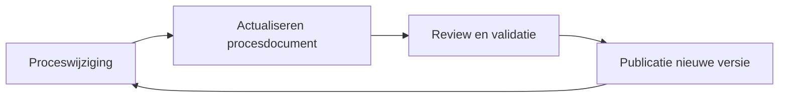

Procesdocumentatie heeft alleen waarde als zij actueel en betrouwbaar is.

In veel organisaties ontstaat procesdocumentatie tijdens een project, een audit of een verbetertraject. Daarna raakt de documentatie echter langzaam verouderd. Processen veranderen, systemen worden aangepast en verantwoordelijkheden verschuiven. De documentatie blijft achter.

Het onderhouden van procesdocumentatie is daarom minstens zo belangrijk als het opstellen ervan.

Binnen het Procesdocumentatiemodel (PDM) wordt procesdocumentatie niet gezien als een eenmalig project, maar als een continu beheerde kennisbron. Door procesdocumentatie te beheren via een gestructureerde cyclus blijft deze actueel, consistent en bruikbaar.

#### Waarom onderhoud noodzakelijk is

Processen in organisaties veranderen voortdurend. Nieuwe wetgeving, veranderende klantverwachtingen, technologische ontwikkelingen en organisatorische wijzigingen hebben allemaal invloed op hoe processen worden uitgevoerd.

Wanneer procesdocumentatie niet actief wordt onderhouden ontstaan verschillende problemen:

- procesbeschrijvingen raken verouderd  
- medewerkers verliezen vertrouwen in de documentatie  
- audits leveren steeds meer afwijkingen op  
- procesverbeteringen worden moeilijker te realiseren.

Goed onderhoud voorkomt dat procesdocumentatie een archief van oude informatie wordt.

#### Procesdocumentatie als beheerd systeem

Binnen het  [Procesdocumentatiemodel](01%20Aanpak/02%20Procesdocumentatiemodel/_index.md) wordt procesdocumentatie gezien als een samenhangend systeem van procesinformatie.

Het centrale object binnen dit systeem is het procesdocument: een gestructureerde beschrijving van een bedrijfsproces.

Om dit systeem betrouwbaar te houden moet het actief worden beheerd. Dit gebeurt via een procesdocumentatiecyclus waarin wijzigingen, reviews en publicaties worden georganiseerd.

Procesdocumentatiebeheer is daarmee vergelijkbaar met configuratiebeheer of documentbeheer: het is een structureel proces binnen de organisatie.

#### De procesdocumentatiecyclus

Het onderhoud van procesdocumentatie kan worden beschreven als een cyclus van vier activiteiten.

Deze cyclus zorgt ervoor dat procesdocumentatie meebeweegt met veranderingen in de organisatie.

#### 1. Signaleren van proceswijzigingen

Onderhoud begint bij het herkennen van veranderingen in processen.

Wijzigingen kunnen ontstaan door:

- organisatorische veranderingen
- nieuwe systemen of applicaties
- aangepaste werkinstructies
- nieuwe wet- of regelgeving
- procesverbeteringen
- auditbevindingen.

Het is belangrijk dat dergelijke veranderingen tijdig worden gemeld zodat procesdocumentatie kan worden aangepast.

Vaak ligt deze verantwoordelijkheid bij proceseigenaren of procesmanagers.

#### 2. Actualiseren van het procesdocument

Wanneer een wijziging wordt vastgesteld, wordt het betreffende procesdocument aangepast.

Dit kan bijvoorbeeld betekenen dat:

- procesmodellen worden bijgewerkt
- activiteiten worden aangepast
- rollen of verantwoordelijkheden veranderen
- indicatoren of sturingsinformatie worden gewijzigd.

Binnen het PDM gebeurt dit altijd volgens de gestandaardiseerde templates, zodat de structuur van procesdocumentatie intact blijft.

#### 3. Review en validatie

Voordat gewijzigde procesdocumentatie wordt gepubliceerd, moet deze worden gecontroleerd.

Deze review heeft verschillende doelen:

- controleren of de beschrijving correct is
- valideren of het proces overeenkomt met de praktijk
- waarborgen van consistentie met andere processen
- voorkomen van interpretatiefouten.

De review wordt meestal uitgevoerd door:

- de proceseigenaar
- betrokken procesteams
- eventueel een procesarchitect of kwaliteitsmanager.

Deze stap zorgt ervoor dat procesdocumentatie betrouwbaar blijft.

#### 4. Publicatie van een nieuwe versie

Na goedkeuring wordt een nieuwe versie van het procesdocument gepubliceerd.

Hierbij is het belangrijk dat:

- de oude versie wordt gearchiveerd
- duidelijk is welke versie actueel is
- betrokken medewerkers op de hoogte worden gesteld van de wijziging.

Versiebeheer en publicatie zorgen ervoor dat medewerkers altijd toegang hebben tot de juiste procesinformatie.

#### Rollen en verantwoordelijkheden

Het onderhouden van procesdocumentatie is een gezamenlijke verantwoordelijkheid.

Typische rollen binnen het beheerproces zijn:

- Proceseigenaar: De proceseigenaar is verantwoordelijk voor de inhoud en actualiteit van het proces.
- Procesdocumentalist: De procesdocumentalist zorgt voor het structureren, modelleren en actualiseren van procesdocumentatie.
- Procesdeelnemers: Medewerkers die in het proces werken leveren input en feedback op procesbeschrijvingen.

Door deze rollen duidelijk te definiëren ontstaat een structurele aanpak voor documentatiebeheer.

#### Praktische principes voor goed onderhoud

Er is een aantal principes dat helpt om procesdocumentatie duurzaam te onderhouden.

- Maak procesdocumentatie onderdeel van procesbeheer: Documentatie moet worden gezien als onderdeel van het proces zelf, niet als een los project.
- Werk met standaardtemplates: Standaardisatie maakt het eenvoudiger om wijzigingen door te voeren.
- Organiseer periodieke reviews: Ook zonder wijzigingen is het verstandig om procesdocumentatie periodiek te controleren.
- Houd documentatie toegankelijk: Medewerkers moeten eenvoudig toegang hebben tot actuele procesdocumentatie.

#### Het belang van continu beheer

Wanneer procesdocumentatie actief wordt onderhouden ontstaat een waardevolle kennisbasis voor de organisatie.

Actuele procesdocumentatie ondersteunt:

- processturing
- procesverbetering
- kennisoverdracht
- compliance en audits.

Het onderhouden van procesdocumentatie is daarom geen administratieve taak, maar een essentieel onderdeel van professioneel procesmanagement.

#### Conclusie

Het onderhouden van procesdocumentatie vraagt om een gestructureerde aanpak.

Binnen het Procesdocumentatiemodel (PDM) gebeurt dit via een procesdocumentatiecyclus waarin wijzigingen, reviews en publicaties worden georganiseerd.

Door procesdocumentatie actief te beheren blijft deze:

- actueel
- betrouwbaar
- bruikbaar voor de organisatie.

Zo wordt procesdocumentatie niet alleen een beschrijving van processen, maar een duurzame kennisbasis voor processturing en procesverbetering.