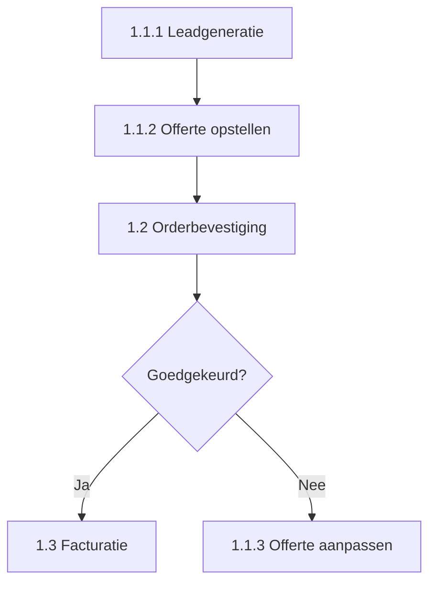

> [!primary]
> Hoe je bedrijfsprocessen logisch rubriceert en nummeren toepast voor maximale duidelijkh, efficiëntie en schaalbaarheid. Met voorbeelden, best practices en tips voor implementatie in tools zoals Confluence, SharePoint en BPMN.

> Een praktische gids voor structuur, overzicht en schaalbaarheid

#### Inleiding

Bedrijfsprocessen zijn de ruggengraat van elke organisatie. Of het nu gaat om klantcontact, productie, logistiek of interne workflows: zonder duidelijke structuur ontstaat chaos. Een van de grootste uitdagingen in procesdocumentatie is het creëren van een logische, schaalbare en begrijpelijke indeling. Hoe zorg je ervoor dat medewerkers, managers en externe partijen snel de juiste informatie vinden? Hoe voorkom je dubbel werk, inconsistenties of verouderde documentatie?

In dit artikel bespreken we:  
- Waarom rubriceren en nummeren essentieel zijn voor efficiëntie en compliance.  
- Stappenplannen voor het opzetten van een robuust rubriceringssysteem.  
- Nummeringsmethoden (hiërarchisch, functioneel, procesgericht) met voor- en nadelen.  
- Praktische voorbeelden uit de telecomsector, productie en dienstverlening.  
- Tools en templates (BPMN, Confluence, SharePoint) om je systeem te implementeren.  
- Valkuilen en tips om veelgemaakte fouten te vermijden.

#### Waarom rubriceren en nummeren?

De voordelen van een gestructureerde aanpak

##### Overzicht en vindbaarheid

- Snelle toegang: Medewerkers vinden processen terug zonder eindeloos te zoeken.
- Consistentie: Uniforme benaming en nummering voorkomt verwarring (bv. "Proces A" vs. "Workflow 1").
- Schaalbaarheid: Nieuwe processen zijn eenvoudig toe te voegen zonder de structuur te doorbreken.

##### Efficiëntie en compliance

- Auditvriendelijk: Externe partijen (auditors, certificeringsinstanties) kunnen gemakkelijk controleren of processen voldoen aan normen zoals ISO 9001, Lean Six Sigma of PRINCE2.
- Automatisering: Gestructureerde processen zijn makkelijker te koppelen aan RPA (Robotic Process Automation) of workflowtools.
- Kennisbehoud: Bij vertrek van medewerkers blijft de kennis behouden in de documentatie.

##### Communicatie en samenwerking

- Eenduidige taal: Iedereen (van uitvoerend tot strategisch niveau) spreekt dezelfde "proces-taal".
- Cross-departmentale afstemming: Processen die meerdere afdelingen raken (bv. order-to-cash) zijn duidelijk gekoppeld.


#### Stappenplan: Hoe begin je met rubriceren?

##### Inventariseer alle processen

Doel: Een compleet overzicht creëren van alle processen in de organisatie.

Methode:

- Workshops: Betrek vertegenwoordigers uit elke afdeling (bv. sales, productie, HR).
- Documentanalyse: Bekijk bestaande handleidingen, SOP’s (Standard Operating Procedures) en IT-systemen.
- Interviews: Vraag medewerkers naar hun dagelijkse taken en knelpunten.

Output: Een longlist van processen, inclusief:

- Naam van het proces
- Verantwoordelijke afdeling
- Frequentie (dagelijks/wekelijks/maandelijks)
- Kritikaliteit (hoog/middel/laag)


| Procesnaam                 | Afdeling   | Frequentie | Kritikaliteit | Huidige documentatie? |
| ------------------------------ | -------------- | -------------- | ----------------- | ------------------------- |
| Orderontvangst                 | Sales          | Dagelijks      | Hoog              | Ja (verouderd)            |
| Klachtbehandeling              | Klantenservice | Dagelijks      | Hoog              | Ja                        |
| Magazijnbeheer                 | Logistiek      | Dagelijks      | Middel            | Nee                       |
| Jaarlijkse audit voorbereiding | Financiën      | Jaarlijks      | Hoog              | Nee                       |


##### Groepeer processen in categorieën

Doel: Processen indelen in logische groepen voor betere vindbaarheid.

Mogelijke indelingscriteria:


| Criterium     | Voorbeeld                                                     | Wanneer toepassen?                           |
| ----------------- | ----------------------------------------------------------------- | ------------------------------------------------ |
| Functie       | Sales, Productie, HR, Financiën                                   | Traditionele organisatiestructuren               |
| Processoort   | Primair (klantgericht), Ondersteunend (HR, IT), Stuur (strategie) | Procesgerichte organisaties (bv. BPMN)           |
| Levenscyclus  | Ontwikkeling, Productie, Afvoering                                | Productiebedrijven                               |
| Kritikaliteit | Hoog (compliance), Middel, Laag                                   | Risicogestuurde omgevingen (bv. gezondheidszorg) |
| Frequentie    | Dagelijks, Wekelijks, Maandelijks                                 | Onderhoudsprocessen                              |


> [!primary] Best Practice
> Gebruik maximaal 3 niveaus in je hiërarchie om complexiteit te beperken.  
> Voorbeeld:
> >
> 1. Primair Proces (bv. Orderverwerking)
 >  1.1 Subproces (bv. Orderontvangst)  
  >  1.1.1 Taak (bv. Klantgegevens valideren)

##### 2.3 Kies een nummeringssysteem

Doel: Unieke identificatie voor elk proces, zodat ze eenduidig zijn te refereren.

Opties voor nummering:


| Systeem       | Voorbeeld           | Voordelen                        | Nadelen                                  | Geschikt voor           |
| ----------------- | ----------------------- | ------------------------------------ | -------------------------------------------- | --------------------------- |
| Hiërarchisch  | 1.1.2, 1.2.1, 2.3.4     | Duidelijke structuur, schaalbaar     | Kan complex worden bij diepe hiërarchie      | Grote organisaties          |
| Functioneel   | SALES-001, HR-002       | Makkelijk te koppelen aan afdelingen | Minder flexibel bij organisatieveranderingen | Traditionele structuren     |
| Procesgericht | O2C-001 (Order-to-Cash) | Focus op eind-to-end processen       | Moeilijker voor afdelingsgerichte teams      | Procesgerichte organisaties |
| Alfanumeriek  | PR-2024-001             | Uniek en traceerbaar                 | Minder intuïtief                             | Projectgebaseerde processen |
| Combinatie    | 1.2-HR-003              | Flexibel en gedetailleerd            | Complexer om te onderhouden                  | Complexe organisaties       |


💡 Tip:  
Gebruik prefixen om het type proces aan te geven, bijvoorbeeld:

- OP- = Operationeel proces
- ST- = Stuurproces
- ON- = Ondersteunend proces

#### 3. Nummeringsmethoden in de praktijk

##### 3.1 Hiërarchische nummering (meest gangbaar)

Werking:

- Hoofdprocessen krijgen een hoofdnummer (bv. 1, 2, 3).
- Subprocessen krijgen subnummers (bv. 1.1, 1.2).
- Taken krijgen derdeniveau-nummers (bv. 1.1.1, 1.1.2).

Voorbeeld (Telecomsector):

```
1. Klantacquisitie
   1.1 Leadgeneratie
      1.1.1 Online campagne beheer
      1.1.2 Telefoonverkoop
   1.2 Offerte opstellen
      1.2.1 Klantbehoefte analyseren
      1.2.2 Prijsberekening
2. Orderverwerking
   2.1 Orderontvangst
   2.2 Orderbevestiging
```

Voordelen:  
✔ Duidelijke hiërarchie  
✔ Makkelijk uit te breiden  
✔ Geschikt voor BPMN-diagrammen

Nadelen:  
✖ Kan te diep worden (bv. 1.1.1.1.1)  
✖ Moeilijk om processen te hergroeperen

##### 3.2 Functionele nummering

Werking:

- Processen krijgen een code gebaseerd op de afdeling en een volgnummer.

Voorbeeld:

```
SALES-001: Leadgeneratie
SALES-002: Offerte opstellen
HR-001: Sollicitatieprocedure
FIN-001: Facturatie
```

Voordelen:  
✔ Makkelijk te koppelen aan afdelingen  
✔ Eenvoudig voor medewerkers om te onthouden

Nadelen:  
✖ Minder flexibel bij organisatieveranderingen  
✖ Geen inzicht in procesverloop

##### 3.3 Procesgerichte nummering (End-to-End)

Werking:

- Processen worden genummerd op basis van waardeketens (bv. Order-to-Cash, Procure-to-Pay).

Voorbeeld:

```
O2C-001: Order ontvangen
O2C-002: Kredietcheck
O2C-003: Order bevestigen
P2P-001: Inkoopaanvraag
P2P-002: Leverancier selecteren
```

Voordelen:  
✔ Focus op klantwaarde  
✔ Geschikt voor Lean Six Sigma en procesoptimalisatie

Nadelen:  
✖ Moeilijker voor afdelingsgerichte teams  
✖ Vereist diep inzicht in waardeketens

##### 3.4 Alfanumerieke nummering

Werking:

- Combinatie van letters en cijfers voor unieke identificatie.

Voorbeeld:

```
PR-2024-001: Project X startfase
OP-2024-012: Onderhoudsprotocol
```

Voordelen:  
✔ Uniek en traceerbaar  
✔ Geschikt voor projectgebaseerde processen

Nadelen:  
✖ Minder intuïtief  
✖ Moeilijker te onthouden

#### 4. Praktische voorbeelden uit verschillende sectoren

##### 4.1 Telecomsector (30+ jaar ervaring)

Uitdaging: Processen lopen over techniek, sales, klantenservice en logistiek heen.  
Oplossing: Hiërarchische nummering met procesgroepen.

```
1. Klantlevenscyclus
   1.1 Acquisitie
      1.1.1 Leadgeneratie (Marketing)
      1.1.2 Offerte opstellen (Sales)
   1.2 Implementatie
      1.2.1 Technische installatie
      1.2.2 Klanttraining
   1.3 Onderhoud
      1.3.1 Storingen melden
      1.3.2 Preventief onderhoud
2. Netwerkbeheer
   2.1 Capaciteitsplanning
   2.2 Storingen oplossen
```

Tools gebruikt:

- BPMN voor procesmodellering
- Confluence voor documentatie
- Jira voor ticketing (gekoppeld aan procesnummers)

##### 4.2 Productiebedrijf

Uitdaging: Snelle wijzigingen in productielijnen en compliance-eisen (bv. ISO 9001).  
Oplossing: Combinatie van hiërarchisch en functioneel.

```
PROD-1.1: Inkoop grondstoffen
PROD-1.2: Productieplanning
PROD-2.1: Kwaliteitscontrole
PROD-2.2: Verpakking
```

Voordelen:

- Traceerbaarheid voor audits
- Flexibiliteit bij wijzigingen in productielijnen

##### 4.3 Ziekenhuis (Gezondheidszorg)

Uitdaging: Hoge kritikaliteit en compliance (bv. HIPAA, NEN-EN-ISO 13485).  
Oplossing: Procesgerichte nummering met risicoclassificatie.

```
PAT-001: Patiëntintake (Hoog risico)
PAT-002: Diagnostiek
MED-001: Medicatiebeheer (Hoog risico)
LOG-001: Magazijnbeheer
```

Extra:

- Kleurcodes in documentatie voor risiconiveaus (rood = hoog, oranje = middel, groen = laag).

#### 5. Tools en templates voor implementatie

##### 5.1 BPMN (Business Process Model and Notation)

Waarom?

- Standaard voor procesmodellering.
- Visuele weergave van processen, inclusief nummering.

Voorbeeld in BPMN:



Tools:

- Lucidchart
- Camunda
- Signavio

##### 5.2 Confluence (Atlassian)

Waarom?

- Centrale opslag voor procesdocumentatie.
- Koppeling met Jira voor ticketing.

Template voor procespagina:

```markdown
# [Procesnaam] - [Procesnummer]
Verantwoordelijke afdeling: [Afdeling]
Kritikaliteit: [Hoog/Middel/Laag]
Laatste update: [Datum]

#### Doel
[Beschrijving van het doel van het proces]

#### Stappen
1. [Stap 1]
2. [Stap 2]

#### Gerelateerde processen
- [Procesnummer]: [Naam]
- [Procesnummer]: [Naam]

#### Bijlagen
- [Link naar handleiding]
- [Link naar template]
```

##### 5.3 SharePoint

Waarom?

- Integratie met Microsoft 365.
- Versiebeheer en toegangsrechten.

Structuurvoorstel:

```
/Processen
   /1_Klantproces
      /1.1_Acquisitie
         - 1.1.1_Leadgeneratie.docx
         - 1.1.2_Offerte_opstellen.docx
   /2_Productie
      /2.1_Inkoop
         - 2.1.1_Grondstoffen_bestellen.docx
```

##### 5.4 Notion

Waarom?

- Flexibel en visueel aantrekkelijk.
- Databases voor procesoverzichten.

Voorbeeld Notion-database:


| Procesnummer | Naam               | Afdeling | Status | Laatste update |
| ---------------- | ---------------------- | ------------ | ---------- | ------------------ |
| 1.1.1            | Leadgeneratie          | Sales        | Actief     | 2026-04-20         |
| 1.2.3            | Orderbevestiging       | Sales        | Concept    | 2026-04-15         |
| 2.1.1            | Grondstoffen bestellen | Productie    | Actief     | 2026-04-10         |


#### 6. Valkuilen en hoe ze te vermijden


| Valkuil                        | Oorzaak                      | Oplossing                                                 |
| ---------------------------------- | -------------------------------- | ------------------------------------------------------------- |
| Te diepe hiërarchie            | Te veel subniveaus               | Maximaal 3-4 niveaus hanteren                                 |
| Inconsistente benaming         | Geen afspraken over terminologie | Gebruik een glossary met vaste termen                     |
| Verouderde documentatie        | Geen versiebeheer                | Implementeer automatische herinneringen voor reviews      |
| Te complex voor medewerkers    | Te theoretisch                   | Betrek eindgebruikers bij het ontwerp                     |
| Geen koppeling met IT-systemen | Processen staan los van tools    | Zorg voor integratie met workflowtools (bv. Zapier, Make) |
| Geen eigenaar                  | Niemand is verantwoordelijk      | Wijs per proces een procesowner aan                       |


#### 7. Stappenplan voor implementatie in jouw organisatie

##### Stap 1: Stakeholders betrekken

- Workshop organiseren met vertegenwoordigers uit alle afdelingen.
- Doel: Draagvlak creëren en inzicht krijgen in behoeften.

##### Stap 2: Pilot uitvoeren

- Kies 1-2 kritische processen om het systeem op uit te testen.
- Voorbeeld: Orderverwerking of klachtbehandeling.

##### Stap 3: Tools selecteren

- Kies 1-2 tools voor documentatie (bv. Confluence + BPMN).
- Zorg voor training voor medewerkers.

##### Stap 4: Roll-out en communicatie

- Lanceer het systeem met een kick-off meeting.
- Communiceer de voordelen (bv. tijdsbesparing, minder fouten).

##### Stap 5: Continu verbeteren

- Feedback verzamelen via enquêtes of interviews.
- Periodiek reviewen (bv. elke 6 maanden).

#### 8. Conclusie: De sleutel tot succesvolle procesdocumentatie

Een goed rubricering- en nummeringssysteem is geen eenmalige klus, maar een doorlopend proces. De sleutel tot succes ligt in:  
- Eenvoud: Houd de structuur overzichtelijk en praktisch.  
- Betrokkenheid: Zorg dat medewerkers het systeem omarmen.  
- Flexibiliteit: Pas het systeem aan als de organisatie verandert.  
- Tools: Gebruik geschikte software om de documentatie levend te houden.

📌 Afsluitende gedachte (Martin van Pelt):  
"In mijn ervaring als procesdocumentalist zie ik vaak dat organisaties te veel focus leggen op de technische kant van rubriceren, en te weinig op de menselijke kant. Een systeem werkt alleen als medewerkers het willen gebruiken. Daardoor hecht ik veel waarde aan visuele duidelijkheid, praktische toepasbaarheid en doorlopende ondersteuning – precies waar mijn 7x Framework en 7x Process Language op inzetten."

#### 9. Verdere lezing en bronnen

- Boeken:
  - The Process Consultant’s Toolkit – Mark A. L. Smith
  - BPMN Quick and Easy Using Method and Style – Tom Debevoise
- Tools:
  - [Lucidchart (BPMN)](https://www.lucidchart.com/)
  - [Confluence (Atlassian)](https://www.atlassian.com/software/confluence)
  - [Notion](https://www.notion.so/)
- Normen:
  - [ISO 9001 (Kwaliteitsmanagement)](https://www.iso.org/iso-9001-quality-management.html)
  - [Lean Six Sigma](https://www.asq.org/quality-resources/six-sigma)

#### 10. Over de auteur

Dit artikel is geschreven door Martin van Pelt, freelance procesdocumentalist met 30+ jaar ervaring in de telecomsector. Martin helpt organisaties bij het in kaart brengen, stroomlijnen en documenteren van werkprocessen, met een focus op bruikbare en toegankelijke informatie voor zowel management als uitvoerende teams. Hij ontwikkelt tevens eigen methodieken, zoals het 7x Framework en de 7x Process Language, om organisaties beter grip te geven op hun processen.

[Meer weten? Bezoek de website](https://www.procesdocumentalist.nl) of neem contact op via [LinkedIn](https://www.linkedin.com/in/martinvanpelt/).