 >  Een geïntegreerd organisatiemodel voor strategische afstemming en operationele excellentie

Auteur: Martin van Pelt  
Versie: 2025  
Copyright: © 2025 Martin van Pelt. Alle rechten voorbehouden.

Het 7x Framework is een principe-gedreven organisatiemodel dat organisaties helpt om strategie, governance, processen, initiatieven en prestaties te integreren in één samenhangend systeem. Het framework fungeert als een overkoepelend besturingssysteem dat bestaande managementmethoden (zoals procesmanagement, projectmanagement en agile werken) met elkaar verbindt, waardoor een coherent model ontstaat voor strategische sturing en operationele uitvoering.

Kernboodschap: "Het 7x Framework is geen losse methode, maar een organisatorisch besturingssysteem dat zorgt voor alignement, wendbaarheid en duurzame waardecreatie."

## Inleiding: Waarom het 7x Framework?

### De uitdagingen van moderne organisaties

Moderne organisaties opereren in een complexe, dynamische omgeving met:

- Meerdere stakeholders (klanten, medewerkers, aandeelhouders, regelgevers).
- Uiteenlopende technologieën (ERP, CRM, cloud, AI).
- Toenemende regelgeving (compliance, privacy, veiligheid).
- Hoge verwachtingen van snelheid, flexibiliteit en innovatie.

In deze context zijn strategische coherentie en organisatorische wendbaarheid cruciaal voor succes. Toch kampen veel organisaties met structurele problemen, zoals:


| Uitdaging                   | Impact                                            | Voorbeeld                                                                                                      |
| ------------------------------- | ----------------------------------------------------- | ------------------------------------------------------------------------------------------------------------------ |
| Gebrek aan alignment        | Strategie en uitvoering lopen uiteen.                 | Een organisatie heeft een "digitale transformatiestrategie", maar IT-projecten sluiten niet aan op bedrijfsdoelen. |
| Versnipperde besluitvorming | Silo’s vertragen beslissingen.                        | Afdelingen nemen beslissingen zonder afstemming, wat leidt tot tegenstrijdige prioriteiten.                        |
| Lage traceerbaarheid        | Beslissingen en resultaten zijn niet terug te vinden. | Een project faalt, maar niemand weet waarom beslissingen zijn genomen.                                             |
| Ineffectieve governance     | Te bureaucratisch of te vrijblijvend.                 | Goedkeuringsprocessen vertragen initiatieven zonder waarde toe te voegen.                                          |
| Slechte waardecreatie       | Initiatieven leveren onvoldoende resultaat.           | Een kostbaar IT-project wordt afgeleverd, maar levert geen meetbare businesswaarde.                                |
| Gefragmenteerde tooling     | Geen integratie tussen systemen.                      | Medewerkers moeten vijf verschillende tools gebruiken voor één proces.                                             |
| Lange verandertrajecten     | Organisaties kunnen niet snel genoeg aanpassen.       | Een verandering duurt maanden door trage goedkeuringsprocessen.                                                    |


Oplossing:  
Het 7x Framework is ontwikkeld om deze problemen systematisch aan te pakken door middel van een holistisch, principe-gedreven model voor organisatiebesturing.

## Het 7x Framework als organisatoriesysteem

Het 7x Framework is geen losse methode, maar een organisatorisch besturingssysteem dat verschillende managementdisciplines met elkaar verbindt:

| Discipline                  | Rol binnen het 7x Framework                                | Voorbeeld                                               |
| ------------------------------- | -------------------------------------------------------------- | ----------------------------------------------------------- |
| Strategieontwikkeling       | Vertalen van visie naar uitvoerbare doelen.                    | Strategische doelen koppelen aan operationele initiatieven. |
| Governance & besluitvorming | Duidelijke verantwoordelijkheden en besluitstructuren.         | Rollen, bevoegdheden en escalatiepaden definiëren.          |
| Procesarchitectuur          | Processen als verbindende laag tussen strategie en uitvoering. | Proceslandkaarten en BPMN-modellen.                         |
| Initiatiefmanagement        | Structuur voor projecten en verandertrajecten.                 | Initiative Lifecycle met duidelijke fasen en exitcriteria.  |
| Prestatiemeting             | Meetbare resultaten en continue verbetering.                   | KPI’s, dashboards en benefit realisatie.                    |
| Kennisstructuren            | Gestructureerde vastlegging van organisatiekennis.             | Entity Relationship Model (ERM) en artefacten.              |

Resultaat:  
Een coherent model waarin strategie daadwerkelijk doorwerkt in de dagelijkse uitvoering, zonder fragmentatie of silo’s.

### Entity-Gedreven Structuur: De ruggengraat van het framework

Een kernkenmerk van het 7x Framework is de entity-gedreven structuur. In plaats van losse documenten of modellen, werkt het framework met een samenhangend netwerk van entiteiten, zoals:

| Entiteit            | Beschrijving                                  | Voorbeeld                              |
| ----------------------- | ------------------------------------------------- | ------------------------------------------ |
| Strategische doelen | Wat wil de organisatie bereiken?                  | "Marktleider worden in duurzame energie."  |
| Initiatieven        | Projecten of programma’s om doelen te realiseren. | "Implementatie van een nieuw CRM-systeem." |
| Processen           | Hoe werk wordt uitgevoerd.                        | "Orderverwerking", "Klachtbehandeling".    |
| Requirements        | Eisen waaraan moet worden voldaan.                | "Systeem moet AVG-compliant zijn."         |
| Benefits            | Verwachte resultaten van initiatieven.            | "20% snellere orderverwerking."            |
| KPI’s               | Meetbare prestatie-indicatoren.                   | "Klanttevredenheidsscore ≥ 8/10."          |
| Rollen              | Verantwoordelijkheden en bevoegdheden.            | "Proceseigenaar: Logistiek Manager."       |

Deze entiteiten zijn onderling verbonden via het Entity Relationship Model (ERM), dat fungeert als de structurele ruggengraat van het framework. Het ERM maakt consistente governance, analyse en besluitvorming mogelijk.

### End-to-End Traceability: Van strategie naar resultaat

Door entiteiten systematisch met elkaar te verbinden, ontstaat end-to-end traceability:

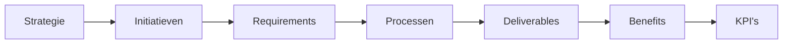

Voordelen van traceability:  
- Strategische doelen zijn gekoppeld aan operationele uitvoering.  
- Verantwoordelijkheid is duidelijk toe te wijzen.  
- Prestaties kunnen objectief worden geëvalueerd.  
- Leren van resultaten wordt mogelijk gemaakt.

Voorbeeld:  
Een strategisch doel als *"Klanttevredenheid verhogen"* is traceerbaar naar:

- Initiatief: "Implementatie van een klantportaal."
- Requirements: "Portaal moet 24/7 beschikbaar zijn."
- Proces: "Klachtbehandeling via portaal."
- KPI: "Klanttevredenheidsscore ≥ 8/10."

## De Zeven Strategische Uitdagingen & Oplossingen

Het 7x Framework richt zich op zeven veelvoorkomende strategische uitdagingen en biedt concrete oplossingen:


| Strategische Uitdaging      | Oplossing via 7x Framework              | Belangrijkste Voordelen                   | Praktijkvoorbeeld                                                                           |
| ------------------------------- | ------------------------------------------- | --------------------------------------------- | ----------------------------------------------------------------------------------------------- |
| Gebrek aan alignment        | Strategic Alignment Grid                | Traceerbaarheid, prioritering, eigenaarschap. | Een IT-project is direct gekoppeld aan het strategische doel "Digitalisering".                  |
| Versnipperde besluitvorming | Governance Structure                    | Snellere, duidelijkere besluitvorming.        | Beslissingen over budgetten worden genomen door een duidelijke rol (bijv. "Portfolio Manager"). |
| Lage traceerbaarheid        | Entity Relationship Model               | End-to-end inzicht en accountability.         | Elke wijziging in een proces is traceerbaar naar de originele beslissing.                       |
| Ineffectieve governance     | Tiered Governance Model                 | Transparante en proportionele besluitvorming. | Goedkeuringsprocessen zijn afgestemd op het risiconiveau.                                       |
| Slechte waardecreatie       | Benefit-Linked Requirements             | Meetbare waarde en betere prioritering.       | Elk initiatief heeft gekoppelde KPI’s (bijv. "10% kostenbesparing").                            |
| Gefragmenteerde tooling     | Unified Entity Model & Template Library | Consistentie en betere samenwerking.          | Alle documenten volgen dezelfde structuur en terminologie.                                      |
| Lange verandertrajecten     | Initiative Lifecycle                    | Wendbare en adaptieve verandering.            | Een verandertraject doorloopt duidelijke fasen (ideation → planning → execution → closure).     |


## De Zeven Principes (7R’s): Ontwerpfilosofie voor effectieve besturing

De 7R’s vormen de ontwerpprincipes van het 7x Framework. Ze zorgen voor verantwoorde governance, doelgerichte implementatie en duurzame prestaties.


| Principe    | Beschrijving                                    | Toepassing                           | Voorbeeld                                                                                |
| --------------- | --------------------------------------------------- | ---------------------------------------- | -------------------------------------------------------------------------------------------- |
| Responsible | Duidelijke verantwoordelijkheden en accountability. | Rollen, governance, besluitbevoegdheden. | Een "Proceseigenaar" is verantwoordelijk voor het bijwerken van procesdocumentatie.          |
| Resilient   | Veerkrachtige systemen en processen.                | Risicobeheer, adaptieve governance.      | Processen zijn ontworpen om om te gaan met verstoringen (bijv. supply chain issues).         |
| Rational    | Evidence-based besluitvorming.                      | KPI’s, data-analyse, prestatiemetingen.  | Beslissingen worden genomen op basis van actuele prestatiedata.                              |
| Reusable    | Herbruikbare structuren en artefacten.              | Templates, standaarden, best practices.  | Procesdocumenten volgen een vast template voor consistentie.                                 |
| Relatable   | Verbinding tussen strategie en uitvoering.          | Alignment modellen, visuele weergaven.   | Een "Strategy Map" toont hoe initiatieven bijdragen aan strategische doelen.                 |
| Realisable  | Realistische en meetbare doelen.                    | Benefit management, haalbare planning.   | Doelen zijn SMART geformuleerd (Specifiek, Meetbaar, Acceptabel, Realistisch, Tijdgebonden). |
| Reflective  | Continue evaluatie en leren.                        | Feedbacklussen, post-initiatief reviews. | Na afronding van een project wordt een "Lessons Learned"-sessie gehouden.                    |


Samen vormen deze principes een ontwerpfilosofie voor effectieve organisatiebesturing.

## Structuur van het 7x Framework

Het 7x Framework bestaat uit twaalf kernelementen, verdeeld over drie hoofdgebieden:

### 1. Strategische Alignement & Governance

Deze laag zorgt voor richting, samenhang en bestuurlijke controle.


| Element                   | Beschrijving                                              | Toepassing                       |
| ----------------------------- | ------------------------------------------------------------- | ------------------------------------ |
| Strategy Definition       | Definieert strategische doelen, thema’s en drivers.           | Missie, visie, strategische pijlers. |
| Governance Structure      | Formaliseert besluitvorming, rollen en verantwoordelijkheden. | RACI-matrix, besluitbevoegdheden.    |
| Entity Relationship Model | Standaardiseert entiteiten en hun relaties.                   | ERD (Entity Relationship Diagram).   |


Voorbeeld:  
Een Governance Structure definieert wie verantwoordelijk is voor het goedkeuren van budgetten (bijv. "Financieel Directeur") en wie input mag leveren (bijv. "Afdelingshoofden").

### 2. Operationele Uitvoering & Prestatiemeting

Hier wordt strategie vertaald naar concrete uitvoering en meetbare resultaten.


| Element                | Beschrijving                                      | Toepassing                      |
| -------------------------- | ----------------------------------------------------- | ----------------------------------- |
| Process Architecture   | Beschrijft proceslandschap en afhankelijkheden.       | Proceslandkaarten, BPMN-diagrammen. |
| Initiative Lifecycle   | Definieert fasen voor projecten en verandertrajecten. | Waterfall, Agile, Hybride methoden. |
| Performance Monitoring | Meet prestaties via KPI’s en dashboards.              | Balanced Scorecard, Power BI.       |


Voorbeeld:  
Een Initiative Lifecycle voor een IT-project omvat:

1. Ideation (ideeënfase).
2. Planning (scope, budget, planning).
3. Execution (uitvoering).
4. Monitoring (prestatiemetingen).
5. Closure (afronding en evaluatie).

### 3. Ondersteunende Tools & Implementatie

Deze componenten ondersteunen de praktische toepassing van het framework.


| Element                      | Beschrijving                                    | Toepassing                   |
| -------------------------------- | --------------------------------------------------- | -------------------------------- |
| Principle-Based Design       | Ontwerpprincipes voor veerkrachtige systemen.       | 7R’s, architectuurprincipes.     |
| Catalogue                    | Overzicht van artefacten, templates en standaarden. | Documentatiebibliotheek.         |
| Supporting Tools & Artefacts | Hulpmiddelen voor modellering en governance.        | Confluence, Jira, Miro.          |
| Implementation Guide         | Stapsgewijze handleiding voor adoptie.              | Change management plan.          |
| Future Integrations          | Roadmap voor toekomstige uitbreidingen.             | API-koppelingen, nieuwe modules. |
| Appendices                   | Aanvullende informatie en referenties.              | Voorbeelden, case studies.       |


## Procesarchitectuur als verbindende laag

Procesarchitectuur speelt een centrale rol binnen het 7x Framework. Het verbindt strategische doelen met operationele uitvoering via processen:

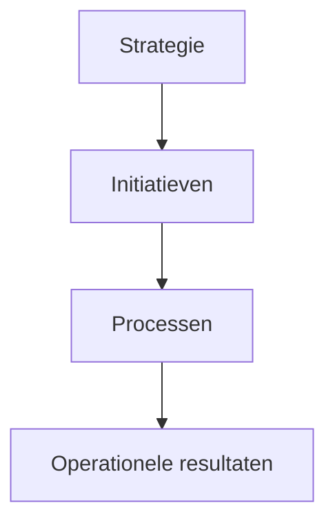

Voorbeeld:  
Een strategisch doel als *"Kosten reduceren"* wordt vertaald naar:

1. Initiatief: "Automatisering van factuurverwerking."
2. Proces: "Factuurverwerking" (met stappen als "Ontvangst factuur → Validatie → Betaling").
3. Resultaat: "20% lagere verwerkingskosten."

Voordelen:  
- Directe koppeling tussen strategie en dagelijkse werkzaamheden.  
- Transparantie over hoe strategie wordt uitgevoerd.  
- Sturing op basis van procesprestaties.

## Doelgroep: Voor wie is het 7x Framework?

Het 7x Framework is bedoeld voor professionals die betrokken zijn bij strategische sturing, organisatorische verbetering en governance:


| Doelgroep                              | Hoe het 7x Framework helpt                 | Praktijkvoorbeeld                                                               |
| ------------------------------------------ | ---------------------------------------------- | ----------------------------------------------------------------------------------- |
| Executives & Senior Leiders            | Strategische alignement en focus.              | CEO gebruikt het framework om strategie te vertalen naar uitvoerbare initiatieven.  |
| Governance, Risk & Compliance Managers | Structuur voor accountability en risicobeheer. | Compliance Manager gebruikt het framework om regelgeving te koppelen aan processen. |
| Programma- & Projectmanagers           | Consistente uitvoeringspraktijken.             | Projectmanager past de Initiative Lifecycle toe voor een IT-implementatie.          |
| Proces- & Business Analisten           | Analyse en verbetering van processen.          | Business Analist modelleert processen met BPMN en koppelt deze aan KPI’s.           |
| Operationele Teams                     | Betere samenwerking en kennisborging.          | Logistiek Team gebruikt gestandaardiseerde procesdocumenten.                        |
| Consultants & Verandermanagers         | Schaalbaar verandermodel.                      | Consultant implementeert het framework bij een klant voor digitale transformatie.   |


## Waardepropositie: Wat levert het 7x Framework op?

Het 7x Framework lost zeven kritieke pijnpunten op en biedt meetbare voordelen:


| Pijnpunt                    | Oplossing               | Resultaat           | Meetbare Impact                                         |
| ------------------------------- | --------------------------- | ----------------------- | ----------------------------------------------------------- |
| Gebrek aan alignment        | Strategic Alignment Grid    | Duidelijkheid en focus. | 90% van de initiatieven draagt bij aan strategische doelen. |
| Versnipperde besluitvorming | Governance Structure        | Snellere besluiten.     | Besluitvormingstijd verkort met 30%.                        |
| Lage traceerbaarheid        | Entity Model                | Transparantie.          | 100% traceerbaarheid van beslissingen en resultaten.        |
| Ineffectieve governance     | Tiered Governance Model     | Betere controle.        | 50% minder goedkeuringsvertragingen.                        |
| Slechte waardecreatie       | Benefit-Linked Requirements | Meetbare resultaten.    | 80% van de initiatieven levert de beloofde benefits.        |
| Gefragmenteerde tooling     | Unified Entity Model        | Consistentie.           | 40% minder tijd besteed aan zoeken naar informatie.         |
| Lange verandertrajecten     | Initiative Lifecycle        | Wendbaarheid.           | Verandertrajecten 2x sneller afgerond.                      |


Uiteindelijk resultaat:  
Organisaties die het 7x Framework toepassen, bereiken:  
- Strategische coherentie (visie en uitvoering zijn aligned).  
- Operationele excellentie (processen zijn efficiënt en effectief).  
- Wendbaarheid (snelle aanpassing aan veranderingen).  
- Duurzame waardecreatie (initiatieven leveren meetbare resultaten).

## Hoofdonderdelen van het Handboek

Het 7x Framework Handboek is opgebouwd uit tien hoofdstukken, die zowel theoretische achtergronden als praktische handleidingen bieden:


| Hoofdstuk                       | Inhoud                                | Doel                                          |
| ------------------------------- | ------------------------------------- | --------------------------------------------- |
| 1. Introduction                 | Achtergrond, visie en doelstellingen. | Begrijpen waarom het framework is ontwikkeld. |
| 2. Value Proposition            | Kritieke pijnpunten en oplossingen.   | Inzicht in de waarde van het framework.       |
| 3. Strategic Challenges         | Zeven strategische uitdagingen.       | Herkennen van organisatorische problemen.     |
| 4. Framework Structure          | Twaalf kernelementen.                 | Overzicht van de opbouw.                      |
| 5. Entity Relationship Model    | Structuur van entiteiten en relaties. | Leren hoe entiteiten zijn verbonden.          |
| 6. Principle-Based Design       | Ontwerpprincipes (7R’s).              | Toepassen van de principes in de praktijk.    |
| 7. Supporting Tools & Artefacts | Hulpmiddelen en templates.            | Praktische toepassing van het framework.      |
| 8. Implementation Guide         | Stapsgewijze implementatie.           | Succesvol adopteren van het framework.        |
| 9. Future Integrations          | Roadmap voor uitbreidingen.           | Toekomstbestendigheid.                        |
| 10. Appendices                  | Aanvullende informatie.               | Verdieping en referenties.                    |

title: "Hoofdstuk 1: Introduction – Achtergrond, visie en doelstellingen van het 7x Framework"  
description: Een diepgaande uitleg over de achtergrond, visie en doelstellingen van het 7x Framework, inclusief de context waarin het is ontwikkeld en de problemen die het oplost.

---

# **Hoofdstuk 1: Introduction – Achtergrond, visie en doelstellingen van het 7x Framework**

## **1.1 Waarom is het 7x Framework ontwikkeld?**

### **De complexiteit van moderne organisaties**

Moderne organisaties opereren in een **dynamische, complexe omgeving** gekenmerkt door:

- **Snelle technologische veranderingen** (AI, cloud, automatisering).
- **Veranderende klantverwachtingen** (persoonlijke ervaringen, snelheid, transparantie).
- **Toenemende regelgeving** (AVG, compliance, duurzaamheidseisen).
- **Globale concurrentie** (snelle innovatiecycli, disruptie).
- **Interne complexiteit** (silo’s, gefragmenteerde processen, tooling).

**Gevolg:**  
Organisaties worstelen met **strategische alignement**, **wendbaarheid** en **duurzame waardecreatie**. Traditionele managementmodellen (zoals procesmanagement, projectmanagement of agile) bieden **geen geïntegreerde oplossing** voor deze uitdagingen.

### **De behoefte aan een geïntegreerd organisatiemodel**

Het **7x Framework** is ontwikkeld als antwoord op deze uitdagingen. Het is **geen losse methode**, maar een **organisatorisch besturingssysteem** dat:

- **Strategie, governance, processen en prestaties** met elkaar verbindt.
- **Fragmentatie** vermindert door een **samenhangend model** te bieden.
- **Wendbaarheid** vergroot door **adaptieve governance** en **traceerbare besluitvorming**.
- **Waardecreatie** meetbaar maakt door **benefit-linked requirements** en **KPI’s**.

**Kernboodschap:**

> *"Het 7x Framework is ontworpen om organisaties te helpen **strategische doelen te vertalen naar operationele resultaten**, zonder verlies van coherentie of flexibiliteit."*

---

### **1.2 Visie: Van reactief naar proactief organisatieontwerp**

#### **De beperkingen van traditionele aanpakken**

Veel organisaties gebruiken **losse methoden** voor strategie, procesmanagement, projectmanagement en governance. Dit leidt tot:

- **Gebrek aan samenhang** tussen strategie en uitvoering.
- **Duplicatie van inspanningen** (bijv. meerdere tools voor proces- en projectmanagement).
- **Traagheid** in besluitvorming en verandering.
- **Onduidelijke verantwoordelijkheden** (wie doet wat, en waarom?).

**Voorbeeld:**  
Een organisatie gebruikt **BPMN voor procesmodellering**, **Scrum voor projectmanagement** en **Balanced Scorecard voor strategie**, maar deze methoden zijn **niet op elkaar afgestemd**. Het gevolg? Strategische doelen worden niet vertaald naar operationele acties, en projecten leveren niet de beloofde waarde.

#### **De visie van het 7x Framework**

Het 7x Framework streeft naar een **geïntegreerd organisatiemodel** waarin:

1. **Strategie** wordt vertaald naar **concrete initiatieven** (via de **Strategic Alignment Grid**).
2. **Governance** is **rolgebaseerd en adaptief** (via de **Governance Structure**).
3. **Processen** fungeren als **verbindende laag** tussen strategie en uitvoering.
4. **Prestaties** worden **continue gemeten en verbeterd** (via **Performance Monitoring**).
5. **Kennis** wordt **gestructureerd vastgelegd** (via het **Entity Relationship Model**).

**Resultaat:**  
Een organisatie die **proactief** kan **anticiperen op veranderingen**, in plaats van **reactief** te reageren.

**Voorbeeld:**  
Een **bank** gebruikt het 7x Framework om:

- **Strategie** ("Digitale transformatie") te koppelen aan **initiatieven** (bijv. "Implementatie van een nieuw klantportaal").
- **Processen** (bijv. "Klantenservice") te optimaliseren met behulp van **BPMN** en **KPI’s**.
- **Besluitvorming** te versnellen via **duidelijke governance-structuren**.

---

### **1.3 Doelstellingen van het 7x Framework**

Het 7x Framework heeft **vijf hoofddoelstellingen**:


| **Doelstelling**             | **Beschrijving**                                                | **Voorbeeld**                                                             |
| ---------------------------- | --------------------------------------------------------------- | ------------------------------------------------------------------------- |
| **Strategische Alignement**  | Zorgt dat strategie en uitvoering **op elkaar zijn afgestemd**. | Een IT-project is direct gekoppeld aan het strategische doel "Innovatie". |
| **Operationele Excellentie** | Processen zijn **efficiënt, effectief en meetbaar**.            | Proces "Orderverwerking" heeft een doorlooptijd van < 2 uur.              |
| **Wendbaarheid**             | Organisaties kunnen **snel aanpassen** aan veranderingen.       | Nieuwe wetgeving wordt binnen 2 weken geïmplementeerd in processen.       |
| **Duurzame Waardecreatie**   | Initiatieven leveren **meetbare resultaten**.                   | Een project levert €500.000 kostenbesparing op.                           |
| **Continue Verbetering**     | Organisaties **leren en verbeteren** op basis van prestaties.   | Maandelijkse reviews van KPI’s leiden tot procesoptimalisaties.           |


**Samenvatting:**  
Het 7x Framework helpt organisaties om **strategische doelen te realiseren**, **processen te optimaliseren** en **duurzame waarde te creëren** in een complexe omgeving.

---

### **1.4 Voor wie is het 7x Framework bedoeld?**

Het framework is relevant voor **alle professionals** die betrokken zijn bij **strategische sturing, organisatorische verbetering en governance**:


| **Doelgroep**                              | **Hoe het 7x Framework helpt**                 | **Praktijkvoorbeeld**                                           |
| ------------------------------------------ | ---------------------------------------------- | --------------------------------------------------------------- |
| **Executives & Senior Leiders**            | Vertalen van visie naar uitvoerbare strategie. | CEO gebruikt het framework om digitale transformatie te sturen. |
| **Governance, Risk & Compliance Managers** | Structuur voor accountability en risicobeheer. | Compliance Manager koppelt regelgeving aan processen.           |
| **Programma- & Projectmanagers**           | Consistente uitvoeringspraktijken.             | Projectmanager past de Initiative Lifecycle toe.                |
| **Proces- & Business Analisten**           | Analyse en verbetering van processen.          | Business Analist modelleert processen met BPMN.                 |
| **Operationele Teams**                     | Betere samenwerking en kennisborging.          | Logistiek Team gebruikt gestandaardiseerde procesdocumenten.    |
| **Consultants & Verandermanagers**         | Schaalbaar verandermodel.                      | Consultant implementeert het framework bij een klant.           |


---

### **1.5 Hoe dit handboek te gebruiken**

Het **7x Framework Handbook** is opgebouwd als een **modulair naslagwerk**:

- **Theoretische achtergronden** (Hoofdstuk 1-5): Begrijp de principes en structuur.
- **Praktische handleidingen** (Hoofdstuk 6-9): Pas het framework toe in je organisatie.
- **Verdieping & referenties** (Hoofdstuk 10): Aanvullende informatie en voorbeelden.

**Aanbevolen leesvolgorde:**

1. **Begrijp de 7R-principes** (Hoofdstuk 6).
2. **Verken de frameworkstructuur** (Hoofdstuk 4).
3. **Pas het model toe** via de **Implementation Guide** (Hoofdstuk 8).

---

**Volgende hoofdstuk:**  
🔗 [Hoofdstuk 2: Value Proposition – Kritieke pijnpunten en oplossingen](#)


title: "Hoofdstuk 2: Value Proposition – Kritieke pijnpunten en oplossingen"  
description: Een analyse van de zeven kritieke pijnpunten die organisaties ervaren en hoe het 7x Framework deze structureel oplost, met praktische voorbeelden en meetbare resultaten.

---

# **Hoofdstuk 2: Value Proposition – Kritieke pijnpunten en oplossingen**

## **2.1 Inleiding: Waarom organisaties vastlopen**

Organisaties kampen vaak met **zeven kritieke pijnpunten** die hun vermogen om **strategische doelen te bereiken** beperken. Deze pijnpunten leiden tot:

- **Verspilde resources** (tijd, geld, menskracht).
- **Gebrek aan focus** (te veel initiatieven, te weinig resultaat).
- **Frustratie** bij medewerkers en stakeholders.
- **Verlies van concurrentiekracht**.

Het **7x Framework** biedt **concrete oplossingen** voor elk van deze pijnpunten, gebaseerd op **gestructureerde governance, traceerbaarheid en meetbare waardecreatie**.

---

## **2.2 De zeven kritieke pijnpunten en oplossingen**


| **Pijnpunt**                       | **Oorzaak**                                       | **Impact**                                     | **Oplossing via 7x Framework**                                  | **Resultaat**                                               |
| ---------------------------------- | ------------------------------------------------- | ---------------------------------------------- | --------------------------------------------------------------- | ----------------------------------------------------------- |
| **1. Gebrek aan alignment**        | Strategie en uitvoering zijn niet gekoppeld.      | Initiatieven leveren geen strategische waarde. | **Strategic Alignment Grid** (koppelt doelen aan initiatieven). | 90% van de initiatieven draagt bij aan strategische doelen. |
| **2. Versnipperde besluitvorming** | Silo’s en onduidelijke verantwoordelijkheden.     | Traagheid en tegenstrijdige beslissingen.      | **Governance Structure** (rolgebaseerde besluitvorming).        | 30% snellere besluitvorming.                                |
| **3. Lage traceerbaarheid**        | Beslissingen en resultaten zijn niet traceerbaar. | Gebrek aan accountability en leren.            | **Entity Relationship Model** (end-to-end traceerbaarheid).     | 100% traceerbaarheid van beslissingen.                      |
| **4. Ineffectieve governance**     | Te bureaucratisch of te vrijblijvend.             | Vertraging en gebrek aan controle.             | **Tiered Governance Model** (proportionele governance).         | 50% minder goedkeuringsvertragingen.                        |
| **5. Slechte waardecreatie**       | Initiatieven leveren onvoldoende resultaat.       | Verspilde investeringen.                       | **Benefit-Linked Requirements** (meetbare waarde).              | 80% van de initiatieven levert beloofde benefits.           |
| **6. Gefragmenteerde tooling**     | Geen integratie tussen systemen.                  | Dubbel werk en inconsistenties.                | **Unified Entity Model** (gestandaardiseerde artefacten).       | 40% minder tijd besteed aan zoeken.                         |
| **7. Lange verandertrajecten**     | Starre processen en trage goedkeuring.            | Initiatieven komen te laat.                    | **Initiative Lifecycle** (wendbare verandering).                | 2x snellere verandertrajecten.                              |


---

### **2.3 Pijnpunt 1: Gebrek aan alignment**

#### **Het probleem**

Veel organisaties hebben **wel een strategie**, maar deze is **niet gekoppeld aan de dagelijkse uitvoering**. Gevolg:

- **Initiatieven** worden gestart zonder duidelijke link met strategische doelen.
- **Resources** worden verspild aan projecten die geen waarde toevoegen.
- **Medewerkers** weten niet hoe hun werk bijdraagt aan de organisatiedoelen.

**Voorbeeld:**  
Een organisatie investeert in een **nieuwe CRM-implementatie**, maar het project is niet gekoppeld aan een strategisch doel (bijv. "Klanttevredenheid verhogen"). Het resultaat? Het project levert geen meetbare waarde.

#### **De oplossing: Strategic Alignment Grid**

Het **Strategic Alignment Grid** koppelt **strategische doelen** aan **operationele initiatieven** via een **gestructureerd model**:


| **Strategisch Doel**       | **Initiatief**                   | **Requirements**                              | **KPI’s**                      | **Verantwoordelijke** |
| -------------------------- | -------------------------------- | --------------------------------------------- | ------------------------------ | --------------------- |
| Klanttevredenheid verhogen | Implementatie klantportaal       | 24/7 beschikbaarheid, gebruiksvriendelijkheid | Klanttevredenheidsscore ≥ 8/10 | IT Manager            |
| Kosten reduceren           | Automatisering factuurverwerking | Integratie met ERP, validatieregels           | 20% lagere verwerkingskosten   | Financieel Directeur  |


**Voordelen:**  
✅ **Traceerbaarheid**: Elk initiatief is gekoppeld aan een strategisch doel.  
✅ **Prioritering**: Resources worden toegewezen aan initiatieven met de hoogste impact.  
✅ **Eigenaarschap**: Duidelijk wie verantwoordelijk is voor welk resultaat.

**Resultaat:**

- **90% van de initiatieven** draagt bij aan strategische doelen.
- **Minder verspilling** van resources.

---

### **2.4 Pijnpunt 2: Versnipperde besluitvorming**

#### **Het probleem**

In veel organisaties worden beslissingen genomen in **silo’s**, zonder afstemming tussen afdelingen. Gevolg:

- **Duplicatie van werk** (bijv. twee teams werken aan hetzelfde probleem).
- **Tegenstrijdige prioriteiten** (bijv. IT wil innovatie, Finance wil kostenbesparing).
- **Traagheid** door gebrek aan duidelijke verantwoordelijkheden.

**Voorbeeld:**  
Een **marketingteam** besluit om een nieuwe campagne te lanceren, maar **IT** weet hier niets van. Het resultaat? De campagne kan niet worden ondersteund door de bestaande systemen.

#### **De oplossing: Governance Structure**

De **Governance Structure** definieert **wie, wanneer en hoe** beslissingen worden genomen, met behulp van:

- **Rolgebaseerde besluitbevoegdheden** (bijv. "Portfolio Manager" goedkeurt budgetten).
- **Escalatiepaden** voor conflicten.
- **Besluitmatrices** (bijv. RACI: Responsible, Accountable, Consulted, Informed).

**Voorbeeld van een besluitmatrix:**


| **Rol**           | **Besluit over**        | **Bevoegdheid** |
| ----------------- | ----------------------- | --------------- |
| Portfolio Manager | Budgettoewijzing        | Goedkeuren      |
| IT Manager        | Technische haalbaarheid | Adviseren       |
| Marketing Manager | Campagne-inhoud         | Uitvoeren       |


**Voordelen:**  
✅ **Snellere besluitvorming** (duidelijke verantwoordelijkheden).  
✅ **Minder conflicten** (afstemming tussen afdelingen).  
✅ **Transparantie** (wie neemt welke beslissing, en waarom?).

**Resultaat:**

- **30% snellere besluitvorming**.
- **Minder dubbel werk**.

---

### **2.5 Pijnpunt 3: Lage traceerbaarheid**

#### **Het probleem**

Veel organisaties hebben **geen inzicht** in:

- **Waarom** beslissingen zijn genomen.
- **Wie** verantwoordelijk is voor resultaten.
- **Hoe** initiatieven bijdragen aan strategische doelen.

**Voorbeeld:**  
Een project faalt, maar niemand weet **wie** de beslissing heeft genomen om een bepaalde leverancier te kiezen, of **waarom** dit is gedaan.

#### **De oplossing: Entity Relationship Model (ERM)**

Het **ERM** biedt **end-to-end traceerbaarheid** door **entiteiten** (zoals doelen, initiatieven, requirements) met elkaar te verbinden.

**Voorbeeld van een traceerbare keten:**

```mermaid
graph LR
    A[Strategisch Doel: "Klanttevredenheid verhogen"] --> B[Initiatief: "Implementatie klantportaal"]
    B --> C[Requirement: "24/7 beschikbaarheid"]
    C --> D[Proces: "Klachtbehandeling via portaal"]
    D --> E[KPI: "Klanttevredenheidsscore ≥ 8/10"]
```

**Voordelen:**  
✅ **Accountability**: Duidelijk wie verantwoordelijk is.  
✅ **Leren van fouten**: Inzicht in **waarom** beslissingen zijn genomen.  
✅ **Compliance**: Voldoen aan audit- en regelgevingseisen.

**Resultaat:**

- **100% traceerbaarheid** van beslissingen en resultaten.

---

### **2.6 Pijnpunt 4: Ineffectieve governance**

#### **Het probleem**

Governance is vaak **te bureaucratisch** (te veel goedkeuringslagen) of **te vrijblijvend** (geen duidelijke verantwoordelijkheden). Gevolg:

- **Vertraging** van initiatieven.
- **Gebrek aan controle** over risico’s en prestaties.

**Voorbeeld:**  
Een **klein verandertraject** moet door **vijf goedkeuringslagen**, wat leidt tot vertraging van twee maanden.

#### **De oplossing: Tiered Governance Model**

Het **Tiered Governance Model** past het **goedkeuringsniveau** aan op basis van **risico en complexiteit**:


| **Tier** | **Type Besluit**        | **Goedkeuringsniveau** | **Voorbeeld**                   |
| -------- | ----------------------- | ---------------------- | ------------------------------- |
| 1        | Operationele beslissing | Teamleider             | Aanpassing werkinstructie       |
| 2        | Tactische beslissing    | Afdelingshoofd         | Budget voor een klein project   |
| 3        | Strategische beslissing | Directie               | Lancering van een nieuw product |


**Voordelen:**  
✅ **Proportionele governance**: Geen overbodige goedkeuringslagen.  
✅ **Snellere uitvoering**: Initiatieven worden niet onnodig vertraagd.  
✅ **Risicobeheer**: Hoger risico = strengere governance.

**Resultaat:**

- **50% minder goedkeuringsvertragingen**.

---

### **2.7 Pijnpunt 5: Slechte waardecreatie**

#### **Het probleem**

Veel initiatieven leveren **onvoldoende waarde** omdat:

- **Doelen niet meetbaar** zijn.
- **Requirements niet gekoppeld** zijn aan benefits.
- **Prestaties niet worden gemeten**.

**Voorbeeld:**  
Een organisatie investeert €500.000 in een **nieuwe softwaretool**, maar weet niet of deze daadwerkelijk bijdraagt aan productiviteit.

#### **De oplossing: Benefit-Linked Requirements**

Elk **requirement** is gekoppeld aan een **meetbaar benefit**:


| **Initiatief**                   | **Requirement**      | **Benefit**                | **KPI**                        | **Verantwoordelijke** |
| -------------------------------- | -------------------- | -------------------------- | ------------------------------ | --------------------- |
| Implementatie klantportaal       | 24/7 beschikbaarheid | Hogere klanttevredenheid   | Klanttevredenheidsscore ≥ 8/10 | IT Manager            |
| Automatisering factuurverwerking | Integratie met ERP   | Lagere operationele kosten | 20% kostenbesparing            | Financieel Directeur  |


**Voordelen:**  
✅ **Meetbare waarde**: Elk initiatief levert **concrete resultaten**.  
✅ **Betere prioritering**: Resources gaan naar initiatieven met de hoogste ROI.  
✅ **Accountability**: Duidelijk wie verantwoordelijk is voor welk resultaat.

**Resultaat:**

- **80% van de initiatieven** levert de beloofde benefits.

---

### **2.8 Pijnpunt 6: Gefragmenteerde tooling**

#### **Het probleem**

Organisaties gebruiken **vele verschillende tools** (bijv. Excel, SharePoint, Jira, Confluence), die **niet geïntegreerd** zijn. Gevolg:

- **Dubbel werk** (zelfde gegevens in meerdere systemen).
- **Inconsistenties** (verschillende versies van documenten).
- **Tijdverlies** (zoeken naar informatie).

**Voorbeeld:**  
Een medewerker moet **vijf verschillende systemen** raadplegen om een proces te begrijpen.

#### **De oplossing: Unified Entity Model & Template Library**

Het **Unified Entity Model** zorgt voor **consistentie** door:

- **Gestandaardiseerde templates** (bijv. voor procesdocumenten, projectplannen).
- **Centrale artefactenbibliotheek** (één plek voor alle documenten).
- **Gedeelde terminologie** (iedereen gebruikt dezelfde definities).

**Voorbeeld:**  
Een **procesdocument** volgt altijd dezelfde structuur:

```markdown
# [Procesnaam]
## 1. Doel
## 2. Scope
## 3. Verantwoordelijkheden
## 4. Stappen
## 5. KPI's
```

**Voordelen:**  
✅ **Consistentie**: Alle documenten zijn op dezelfde manier opgebouwd.  
✅ **Efficiëntie**: Minder tijd besteed aan zoeken en interpreteren.  
✅ **Samenwerking**: Teams werken met dezelfde informatie.

**Resultaat:**

- **40% minder tijd** besteed aan zoeken naar informatie.

---

### **2.9 Pijnpunt 7: Lange verandertrajecten**

#### **Het probleem**

Verandertrajecten duren **te lang** door:

- **Onduidelijke fasen** (wat moet wanneer gebeuren?).
- **Traag goedkeuringsproces**.
- **Gebrek aan adaptiviteit** (kan niet snel worden bijgestuurd).

**Voorbeeld:**  
Een **digitale transformatie** duurt **twee jaar** in plaats van zes maanden.

#### **De oplossing: Initiative Lifecycle**

De **Initiative Lifecycle** definieert **duidelijke fasen** met **exitcriteria**:


| **Fase**   | **Doel**                    | **Exitcriteria**               | **Duur** |
| ---------- | --------------------------- | ------------------------------ | -------- |
| Ideation   | Idee genereren en valideren | Business case goedgekeurd      | 2 weken  |
| Planning   | Scope, budget, planning     | Plan goedgekeurd               | 4 weken  |
| Execution  | Uitvoering                  | Deliverables opgeleverd        | 12 weken |
| Monitoring | Prestaties meten            | KPI’s behaald                  | Continu  |
| Closure    | Afronding en evaluatie      | Lessons learned gedocumenteerd | 2 weken  |


**Voordelen:**  
✅ **Duidelijke stappen**: Iedereen weet wat er moet gebeuren.  
✅ **Snellere uitvoering**: Geen onnodige vertragingen.  
✅ **Adaptiviteit**: Bijsturen op basis van prestaties.

**Resultaat:**

- **2x snellere verandertrajecten**.

---

## **2.10 Samenvatting: Waardepropositie van het 7x Framework**

Het 7x Framework lost **zeven kritieke pijnpunten** op en biedt **meetbare voordelen**:


| **Pijnpunt**                | **Oplossing**               | **Resultaat**                             |
| --------------------------- | --------------------------- | ----------------------------------------- |
| Gebrek aan alignment        | Strategic Alignment Grid    | 90% initiatieven dragen bij aan strategie |
| Versnipperde besluitvorming | Governance Structure        | 30% snellere besluitvorming               |
| Lage traceerbaarheid        | Entity Relationship Model   | 100% traceerbaarheid                      |
| Ineffectieve governance     | Tiered Governance Model     | 50% minder vertragingen                   |
| Slechte waardecreatie       | Benefit-Linked Requirements | 80% initiatieven leveren waarde           |
| Gefragmenteerde tooling     | Unified Entity Model        | 40% minder zoektijd                       |
| Lange verandertrajecten     | Initiative Lifecycle        | 2x snellere verandering                   |


**Kernboodschap:**

> *"Het 7x Framework helpt organisaties om **strategische doelen te realiseren**, **processen te optimaliseren** en **duurzame waarde te creëren** door zeven kritieke pijnpunten structureel aan te pakken."*

---

**Volgende hoofdstuk:**  
🔗 [Hoofdstuk 3: Strategic Challenges – Zeven strategische uitdagingen](#)


title: "Hoofdstuk 3: Strategic Challenges – Zeven strategische uitdagingen en hoe het 7x Framework deze oplost"  
description: Een diepgaande analyse van de zeven strategische uitdagingen waar moderne organisaties mee kampen, met praktische oplossingen en voorbeelden uit het 7x Framework.

---

# **Hoofdstuk 3: Strategic Challenges – Zeven strategische uitdagingen en hoe het 7x Framework deze oplost**

## **3.1 Inleiding: Waarom strategische uitdagingen systematisch moeten worden aangepakt**

Moderne organisaties worden geconfronteerd met **zeven strategische uitdagingen** die hun vermogen om **succesvol te opereren** beperken. Deze uitdagingen zijn **diepgeworteld** in de structuur, cultuur en systemen van organisaties en vereisen een **systematische aanpak** om opgelost te worden.

Het **7x Framework** biedt **concrete oplossingen** voor elk van deze uitdagingen, gebaseerd op **gestructureerde governance, traceerbaarheid en meetbare waardecreatie**.

---

## **3.2 Uitdaging 1: Gebrek aan alignment tussen strategie en uitvoering**

### **Het probleem**

Veel organisaties hebben **wel een strategie**, maar deze is **niet gekoppeld aan de dagelijkse uitvoering**. Dit leidt tot:

- **Initiatieven** die niet bijdragen aan strategische doelen.
- **Verspilling van resources** (tijd, geld, menskracht).
- **Gebrek aan focus** (te veel projecten, te weinig resultaat).

**Voorbeeld:**  
Een organisatie heeft als strategisch doel *"Klanttevredenheid verhogen"*, maar de **IT-afdeling** werkt aan een project dat hier niet aan bijdraagt (bijv. een intern systeem dat geen impact heeft op klanten).

---

### **Oplossing: Strategic Alignment Grid**

Het **Strategic Alignment Grid** koppelt **strategische doelen** aan **operationele initiatieven** via een **gestructureerd model**:


| **Strategisch Doel**       | **Initiatief**                   | **Requirements**                              | **KPI’s**                      | **Verantwoordelijke** |
| -------------------------- | -------------------------------- | --------------------------------------------- | ------------------------------ | --------------------- |
| Klanttevredenheid verhogen | Implementatie klantportaal       | 24/7 beschikbaarheid, gebruiksvriendelijkheid | Klanttevredenheidsscore ≥ 8/10 | IT Manager            |
| Kosten reduceren           | Automatisering factuurverwerking | Integratie met ERP, validatieregels           | 20% lagere verwerkingskosten   | Financieel Directeur  |


**Voordelen:**  
✅ **Traceerbaarheid**: Elk initiatief is gekoppeld aan een strategisch doel.  
✅ **Prioritering**: Resources gaan naar initiatieven met de hoogste impact.  
✅ **Eigenaarschap**: Duidelijk wie verantwoordelijk is voor welk resultaat.

**Resultaat:**

- **90% van de initiatieven** draagt bij aan strategische doelen.

---

## **3.3 Uitdaging 2: Versnipperde besluitvorming**

### **Het probleem**

Beslissingen worden vaak genomen in **silo’s**, zonder afstemming tussen afdelingen. Dit leidt tot:

- **Duplicatie van werk** (bijv. twee teams werken aan hetzelfde probleem).
- **Tegenstrijdige prioriteiten** (bijv. IT wil innovatie, Finance wil kostenbesparing).
- **Traagheid** door gebrek aan duidelijke verantwoordelijkheden.

**Voorbeeld:**  
Een **marketingteam** besluit om een nieuwe campagne te lanceren, maar **IT** weet hier niets van. Het resultaat? De campagne kan niet worden ondersteund door de bestaande systemen.

---

### **Oplossing: Governance Structure**

De **Governance Structure** definieert **wie, wanneer en hoe** beslissingen worden genomen, met behulp van:

- **Rolgebaseerde besluitbevoegdheden** (bijv. "Portfolio Manager" goedkeurt budgetten).
- **Escalatiepaden** voor conflicten.
- **Besluitmatrices** (bijv. RACI: Responsible, Accountable, Consulted, Informed).

**Voorbeeld van een besluitmatrix:**


| **Rol**           | **Besluit over**        | **Bevoegdheid** |
| ----------------- | ----------------------- | --------------- |
| Portfolio Manager | Budgettoewijzing        | Goedkeuren      |
| IT Manager        | Technische haalbaarheid | Adviseren       |
| Marketing Manager | Campagne-inhoud         | Uitvoeren       |


**Voordelen:**  
✅ **Snellere besluitvorming** (duidelijke verantwoordelijkheden).  
✅ **Minder conflicten** (afstemming tussen afdelingen).  
✅ **Transparantie** (wie neemt welke beslissing, en waarom?).

**Resultaat:**

- **30% snellere besluitvorming**.

---

## **3.4 Uitdaging 3: Lage traceerbaarheid**

### **Het probleem**

Organisaties hebben vaak **geen inzicht** in:

- **Waarom** beslissingen zijn genomen.
- **Wie** verantwoordelijk is voor resultaten.
- **Hoe** initiatieven bijdragen aan strategische doelen.

**Voorbeeld:**  
Een project faalt, maar niemand weet **wie** de beslissing heeft genomen om een bepaalde leverancier te kiezen, of **waarom** dit is gedaan.

---

### **Oplossing: Entity Relationship Model (ERM)**

Het **ERM** biedt **end-to-end traceerbaarheid** door **entiteiten** (zoals doelen, initiatieven, requirements) met elkaar te verbinden.

**Voorbeeld van een traceerbare keten:**

```mermaid
graph LR
    A[Strategisch Doel: "Klanttevredenheid verhogen"] --> B[Initiatief: "Implementatie klantportaal"]
    B --> C[Requirement: "24/7 beschikbaarheid"]
    C --> D[Proces: "Klachtbehandeling via portaal"]
    D --> E[KPI: "Klanttevredenheidsscore ≥ 8/10"]
```

**Voordelen:**  
✅ **Accountability**: Duidelijk wie verantwoordelijk is.  
✅ **Leren van fouten**: Inzicht in **waarom** beslissingen zijn genomen.  
✅ **Compliance**: Voldoen aan audit- en regelgevingseisen.

**Resultaat:**

- **100% traceerbaarheid** van beslissingen en resultaten.

---

## **3.5 Uitdaging 4: Ineffectieve governance**

### **Het probleem**

Governance is vaak **te bureaucratisch** (te veel goedkeuringslagen) of **te vrijblijvend** (geen duidelijke verantwoordelijkheden). Gevolg:

- **Vertraging** van initiatieven.
- **Gebrek aan controle** over risico’s en prestaties.

**Voorbeeld:**  
Een **klein verandertraject** moet door **vijf goedkeuringslagen**, wat leidt tot vertraging van twee maanden.

---

### **Oplossing: Tiered Governance Model**

Het **Tiered Governance Model** past het **goedkeuringsniveau** aan op basis van **risico en complexiteit**:


| **Tier** | **Type Besluit**        | **Goedkeuringsniveau** | **Voorbeeld**                   |
| -------- | ----------------------- | ---------------------- | ------------------------------- |
| 1        | Operationele beslissing | Teamleider             | Aanpassing werkinstructie       |
| 2        | Tactische beslissing    | Afdelingshoofd         | Budget voor een klein project   |
| 3        | Strategische beslissing | Directie               | Lancering van een nieuw product |


**Voordelen:**  
✅ **Proportionele governance**: Geen overbodige goedkeuringslagen.  
✅ **Snellere uitvoering**: Initiatieven worden niet onnodig vertraagd.  
✅ **Risicobeheer**: Hoger risico = strengere governance.

**Resultaat:**

- **50% minder goedkeuringsvertragingen**.

---

## **3.6 Uitdaging 5: Slechte waardecreatie**

### **Het probleem**

Veel initiatieven leveren **onvoldoende waarde** omdat:

- **Doelen niet meetbaar** zijn.
- **Requirements niet gekoppeld** zijn aan benefits.
- **Prestaties niet worden gemeten**.

**Voorbeeld:**  
Een organisatie investeert €500.000 in een **nieuwe softwaretool**, maar weet niet of deze daadwerkelijk bijdraagt aan productiviteit.

---

### **Oplossing: Benefit-Linked Requirements**

Elk **requirement** is gekoppeld aan een **meetbaar benefit**:


| **Initiatief**                   | **Requirement**      | **Benefit**                | **KPI**                        | **Verantwoordelijke** |
| -------------------------------- | -------------------- | -------------------------- | ------------------------------ | --------------------- |
| Implementatie klantportaal       | 24/7 beschikbaarheid | Hogere klanttevredenheid   | Klanttevredenheidsscore ≥ 8/10 | IT Manager            |
| Automatisering factuurverwerking | Integratie met ERP   | Lagere operationele kosten | 20% kostenbesparing            | Financieel Directeur  |


**Voordelen:**  
✅ **Meetbare waarde**: Elk initiatief levert **concrete resultaten**.  
✅ **Betere prioritering**: Resources gaan naar initiatieven met de hoogste ROI.  
✅ **Accountability**: Duidelijk wie verantwoordelijk is voor welk resultaat.

**Resultaat:**

- **80% van de initiatieven** levert de beloofde benefits.

---

## **3.7 Uitdaging 6: Gefragmenteerde tooling**

### **Het probleem**

Organisaties gebruiken **vele verschillende tools** (bijv. Excel, SharePoint, Jira, Confluence), die **niet geïntegreerd** zijn. Gevolg:

- **Dubbel werk** (zelfde gegevens in meerdere systemen).
- **Inconsistenties** (verschillende versies van documenten).
- **Tijdverlies** (zoeken naar informatie).

**Voorbeeld:**  
Een medewerker moet **vijf verschillende systemen** raadplegen om een proces te begrijpen.

---

### **Oplossing: Unified Entity Model & Template Library**

Het **Unified Entity Model** zorgt voor **consistentie** door:

- **Gestandaardiseerde templates** (bijv. voor procesdocumenten, projectplannen).
- **Centrale artefactenbibliotheek** (één plek voor alle documenten).
- **Gedeelde terminologie** (iedereen gebruikt dezelfde definities).

**Voorbeeld:**  
Een **procesdocument** volgt altijd dezelfde structuur:

```markdown
# [Procesnaam]
## 1. Doel
## 2. Scope
## 3. Verantwoordelijkheden
## 4. Stappen
## 5. KPI's
```

**Voordelen:**  
✅ **Consistentie**: Alle documenten zijn op dezelfde manier opgebouwd.  
✅ **Efficiëntie**: Minder tijd besteed aan zoeken en interpreteren.  
✅ **Samenwerking**: Teams werken met dezelfde informatie.

**Resultaat:**

- **40% minder tijd** besteed aan zoeken naar informatie.

---

## **3.8 Uitdaging 7: Lange verandertrajecten**

### **Het probleem**

Verandertrajecten duren **te lang** door:

- **Onduidelijke fasen** (wat moet wanneer gebeuren?).
- **Traag goedkeuringsproces**.
- **Gebrek aan adaptiviteit** (kan niet snel worden bijgestuurd).

**Voorbeeld:**  
Een **digitale transformatie** duurt **twee jaar** in plaats van zes maanden.

---

### **Oplossing: Initiative Lifecycle**

De **Initiative Lifecycle** definieert **duidelijke fasen** met **exitcriteria**:


| **Fase**   | **Doel**                    | **Exitcriteria**               | **Duur** |
| ---------- | --------------------------- | ------------------------------ | -------- |
| Ideation   | Idee genereren en valideren | Business case goedgekeurd      | 2 weken  |
| Planning   | Scope, budget, planning     | Plan goedgekeurd               | 4 weken  |
| Execution  | Uitvoering                  | Deliverables opgeleverd        | 12 weken |
| Monitoring | Prestaties meten            | KPI’s behaald                  | Continu  |
| Closure    | Afronding en evaluatie      | Lessons learned gedocumenteerd | 2 weken  |


**Voordelen:**  
✅ **Duidelijke stappen**: Iedereen weet wat er moet gebeuren.  
✅ **Snellere uitvoering**: Geen onnodige vertragingen.  
✅ **Adaptiviteit**: Bijsturen op basis van prestaties.

**Resultaat:**

- **2x snellere verandertrajecten**.

---

## **3.9 Samenvatting: Hoe het 7x Framework strategische uitdagingen oplost**


| **Uitdaging**               | **Oplossing**               | **Resultaat**                             |
| --------------------------- | --------------------------- | ----------------------------------------- |
| Gebrek aan alignment        | Strategic Alignment Grid    | 90% initiatieven dragen bij aan strategie |
| Versnipperde besluitvorming | Governance Structure        | 30% snellere besluitvorming               |
| Lage traceerbaarheid        | Entity Relationship Model   | 100% traceerbaarheid                      |
| Ineffectieve governance     | Tiered Governance Model     | 50% minder vertragingen                   |
| Slechte waardecreatie       | Benefit-Linked Requirements | 80% initiatieven leveren waarde           |
| Gefragmenteerde tooling     | Unified Entity Model        | 40% minder zoektijd                       |
| Lange verandertrajecten     | Initiative Lifecycle        | 2x snellere verandering                   |


**Kernboodschap:**

> *"Het 7x Framework lost **zeven kritieke strategische uitdagingen** op door middel van **gestructureerde governance, traceerbaarheid en meetbare waardecreatie**."*

---

**Volgende hoofdstuk:**  
🔗 [Hoofdstuk 4: Framework Structure – Twaalf kernelementen van het 7x Framework](#)


title: "Hoofdstuk 4: Framework Structure – Twaalf kernelementen van het 7x Framework"  
description: Een gedetailleerd overzicht van de twaalf kernelementen van het 7x Framework, onderverdeeld in drie hoofdgebieden: Strategische Alignement & Governance, Operationele Uitvoering & Prestatiemeting, en Ondersteunende Tools & Implementatie.

---

# **Hoofdstuk 4: Framework Structure – Twaalf kernelementen van het 7x Framework**

## **4.1 Inleiding: Opbouw van het 7x Framework**

Het **7x Framework** bestaat uit **twaalf kernelementen**, onderverdeeld in **drie hoofdgebieden**:

1. **Strategische Alignement & Governance** (richting en bestuurlijke controle).
2. **Operationele Uitvoering & Prestatiemeting** (vertaling van strategie naar resultaten).
3. **Ondersteunende Tools & Implementatie** (praktische hulpmiddelen voor adoptie).

Deze structuur zorgt voor een **coherent, adaptief en meetbaar organisatiemodel**.

---

## **4.2 Hoofdgebied 1: Strategische Alignement & Governance**

Dit gebied zorgt voor **richting, samenhang en bestuurlijke controle** binnen de organisatie.

### **4.2.1 Strategy Definition**

**Doel:** Definiëren van **strategische doelen, thema’s en drivers** die de organisatie wil bereiken.

**Kernelementen:**

- **Missie & Visie**: Waarom bestaat de organisatie, en waar wil ze naartoe?
- **Strategische Doelen**: Concreet en meetbaar (bijv. "Marktleider worden in duurzame energie").
- **Strategische Thema’s**: Overkoepelende focusgebieden (bijv. "Digitalisering", "Klantcentriciteit").
- **Strategische Drivers**: Externe en interne factoren die strategie beïnvloeden (bijv. regelgeving, technologische ontwikkelingen).

**Voorbeeld:**


| **Element**         | **Beschrijving**       | **Voorbeeld**                                        |
| ------------------- | ---------------------- | ---------------------------------------------------- |
| Missie              | Reden van bestaan      | "Duurzame energie voor iedereen toegankelijk maken." |
| Strategisch Doel    | Concreet doel          | "30% marktaandeel in 2025."                          |
| Strategisch Thema   | Focusgebied            | "Digitalisering van klantprocessen."                 |
| Strategische Driver | Externe/interne factor | "Nieuwe EU-wetgeving voor duurzaamheid."             |


**Toepassing:**

- Gebruik de **Strategic Alignment Grid** om doelen te koppelen aan initiatieven.
- Definieer **KPI’s** om voortgang te meten.

---

### **4.2.2 Governance Structure**

**Doel:** Formaliseren van **besluitvorming, rollen en verantwoordelijkheden** binnen de organisatie.

**Kernelementen:**

- **Rolgebaseerde besluitbevoegdheden** (bijv. Portfolio Manager, Proceseigenaar).
- **Besluitmatrices** (bijv. RACI: Responsible, Accountable, Consulted, Informed).
- **Escalatiepaden** voor conflictoplossing.
- **Governance Layers** (operationeel, tactisch, strategisch).

**Voorbeeld van een besluitmatrix:**


| **Rol**           | **Besluit over**        | **Bevoegdheid** |
| ----------------- | ----------------------- | --------------- |
| Portfolio Manager | Budgettoewijzing        | Goedkeuren      |
| IT Manager        | Technische haalbaarheid | Adviseren       |
| Marketing Manager | Campagne-inhoud         | Uitvoeren       |


**Toepassing:**

- Gebruik **Tiered Governance** om besluitvorming af te stemmen op risiconiveau.
- Definieer **escalatiepaden** voor snelle conflictoplossing.

---

### **4.2.3 Entity Relationship Model (ERM)**

**Doel:** Standaardiseren van **entiteiten** (bijv. doelen, initiatieven, processen) en hun **onderlinge relaties**.

**Kernelementen:**

- **Entiteiten**: Strategische doelen, initiatieven, requirements, benefits, KPI’s, rollen.
- **Relaties**: Hoe entiteiten met elkaar verbonden zijn (bijv. een initiatief is gekoppeld aan een strategisch doel).
- **Metadata**: Extra informatie over entiteiten (bijv. status, eigenaar, datum).

**Voorbeeld van een ERM:**

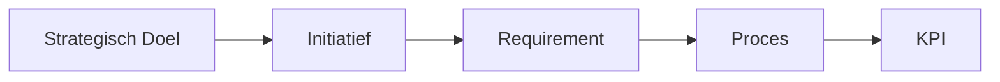

**Toepassing:**

- Gebruik het ERM om **traceerbaarheid** te creëren.
- Koppel **initiatieven aan strategische doelen** voor alignement.

---

---

## **4.3 Hoofdgebied 2: Operationele Uitvoering & Prestatiemeting**

Dit gebied vertaalt **strategie naar concrete uitvoering en meetbare resultaten**.

### **4.3.1 Process Architecture**

**Doel:** Beschrijven van het **proceslandschap** en de **afhankelijkheden** tussen processen.

**Kernelementen:**

- **Proceslandkaarten**: Visueel overzicht van alle processen.
- **Procesmodellen**: Gedetailleerde beschrijvingen (bijv. BPMN, flowcharts).
- **Proces-eigenaarschap**: Wie is verantwoordelijk voor welk proces?

**Voorbeeld:**

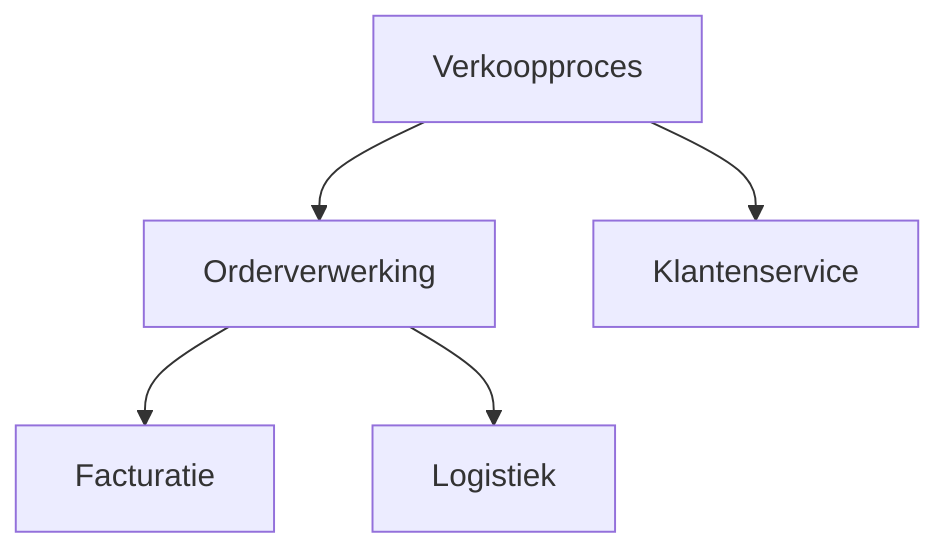

**Toepassing:**

- Gebruik **BPMN** voor complexe processen.
- Definieer **proces-KPI’s** (bijv. doorlooptijd, kosten per transactie).

---

### **4.3.2 Initiative Lifecycle**

**Doel:** Definiëren van **fasen, verbetermodi en exitcriteria** voor initiatieven.

**Kernelementen:**

- **Fasen**: Ideation, Planning, Execution, Monitoring, Closure.
- **Exitcriteria**: Wat moet bereikt zijn om naar de volgende fase te gaan?
- **Verbetermodi**: Agile, Waterfall, Hybride.

**Voorbeeld:**


| **Fase**  | **Doel**                    | **Exitcriteria**          | **Duur** |
| --------- | --------------------------- | ------------------------- | -------- |
| Ideation  | Idee genereren en valideren | Business case goedgekeurd | 2 weken  |
| Planning  | Scope, budget, planning     | Plan goedgekeurd          | 4 weken  |
| Execution | Uitvoering                  | Deliverables opgeleverd   | 12 weken |


**Toepassing:**

- Gebruik de **Initiative Lifecycle** voor **wendbare verandertrajecten**.
- Definieer **meetbare exitcriteria** per fase.

---

### **4.3.3 Performance Monitoring**

**Doel:** Meten van **prestaties** via KPI’s, dashboards en rapportages.

**Kernelementen:**

- **KPI’s**: Key Performance Indicators (bijv. klanttevredenheid, kostenbesparing).
- **Dashboards**: Visuele weergave van prestaties (bijv. Power BI, Tableau).
- **Rapportages**: Periodieke updates over voortgang.

**Voorbeeld:**


| **KPI**           | **Doelstelling** | **Bron**    | **Frequentie** |
| ----------------- | ---------------- | ----------- | -------------- |
| Klanttevredenheid | ≥ 8/10           | Enquête     | Maandelijks    |
| Kostenbesparing   | 20%              | ERP-systeem | Kwartaal       |


**Toepassing:**

- Gebruik **dashboards** voor real-time inzicht.
- **Evalueer KPI’s** maandelijks en stuur bij waar nodig.

---

---

## **4.4 Hoofdgebied 3: Ondersteunende Tools & Implementatie**

Dit gebied ondersteunt de **praktische toepassing** van het 7x Framework.

### **4.4.1 Principle-Based Design**

**Doel:** Ontwerpprincipes voor **veerkrachtige systemen** (gebaseerd op de 7R’s).

**Kernelementen:**

- **Responsible**: Duidelijke verantwoordelijkheden.
- **Resilient**: Veerkrachtige processen.
- **Rational**: Evidence-based besluitvorming.
- **Reusable**: Herbruikbare templates en artefacten.
- **Relatable**: Verbinding tussen strategie en uitvoering.
- **Realisable**: Haalbare en meetbare doelen.
- **Reflective**: Continue evaluatie en leren.

**Toepassing:**

- Gebruik de **7R’s** als **ontwerpprincipes** voor processen en systemen.
- **Evalueer** regelmatig of principes worden nageleefd.

---

### **4.4.2 Catalogue**

**Doel:** Centraal overzicht van **artefacten, templates en standaarden**.

**Kernelementen:**

- **Templates**: Voor procesdocumenten, projectplannen, besluitmatrices.
- **Artefacten**: Documenten, modellen, rapportages.
- **Standaarden**: Definities, terminologie, structuren.

**Voorbeeld:**

```markdown
# Catalogue Structuur
1. Procesdocumenten
   - Template: Procesbeschrijving
   - Template: BPMN-diagram
2. Projectdocumenten
   - Template: Business Case
   - Template: Projectplan
3. Governance
   - Template: Besluitmatrix (RACI)
   - Template: Escalatiepad
```

**Toepassing:**

- Gebruik de **Catalogue** voor **consistente documentatie**.
- **Deel templates** met alle teams.

---

### **4.4.3 Supporting Tools & Artefacts**

**Doel:** Hulpmiddelen voor **modellering, documentatie en governance**.

**Kernelementen:**

- **Modelleringstools**: BPMN, flowcharts, ERD’s.
- **Documentatietools**: Confluence, SharePoint, Notion.
- **Governance-tools**: Jira, Trello, Power BI.

**Voorbeeld:**


| **Tool**      | **Toepassing**    | **Voorbeeld**          |
| ------------- | ----------------- | ---------------------- |
| BPMN (Bizagi) | Procesmodellering | Orderverwerkingsproces |
| Confluence    | Documentatie      | Proceshandboek         |
| Power BI      | Prestatiemetingen | KPI-dashboard          |


**Toepassing:**

- Kies **tools die passen bij je organisatie**.
- **Integreer tools** voor een naadloze workflow.

---

### **4.4.4 Implementation Guide**

**Doel:** Stapsgewijze handleiding voor **succesvolle adoptie** van het 7x Framework.

**Kernelementen:**

- **Stappenplan**: Van analyse tot implementatie.
- **Best Practices**: Lessons learned uit eerdere implementaties.
- **Change Management**: Communicatie en training.

**Voorbeeld:**


| **Stap**         | **Activiteit**                         | **Resultaat**          |
| ---------------- | -------------------------------------- | ---------------------- |
| 1. Analyse       | Huidige situatie in kaart brengen      | Rapport met knelpunten |
| 2. Ontwerp       | 7x Framework aanpassen aan organisatie | Aangepast framework    |
| 3. Implementatie | Pilotproject uitvoeren                 | Eerste resultaten      |
| 4. Evaluatie     | Lessons learned documenteren           | Verbeterpunten         |


**Toepassing:**

- Begin met een **pilotproject**.
- **Train medewerkers** in het gebruik van het framework.

---

### **4.4.5 Future Integrations**

**Doel:** Roadmap voor **toekomstige uitbreidingen** van het framework.

**Kernelementen:**

- **API-koppelingen**: Integratie met bestaande systemen.
- **Nieuwe modules**: Uitbreiding met extra functionaliteit.
- **Technologische innovaties**: AI, automatisering, data-analyse.

**Voorbeeld:**


| **Integratie** | **Doel**                            | **Voorbeeld**                    |
| -------------- | ----------------------------------- | -------------------------------- |
| ERP-koppeling  | Automatische datastromen            | SAP-integratie                   |
| AI-analyse     | Voorspellende prestatiemetingen     | Chatbot voor procesoptimalisatie |
| Data Lake      | Centrale opslag van organisatiedata | Azure Data Lake                  |


**Toepassing:**

- **Plan uitbreidingen** op basis van organisatiebehoeften.
- **Monitor technologische ontwikkelingen**.

---

### **4.4.6 Appendices**

**Doel:** Aanvullende informatie, **voorbeelden en referenties**.

**Kernelementen:**

- **Case Studies**: Succesverhalen van andere organisaties.
- **Glossary**: Definities van termen.
- **Referenties**: Bronnen en verdere lezing.

**Voorbeeld:**


| **Appendix**       | **Inhoud**                      | **Doel**                          |
| ------------------ | ------------------------------- | --------------------------------- |
| Case Study: Bank X | Implementatie 7x Framework      | Inspiratie voor eigen organisatie |
| Glossary           | Definities van 7x-termijnologie | Eenduidig taalgebruik             |
| Referenties        | Boeken, artikelen, whitepapers  | Verdieping                        |


**Toepassing:**

- Gebruik **case studies** als inspiratie.
- Raadpleeg de **glossary** voor eenduidige termen.

---

---

## **4.5 Samenvatting: Twaalf kernelementen van het 7x Framework**


| **Hoofdgebied**                               | **Kernelement**              | **Doel**                           |
| --------------------------------------------- | ---------------------------- | ---------------------------------- |
| **Strategische Alignement & Governance**      | Strategy Definition          | Definiëren van strategische doelen |
| &nbsp;                                        | Governance Structure         | Formaliseren van besluitvorming    |
| &nbsp;                                        | Entity Relationship Model    | Standaardiseren van entiteiten     |
| **Operationele Uitvoering & Prestatiemeting** | Process Architecture         | Beschrijven van proceslandschap    |
| &nbsp;                                        | Initiative Lifecycle         | Definiëren van initiatieffasen     |
| &nbsp;                                        | Performance Monitoring       | Meten van prestaties               |
| **Ondersteunende Tools & Implementatie**      | Principle-Based Design       | Ontwerpprincipes (7R’s)            |
| &nbsp;                                        | Catalogue                    | Overzicht van artefacten           |
| &nbsp;                                        | Supporting Tools & Artefacts | Hulpmiddelen voor toepassing       |
| &nbsp;                                        | Implementation Guide         | Stapsgewijze implementatie         |
| &nbsp;                                        | Future Integrations          | Roadmap voor uitbreidingen         |
| &nbsp;                                        | Appendices                   | Aanvullende informatie             |


**Kernboodschap:**

> *"Het 7x Framework bestaat uit **twaalf kernelementen**, onderverdeeld in drie hoofdgebieden, die samen een **coherent, adaptief en meetbaar organisatiemodel** vormen."*

---

**Volgende hoofdstuk:**  
🔗 [Hoofdstuk 5: Entity Relationship Model – Structuur van entiteiten en relaties](#)


title: "Hoofdstuk 5: Entity Relationship Model – Structuur van entiteiten en relaties"  
description: Een diepgaande uitleg over het Entity Relationship Model (ERM) binnen het 7x Framework, inclusief entiteiten, relaties, metadata en praktische toepassingen.

---

# **Hoofdstuk 5: Entity Relationship Model – Structuur van entiteiten en relaties**

## **5.1 Inleiding: Waarom een Entity Relationship Model (ERM)?**

Het **Entity Relationship Model (ERM)** is het **hart** van het 7x Framework. Het biedt een **gestructureerde manier** om **entiteiten** (zoals strategische doelen, initiatieven, processen) en hun **onderlinge relaties** te definiëren, waardoor:  
✅ **Traceerbaarheid** ontstaat tussen strategie en uitvoering.  
✅ **Consistentie** wordt gewaarborgd in documentatie en besluitvorming.  
✅ **Accountability** duidelijk is (wie is verantwoordelijk voor wat?).  
✅ **Data-gedreven besluitvorming** mogelijk wordt.

**Kernboodschap:**

> *"Het ERM is de **structurele ruggengraat** van het 7x Framework, die zorgt voor **samenhang, traceerbaarheid en meetbaarheid** in organisatorische processen."*

---

## **5.2 Wat is een Entity Relationship Model (ERM)?**

Een **ERM** is een **conceptueel model** dat:

- **Entiteiten** definieert (bijv. strategische doelen, initiatieven, processen).
- **Relaties** tussen entiteiten beschrijft (bijv. "een initiatief draagt bij aan een strategisch doel").
- **Metadata** toevoegt (bijv. status, eigenaar, datum).

**Voorbeeld:**  
Een **strategisch doel** ("Klanttevredenheid verhogen") is gekoppeld aan een **initiatief** ("Implementatie klantportaal"), dat weer gekoppeld is aan **requirements**, **processen** en **KPI’s**.

---

### **5.2.1 Entiteiten in het 7x Framework**

Hieronder een overzicht van de **belangrijkste entiteiten** in het ERM:


| **Entiteit**         | **Beschrijving**                                | **Voorbeeld**                              |
| -------------------- | ----------------------------------------------- | ------------------------------------------ |
| **Strategisch Doel** | Wat de organisatie wil bereiken.                | "Marktleider worden in duurzame energie."  |
| **Initiatief**       | Project of programma om een doel te realiseren. | "Implementatie van een nieuw CRM-systeem." |
| **Requirement**      | Eisen waaraan een initiatief moet voldoen.      | "Systeem moet AVG-compliant zijn."         |
| **Proces**           | Hoe werk wordt uitgevoerd.                      | "Orderverwerking", "Klachtbehandeling".    |
| **Benefit**          | Verwachte resultaten van een initiatief.        | "20% snellere orderverwerking."            |
| **KPI**              | Meetbare prestatie-indicator.                   | "Klanttevredenheidsscore ≥ 8/10."          |
| **Rol**              | Verantwoordelijkheden en bevoegdheden.          | "Proceseigenaar: Logistiek Manager."       |
| **Artefact**         | Documenten, modellen, rapportages.              | "Procesbeschrijving Orderverwerking."      |


---

### **5.2.2 Relaties tussen entiteiten**

Entiteiten zijn **onderling verbonden** via relaties. Hieronder de **belangrijkste relaties**:


| **Relatie**                     | **Beschrijving**                                    | **Voorbeeld**                                                     |
| ------------------------------- | --------------------------------------------------- | ----------------------------------------------------------------- |
| **Draagt bij aan**              | Een initiatief draagt bij aan een strategisch doel. | "Implementatie klantportaal" → "Klanttevredenheid verhogen"       |
| **Heeft als requirement**       | Een initiatief heeft specifieke eisen.              | "Implementatie klantportaal" → "24/7 beschikbaarheid"             |
| **Gebruikt proces**             | Een initiatief maakt gebruik van een proces.        | "Implementatie klantportaal" → "Klachtbehandeling"                |
| **Levert benefit**              | Een initiatief levert een bepaald resultaat.        | "Implementatie klantportaal" → "20% hogere klanttevredenheid"     |
| **Wordt gemeten via**           | Een benefit wordt gemeten via een KPI.              | "20% hogere klanttevredenheid" → "Klanttevredenheidsscore ≥ 8/10" |
| **Is verantwoordelijkheid van** | Een entiteit heeft een eigenaar.                    | "Proces Orderverwerking" → "Logistiek Manager"                    |


---

### **5.2.3 Metadata in het ERM**

**Metadata** voegt **extra informatie** toe aan entiteiten, zoals:

- **Status** (bijv. "In uitvoering", "Afgerond").
- **Eigenaar** (wie is verantwoordelijk?).
- **Datum** (wanneer is de entiteit aangemaakt/bijgewerkt?).
- **Versie** (voor versiebeheer).

**Voorbeeld:**


| **Entiteit**                             | **Metadata**                                                                |
| ---------------------------------------- | --------------------------------------------------------------------------- |
| Initiatief: "Implementatie klantportaal" | Status: In uitvoering, Eigenaar: IT Manager, Datum: 01-01-2025, Versie: 1.2 |


---

---

## **5.3 Hoe werkt het ERM in de praktijk?**

### **5.3.1 Voorbeeld: Traceerbaarheid van strategie naar uitvoering**

Stel, een organisatie heeft het **strategische doel** *"Klanttevredenheid verhogen"*. Het ERM maakt inzichtelijk **hoe dit doel wordt gerealiseerd**:

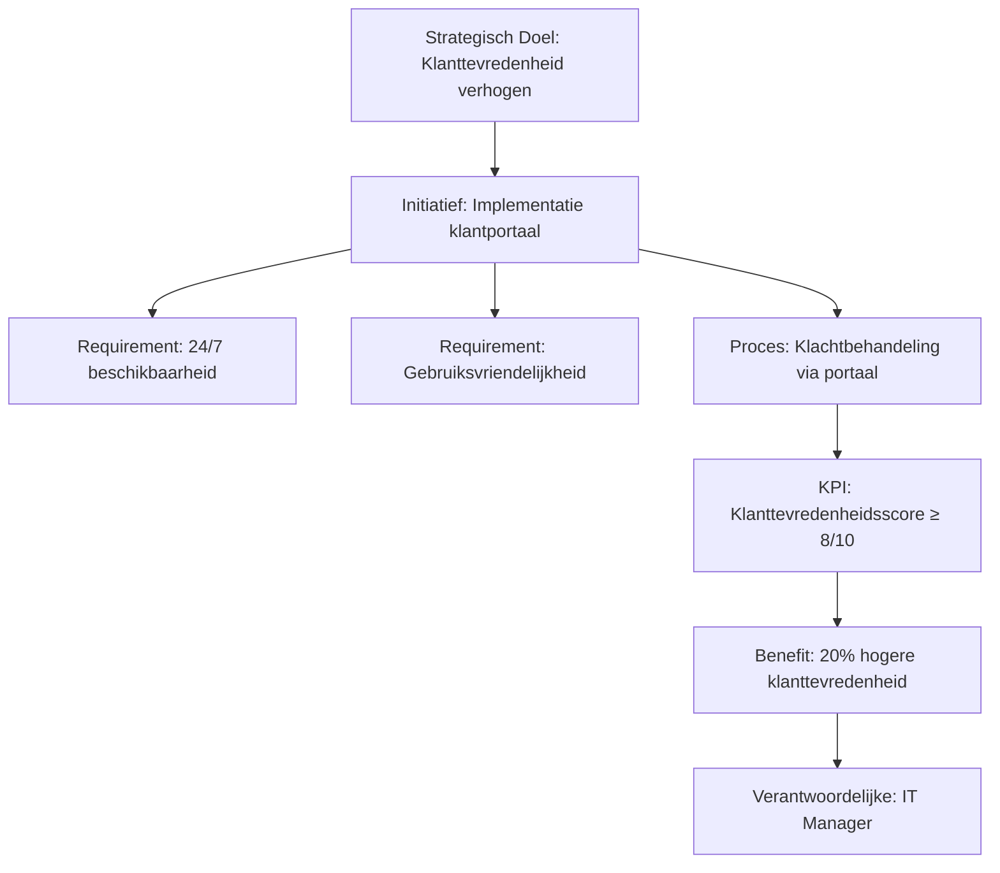

**Uitleg:**

1. Het **strategische doel** is gekoppeld aan een **initiatief**.
2. Het initiatief heeft **requirements** (bijv. 24/7 beschikbaarheid).
3. Het initiatief maakt gebruik van een **proces** (bijv. klachtbehandeling).
4. Het proces wordt gemeten via een **KPI**.
5. De KPI levert een **benefit** (bijv. hogere klanttevredenheid).
6. Een **rol** is verantwoordelijk voor het initiatief.

---

### **5.3.2 Voorbeeld: Procesarchitectuur en ERM**

Een **proces** (bijv. "Orderverwerking") is gekoppeld aan **andere entiteiten** in het ERM:


| **Entiteit**            | **Relatie**                 | **Gerelateerde Entiteit**                  |
| ----------------------- | --------------------------- | ------------------------------------------ |
| Proces: Orderverwerking | Gebruikt door               | Initiatief: Automatisering orderverwerking |
| Proces: Orderverwerking | Heeft als KPI               | Doorlooptijd < 2 uur                       |
| Proces: Orderverwerking | Is verantwoordelijkheid van | Rol: Logistiek Manager                     |
| Proces: Orderverwerking | Draagt bij aan              | Strategisch Doel: Efficiëntie verhogen     |


**Visuele weergave:**

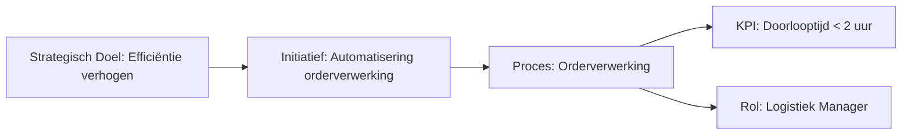

---

---

## **5.4 Voordelen van het Entity Relationship Model**


| **Voordeel**                     | **Uitleg**                                 | **Praktijkvoorbeeld**                                     |
| -------------------------------- | ------------------------------------------ | --------------------------------------------------------- |
| **Traceerbaarheid**              | Inzicht in hoe strategie wordt uitgevoerd. | Een initiatief is traceerbaar naar een strategisch doel.  |
| **Consistentie**                 | Alle entiteiten volgen dezelfde structuur. | Processen worden uniform gedocumenteerd.                  |
| **Accountability**               | Duidelijke verantwoordelijkheden.          | Een "Proceseigenaar" is verantwoordelijk voor een proces. |
| **Data-gedreven besluitvorming** | Beslissingen gebaseerd op feiten.          | KPI’s tonen aan of een initiatief succesvol is.           |
| **Leren en verbeteren**          | Inzicht in wat werkt (en wat niet).        | Lessons learned uit afgeronde initiatieven.               |


---

---

## **5.5 Hoe implementeer je het ERM?**

### **5.5.1 Stap 1: Entiteiten identificeren**

- **Inventariseer** alle relevante entiteiten (bijv. strategische doelen, processen, rollen).
- **Gebruik templates** (bijv. een lijst met entiteitstypen).

**Voorbeeld:**

```markdown
# Entiteiten in ons ERM
1. Strategische doelen
2. Initiatieven
3. Processen
4. Requirements
5. Benefits
6. KPI's
7. Rollen
```

---

### **5.5.2 Stap 2: Relaties definiëren**

- **Bepaal hoe entiteiten met elkaar verbonden zijn** (bijv. "een initiatief draagt bij aan een strategisch doel").
- **Gebruik een visuele tool** (bijv. Lucidchart, Miro) om relaties in kaart te brengen.

**Voorbeeld:**

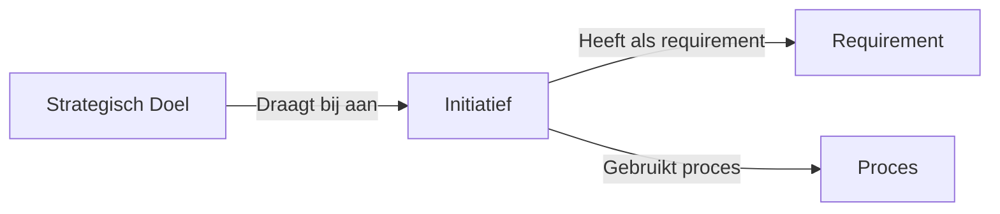

---

### **5.5.3 Stap 3: Metadata toevoegen**

- **Voeg metadata toe** aan entiteiten (bijv. status, eigenaar, datum).
- **Gebruik een centrale opslag** (bijv. Confluence, SharePoint) voor beheer.

**Voorbeeld:**


| **Entiteit**                           | **Metadata**                                                   |
| -------------------------------------- | -------------------------------------------------------------- |
| Initiatief: Implementatie klantportaal | Status: In uitvoering, Eigenaar: IT Manager, Datum: 01-01-2025 |


---

### **5.5.4 Stap 4: Valideer en onderhoud**

- **Valideer** het ERM met stakeholders (bijv. proceseigenaren, IT, management).
- **Onderhoud** het model door regelmatige updates (bijv. kwartaalreviews).

**Tip:**  
Gebruik een **versiebeheersysteem** (bijv. Git, SharePoint) om wijzigingen bij te houden.

---

---

## **5.6 Integratie met andere 7x Framework-elementen**

Het **ERM** is gekoppeld aan andere kernelementen van het 7x Framework:


| **Kernelement**              | **Koppeling met ERM**                             | **Voorbeeld**                                             |
| ---------------------------- | ------------------------------------------------- | --------------------------------------------------------- |
| **Strategic Alignment Grid** | Koppelt strategische doelen aan initiatieven.     | Een initiatief is gekoppeld aan een strategisch doel.     |
| **Governance Structure**     | Definieert verantwoordelijkheden voor entiteiten. | Een "Proceseigenaar" is verantwoordelijk voor een proces. |
| **Process Architecture**     | Beschrijft processen als entiteiten.              | "Orderverwerking" is een proces in het ERM.               |
| **Performance Monitoring**   | Meet KPI’s die gekoppeld zijn aan entiteiten.     | Een KPI meet de prestatie van een proces.                 |


---

---

## **5.7 Samenvatting: Waarom het Entity Relationship Model essentieel is**

Het **Entity Relationship Model** is de **ruggengraat** van het 7x Framework omdat het:  
✅ **Samenhang** creëert tussen strategie en uitvoering.  
✅ **Traceerbaarheid** mogelijk maakt (wie, wat, waarom).  
✅ **Consistentie** waarborgt in documentatie en besluitvorming.  
✅ **Data-gedreven besluitvorming** ondersteunt.

**Kernboodschap:**

> *"Het ERM zorgt ervoor dat organisaties **strategische doelen kunnen vertalen naar meetbare resultaten**, met duidelijke verantwoordelijkheden en traceerbare besluitvorming."*

---

**Volgende hoofdstuk:**  
🔗 [Hoofdstuk 6: Principle-Based Design – Ontwerpprincipes (7R’s)](#)

title: "Hoofdstuk 6: Principle-Based Design – Ontwerpprincipes (7R’s)"  
description: Een diepgaande uitleg over de zeven ontwerpprincipes (7R’s) van het 7x Framework, inclusief praktische toepassingen, voorbeelden en implementatietips.

---

# **Hoofdstuk 6: Principle-Based Design – Ontwerpprincipes (7R’s)**

## **6.1 Inleiding: Waarom principes belangrijk zijn**

De **zeven ontwerpprincipes (7R’s)** vormen de **fundamenten** van het 7x Framework. Ze zorgen voor:  
✅ **Verantwoorde governance** (wie is verantwoordelijk?).  
✅ **Doelgerichte implementatie** (hoe bereiken we resultaten?).  
✅ **Duurzame prestaties** (hoe meten en verbeteren we?).

**Kernboodschap:**

> *"De 7R’s zijn **geen theoretische concepten**, maar **praktische ontwerpprincipes** die organisaties helpen om **wendbaar, veerkrachtig en resultaatgericht** te opereren."*

---

## **6.2 Overzicht van de 7R’s**


| **Principe**    | **Beschrijving**                                    | **Toepassing**                           | **Voorbeeld**                                                             |
| --------------- | --------------------------------------------------- | ---------------------------------------- | ------------------------------------------------------------------------- |
| **Responsible** | Duidelijke verantwoordelijkheden en accountability. | Rollen, governance, besluitbevoegdheden. | Een "Proceseigenaar" is verantwoordelijk voor procesdocumentatie.         |
| **Resilient**   | Veerkrachtige systemen en processen.                | Risicomanagement, adaptieve governance.  | Processen zijn ontworpen om om te gaan met verstoringen.                  |
| **Rational**    | Evidence-based besluitvorming.                      | KPI’s, data-analyse, prestatiemetingen.  | Beslissingen worden genomen op basis van actuele data.                    |
| **Reusable**    | Herbruikbare structuren en artefacten.              | Templates, standaarden, best practices.  | Procesdocumenten volgen een vast template.                                |
| **Relatable**   | Verbinding tussen strategie en uitvoering.          | Alignment modellen, visuele weergaven.   | Een "Strategy Map" toont hoe initiatieven bijdragen aan doelen.           |
| **Realisable**  | Realistische en meetbare doelen.                    | Benefit management, haalbare planning.   | Doelen zijn SMART geformuleerd.                                           |
| **Reflective**  | Continue evaluatie en leren.                        | Feedbacklussen, post-initiatief reviews. | Na afronding van een project wordt een "Lessons Learned"-sessie gehouden. |


---

## **6.3 Principe 1: Responsible – Verantwoordelijkheid en accountability**

### **Wat betekent "Responsible"?**

Duidelijke **verantwoordelijkheden** en **accountability** zorgen ervoor dat:

- Iedereen weet **wie wat doet**.
- **Beslissingen** snel en effectief worden genomen.
- **Resultaten** meetbaar zijn en toegewezen aan een eigenaar.

**Voorbeeld:**


| **Rol**           | **Verantwoordelijkheid**           | **Accountability**   |
| ----------------- | ---------------------------------- | -------------------- |
| Proceseigenaar    | Onderhouden van procesdocumentatie | Procesprestaties     |
| Portfolio Manager | Goedkeuren van budgetten           | Initiatiefresultaten |


---

### **Hoe pas je "Responsible" toe?**

1. **Definieer rollen** (bijv. Proceseigenaar, Initiatiefleider).
2. **Gebruik een RACI-matrix** om verantwoordelijkheden toe te wijzen.
3. **Koppel KPI’s aan rollen** (bijv. "Proceseigenaar is verantwoordelijk voor een doorlooptijd < 2 uur").

**Voorbeeld RACI-matrix:**


| **Taak**                     | **Proceseigenaar** | **IT Manager**  | **Financieel Directeur** |
| ---------------------------- | ------------------ | --------------- | ------------------------ |
| Procesdocumentatie bijwerken | R (Responsible)    | C (Consulted)   | I (Informed)             |
| Budget goedkeuren            | C                  | A (Accountable) | C                        |


---

## **6.4 Principe 2: Resilient – Veerkrachtige systemen en processen**

### **Wat betekent "Resilient"?**

Veerkrachtige systemen en processen kunnen **omgaan met verstoringen** (bijv. marktveranderingen, crises, technologische storingen).

**Voorbeeld:**  
Een **logistiek proces** is ontworpen om **alternatieve routes** te gebruiken bij een transportstoring.

---

### **Hoe pas je "Resilient" toe?**

1. **Identificeer risico’s** (bijv. leveranciersrisico’s, systeemuitval).
2. **Ontwerp back-upplannen** (bijv. alternatieve leveranciers).
3. **Test veerkracht** via scenario-analyses.

**Voorbeeld:**


| **Risico**         | **Mitigatiemaatregel**    | **Verantwoordelijke** |
| ------------------ | ------------------------- | --------------------- |
| Systeemuitval      | Back-up systeem           | IT Manager            |
| Leveranciersrisico | Alternatieve leveranciers | Inkoop Manager        |


---

## **6.5 Principe 3: Rational – Evidence-based besluitvorming**

### **Wat betekent "Rational"?**

Beslissingen worden genomen op basis van **feiten en data**, niet op aannames of politiek.

**Voorbeeld:**  
Een **investering in automatisering** wordt goedgekeurd omdat data aantoont dat het **20% kosten bespaart**.

---

### **Hoe pas je "Rational" toe?**

1. **Definieer KPI’s** voor elk initiatief.
2. **Gebruik dashboards** voor real-time inzicht.
3. **Baseer beslissingen op data** (bijv. "Dit initiatief levert €500.000 besparing op").

**Voorbeeld KPI-dashboard:**


| **KPI**           | **Doelstelling** | **Actuele Waarde** | **Status**           |
| ----------------- | ---------------- | ------------------ | -------------------- |
| Klanttevredenheid | ≥ 8/10           | 7,5                | ⚠️ Verbetering nodig |
| Kostenbesparing   | 20%              | 15%                | 🟢 Op schema         |


---

## **6.6 Principe 4: Reusable – Herbruikbare structuren en artefacten**

### **Wat betekent "Reusable"?**

Gebruik **standaard templates, structuren en best practices** om **efficiëntie** te vergroten en **consistentie** te waarborgen.

**Voorbeeld:**  
Een **procesdocument** volgt altijd hetzelfde template, zodat medewerkers weten wat ze kunnen verwachten.

---

### **Hoe pas je "Reusable" toe?**

1. **Maak templates** voor procesdocumenten, projectplannen, besluitmatrices.
2. **Gebruik een centrale bibliotheek** (bijv. Confluence, SharePoint).
3. **Deel best practices** tussen teams.

**Voorbeeld template voor een procesdocument:**

```markdown
# [Procesnaam]
## 1. Doel
## 2. Scope
## 3. Verantwoordelijkheden
## 4. Stappen
## 5. KPI's
```

---

## **6.7 Principe 5: Relatable – Verbinding tussen strategie en uitvoering**

### **Wat betekent "Relatable"?**

Zorgt voor een **duidelijke verbinding** tussen **strategische doelen** en **dagelijkse uitvoering**, zodat medewerkers begrijpen **hoe hun werk bijdraagt aan het geheel**.

**Voorbeeld:**  
Een **medewerker in klantenservice** ziet hoe zijn werk bijdraagt aan het strategische doel *"Klanttevredenheid verhogen"*.

---

### **Hoe pas je "Relatable" toe?**

1. **Gebruik een Strategic Alignment Grid** om doelen te koppelen aan initiatieven.
2. **Maak visuele modellen** (bijv. strategy maps, proceslandkaarten).
3. **Communiceer regelmatig** over hoe werk bijdraagt aan strategie.

**Voorbeeld Strategy Map:**

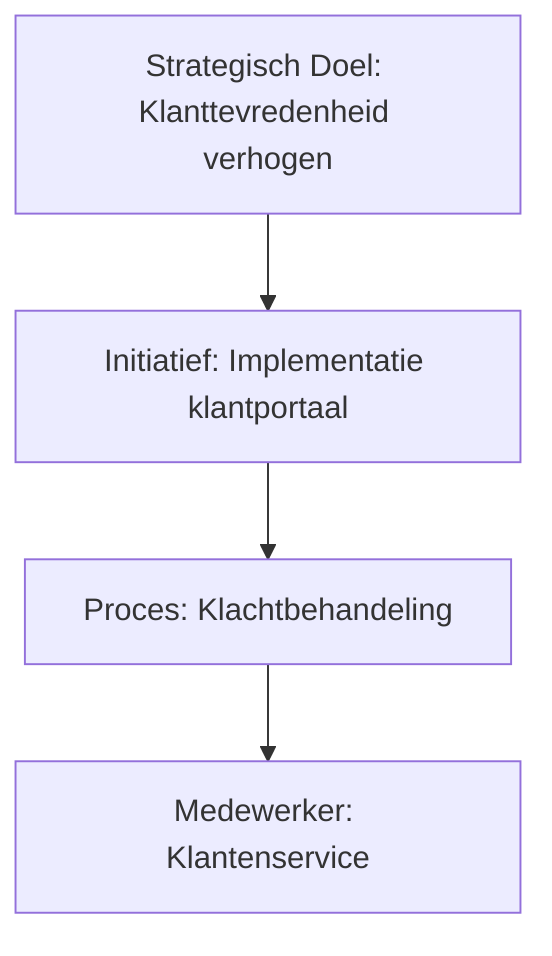

---

## **6.8 Principe 6: Realisable – Realistische en meetbare doelen**

### **Wat betekent "Realisable"?**

Doelen zijn **haalbaar, meetbaar en tijdgebonden** (SMART).

**Voorbeeld:**  
❌ **"Klanttevredenheid verbeteren"** (vaag).  
✅ **"Klanttevredenheidsscore verhogen van 7,5 naar 8,5 binnen 6 maanden"** (SMART).

---

### **Hoe pas je "Realisable" toe?**

1. **Formuleer doelen SMART**:
  - **Specifiek** (wat willen we bereiken?).
  - **Meetbaar** (hoe meten we succes?).
  - **Acceptabel** (is het realistisch?).
  - **Relevant** (sluit het aan bij strategie?).
  - **Tijdgebonden** (wanneer moet het bereikt zijn?).
2. **Koppel doelen aan KPI’s**.
3. **Monitor voortgang** via dashboards.

**Voorbeeld SMART-doel:**


| **Doel**                   | **Meetbaar** | **Tijdpad** | **Verantwoordelijke**  |
| -------------------------- | ------------ | ----------- | ---------------------- |
| Klanttevredenheid verhogen | Score ≥ 8/10 | 6 maanden   | Klantenservice Manager |


---

## **6.9 Principe 7: Reflective – Continue evaluatie en leren**

### **Wat betekent "Reflective"?**

Organisaties **leren van ervaringen** en **verbeteren continu** door:

- **Feedbacklussen** (bijv. retrospectives).
- **Lessons learned** documenteren.
- **Prestaties evalueren** en bijsturen.

**Voorbeeld:**  
Na afronding van een project wordt een **"Lessons Learned"-sessie** gehouden om te bespreken **wat goed ging en wat beter kan**.

---

### **Hoe pas je "Reflective" toe?**

1. **Houd retrospectives** na elk initiatief.
2. **Documenteer lessons learned** in een centrale bibliotheek.
3. **Pas verbeterpunten toe** in toekomstige initiatieven.

**Voorbeeld Lessons Learned:**


| **Initiatief**             | **Wat goed ging**                              | **Wat beter kan**                 | **Actiepunt**                          |
| -------------------------- | ---------------------------------------------- | --------------------------------- | -------------------------------------- |
| Implementatie klantportaal | Goede samenwerking tussen IT en klantenservice | Te late levering door leverancier | Alternatieve leveranciers contracteren |


---

---

## **6.10 Hoe implementeer je de 7R’s in je organisatie?**

### **Stap 1: Bewustwording creëren**

- **Train medewerkers** in de 7R-principes.
- **Gebruik voorbeelden** uit de praktijk.

**Tip:**  
Organiseer een **workshop** waarin teams de principes toepassen op hun eigen werk.

---

### **Stap 2: Principes integreren in processen**

- **Pas de 7R’s toe** in procesdocumenten, projectplannen en besluitvorming.
- **Gebruik templates** die de principes weerspiegelen.

**Voorbeeld:**  
Een **procesdocument** bevat een sectie **"Lessons Learned"** (Reflective) en **KPI’s** (Rational).

---

### **Stap 3: Monitor en evalueren**

- **Meet naleving** van de principes (bijv. via audits).
- **Evalueer impact** (bijv. "Heeft het toepassen van 'Resilient' geleid tot minder verstoringen?").

**Voorbeeld evaluatie:**


| **Principe** | **Naleving** | **Impact**                          |
| ------------ | ------------ | ----------------------------------- |
| Responsible  | 90%          | Duidelijkere verantwoordelijkheden  |
| Reflective   | 70%          | Meer lessons learned gedocumenteerd |


---

### **Stap 4: Continue verbetering**

- **Stel doelen** voor verbetering (bijv. "100% naleving van 'Realisable' binnen 6 maanden").
- **Deel successen** en leerpunten binnen de organisatie.

---

---

## **6.11 Samenvatting: Waarom de 7R’s essentieel zijn**

De **7R’s** vormen de **basis** voor een **wendbare, veerkrachtige en resultaatgerichte organisatie**:


| **Principe** | **Waarom belangrijk?**           | **Resultaat**         |
| ------------ | -------------------------------- | --------------------- |
| Responsible  | Duidelijke verantwoordelijkheden | Betere accountability |
| Resilient    | Veerkrachtige processen          | Minder verstoringen   |
| Rational     | Data-gedreven beslissingen       | Betere resultaten     |
| Reusable     | Herbruikbare structuren          | Efficiënter werken    |
| Relatable    | Verbinding strategie-uitvoering  | Meer betrokkenheid    |
| Realisable   | Haalbare doelen                  | Hogere succesratio    |
| Reflective   | Continue leren                   | Snellere verbetering  |


**Kernboodschap:**

> *"De 7R’s zijn **geen theoretische concepten**, maar **praktische richtlijnen** die organisaties helpen om **strategische doelen te realiseren**, **processen te optimaliseren** en **duurzame waarde te creëren**."*

---

**Volgende hoofdstuk:**  
🔗 [Hoofdstuk 7: Supporting Tools & Artefacts – Hulpmiddelen en templates](#)

title: "Hoofdstuk 7: Supporting Tools & Artefacts – Hulpmiddelen en templates voor praktische toepassing"  
description: Een overzicht van de ondersteunende tools, templates en artefacten die het 7x Framework biedt voor succesvolle implementatie, inclusief voorbeelden en praktische tips.

---

# **Hoofdstuk 7: Supporting Tools & Artefacts – Hulpmiddelen en templates voor praktische toepassing**

## **7.1 Inleiding: Waarom ondersteunende tools belangrijk zijn**

Het **7x Framework** is niet alleen een **theoretisch model**, maar ook een **praktisch instrument** voor organisaties. **Supporting Tools & Artefacts** zorgen voor:  
✅ **Consistentie** in documentatie en processen.  
✅ **Efficiëntie** door herbruikbare templates.  
✅ **Samenwerking** tussen teams en afdelingen.  
✅ **Traceerbaarheid** van beslissingen en resultaten.

**Kernboodschap:**

> *"De juiste tools en artefacten maken het verschil tussen **theorie en praktijk** – ze helpen organisaties om het 7x Framework **succesvol te implementeren en te onderhouden**."*

---

## **7.2 Overzicht van Supporting Tools & Artefacts**


| **Categorie**         | **Voorbeelden**                                        | **Doel**                                                |
| --------------------- | ------------------------------------------------------ | ------------------------------------------------------- |
| **Modelleringstools** | BPMN (Bizagi, Signavio), Flowcharts (Lucidchart, Miro) | Visuele weergave van processen en initiatieven.         |
| **Documentatietools** | Confluence, SharePoint, Notion                         | Centrale opslag van procesdocumenten en artefacten.     |
| **Projectmanagement** | Jira, Trello, Asana                                    | Beheer van initiatieven en taken.                       |
| **Prestatiemetingen** | Power BI, Tableau, Excel                               | Dashboards voor KPI’s en prestatieanalyse.              |
| **Governance**        | RACI-matrices, besluitlogboeken                        | Structuur voor besluitvorming en verantwoordelijkheden. |
| **Templates**         | Procesdocumenten, projectplannen, besluitmatrices      | Standaardisatie en efficiëntie.                         |
| **Kennisbibliotheek** | Centrale opslag van lessons learned, best practices    | Leren en verbeteren.                                    |


---

## **7.3 Modelleringstools: Processen en initiatieven visualiseren**

### **7.3.1 BPMN (Business Process Model and Notation)**

**Doel:** Visuele weergave van **complexe processen** met vertakkingen, lussen en afhankelijkheden.

**Voorbeeld:**  
Een **orderverwerkingsproces** gemodelleerd in BPMN:

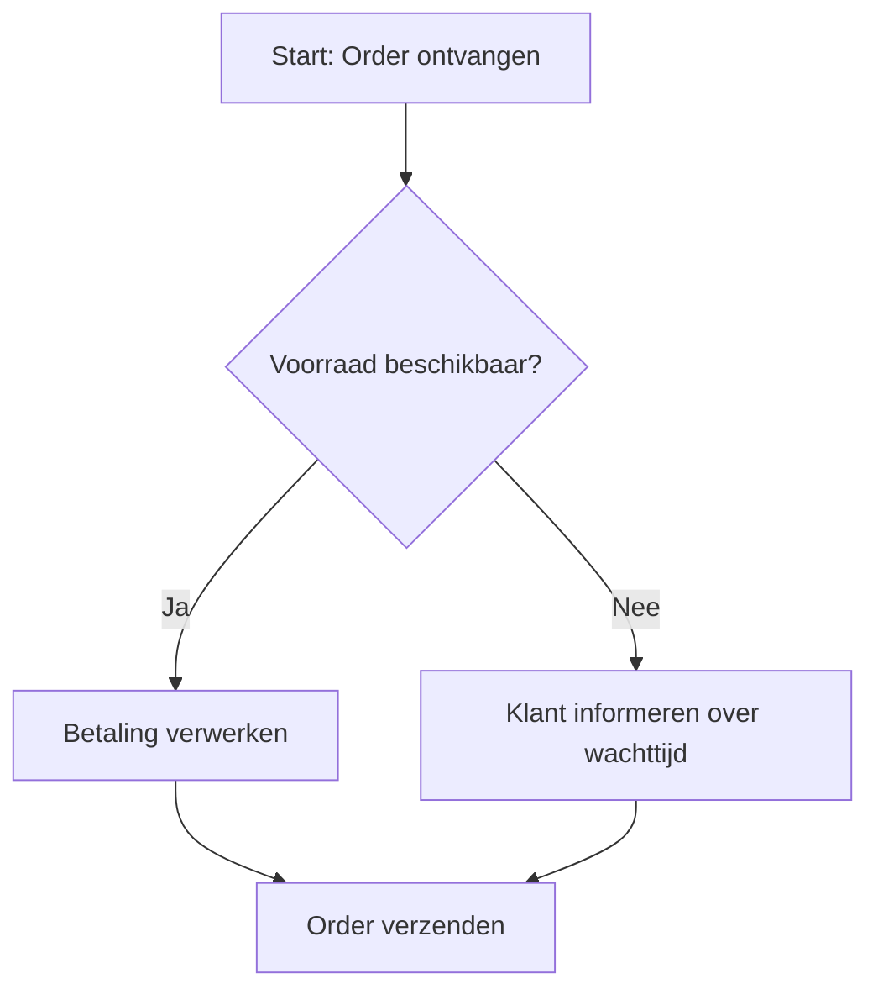

**Tools:**

- **Bizagi**
- **Signavio**
- **Lucidchart**

**Toepassing:**

- Gebruik BPMN voor **complexe processen** (bijv. klachtbehandeling, inkoop).
- **Koppel BPMN-modellen** aan het **Entity Relationship Model (ERM)** voor traceerbaarheid.

---

### **7.3.2 Flowcharts**

**Doel:** Eenvoudige, **lineaire processen** visualiseren.

**Voorbeeld:**  
Een **stappenplan voor het opstarten van een nieuwe medewerker**:

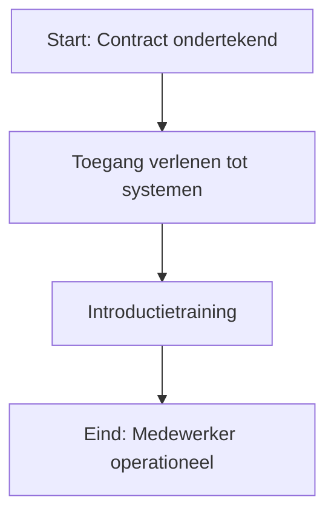

**Tools:**

- **Miro**
- **Lucidchart**
- **Microsoft Visio**

**Toepassing:**

- Gebruik flowcharts voor **eenvoudige processen** (bijv. onboarding, factuurverwerking).
- **Voeg metadata toe** (bijv. verantwoordelijke, KPI’s).

---

---

## **7.4 Documentatietools: Centrale opslag van kennis**

### **7.4.1 Confluence**

**Doel:** **Centrale opslag** van procesdocumenten, projectplannen en artefacten.

**Voorbeeldstructuur:**

```
📁 7x Framework
├── 📁 Strategie
│   ├── Strategische doelen.md
│   └── Strategic Alignment Grid.xlsx
├── 📁 Processen
│   ├── Orderverwerking.md
│   └── Klachtbehandeling.bpmn
└── 📁 Initiatieven
    ├── Implementatie klantportaal.md
    └── Automatisering factuurverwerking.xlsx
```

**Voordelen:**  
✅ **Centrale opslag** (één plek voor alle documenten).  
✅ **Versiebeheer** (wijzigingen zijn traceerbaar).  
✅ **Samenwerking** (teams kunnen gelijktijdig werken).

**Toepassing:**

- **Gebruik templates** voor consistentie.
- **Koppel documenten** aan het **ERM** voor traceerbaarheid.

---

### **7.4.2 SharePoint**

**Doel:** **Documentbeheer** en **samenwerking** binnen Microsoft 365.

**Voorbeeld:**  
Een **procesdocument** in SharePoint met:

- **Metadata** (bijv. eigenaar, versie, datum).
- **Workflow** voor goedkeuring.

**Voordelen:**  
✅ **Integratie met Office 365** (Word, Excel, Teams).  
✅ **Toegangbeheer** (wie mag wat zien/bewerken?).  
✅ **Automatisering** (bijv. goedkeuringsworkflows).

**Toepassing:**

- **Gebruik metadata** voor zoekbaarheid.
- **Automatiseer goedkeuringsprocessen**.

---

---

## **7.5 Projectmanagement: Initiatieven beheren**

### **7.5.1 Jira**

**Doel:** **Beheer van initiatieven en taken** (met name voor Agile/Scrum).

**Voorbeeld:**  
Een **initiatief** ("Implementatie klantportaal") in Jira:

- **Epic**: Hoofdinitiatief.
- **User Stories**: Specifieke taken (bijv. "Ontwerp login-pagina").
- **Sprints**: Tijdsboxen voor uitvoering.

**Voordelen:**  
✅ **Agile-projectmanagement** (Scrum, Kanban).  
✅ **Traceerbaarheid** (wie doet wat, wanneer?).  
✅ **Integratie met Confluence** (koppeling met documentatie).

**Toepassing:**

- **Gebruik de Initiative Lifecycle** als raamwerk.
- **Koppel Jira-taken** aan **strategische doelen** in het ERM.

---

### **7.5.2 Trello**

**Doel:** **Visueel takenbeheer** (Kanban-borden).

**Voorbeeld:**  
Een **Kanban-board** voor een initiatief:

```
📌 To Do | 📌 In Progress | 📌 Done
---------|--------------|--------
Ontwerp portal | Bouw backend | -
Testen | - | -
```

**Voordelen:**  
✅ **Eenvoudig en visueel**.  
✅ **Flexibel** (past bij elke methodiek).  
✅ **Integratie met andere tools** (Slack, Google Drive).

**Toepassing:**

- **Gebruik kolommen** voor de **Initiative Lifecycle** (Ideation, Planning, Execution).
- **Voeg labels toe** voor prioritering (bijv. "Strategisch", "Operationeel").

---

---

## **7.6 Prestatiemetingen: KPI’s en dashboards**

### **7.6.1 Power BI**

**Doel:** **Visuele weergave** van KPI’s en prestaties.

**Voorbeeld dashboard:**


| **KPI**                      | **Doelstelling** | **Actuele Waarde** | **Trend**   |
| ---------------------------- | ---------------- | ------------------ | ----------- |
| Klanttevredenheid            | ≥ 8/10           | 7,8                | 📈 Stijgend |
| Doorlooptijd orderverwerking | < 2 uur          | 1,5 uur            | 📉 Dalend   |


**Voordelen:**  
✅ **Real-time inzicht** in prestaties.  
✅ **Interactieve visualisaties** (drill-down, filters).  
✅ **Koppeling met databronnen** (ERP, CRM).

**Toepassing:**

- **Koppel KPI’s** aan **strategische doelen** in het ERM.
- **Gebruik dashboards** voor **managementreviews**.

---

### **7.6.2 Tableau**

**Doel:** **Geavanceerde data-analyse** en visualisatie.

**Voorbeeld:**  
Een **heatmap** van procesprestaties:

- **X-as**: Processen (bijv. Orderverwerking, Klachtbehandeling).
- **Y-as**: KPI’s (bijv. Doorlooptijd, Kosten).
- **Kleuren**: Prestaties (groen = goed, rood = slecht).

**Voordelen:**  
✅ **Diepgaande analyses** (bijv. correlaties tussen KPI’s).  
✅ **Self-service analytics** (medewerkers kunnen zelf rapporten maken).  
✅ **Integratie met big data**.

**Toepassing:**

- **Gebruik voor procesoptimalisatie**.
- **Deel inzichten** met stakeholders.

---

---

## **7.7 Governance: Structuur voor besluitvorming**

### **7.7.1 RACI-matrix**

**Doel:** **Duidelijke verantwoordelijkheden** voor beslissingen en taken.

**Voorbeeld:**


| **Taak**                     | **Proceseigenaar** | **IT Manager**  | **Financieel Directeur** |
| ---------------------------- | ------------------ | --------------- | ------------------------ |
| Procesdocumentatie bijwerken | R (Responsible)    | C (Consulted)   | I (Informed)             |
| Budget goedkeuren            | C                  | A (Accountable) | C                        |


**Voordelen:**  
✅ **Duidelijkheid** over wie wat doet.  
✅ **Minder conflicten** over verantwoordelijkheden.  
✅ **Snellere besluitvorming**.

**Toepassing:**

- **Gebruik in combinatie met de Governance Structure**.
- **Documenteer in Confluence/SharePoint**.

---

### **7.7.2 Besluitlogboek**

**Doel:** **Traceerbaarheid** van beslissingen (wie, wat, wanneer, waarom).

**Voorbeeld:**


| **Besluit**              | **Datum**  | **Genomen door** | **Reden**                       | **Impact**    |
| ------------------------ | ---------- | ---------------- | ------------------------------- | ------------- |
| Keuze voor Leverancier X | 01-01-2025 | Inkoop Manager   | Beste prijs-kwaliteitverhouding | Lagere kosten |


**Voordelen:**  
✅ **Accountability** (wie heeft besloten?).  
✅ **Leren voor de toekomst** (waarom is deze keuze gemaakt?).  
✅ **Compliance** (voldoen aan audit-eisen).

**Toepassing:**

- **Koppel aan het ERM** voor end-to-end traceerbaarheid.
- **Gebruik templates** voor consistentie.

---

---

## **7.8 Templates: Standaardisatie en efficiëntie**

### **7.8.1 Procesdocument-template**

**Doel:** **Consistente procesdocumentatie**.

**Template:**

```markdown
# [Procesnaam]
## 1. Doel
[Beschrijf het doel van het proces.]

## 2. Scope
[Welke activiteiten vallen onder dit proces?]

## 3. Verantwoordelijkheden
| Rol | Verantwoordelijkheid |
|-----|----------------------|
| [Rol] | [Taak] |

## 4. Stappen
1. [Stap 1]
2. [Stap 2]

## 5. KPI's
| KPI | Doelstelling | Bron |
|-----|--------------|------|
| [KPI] | [Doel] | [Systeem] |

## 6. Gerelateerde processen
[Lijst van gerelateerde processen.]

## 7. Versiebeheer
| Versie | Datum | Wijziging | Eigenaar |
|--------|-------|-----------|---------|
| 1.0 | 01-01-2025 | Initiële versie | [Naam] |
```

**Voordelen:**  
✅ **Consistentie** (alle procesdocumenten zien er hetzelfde uit).  
✅ **Efficiëntie** (minder tijd besteed aan opmaak).  
✅ **Traceerbaarheid** (wie heeft wat gewijzigd?).

---

### **7.8.2 Projectplan-template**

**Doel:** **Standaardisatie van projectplannen**.

**Template:**

```markdown
# [Projectnaam]
## 1. Doelstellingen
[Wat wil het project bereiken?]

## 2. Scope
[Wat valt binnen/buiten het project?]

## 3. Stakeholders
| Rol | Naam | Verantwoordelijkheid |
|-----|------|----------------------|
| [Rol] | [Naam] | [Taak] |

## 4. Planning
| Fase | Startdatum | Einddatum | Verantwoordelijke |
|------|------------|-----------|-------------------|
| Ideation | 01-01-2025 | 15-01-2025 | [Naam] |

## 5. Budget
| Post | Bedrag | Goedgekeurd door |
|------|--------|-----------------|
| Software | €50.000 | [Naam] |

## 6. Risico's
| Risico | Impact | Mitigatie | Eigenaar |
|--------|--------|-----------|---------|
| Vertraging leverancier | Hoog | Alternatieve leverancier | [Naam] |

## 7. KPI's
| KPI | Doelstelling | Bron |
|-----|--------------|------|
| Tijdige oplevering | 100% | Projectmanagementtool |
```

---

### **7.8.3 Besluitmatrix-template**

**Doel:** **Duidelijke besluitbevoegdheden**.

**Template:**

```markdown
# Besluitmatrix: [Onderwerp]
| Taak | Rol 1 | Rol 2 | Rol 3 |
|------|--------|--------|--------|
| [Taak 1] | R | A | C |
| [Taak 2] | C | I | R |

**Legenda:**
- R = Responsible (uitvoerend)
- A = Accountable (eindverantwoordelijk)
- C = Consulted (raadgevend)
- I = Informed (geïnformeerd)
```

---

---

## **7.9 Kennisbibliotheek: Leren en verbeteren**

### **7.9.1 Lessons Learned-database**

**Doel:** **Capturen van leerpunten** uit afgeronde initiatieven.

**Template:**

```markdown
# Lessons Learned: [Initiatiefnaam]
## 1. Wat goed ging
- [Punt 1]
- [Punt 2]

## 2. Wat beter kan
- [Punt 1]
- [Punt 2]

## 3. Actiepunten
| Actiepunt | Verantwoordelijke | Deadline |
|-----------|-------------------|----------|
| [Actie] | [Naam] | [Datum] |
```

**Voordelen:**  
✅ **Leren van ervaringen** (wat werkte, wat niet?).  
✅ **Voorkomen van herhaling van fouten**.  
✅ **Continue verbetering**.

---

### **7.9.2 Best Practices-database**

**Doel:** **Delen van succesvolle aanpakken**.

**Voorbeeld:**

```markdown
# Best Practice: Agile Implementatie
## Context
[Wanneer is deze aanpak toegepast?]

## Aanpak
1. [Stap 1]
2. [Stap 2]

## Resultaten
- [Resultaat 1]
- [Resultaat 2]

## Toepasbaarheid
[Wanneer kan deze aanpak worden hergebruikt?]
```

---

---

## **7.10 Hoe kies je de juiste tools voor je organisatie?**

### **Stap 1: Analyseer behoeften**

- **Welke processen** moeten worden ondersteund? (bijv. procesmanagement, projectmanagement).
- **Welke teams** gaan de tools gebruiken? (bijv. IT, klantenservice, management).
- **Welke integraties** zijn nodig? (bijv. koppeling met ERP, CRM).

**Voorbeeld:**


| **Behoefte**      | **Tool**   | **Reden**                 |
| ----------------- | ---------- | ------------------------- |
| Procesmodellering | Bizagi     | BPMN-ondersteuning        |
| Documentatie      | Confluence | Centrale opslag           |
| Projectmanagement | Jira       | Agile/Scrum-ondersteuning |


---

### **Stap 2: Pilot en evaluatie**

1. **Kies 1-2 tools** voor een pilot.
2. **Train een pilot-team**.
3. **Evalueer** na 3 maanden (bijv. gebruiksgemak, integratie, resultaten).

**Voorbeeld evaluatie:**


| **Tool**   | **Gebruiksgemak** | **Integratie** | **Resultaten**                     | **Doorzetten?** |
| ---------- | ----------------- | -------------- | ---------------------------------- | --------------- |
| Confluence | 9/10              | 8/10           | Goede samenwerking                 | Ja              |
| Trello     | 7/10              | 6/10           | Te beperkt voor complexe projecten | Nee             |


---

### **Stap 3: Schaal op**

- **Implementeer gekozen tools** organisatiebreed.
- **Train medewerkers**.
- **Monitor gebruik en prestaties**.

**Tip:**  
Gebruik een **stapsgewijze aanpak** (bijv. eerst procesmanagement, dan projectmanagement).

---

---

## **7.11 Samenvatting: Waarom Supporting Tools & Artefacts essentieel zijn**

**Supporting Tools & Artefacts** zorgen voor:  
✅ **Consistentie** (templates, standaarden).  
✅ **Efficiëntie** (minder dubbel werk, snellere uitvoering).  
✅ **Samenwerking** (centrale opslag, gedeelde tools).  
✅ **Traceerbaarheid** (besluitlogboeken, metadata).  
✅ **Continue verbetering** (lessons learned, best practices).

**Kernboodschap:**

> *"De juiste tools en artefacten maken het verschil tussen **theorie en praktijk** – ze helpen organisaties om het 7x Framework **succesvol te implementeren en te onderhouden**."*

---

**Volgende hoofdstuk:**  
🔗 [Hoofdstuk 8: Implementation Guide – Stapsgewijze implementatie van het 7x Framework](#)


title: "Hoofdstuk 8: Implementation Guide – Stapsgewijze implementatie van het 7x Framework"  
description: Een praktische, stapsgewijze handleiding voor het implementeren van het 7x Framework in je organisatie, inclusief voorbereiding, pilot, opschaling en continue verbetering.

---

# **Hoofdstuk 8: Implementation Guide – Stapsgewijze implementatie van het 7x Framework**

## **8.1 Inleiding: Waarom een gestructureerde implementatie?**

Het **7x Framework** is een **krachtig organisatiemodel**, maar de **succesvolle implementatie** vereist een **gestructureerde aanpak**. Een **goede implementatie** zorgt voor:  
✅ **Draagvlak** bij medewerkers en management.  
✅ **Alignement** tussen strategie en uitvoering.  
✅ **Meetbare resultaten** (KPI’s, benefits).  
✅ **Duurzame adoptie** (het framework wordt daadwerkelijk gebruikt).

**Kernboodschap:**

> *"Een succesvolle implementatie van het 7x Framework vergt **planning, pilotering, opschaling en continue verbetering** – deze guide helpt je om **stap voor stap** resultaten te behalen."*

---

## **8.2 Fase 1: Voorbereiding – Analyse en planning**

### **8.2.1 Stap 1: Huidige situatie analyseren**

**Doel:** Inzicht krijgen in **knelpunten, behoeften en mogelijkheden** binnen de organisatie.

**Activiteiten:**

1. **Interviews** met stakeholders (management, proces-eigenaren, IT, HR).
2. **Documentanalyse** (bestaande procesdocumenten, projectplannen, KPI-rapportages).
3. **Workshops** om pijnpunten en kansen te identificeren.

**Voorbeeldvragen:**

- Welke **strategische doelen** zijn niet gerealiseerd, en waarom?
- Welke **processen** zijn gefragmenteerd of inefficiënt?
- Welke **tools** worden gebruikt, en hoe zijn ze geïntegreerd?

**Output:**

- **Rapport met knelpunten** (bijv. "Gebrek aan alignement tussen IT en business").
- **Stakeholderanalyse** (wie is betrokken, wat zijn hun belangen?).

---

### **8.2.2 Stap 2: Doelstellingen definiëren**

**Doel:** **Concreet maken** wat je met het 7x Framework wil bereiken.

**Voorbeelden van doelstellingen:**


| **Doelstelling**                 | **Meetbare KPI**                                       | **Verantwoordelijke** |
| -------------------------------- | ------------------------------------------------------ | --------------------- |
| Verbeter strategische alignement | 90% van initiatieven gekoppeld aan strategische doelen | Strategie Manager     |
| Versnel besluitvorming           | 30% snellere goedkeuringsprocessen                     | Governance Manager    |
| Verhoog traceerbaarheid          | 100% beslissingen gedocumenteerd in ERM                | IT Manager            |


**Tip:**  
Gebruik de **SMART-methode** (Specifiek, Meetbaar, Acceptabel, Realistisch, Tijdgebonden).

---

### **8.2.3 Stap 3: Implementatiestrategie kiezen**

**Opties:**

1. **Big Bang**: Het hele framework in één keer implementeren (geschikt voor kleine organisaties).
2. **Fased Approach**: Stapsgewijs implementeren (geschikt voor grote organisaties).
3. **Pilot First**: Eerst een pilot, dan opschalen (aanbevolen aanpak).

**Aanbevolen aanpak:**  
🔹 **Pilot First** (minimaal risico, maximale leerervaring).

---

### **8.2.4 Stap 4: Resources en planning**

**Doel:** Zorgen voor **voldoende middelen** (tijd, budget, mensen) en een **realistisch plan**.

**Checklist:**

- **Budget** (bijv. voor tools, training, consultancy).
- **Team** (wie is betrokken bij implementatie?).
- **Tijdlijn** (wanneer zijn milestones bereikt?).

**Voorbeeld planning:**

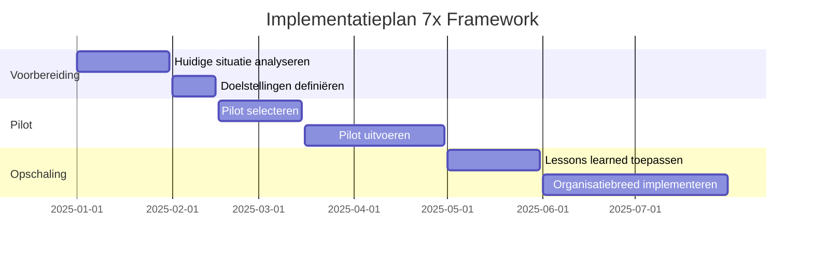

---

---

## **8.3 Fase 2: Pilot – Testen en leren**

### **8.3.1 Stap 1: Pilot selecteren**

**Doel:** Kies een **geschikt pilootproces of -initiatief** om het framework te testen.

**Criteria voor een goede pilot:**  
✅ **Beperkte scope** (niet te complex).  
✅ **Relevant voor strategische doelen**.  
✅ **Betrokkenheid van key stakeholders**.

**Voorbeelden:**

- **Proces:** "Klachtbehandeling" (eenvoudig, meetbaar).
- **Initiatief:** "Implementatie klantportaal" (strategisch relevant).

---

### **8.3.2 Stap 2: Pilot voorbereiden**

**Activiteiten:**

1. **Definieer pilotdoelstellingen** (bijv. "Verbeter doorlooptijd klachtbehandeling met 20%").
2. **Selecteer tools** (bijv. Confluence voor documentatie, Jira voor projectmanagement).
3. **Train het pilotteam** in het 7x Framework.

**Checklist:**

- Pilotdoelstellingen gedefinieerd.
- Tools geselecteerd en geconfigureerd.
- Team getraind (workshop, handleidingen).

---

### **8.3.3 Stap 3: Pilot uitvoeren**

**Doel:** Het framework **toepassen** op de pilot en **leren** van de ervaring.

**Activiteiten:**

1. **Pas het 7x Framework toe**:
  - Gebruik de **Strategic Alignment Grid** om het initiatief te koppelen aan strategische doelen.
  - Documenteer het proces in het **Entity Relationship Model (ERM)**.
  - Gebruik de **Initiative Lifecycle** voor sturing.
2. **Monitor prestaties** (KPI’s, feedback).
3. **Documenteer lessons learned**.

**Voorbeeld:**


| **Activiteit**      | **Tool/Principe** | **Resultaat**                           |
| ------------------- | ----------------- | --------------------------------------- |
| Proces documenteren | ERM, BPMN         | Gestructureerd procesdocument           |
| KPI’s meten         | Power BI          | Doorlooptijd gedaald van 5 naar 4 dagen |
| Lessons learned     | Confluence        | 3 verbeterpunten geïdentificeerd        |


---

### **8.3.4 Stap 4: Pilot evalueren**

**Doel:** **Leren** van de pilot en **verbeterpunten** identificeren.

**Vragen om te beantwoorden:**

- Wat werkte **goed**?
- Wat kan **beter**?
- Welke **aanpassingen** zijn nodig voor opschaling?

**Output:**

- **Evaluatierapport** met bevindingen.
- **Aanpassingen** aan het implementatieplan.

**Voorbeeld evaluatie:**


| **Aspect**         | **Succes**                  | **Verbeterpunt**                 | **Actie**                      |
| ------------------ | --------------------------- | -------------------------------- | ------------------------------ |
| Procesdocumentatie | Duidelijk en gestructureerd | Te veel tijd nodig voor updates  | Automatiseren met templates    |
| Besluitvorming     | Sneller door RACI           | Niet alle stakeholders betrokken | Extra training                 |
| KPI-metingen       | Goed inzicht                | Data niet altijd actueel         | Automatische koppeling met ERP |


---

---

## **8.4 Fase 3: Opschaling – Organisatiebrede implementatie**

### **8.4.1 Stap 1: Lessons learned toepassen**

**Doel:** **Verbeterpunten** uit de pilot **integreren** in de opschaling.

**Activiteiten:**

1. **Pas templates en tools aan** (bijv. vereenvoudig procesdocumenten).
2. **Train extra medewerkers** (bijv. workshops over governance en ERM).
3. **Communiceer succesverhalen** uit de pilot.

---

### **8.4.2 Stap 2: Implementatieplan opschalen**

**Doel:** Een **realistisch plan** maken voor organisatiebrede implementatie.

**Stappen:**

1. **Prioriseer processen/initiatieven** (welke eerst?).
2. **Wijs verantwoordelijken aan** (bijv. proceseigenaren).
3. **Plan trainingen** (bijv. 2-dagse workshop per afdeling).

**Voorbeeld planning:**


| **Fase** | **Activiteit** | **Tijdlijn** | **Verantwoordelijke** |
| -------- | -------------- | ------------ | --------------------- |
| 1        | Processelectie | Week 1-2     | Procesmanager         |
| 2        | Training       | Week 3-4     | HR                    |
| 3        | Implementatie  | Week 5-8     | Proceseigenaren       |
| 4        | Evaluatie      | Week 9-10    | Kwaliteitsmanager     |


---

### **8.4.3 Stap 3: Communicatie en training**

**Doel:** Zorgen voor **draagvlak** en **kennis** bij medewerkers.

**Activiteiten:**

1. **Communicatieplan**:
  - **Doel:** Waarom wordt het 7x Framework geïmplementeerd?
  - **Voordelen:** Wat levert het op voor medewerkers?
  - **Tijdlijn:** Wanneer gebeurt wat?
2. **Training**:
  - **Workshops** per afdeling.
  - **E-learning** voor nieuwe medewerkers.
  - **Quick Reference Guides** (bijv. "Hoe gebruik ik het ERM?").

**Voorbeeld communicatieplan:**


| **Doelgroep**      | **Boodschap**          | **Kanaal**  | **Frequentie** |
| ------------------ | ---------------------- | ----------- | -------------- |
| Management         | Strategische voordelen | Presentatie | Maandelijks    |
| Medewerkers        | Praktische toepassing  | Workshop    | Kwartaal       |
| Nieuwe medewerkers | Inwerkprogramma        | E-learning  | Eenmalig       |


---

### **8.4.4 Stap 4: Monitoring en bijsturing**

**Doel:** Zorgen dat de implementatie **op koers blijft**.

**Activiteiten:**

1. **Maandelijkse reviews** (bijv. "Worden KPI’s behaald?").
2. **Feedback verzamelen** (bijv. via enquêtes, interviews).
3. **Bijsturen** waar nodig (bijv. extra training, toolaanpassingen).

**Voorbeeld KPI-dashboard:**


| **KPI**                         | **Doelstelling** | **Actuele Waarde** | **Status**           |
| ------------------------------- | ---------------- | ------------------ | -------------------- |
| Aantal processen gedocumenteerd | 100%             | 85%                | ⚠️ Aandacht nodig    |
| Doorlooptijd klachtbehandeling  | < 2 dagen        | 1,8 dagen          | 🟢 Op schema         |
| Medewerkerstevredenheid         | ≥ 7/10           | 6,5                | 🟡 Verbetering nodig |


---

---

## **8.5 Fase 4: Continue verbetering – Borgen en optimaliseren**

### **8.5.1 Stap 1: Periodieke evaluaties**

**Doel:** **Regelmatig evalueren** of het framework nog past bij de organisatie.

**Activiteiten:**

1. **Kwartaalreviews** (bijv. "Worden de 7R-principes nageleefd?").
2. **Jaarlijkse audit** (bijv. "Is de governance-structuur nog effectief?").
3. **Benchmarking** (hoe presteren we ten opzichte van andere organisaties?).

**Voorbeeld evaluatievragen:**

- Worden **beslissingen** sneller genomen?
- Is de **traceerbaarheid** verbeterd?
- Leveren **initiatieven** meetbare waarde?

---

### **8.5.2 Stap 2: Lessons learned delen**

**Doel:** **Leren** van ervaringen en **best practices delen**.

**Activiteiten:**

1. **Lessons Learned-database** bijhouden (bijv. in Confluence).
2. **Succesverhalen delen** (bijv. via nieuwsbrieven, intranet).
3. **Communities of Practice** opzetten (bijv. maandelijkse bijeenkomsten voor proceseigenaren).

**Voorbeeld Lessons Learned:**


| **Initiatief**                   | **Succes**        | **Verbeterpunt**                            | **Actie**              |
| -------------------------------- | ----------------- | ------------------------------------------- | ---------------------- |
| Automatisering factuurverwerking | 30% tijdbesparing | Gebrek aan training voor nieuwe medewerkers | Extra trainingssessies |


---

### **8.5.3 Stap 3: Tooling en processen optimaliseren**

**Doel:** **Tools en processen** blijven **verbeteren** op basis van feedback.

**Activiteiten:**

1. **Tool-evaluaties** (bijv. "Werkt Confluence nog voor ons?").
2. **Procesoptimalisatie** (bijv. "Kunnen we de Initiative Lifecycle verkorten?").
3. **Nieuwe integraties** (bijv. koppeling met AI-tools voor predictieve analyses).

**Voorbeeld optimalisatie:**


| **Tool/Proces**      | **Huidige Situatie**        | **Verbeterpunt**       | **Actie**                     |
| -------------------- | --------------------------- | ---------------------- | ----------------------------- |
| Confluence           | Werkt goed, maar traag      | Zoekfunctie verbeteren | Upgrade naar nieuwere versie  |
| Initiative Lifecycle | Te veel goedkeuringsstappen | Stappen verminderen    | Pilot met vereenvoudigd model |


---

### **8.5.4 Stap 4: Cultuur van continue verbetering**

**Doel:** Zorgen voor een **cultuur** waarin **leren en verbeteren** centraal staan.

**Activiteiten:**

1. **Beloon verbeterideeën** (bijv. "Idee van de maand").
2. **Faciliteer experimenten** (bijv. "Pilot met nieuwe tool").
3. **Meet verbeterresultaten** (bijv. "Aantal verbeterideeën per afdeling").

**Voorbeeld:**  
Een **verbeterbord** (fysiek of digitaal) waar medewerkers ideeën kunnen indienen:

```markdown
# Verbeterbord: [Afdeling]
| Idee | Indiener | Status | Impact |
|------|----------|--------|--------|
| Automatiseer rapportages | Jan | In uitvoering | Tijdbesparing: 5 uur/week |
| Vereenvoudig goedkeuringsproces | Piet | Geïmplementeerd | Doorlooptijd: -2 dagen |
```

---

---

## **8.6 Veelgemaakte fouten en hoe ze te vermijden**


| **Fout**                    | **Oorzaak**                                            | **Oplossing**                                                 |
| --------------------------- | ------------------------------------------------------ | ------------------------------------------------------------- |
| **Te grote scope**          | Willen alles in één keer implementeren.                | Begin met een **pilot**.                                      |
| **Gebrek aan draagvlak**    | Medewerkers zien het nut niet in.                      | **Communiceer voordelen** en betrek medewerkers bij de pilot. |
| **Onvoldoende training**    | Medewerkers weten niet hoe het framework te gebruiken. | **Organiseer workshops** en maak quick reference guides.      |
| **Geen meetbare doelen**    | Succes is niet gedefinieerd.                           | **Gebruik KPI’s** en evalueren regelmatig.                    |
| **Tools niet geïntegreerd** | Systemen werken niet samen.                            | **Kies tools die integreren** (bijv. Confluence + Jira).      |
| **Geen follow-up**          | Na implementatie wordt het framework niet onderhouden. | **Plan periodieke reviews** en verbetercycli.                 |


---

---

## **8.7 Samenvatting: Stapsgewijze implementatie van het 7x Framework**


| **Fase**                 | **Doel**                       | **Belangrijkste Activiteiten**                                                        | **Resultaat**             |
| ------------------------ | ------------------------------ | ------------------------------------------------------------------------------------- | ------------------------- |
| **Voorbereiding**        | Analyse en planning            | Huidige situatie analyseren, doelstellingen definiëren, implementatiestrategie kiezen | Implementatieplan         |
| **Pilot**                | Testen en leren                | Pilot selecteren, uitvoeren, evalueren                                                | Lessons learned           |
| **Opschaling**           | Organisatiebrede implementatie | Lessons learned toepassen, trainingen organiseren, communiceren                       | Framework geïmplementeerd |
| **Continue verbetering** | Borgen en optimaliseren        | Periodieke evaluaties, lessons learned delen, tooling optimaliseren                   | Duurzame adoptie          |


**Kernboodschap:**

> *"Een succesvolle implementatie van het 7x Framework vergt **planning, pilotering, opschaling en continue verbetering** – deze stapsgewijze guide helpt je om **structuur en resultaten** te behalen."*

---

**Volgende hoofdstuk:**  
🔗 [Hoofdstuk 9: Future Integrations – Roadmap voor toekomstige uitbreidingen](#)

---

## **Hoofdstuk 9: Future Integrations – Roadmap voor toekomstige uitbreidingen en innovatie**

### **9.1 Inleiding: Waarom een roadmap voor toekomstige integraties?**

Het **7x Framework** is ontworpen als een **levend systeem** dat **meegroeit** met de organisatie en de **veranderende omgeving**. Een **roadmap voor toekomstige integraties** zorgt ervoor dat het framework:  
✅ **Toekomstbestendig** blijft (bijv. nieuwe technologieën, regelgeving).  
✅ **Schaalbaar** is (bijv. groei van de organisatie, nieuwe markten).  
✅ **Innovatief** blijft (bijv. integratie met AI, data analytics).

**Kernboodschap:**

> _"Een roadmap voor toekomstige integraties zorgt ervoor dat het 7x Framework **niet veroudert**, maar **meegroeit** met de organisatie en nieuwe mogelijkheden benut."_

---

### **9.2 Strategische richtingen voor toekomstige integraties**

Het 7x Framework kan op **vier strategische gebieden** worden uitgebreid:

|Gebied|Doel|Voorbeelden|
|---|---|---|
|**Technologische integraties**|Koppeling met nieuwe tools en systemen.|AI voor predictieve analyses, blockchain voor traceerbaarheid, RPA voor automatisering.|
|**Procesinnovaties**|Verbetering van bestaande processen en toevoeging van nieuwe methoden.|Agile@Scale, Design Thinking, Lean Six Sigma.|
|**Data & Analytics**|Verdieping van prestatiemetingen en inzichten.|Real-time dashboards, voorspellende KPI’s, geavanceerde rapportages.|
|**Cultuur & Gedrag**|Versterking van een lerende en innovatieve organisatiecultuur.|Gamification voor verbeterideeën, communities of practice, beloningsystemen.|

---

### **9.3 Roadmap: Stapsgewijze uitbreiding van het 7x Framework**

#### **9.3.1 Fase 1: Evaluatie van huidige staat (0-3 maanden)**

**Doel:** **Inzicht krijgen** in de huidige implementatie en **kansen voor uitbreiding** identificeren.

**Activiteiten:**

1. **Huidige implementatie evalueren**:
    - Welke **elementen** van het 7x Framework worden al gebruikt?
    - Welke **KPI’s** worden gemeten, en wat zijn de resultaten?
    - Welke **knelpunten** of **verbeterpunten** zijn er?
2. **Stakeholderinterviews** houden (management, proceseigenaren, IT, HR).
3. **Benchmarking** met andere organisaties (bijv. "Hoe gebruiken zij het 7x Framework?").

**Output:**

- **Rapport met bevindingen** (bijv. "Gebrek aan integratie met AI-tools").
- **Prioriteitenlijst** voor uitbreidingen.

**Voorbeeld evaluatie:**

|Element|Huidig Gebruik|Knelpunt|Kans voor Uitbreiding|
|---|---|---|---|
|Strategic Alignment Grid|Volledig geïmplementeerd|Geen koppeling met KPI-dashboards|Integratie met Power BI|
|Initiative Lifecycle|Gedeeltelijk|Te veel handmatige stappen|Automatisering met workflowtools|
|Entity Relationship Model|Volledig|Geen koppeling met ERP|API-integratie met SAP|

---

#### **9.3.2 Fase 2: Prioritering en planning (3-6 maanden)**

**Doel:** **Kansen voor uitbreiding** prioriteren en een **concreet plan** maken.

**Stappen:**

1. **Prioriteitsmatrix** maken (bijv. impact vs. moeite).
2. **Business case** opstellen voor geselecteerde uitbreidingen.
3. **Roadmap** opstellen met tijdlijn, budget en verantwoordelijken.

**Voorbeeld prioriteitsmatrix:**

mermaid

Copy

```
quadrantChart
    title Prioriteitsmatrix voor uitbreidingen
    x-axis "Moeilijkheidsgraad" --> "Laag", "Hoog"
    y-axis "Impact" --> "Laag", "Hoog"
    quadrant-1 "Doe het nu"
    quadrant-2 "Overweeg"
    quadrant-3 "Vermijd"
    quadrant-4 "Plan voor later"
    "Integratie met Power BI": [0.2, 0.8]
    "Automatisering Initiative Lifecycle": [0.5, 0.7]
    "API-koppeling met SAP": [0.8, 0.6]
    "AI voor predictieve analyses": [0.9, 0.9]
```

**Voorbeeld roadmap:**

|Uitbreiding|Doel|Tijdlijn|Verantwoordelijke|Budget|
|---|---|---|---|---|
|Integratie met Power BI|Real-time KPI-dashboards|Q1 2025|IT Manager|€10.000|
|Automatisering Initiative Lifecycle|Verminderen handmatige stappen|Q2 2025|Procesmanager|€15.000|
|API-koppeling met SAP|Data-uitwisseling tussen ERM en ERP|Q3 2025|Integratie Specialist|€20.000|

---

#### **9.3.3 Fase 3: Pilot en validatie (6-9 maanden)**

**Doel:** **Testen** of de geplande uitbreidingen **werken** en **waarde toevoegen**.

**Activiteiten:**

1. **Selecteer een pilot** (bijv. "Integratie met Power BI voor het financiële proces").
2. **Implementeer de uitbreiding** in een beperkte omgeving.
3. **Meet resultaten** (bijv. "Is de doorlooptijd van rapportages gedaald?").
4. **Verzamel feedback** van gebruikers.

**Voorbeeld pilot:**

|Pilot|Doel|Meetbare KPI|Succescriterium|
|---|---|---|---|
|Power BI-integratie|Real-time inzicht in KPI’s|Rapportagetijd: < 1 uur|50% tijdbesparing|
|Automatisering Initiative Lifecycle|Snellere goedkeuringen|Doorlooptijd: < 2 dagen|30% verkorting|

---

#### **9.3.4 Fase 4: Opschaling en borgen (9-12 maanden)**

**Doel:** **Succesvolle uitbreidingen organisatiebreed implementeren** en **borgen**.

**Activiteiten:**

1. **Train medewerkers** in de nieuwe functionaliteiten.
2. **Communiceer succesverhalen** (bijv. "Power BI-integratie bespaart 10 uur/week").
3. **Monitor prestaties** en stuur bij waar nodig.
4. **Documenteer lessen** voor toekomstige uitbreidingen.

**Voorbeeld communicatieplan:**

|Doelgroep|Boodschap|Kanaal|Frequentie|
|---|---|---|---|
|Management|Strategische voordelen van uitbreiding|Presentatie|Maandelijks|
|Proceseigenaren|Praktische toepassing|Workshop|Kwartaal|
|IT|Technische details|Documentatie|Ad-hoc|

---

---

### **9.4 Concreet voorbeeld: Integratie met AI en Data Analytics**

**Doel:** **Predictieve analyses** toevoegen aan het 7x Framework voor **betere besluitvorming**.

**Stappen:**

1. **Koppeling met AI-tools** (bijv. Microsoft Azure AI, IBM Watson).
2. **Train AI-modellen** op historische data (bijv. procesprestaties, KPI’s).
3. **Voorspellende inzichten** integreren in dashboards (bijv. "Risico op vertraging in project X: 80%").
4. **Automatiseer aanbevelingen** (bijv. "Stel prioriteit bij voor initiatief Y").

**Voorbeeld toepassing:**

|AI-toepassing|Data Bron|Inzicht|Actie|
|---|---|---|---|
|Voorspellende KPI’s|Historische prestatiedata|"Project A loopt risico op vertraging"|Prioriteit verhogen|
|Automatische risicoanalyse|Procesdata|"Stap 3 in proces B is een bottleneck"|Proces optimaliseren|
|Chatbot voor procesvragen|Procesdocumentatie|"Antwoord op vraag over proces C"|Medewerkers ondersteunen|

**Voordelen:**  
✅ **Snellere besluitvorming** (data-gedreven inzichten).  
✅ **Proactief risicomanagement** (voorkom vertragingen).  
✅ **Efficiëntere processen** (automatisering van repetitieve taken).

---

---

### **9.5 Toekomstige technologische integraties**

Het 7x Framework kan worden **verrijkt** met **nieuwe technologieën**:

|Technologie|Toepassing binnen 7x Framework|Voordelen|
|---|---|---|
|**AI & Machine Learning**|Predictieve analyses, automatische risicosignalering, chatbots voor ondersteuning.|Snellere besluitvorming, proactief risicomanagement.|
|**Blockchain**|Onveranderlijke audit trails, transparante governance.|Verhoogde traceerbaarheid en vertrouwen.|
|**RPA (Robotic Process Automation)**|Automatisering van repetitieve taken (bijv. datainvoer, goedkeuringsworkflows).|Tijdbesparing, minder fouten.|
|**Low-Code/No-Code**|Snelle ontwikkeling van custom tools en dashboards.|Lagere ontwikkelkosten, snellere implementatie.|
|**IoT (Internet of Things)**|Real-time monitoring van fysieke processen (bijv. productie, logistiek).|Betere prestatiemetingen, proactieve onderhoud.|

**Voorbeeld:**  
Een **logistieke organisatie** integreert **IoT-sensors** in het 7x Framework om:

- **Real-time tracking** van goederen.
- **Automatische updates** van processtatus (bijv. "Lading vertraagd").
- **Predictieve analyses** voor leveringsrisico’s.

---

---

### **9.6 Cultuur en gedrag: Een lerende organisatie**

**Doel:** Zorgen voor een **cultuur** waarin **innovatie, leren en verbeteren** centraal staan.

**Activiteiten:**

1. **Gamification**:
    - Beloon medewerkers voor **verbeterideeën** (bijv. "Idee van de maand").
    - Gebruik een **punten systeem** voor bijdragen aan procesverbetering.
2. **Communities of Practice**:
    - Opzetten van **lerende netwerken** (bijv. maandelijkse bijeenkomsten voor proceseigenaren).
    - Delen van **best practices** en lessons learned.
3. **Feedbackcultuur**:
    - **Regelmatige retrospectives** (bijv. na elk project).
    - **360-graden feedback** voor leiders en teams.

**Voorbeeld:**  
Een **financiële instelling** introduceert:

- Een **digitale ideeënbox** voor procesverbeteringen.
- **Kwartaalprijs** voor het beste verbeteridee.
- **Lunch & Learn-sessies** waar teams leren van elkaars ervaringen.

**Resultaat:**  
✅ **Meer betrokkenheid** bij verbeteringen.  
✅ **Snellere innovatie** door kennisdeling.  
✅ **Betere prestaties** door continue leren.

---

---

### **9.7 Veelgemaakte fouten bij toekomstige integraties**

|Fout|Oorzaak|Oplossing|
|---|---|---|
|**Te ambitieus**|Willen alles in één keer integreren.|**Begin klein** (bijv. één technologie per kwartaal).|
|**Geen duidelijke business case**|Onvoldoende onderbouwing van waarde.|**Maak een kosteneffectiviteitsanalyse** vooraf.|
|**Onvoldoende training**|Medewerkers weten niet hoe nieuwe tools te gebruiken.|**Organiseer workshops** en maak handleidingen.|
|**Geen meetbare doelen**|Succes is niet gedefinieerd.|**Stel KPI’s** (bijv. "20% tijdbesparing").|
|**Geen stakeholderbetrokkenheid**|IT of management is niet betrokken.|**Betrek alle stakeholders** vanaf het begin.|
|**Geen follow-up**|Na implementatie wordt de integratie niet onderhouden.|**Plan periodieke evaluaties** en updates.|

---

---

### **9.8 Samenvatting: Roadmap voor toekomstige integraties**

|Fase|Doel|Belangrijkste Activiteiten|Resultaat|
|---|---|---|---|
|**Evaluatie**|Inzicht in huidige staat en kansen.|Huidige implementatie evalueren, stakeholderinterviews, benchmarking.|Rapport met bevindingen.|
|**Prioritering**|Kansen voor uitbreiding prioriteren.|Prioriteitsmatrix, business case, roadmap.|Concreet plan.|
|**Pilot**|Testen of uitbreidingen werken.|Pilot selecteren, implementeren, meten, feedback verzamelen.|Lessons learned.|
|**Opschaling**|Organisatiebrede implementatie.|Trainingen, communicatie, monitoring.|Framework uitgebreid.|
|**Continue verbetering**|Borgen en optimaliseren.|Periodieke evaluaties, lessen delen, tooling optimaliseren.|Toekomstbestendig framework.|

**Kernboodschap:**

> _"Een roadmap voor toekomstige integraties zorgt ervoor dat het 7x Framework **niet stagneert**, maar **meegroeit** met nieuwe technologieën, behoeften en mogelijkheden. Begin klein, meet resultaten en schaal op op basis van succes."_

---

---

## **Hoofdstuk 10: Appendices – Aanvullende informatie, voorbeelden en referenties**

### **10.1 Inleiding: Waarom appendices?**

De **appendices** bieden **extra informatie, voorbeelden en referenties** om het 7x Framework **praktisch toe te passen**. Ze zijn bedoeld als:  
📚 **Naslagwerk** voor gedetailleerde uitleg.  
📊 **Voorbeelden** van toepassingen in verschillende sectoren.  
🔗 **Referenties** naar tools, templates en externe bronnen.

**Kernboodschap:**

> _"De appendices zijn het **gereedschapskistje** van het 7x Framework – vol met praktische hulpmiddelen om het framework direct toe te passen."_

---

### **10.2 Appendix A: Voorbeelden van Strategic Alignment Grids**

**Doel:** **Concrete voorbeelden** van hoe organisaties de **Strategic Alignment Grid** toepassen.

#### **10.2.1 Voorbeeld 1: Retailorganisatie**

**Strategisch doel:** _"Marktleider worden in duurzame mode."_

|Strategisch Thema|Initiatief|Requirements|KPI|Verantwoordelijke|
|---|---|---|---|---|
|Duurzaamheid|Lancering duurzame collectie|100% gerecyclede materialen|30% CO2-reductie|Product Manager|
|Klantbeleving|Nieuwe webshop|Mobielvriendelijk, 1-click checkout|Conversie: +15%|E-commerce Manager|
|Operatiele excellentie|Automatisering magazijn|RPA voor orderpicking|Doorlooptijd: -20%|Logistiek Manager|

**Visuele weergave:**

mermaid

Copy

```
graph TD
    A[Strategisch Doel: Marktleider Duurzame Mode] --> B[Duurzaamheid]
    A --> C[Klantbeleving]
    A --> D[Operationele Excellentie]
    B --> E[Lancering Duurzame Collectie]
    C --> F[Nieuwe Webshop]
    D --> G[Automatisering Magazijn]
```

---

#### **10.2.2 Voorbeeld 2: Ziekenhuis**

**Strategisch doel:** _"Patiëntgerichte zorg met maximale efficiëntie."_

|Strategisch Thema|Initiatief|Requirements|KPI|Verantwoordelijke|
|---|---|---|---|---|
|Patiënttevredenheid|Digitale patiëntenportaal|24/7 toegang, integratie met EPD|Tevredenheid: ≥ 8.5/10|Patiëntenzorg Manager|
|Procesoptimalisatie|Lean Six Sigma in logistiek|5S-methode, value stream mapping|Wachttijd: -15%|Logistiek Manager|
|Compliance|AVG-naleving|Automatische toestemmingsworkflows|0 datalekken|Compliance Officer|

**Tip:**  
Gebruik **kleurcodering** in de grid om **prioriteiten** aan te geven (bijv. rood = hoog, groen = laag).

---

### **10.3 Appendix B: Templates voor Procesdocumentatie**

**Doel:** **Klaar-voor-gebruik templates** voor het documenteren van processen binnen het 7x Framework.

#### **10.3.1 Template: Procesdocument (Confluence/Word)**

markdown

Copy

```
# [Naam Proces]

## 1. Procescontext
- **Doelgroep:** [Wie gebruikt dit proces?]
- **Scope:** [Waar geldt dit proces voor?]
- **Afhankelijkheden:** [Welke andere processen/systemen zijn betrokken?]

## 2. Procesdoel
- **Hoofddoel:** [Wat moet het proces bereiken?]
- **Subdoelen:** [Specifieke doelen, bijv. KPI’s.]

## 3. Proceseigenschappen
- **Frequentie:** [Hoe vaak wordt het proces uitgevoerd?]
- **Doorlooptijd:** [Hoe lang duurt het proces gemiddeld?]
- **Complexiteit:** [Eenvoudig/Middel/Complex]

## 4. Procesmodel
- **BPMN-diagram:** [Visuele weergave]
- **Flowchart:** [Eenvoudige visuele weergave]

## 5. Procesuitvoering
- **Stappenplan:**
  1. [Stap 1]
  2. [Stap 2]
- **Verantwoordelijkheden:** [Wie doet wat?]

## 6. Processturing
- **KPI’s:** [Prestatie-indicatoren.]
- **Verantwoordelijke:** [Wie is eigenaar van het proces?]

## 7. Procesverbetering
- **Bottlenecks:** [Waar loopt het proces vast?]
- **Verbeterpunten:** [Hoe kan het proces beter?]
```

**Tip:**  
Gebruik **Confluence-macro’s** voor interactieve procesdocumenten (bijv. embedded BPMN-diagrammen).

---

#### **10.3.2 Template: Initiative Lifecycle (Excel/Confluence)**

|Fase|Activiteiten|Verantwoordelijke|Exit Criteria|
|---|---|---|---|
|Ideation|Idee genereren, haalbaarheidsonderzoek|Innovatie Manager|Goedkeuring door MT|
|Planning|Scope, budget, planning|Project Manager|Gedetailleerd plan goedgekeurd|
|Execution|Uitvoering, monitoring|Team|Deliverables opgeleverd|
|Closure|Evaluatie, lessons learned|Project Manager|Rapportage en archivering voltooid|

**Voorbeeld:**  
Een **IT-project** doorloopt de volgende fasen:

1. **Ideation:** "Nieuw CRM-systeem nodig?"
2. **Planning:** Budget: €50.000, doorlooptijd: 6 maanden.
3. **Execution:** Wekelijkse sprints, dagelijkse stand-ups.
4. **Closure:** Evaluatie: "Systeem levert 20% tijdbesparing op."

---

### **10.4 Appendix C: Voorbeelden van Entity Relationship Models (ERM)**

**Doel:** **Concrete voorbeelden** van hoe entiteiten met elkaar verbonden zijn.

#### **10.4.1 Voorbeeld: Productiebedrijf**

**Entiteiten:**

- **Strategisch Doel:** *"Kosten reduceren met 10%".
- **Initiatief:** "Lean-productie implementeren".
- **Proces:** "Montagelijn optimaliseren".
- **Requirement:** "5S-methode toepassen".
- **KPI:** "Doorlooptijd: < 2 uur".
- **Rol:** "Productie Manager".

**Visuele weergave:**

mermaid

Copy

```
erDiagram
    STRATEGISCH_DOEL ||--o{ INITIATIEF : "realiseert"
    INITIATIEF ||--o{ PROCES : "beïnvloedt"
    PROCES ||--o{ REQUIREMENT : "heeft"
    PROCES ||--o{ KPI : "meet"
    INITIATIEF ||--o{ ROL : "verantwoordelijk"
```

**Uitleg:**

- Een **strategisch doel** wordt gerealiseerd door **initiatieven**.
- Een **initiatief** beïnvloedt **processen**.
- Een **proces** heeft **requirements** en wordt gemeten met **KPI’s**.
- Een **rol** is verantwoordelijk voor het **initiatief**.

---

#### **10.4.2 Voorbeeld: Gemeente**

**Entiteiten:**

- **Strategisch Doel:** *"Dienstverlening verbeteren".
- **Initiatief:** "Digitale balie implementeren".
- **Proces:** "Aanvraag vergunning".
- **Requirement:** "24/7 beschikbaarheid".
- **KPI:** "Klanttevredenheid: ≥ 8/10".
- **Rol:** "Dienstverleningsmanager".

**Tip:**  
Gebruik **tools zoals Lucidchart of draw.io** om ERM’s te visualiseren.

---

### **10.5 Appendix D: Supporting Tools & Artefacts**

**Doel:** **Overzicht van tools** die het 7x Framework ondersteunen.

|Categorie|Tool|Toepassing|Voordelen|
|---|---|---|---|
|**Procesmodellering**|Lucidchart|BPMN-diagrammen, flowcharts|Visuele duidelijkheid, samenwerking.|
|**Documentatie**|Confluence|Procesdocumenten, templates, knowledge base|Centrale opslag, versiebeheer.|
|**Projectmanagement**|Jira|Initiative Lifecycle, taakbeheer|Agile planning, traceerbaarheid.|
|**Data & Analytics**|Power BI|KPI-dashboards, prestatierapportages|Real-time inzichten.|
|**Automatisering**|UiPath|RPA voor repetitieve taken|Tijdbesparing, minder fouten.|
|**Governance**|ServiceNow|Workflowautomatisering, goedkeuringsprocessen|Transparantie, compliance.|

**Voorbeeld integratie:**  
Een **logistieke organisatie** gebruikt:

- **Lucidchart** voor procesmodellering.
- **Confluence** voor procesdocumentatie.
- **Power BI** voor KPI-dashboards.
- **UiPath** voor automatisering van datainvoer.

**Resultaat:**  
✅ **Eenduidige tooling** (geen fragmentatie).  
✅ **Automatische updates** tussen systemen.  
✅ **Betere samenwerking** (alleen tools met integraties).

---

### **10.6 Appendix E: Implementatie Checklists**

**Doel:** **Stapsgewijze checklists** voor succesvolle implementatie.

#### **10.6.1 Checklist: Voorbereiding**

- [ ]  Huidige proceslandschap in kaart gebracht.
- [ ]  Stakeholders geïdentificeerd en betrokken.
- [ ]  Doelstellingen gedefinieerd (SMART).
- [ ]  Budget en resources toegewezen.
- [ ]  Implementatiestrategie gekozen (pilot/fased).

#### **10.6.2 Checklist: Pilot**

- [ ]  Pilotproces geselecteerd.
- [ ]  Team getraind in 7x Framework.
- [ ]  Tools geconfigureerd (bijv. Confluence, Jira).
- [ ]  KPI’s gedefinieerd en baseline gemeten.
- [ ]  Lessons learned gedocumenteerd.

#### **10.6.3 Checklist: Opschaling**

- [ ]  Lessons learned toegepast op hoofdimplementatie.
- [ ]  Communicatieplan opgesteld.
- [ ]  Training voor alle medewerkers georganiseerd.
- [ ]  Monitoring en evaluatie ingericht.

#### **10.6.4 Checklist: Continue Verbetering**

- [ ]  Periodieke evaluaties gepland (bijv. kwartaalreviews).
- [ ]  Feedbackmechanismen ingericht (bijv. verbeterbord).
- [ ]  Tool-updates en integraties gepland.
- [ ]  Succesverhalen gedeeld (bijv. via nieuwsbrief).

---

### **10.7 Appendix F: Veelgestelde Vragen (FAQ)**

**Doel:** **Antwoorden** op veelvoorkomende vragen over het 7x Framework.

|Vraag|Antwoord|
|---|---|
|**Wat is het verschil tussen 7x Framework en andere methoden zoals BPMN of Agile?**|Het 7x Framework is **geen losse methode**, maar een **overkoepelend besturingssysteem** dat BPMN, Agile en andere methoden **integreert** in één coherent model.|
|**Hoe lang duurt een implementatie?**|Afhankelijk van de scope: **Pilot (3-6 maanden)**, **volledige implementatie (12-18 maanden)**.|
|**Kan het 7x Framework worden geïntegreerd met bestaande systemen?**|Ja, het framework is **tool-agnostisch** en kan worden gekoppeld aan bestaande systemen (bijv. ERP, CRM) via **API’s of handmatige integraties**.|
|**Is training vereist?**|Ja, **basistraining** is aanbevolen voor proceseigenaren en management. **Geavanceerde training** voor governance en ERM-beheer.|
|**Hoe meet ik het succes van de implementatie?**|Via **KPI’s** (bijv. doorlooptijd processen, klanttevredenheid) en **kwalitatieve feedback** (bijv. medewerkerstevredenheid).|
|**Wat als onze organisatie klein is?**|Begin met een **pilot** op één kritisch proces (bijv. klachtbehandeling). Het framework is **schaalbaar** en kan stap voor stap worden uitgebreid.|

---

### **10.8 Appendix G: Case Studies**

**Doel:** **Praktijkvoorbeelden** van organisaties die het 7x Framework succesvol hebben geïmplementeerd.

#### **10.8.1 Case Study: Telecombedrijf**

**Uitdaging:**

- **Versnipperde procesdocumentatie** (SharePoint, Excel, Word).
- **Lange doorlooptijden** voor klantorders (gemiddeld 5 dagen).
- **Gebrek aan alignement** tussen IT en business.

**Oplossing:**

1. **Strategic Alignment Grid** om IT-projecten te koppelen aan bedrijfsdoelen.
2. **Entity Relationship Model** voor end-to-end traceerbaarheid.
3. **Automatisering** van orderverwerking met RPA.

**Resultaten:**  
✅ **Doorlooptijd orders**: van 5 naar 2 dagen.  
✅ **Klanttevredenheid**: van 6.5 naar 8.2/10.  
✅ **Procesdocumentatie**: centraal beheerd in Confluence.

**Quote:**

> _"Het 7x Framework heeft ons geholpen om **strategie en uitvoering** te alignen – nu weten alle teams **waarom** ze doen wat ze doen."_  
> — **COO, Telecombedrijf**

---

#### **10.8.2 Case Study: Ziekenhuis**

**Uitdaging:**

- **Inefficiënte patiëntenstroom** (wachttijden tot 4 uur).
- **Gebrek aan prestatiemetingen** (geen inzicht in doorlooptijden).
- **Compliance-risico’s** (AVG-naleving niet geborgd).

**Oplossing:**

1. **Procesarchitectuur** voor patiëntenstroom (BPMN-modellen).
2. **KPI-dashboards** in Power BI voor real-time monitoring.
3. **Automatische workflows** voor AVG-toestemmingen.

**Resultaten:**  
✅ **Wachttijd**: van 4 naar 1.5 uur.  
✅ **Compliance**: 0 datalekken in 12 maanden.  
✅ **Medewerkerstevredenheid**: van 5.8 naar 7.5/10.

**Quote:**

> *"Dankzij het 7x Framework hebben we **inzicht** in onze processen en kunnen we **proactief** sturen op prestaties."  
> — **Kwaliteitsmanager, Ziekenhuis**

---

### **10.9 Appendix H: Glossary (Begrippenlijst)**

**Doel:** **Uitleg** van belangrijke termen binnen het 7x Framework.

|Term|Definitie|
|---|---|
|**7R’s**|Zeven ontwerpprincipes van het 7x Framework: Responsible, Resilient, Rational, Reusable, Relatable, Realisable, Reflective.|
|**Strategic Alignment Grid**|Model dat strategische doelen koppelt aan initiatieven, requirements en KPI’s.|
|**Entity Relationship Model (ERM)**|Structuur die entiteiten (bijv. processen, initiatieven, rollen) en hun relaties beschrijft.|
|**Initiative Lifecycle**|Standaard fasen voor het beheren van initiatieven (ideation → planning → execution → closure).|
|**Governance Structure**|Model voor besluitvorming, verantwoordelijkheden en escalatiepaden.|
|**BPMN**|Business Process Model and Notation: standaard voor procesmodellering.|
|**KPI**|Key Performance Indicator: meetbare prestatie-indicator.|
|**RACI**|Rolmodel voor verantwoordelijkheden: Responsible, Accountable, Consulted, Informed.|

---

### **10.10 Appendix I: Referenties en Aanbevolen Literatuur**

**Doel:** **Bronnen** voor verdere verdieping in het 7x Framework en gerelateerde onderwerpen.

#### **10.10.1 Boeken**

|Titel|Auteur|Relevantie|
|---|---|---|
|_The 7x Framework: From Strategy to Execution_|Martin van Pelt|Diepgaande uitleg van het framework en praktische toepassingen.|
|_Good Strategy Bad Strategy_|Richard Rumelt|Inzicht in strategische alignement en besluitvorming.|
|_The Lean Startup_|Eric Ries|Agile principes voor initiatiefmanagement.|
|_Business Process Management_|Jeston & Nelis|Procesmodellering en -optimalisatie.|

#### **10.10.2 Tools en Software**

|Tool|Website|Toepassing|
|---|---|---|
|Lucidchart|[lucidchart.com](https://lucidchart.com)|Procesmodellering (BPMN, flowcharts).|
|Confluence|[atlassian.com/confluence](https://atlassian.com/confluence)|Procesdocumentatie en kennisborging.|
|Power BI|[powerbi.microsoft.com](https://powerbi.microsoft.com)|KPI-dashboards en prestatiemetingen.|
|Jira|[atlassian.com/jira](https://atlassian.com/jira)|Initiative Lifecycle en taakbeheer.|
|UiPath|[uipath.com](https://uipath.com)|Robotic Process Automation (RPA).|

#### **10.10.3 Online Resources**

|Bron|Link|Inhoud|
|---|---|---|
|7x Framework Website|[7x-framework.org](https://7x-framework.org)|Officiële documentatie, templates, case studies.|
|BPMN Official Site|[bpmn.org](https://www.bpmn.org)|Standaard voor procesmodellering.|
|MIT Sloan Management Review|[sloanreview.mit.edu](https://sloanreview.mit.edu)|Artikelen over strategie, governance en innovatie.|
|Harvard Business Review|[hbr.org](https://hbr.org)|Best practices voor organisatieverandering.|

---

---

### **10.11 Appendix J: Contact en Ondersteuning**

**Doel:** **Informatie** over hoe je **ondersteuning** kunt krijgen bij de implementatie van het 7x Framework.

#### **10.11.1 Contactgegevens**

|Onderwerp|Contactpersoon|E-mail|Telefoon|
|---|---|---|---|
|Algemene vragen|Martin van Pelt|[martin.vanpelt@7x-framework.org](mailto:martin.vanpelt@7x-framework.org)|+31 (0)6 12345678|
|Training en workshops|Trainingsteam|[training@7x-framework.org](mailto:training@7x-framework.org)|+31 (0)6 87654321|
|Licenties en partnerschappen|Sales Team|[sales@7x-framework.org](mailto:sales@7x-framework.org)|+31 (0)6 11223344|
|Technische ondersteuning|Support Team|[support@7x-framework.org](mailto:support@7x-framework.org)|+31 (0)6 55667788|

#### **10.11.2 Ondersteuningspakketten**

|Pakket|Inhoud|Prijs (indicatie)|
|---|---|---|
|**Starter**|Basistraining (2 dagen), templates, 3 maanden support.|€ 5.000|
|**Professional**|Geavanceerde training (5 dagen), implementatiebegeleiding, 6 maanden support.|€ 15.000|
|**Enterprise**|Full-service implementatie, maatwerk, 12 maanden support.|€ 30.000+|
|**Custom**|Op maat gemaakt voor specifieke behoeften.|Offerte op aanvraag|

#### **10.11.3 Community en Evenementen**

- **7x Framework User Group**: Maandelijkse bijeenkomsten voor gebruikers (online/fysiek).
- **Jaarcongres**: Presentaties, workshops en netwerkmogelijkheden.
- **Webinars**: Diepgaande sessies over specifieke onderwerpen (bijv. "AI-integratie").

**Aanmelden:**  
🔗 [7x-framework.org/community](https://7x-framework.org/community)

---

---

## **Samenvatting: Appendices als gereedschapskist**

|Appendix|Inhoud|Doel|
|---|---|---|
|**A: Strategic Alignment Grids**|Voorbeelden van alignement tussen strategie en initiatieven.|**Inspiratie** voor eigen toepassing.|
|**B: Templates**|Klaar-voor-gebruik sjablonen voor procesdocumentatie.|**Versnellen** van implementatie.|
|**C: ERM Voorbeelden**|Concreet voorbeelden van Entity Relationship Models.|**Begrijpen** hoe entiteiten verbonden zijn.|
|**D: Supporting Tools**|Overzicht van tools die het framework ondersteunen.|**Kiezen** van de juiste tooling.|
|**E: Implementatie Checklists**|Stapsgewijze handleidingen.|**Zorgen** voor complete implementatie.|
|**F: FAQ**|Antwoorden op veelgestelde vragen.|**Snel** antwoord vinden op praktische vragen.|
|**G: Case Studies**|Succesverhalen van andere organisaties.|**Leren** van best practices.|
|**H: Glossary**|Uitleg van belangrijke termen.|**Begrijpen** van de terminologie.|
|**I: Referenties**|Boeken, tools en online bronnen.|**Verdiepen** in gerelateerde onderwerpen.|
|**J: Contact**|Ondersteuningsmogelijkheden.|**Vinden** van hulp bij implementatie.|

**Kernboodschap:**

> _"De appendices zijn het **gereedschapskistje** van het 7x Framework – vol met **praktische hulpmiddelen, voorbeelden en referenties** om het framework direct toe te passen en te optimaliseren."_

---

---

**Volgende stappen:**

- **Download de templates** en pas ze toe op je eigen processen.
- **Neem contact op** voor ondersteuning bij implementatie.
- **Deel je ervaringen** in de 7x Framework Community.

---

**Over de auteur**  
**Martin van Pelt** is de ontwikkelaar van het 7x Framework en heeft ruime ervaring in **strategische transformatie, procesmanagement en governance**. Het framework is ontworpen om organisaties te helpen **complexiteit te beheersen, wendbaarheid te vergroten en duurzame waarde te creëren**.

**Contact:**

- E-mail: [martin.vanpelt@7x-framework.org](mailto:martin.vanpelt@7x-framework.org)
- Locatie: Pijnacker, Zuid-Holland, Nederland

---

**Licentie & Gebruiksvoorwaarden**  
Dit document en alle bijbehorende materialen zijn **intellectueel eigendom van Martin van Pelt** en zijn beschermd onder internationale auteursrechten. **Gebruik, replicatie of aanpassing zonder toestemming is niet toegestaan**.

**Voor toestemming, vragen of licentiemogelijkheden:**  
Neem contact op via [martin.vanpelt@7x-framework.org](mailto:martin.vanpelt@7x-framework.org).


## Hoe gebruik je dit Handboek?

Het 7x Framework Handboek is zowel een referentiegids als een praktische implementatiegids. De modulaire opbouw maakt het mogelijk om te focussen op onderwerpen die relevant zijn voor je rol:


| Doelgroep            | Aanbevolen Focus                                       | Praktische Toepassing                          |
| ------------------------ | ---------------------------------------------------------- | -------------------------------------------------- |
| Strategische leiders | Principes, Strategic Alignment Grid, Governance Structure. | Strategie vertalen naar uitvoerbare initiatieven.  |
| Operationele teams   | Process Architecture, Initiative Lifecycle.                | Processen optimaliseren en initiatieven uitvoeren. |
| Verandermanagers     | Implementation Guide, Supporting Tools.                    | Verandertrajecten sturen en begeleiden.            |
| Consultants          | Principle-Based Design, Future Integrations.               | Framework aanpassen aan klantspecifieke behoeften. |


Aanbevolen leesvolgorde:

1. Begrijp de 7R-principes (Hoofdstuk 6).
2. Verken de frameworkstructuur (Hoofdstuk 4).
3. Pas het model toe via de Implementation Guide (Hoofdstuk 8).

## Toekomstvisie: Van overleving naar meesterschap

Het 7x Framework is meer dan een verzameling tools – het is een transformatieve mindset die organisaties helpt om te gedijen in een complexe, onzekere wereld. In plaats van te focussen op korte-termijn oplossingen, daagt het framework organisaties uit om diepgewortelde veerkracht, wendbaarheid en doelgerichtheid te ontwikkelen.

Toekomstperspectief:

- Proactief leiderschap: Organisaties vormgeven verandering in plaats van erop te reageren.
- Continue innovatie: Een cultuur van leren en verbeteren.
- Duurzame impact: Waardecreatie voor klanten, medewerkers, partners en de samenleving.

Kernboodschap:

> *"Het 7x Framework helpt organisaties om van overleving naar meesterschap te gaan – door strategische alignement, operationele excellentie en veerkracht te integreren in één samenhangend, adaptief systeem."*

## Conclusie: Waarom het 7x Framework?

Het 7x Framework biedt een geïntegreerd model voor:  
- Strategische alignement (visie en uitvoering zijn verbonden).  
- Effectieve governance (duidelijke verantwoordelijkheden en besluitstructuren).  
- Procesgestuurde uitvoering (processen als verbindende laag).  
- Meetbare waardecreatie (initiatieven leveren concrete resultaten).  
- Continue verbetering (leren en aanpassen op basis van prestaties).

Voor wie?  
Voor elke organisatie die:

- Strategische doelen wil vertalen naar operationele resultaten.
- Wendbaarheid wil vergroten in een complexe omgeving.
- Duurzame waarde wil creëren voor stakeholders.

Hoe beginnen?

1. Lees het Handboek en begrijp de 7R-principes.
2. Pas de Strategic Alignment Grid toe om strategie en uitvoering te koppelen.
3. Implementeer de Governance Structure voor duidelijke besluitvorming.
4. Gebruik de Entity Relationship Model voor traceerbaarheid en accountability.
5. Meet en verbeter met behulp van Performance Monitoring.

## Over de auteur

Martin van Pelt is de ontwikkelaar van het 7x Framework en heeft ruime ervaring in strategische transformatie, procesmanagement en governance. Het framework is ontworpen om organisaties te helpen complexiteit te beheersen, wendbaarheid te vergroten en duurzame waarde te creëren.

Contact:

- E-mail: [martin.vanpelt@7x-framework.org](mailto:martin.vanpelt@7x-framework.org)
- Locatie: Pijnacker, Zuid-Holland, Nederland

Licentie & Gebruiksvoorwaarden  
Dit document en alle bijbehorende materialen zijn intellectueel eigendom van Martin van Pelt en zijn beschermd onder internationale auteursrechten. Gebruik, replicatie of aanpassing zonder toestemming is niet toegestaan.

Voor toestemming, vragen of licentiemogelijkheden:  
Neem contact op via [martin.vanpelt@7x-framework.org](mailto:martin.vanpelt@7x-framework.org).

Volgende stappen

- [Download het volledige 7x Framework Handboek](#) (indien beschikbaar).
- [Neem contact op voor implementatieondersteuning](#).
- [Ontdek de Entity Relationship Model en Supporting Tools](#).