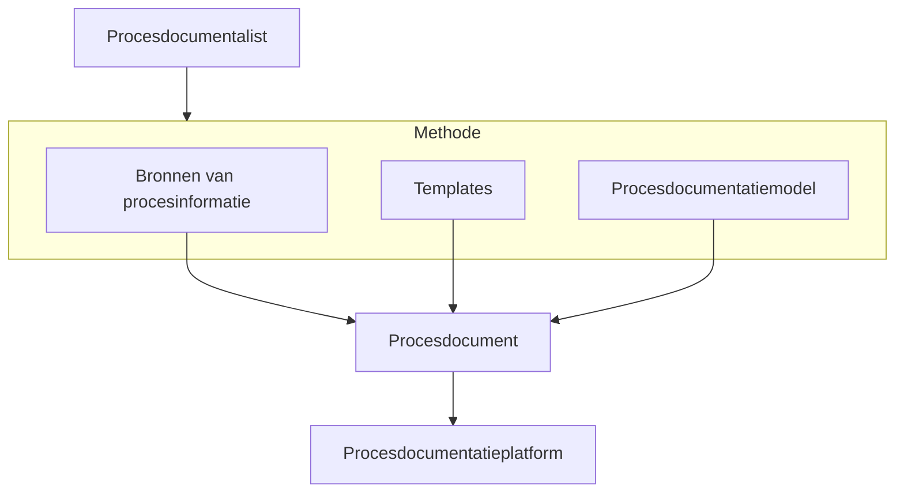
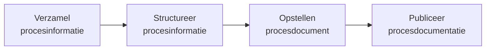
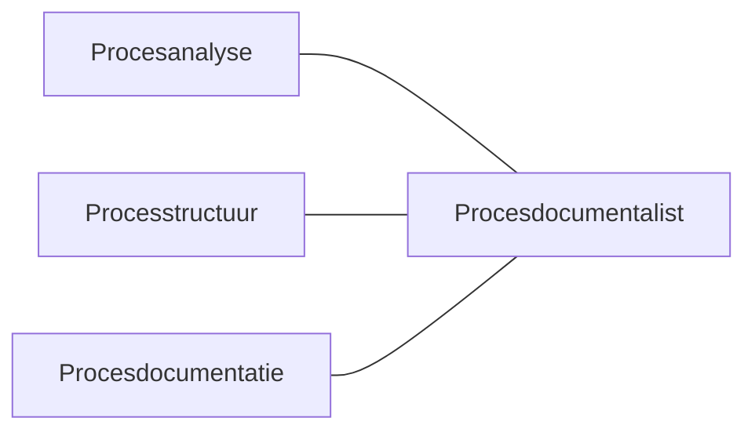

> [!primary] 
De Procesdocumentalist in één oogopslag

Een Procesdocumentalist is een specialist die processen analyseert, structureert en vastlegt zodat organisaties hun werk beter kunnen begrijpen, uitvoeren en verbeteren.

De Procesdocumentalist zorgt ervoor dat proceskennis:

- begrijpelijk wordt vastgelegd  
- consistent wordt gestructureerd  
- toegankelijk blijft voor medewerkers  
- onderhoudbaar blijft in de tijd  

#### De aanpak van de Procesdocumentalist

De Procesdocumentalist gebruikt een gestructureerde aanpak om procesinformatie uit de organisatie om te zetten in bruikbare procesdocumentatie.

Procesinformatie wordt verzameld uit verschillende bronnen, gestructureerd met templates en het Procesdocumentatiemodel (PDM), en uitgewerkt tot een procesdocument dat wordt gepubliceerd op een procesdocumentatieplatform.

Procesinformatie uit de organisatie wordt gestructureerd met templates en het procesdocumentatiemodel.  
Het resultaat is een helder procesdocument dat wordt gepubliceerd op een procesdocumentatieplatform.

#### De methode in vier stappen

##### 1. Procesinformatie verzamelen

Procesinformatie wordt opgehaald uit de praktijk, bijvoorbeeld via:

- interviews met medewerkers
- workshops
- bestaande documentatie
- systemen en rapportages

##### 2. Procesinformatie structureren

De informatie wordt gestructureerd met behulp van:

- templates
- het procesdocumentatiemodel
- procesmodellering

Hierdoor ontstaat een consistente beschrijving van processen.

##### 3. Procesdocument opstellen

De gestructureerde informatie wordt uitgewerkt tot een procesdocument met onder andere:

- procescontext
- procesdoel
- processtappen
- proceseigenschappen
- processturing

##### 4. Procesdocumentatie publiceren

Procesdocumenten worden gepubliceerd op een procesdocumentatieplatform, zodat medewerkers ze kunnen raadplegen en gebruiken in hun dagelijkse werk.

#### Resultaat voor de organisatie

Goede procesdocumentatie zorgt voor:

- duidelijkheid over hoe werk wordt uitgevoerd
- consistentie tussen teams en afdelingen
- kennisborging wanneer medewerkers vertrekken
- betere processturing
- betere basis voor procesverbetering

#### De rol van de Procesdocumentalist

De Procesdocumentalist bevindt zich op het snijvlak van:

De rol combineert analytisch vermogen, structuur en duidelijke documentatie.

#### Samenvatting

De Procesdocumentalist zorgt ervoor dat organisaties hun processen niet alleen uitvoeren, maar ook begrijpen en beheersen.

Door procesinformatie systematisch te verzamelen, structureren en publiceren ontstaat een duurzame kennisbasis van hoe de organisatie werkt.