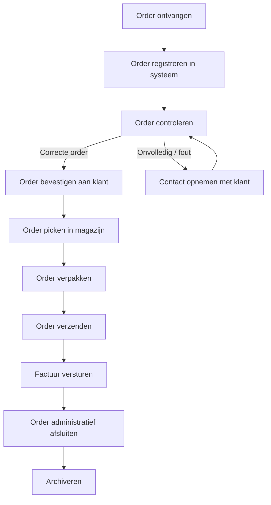

# Processchema Orderverwerking

*Praktisch voorbeeld van een end-to-end bedrijfsproces*

------

## Inleiding

Orderverwerking is één van de kernprocessen binnen vrijwel iedere organisatie die producten of diensten levert. Het proces vormt de schakel tussen klantvraag en daadwerkelijke levering en heeft directe invloed op klanttevredenheid, kostenbeheersing, doorlooptijd en cashflow. Een foutloos en efficiënt ingericht orderproces zorgt ervoor dat klanten krijgen wat zij verwachten, op het juiste moment en tegen de afgesproken voorwaarden.

Dit document beschrijft een praktisch en herkenbaar voorbeeld van een orderverwerkingsproces, van het moment van bestellen tot en met archivering. Het proces is uitgewerkt aan de hand van een procesdiagram, duidelijke rollen en verantwoordelijkheden, een toelichting per processtap, relevante KPI’s en praktische implementatietips.

### Doel van dit document

Dit document is bedoeld om:

- Te dienen als formele procesdocumentatie
- Ondersteuning te bieden bij training en onboarding van medewerkers
- Een gemeenschappelijke werkwijze vast te leggen
- Een basis te vormen voor procesanalyse en -verbetering

------

## Procesdiagram Orderverwerking

Onderstaand procesdiagram geeft in één oogopslag de belangrijkste stappen en beslismomenten binnen het orderverwerkingsproces weer.

------

## Rollen en Verantwoordelijkheden

Een goed proces vraagt om duidelijke verantwoordelijkheden. Onderstaande tabel beschrijft de betrokken rollen en hun bijdrage aan het orderproces.

| Rol                      | Verantwoordelijkheid                                         |
| ------------------------ | ------------------------------------------------------------ |
| Klant                    | Plaatst de bestelling via webshop, e-mail, telefoon of EDI   |
| Verkoop / Klantenservice | Ontvangt, controleert en bevestigt de order; onderhoudt klantcontact bij vragen of onvolledigheden |
| Administratie            | Registreert orders in ERP/CRM; verzorgt facturatie en administratieve afhandeling |
| Magazijn                 | Pickt en verpakt de order; controleert kwaliteit en aantallen |
| Logistiek                | Verzendt de order; regelt transport, track & trace en levering |
| Procesmanager            | Bewaakt procesprestaties, KPI’s en doorlooptijd; initieert verbeteringen |

------

## Toelichting per Processtap

In dit hoofdstuk worden de afzonderlijke processtappen nader toegelicht. Per stap wordt beschreven wat het doel is, wat er gebeurt en waar aandachtspunten liggen.

------

### 1. Order ontvangen

Het proces start wanneer een klant een bestelling plaatst. Dit kan via verschillende kanalen:

- Webshop (automatische orderinvoer)
- E-mail (handmatige verwerking)
- Telefoon (directe invoer door medewerker)
- EDI (elektronische gegevensuitwisseling tussen systemen)

Het is belangrijk dat iedere order direct wordt herkend als startpunt van het proces.

Tip: Verstuur altijd een automatische ontvangstbevestiging met een uniek ordernummer.

------

### 2. Order registreren

De ontvangen order wordt vastgelegd in het ordersysteem (bijvoorbeeld ERP, CRM of OMS). Dit vormt de basis voor alle vervolgstappen in het proces.

Belangrijke vast te leggen gegevens zijn onder andere:

- Klantgegevens (naam, adres, contactpersoon)
- Productinformatie (artikelnummers, omschrijving, aantallen)
- Prijzen en eventuele kortingen
- Lever- en factuuradres
- Gewenste leverdatum

Tip: Automatiseer invoer vanuit webshop of EDI om fouten en dubbele invoer te voorkomen.

------

### 3. Order controleren

Na registratie wordt de order inhoudelijk gecontroleerd. Het doel van deze stap is om fouten vroegtijdig te signaleren en te herstellen.

Controlepunten zijn onder andere:

- Is de order volledig?
- Kloppen de klant- en adresgegevens?
- Zijn de producten op voorraad of tijdig leverbaar?
- Zijn prijzen, kortingen en afspraken correct toegepast?

Bij afwijkingen: Neem zo snel mogelijk contact op met de klant om vertraging te voorkomen.

------

### 4. Order bevestigen

Wanneer de order correct is bevonden, ontvangt de klant een formele orderbevestiging. Dit document bevestigt de afspraken tussen klant en organisatie.

De orderbevestiging bevat minimaal:

- Ordernummer
- Overzicht van producten en aantallen
- Prijzen en totaalbedrag
- Verwachte leverdatum
- Contactgegevens

Tip: Gebruik vaste sjablonen voor een professionele en consistente uitstraling.

------

### 5. Order picken

Het magazijn ontvangt een picklijst (digitaal of geprint) en verzamelt de producten.

Tijdens het picken wordt gecontroleerd op:

- Juiste artikelen
- Juiste aantallen
- Beschadigingen of kwaliteitsproblemen

Tip: Werk met barcodes en scanners om pickfouten te minimaliseren.

------

### 6. Order verpakken

Na het picken worden de producten verpakt volgens vastgestelde verpakkingsrichtlijnen.

Belangrijke aandachtspunten:

- Gebruik een passende verpakking
- Bescherm producten tegen beschadiging
- Voeg eventueel pakbon of retourinformatie toe
- Maak het verzendlabel aan

Tip: Optimaliseer verpakkingen om verzendkosten en milieubelasting te beperken.

------

### 7. Order verzenden

De verpakte order wordt aangeboden aan de vervoerder. Afhankelijk van het type zending kan dit via:

- Pakketdiensten (zoals PostNL, DHL of UPS)
- Transporteurs (voor pallet- of bulkzendingen)
- Eigen bezorgdienst

De klant ontvangt idealiter een verzendbevestiging met track & trace.

------

### 8. Factureren

Na verzending wordt de factuur aangemaakt en verstuurd. In veel organisaties gebeurt dit automatisch vanuit het ERP-systeem.

De factuur bevat onder andere:

- Factuurnummer
- Orderreferentie
- Geleverde producten
- Bedragen en btw
- Betalingsvoorwaarden

Tip: Factureer zo snel mogelijk na verzending voor een gezonde cashflow.

------

### 9. Order administratief afsluiten

De order wordt administratief afgesloten zodra:

- De levering heeft plaatsgevonden
- De factuur is verzonden

De orderstatus wordt bijgewerkt naar “afgerond” of “gesloten”.

Tip: Werk met duidelijke statuscodes voor overzicht en rapportage.

------

### 10. Archiveren

Tot slot worden alle ordergerelateerde documenten digitaal gearchiveerd, zoals:

- Ordergegevens
- Orderbevestiging
- Factuur
- Verzend- en leverinformatie

Tip: Zorg voor een duidelijke structuur en voldoe aan wettelijke bewaartermijnen.

------

## KPI’s voor Procesmonitoring

Om het orderproces te beheersen en te verbeteren, worden KPI’s gemeten.

| KPI                  | Betekenis                            | Streefwaarde |
| -------------------- | ------------------------------------ | ------------ |
| Doorlooptijd order   | Tijd tussen bestelling en verzending | < 24 uur     |
| Orderfoutpercentage  | Percentage foutieve orders           | < 1%         |
| First Time Right     | Orders in één keer correct           | > 95%        |
| Leverbetrouwbaarheid | Op tijd geleverde orders             | > 98%        |
| Retourpercentage     | Percentage retourzendingen           | < 2%         |

Tip: Bespreek KPI’s periodiek en koppel acties aan afwijkingen.

------

## Praktische Tips voor Implementatie

- Automatiseer waar mogelijk om fouten en handwerk te beperken
- Leg werkinstructies vast per rol en processtap
- Train medewerkers regelmatig en borg kennis
- Gebruik data en KPI’s als basis voor verbetering
- Communiceer transparant met klanten bij afwijkingen

------

## Hoe dit schema te gebruiken

Dit processchema kan worden ingezet als:

- Standaardproces binnen de organisatie
- Onderdeel van onboarding en training
- Basis voor procesanalyse en audits
- Startpunt voor Lean- of verbetertrajecten

------

**Meer weten?**
Bezoek https://www.procesdocumentalist.nl.

**Vragen of uitbreidingen nodig?**
Ik help je graag verder. Denk aan:

- Een RACI-matrix
- Werkinstructies per rol
- Procesvarianten (bijv. retouren of spoedorders)
- BPMN-versie van dit proces

Laat maar weten!